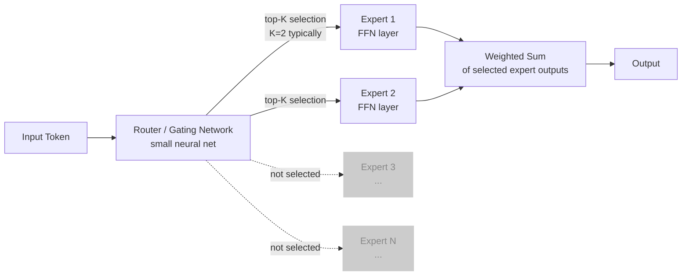
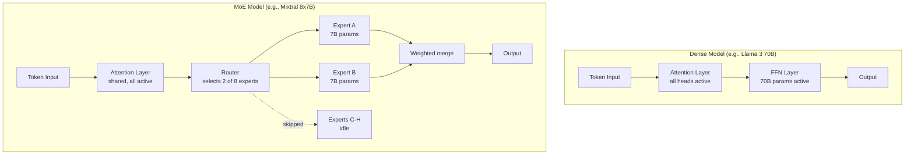
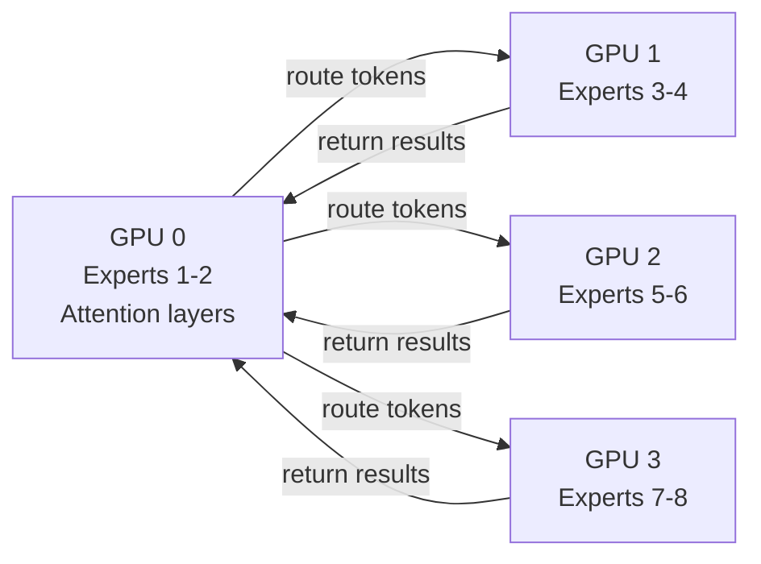

# Mixture of Experts (MoE) — How Models Scale to Trillions of Parameters

**Level**: 🔴 Advanced
**Reading Time**: 14 minutes

> A 45B parameter model that costs the same to run as a 12B dense model — that's not a trick. It's architecture.

## 🗺️ Quick Overview



*Only 2 of N experts are activated per token. The rest sit idle. This is the core efficiency win of MoE architecture.*

## The Problem

As of 2023, the frontier of LLM capability requires models with hundreds of billions of parameters. But training and serving a 100B+ dense model (where every parameter is active for every token) is extraordinarily expensive:

- GPT-3 (175B dense): training cost ~$4.6M in 2020 compute
- Serving a 70B dense model at 10 requests/sec requires 4× A100 80GB GPUs
- Doubling parameters doubles compute — there is no free lunch

The challenge: how do you scale model capacity beyond what dense architectures can afford to run?

Mixture of Experts (MoE) solves this by making models **conditionally compute** — only a fraction of parameters are activated for any given token. You get the knowledge of a large model at the inference cost of a small one.

---

## What MoE Is (and Isn't)

**Dense model**: Every weight in every layer participates in every forward pass. A 7B dense model performs 7B parameter operations per token.

**MoE model**: The model is divided into N "experts" — sub-networks (typically FFN layers). For each token, a small routing network selects only K experts (usually K=2). Only those K experts' parameters are active.

**The math for Mixtral 8x7B:**
- 8 experts, each 7B parameters = 56B total FFN parameters
- Plus shared attention layers ≈ 45B total model size
- K=2 experts active = ~12B parameters active per forward pass
- Compute cost: similar to a 12B dense model
- Capacity: 45B worth of knowledge

This is the core trade-off: **total parameters** (knowledge, storage cost) vs **active parameters** (compute cost, inference cost).

---

## Architecture Deep Dive

### The Transformer MoE Layer

Standard transformer layers alternate between:
1. Multi-head attention (MHA)
2. Feed-forward network (FFN)

In MoE models, the FFN layers are replaced by MoE layers:

```
Standard Transformer Layer:
  x → LayerNorm → MultiHeadAttention → x
  x → LayerNorm → FFN(x) → x

MoE Transformer Layer:
  x → LayerNorm → MultiHeadAttention → x
  x → LayerNorm → MoELayer(x) → x

  Where MoELayer(x) =
    gates = Softmax(Router(x))        // probability over N experts
    top_k_experts = argTopK(gates, K) // select K highest
    output = sum(gates[i] * Expert_i(x) for i in top_k_experts)
```

Attention layers are shared — they see every token the same way. Only FFN layers are MoE.

### Component 1: The Router (Gating Network)

The router is a small linear projection layer that maps input token representations to a probability distribution over experts:

```
// Router pseudocode
function route(token_embedding, num_experts):
  // Linear projection: hidden_dim → num_experts
  logits = token_embedding @ router_weights  // shape: [num_experts]
  probs = softmax(logits)                    // normalized probabilities
  top_k_indices = argsort(probs)[-K:]        // top K expert indices
  top_k_probs = probs[top_k_indices]         // normalized weights
  top_k_probs = top_k_probs / sum(top_k_probs)  // renormalize
  return top_k_indices, top_k_probs
```

The router is tiny (< 1M params for a 7B-per-expert model) but critical — it controls what every expert learns.

### Component 2: Expert FFN Layers

Each expert is a standard FFN with its own independent weights:

```
// Expert FFN pseudocode (same structure as dense FFN, different weights)
function expert_ffn(x, expert_id):
  // Standard 2-layer FFN with activation
  h = GELU(x @ W1[expert_id] + b1[expert_id])
  out = h @ W2[expert_id] + b2[expert_id]
  return out

// MoE forward pass
function moe_forward(x):
  expert_indices, expert_weights = route(x, NUM_EXPERTS)
  output = zeros_like(x)
  for idx, weight in zip(expert_indices, expert_weights):
    output += weight * expert_ffn(x, expert_id=idx)
  return output
```

### Component 3: Load Balancing Loss

Without explicit balancing, all tokens learn to route to the "best" 2 experts, leaving the rest unused. Training degenerates because only 2 experts get gradient updates.

Two solutions used in practice:

**Auxiliary load balancing loss** (Switch Transformer, Mixtral):
```
// Encourage equal distribution across experts
// f_i = fraction of tokens routed to expert i
// p_i = average routing probability for expert i
auxiliary_loss = alpha * sum(f_i * p_i for all experts i)
// alpha is typically 0.01 — small penalty to not overwhelm main loss
```

**Router z-loss** (used in GLaM, PaLM-2):
```
// Penalize large logits to improve routing stability
z_loss = beta * mean(logsumexp(logits)^2)
// Prevents router from becoming overconfident
```

Both are added to the main language modeling loss during training. Without them, collapse to 1-2 experts is nearly universal.

---

## Dense vs MoE: Architecture Comparison



| Property | Dense (70B) | MoE (8x7B = 45B) |
|----------|-------------|------------------|
| Total parameters | 70B | 45B |
| Active parameters per token | 70B | ~12B |
| Inference compute | ~70B FLOP/token | ~12B FLOP/token |
| Memory (VRAM) for full model | ~140GB (fp16) | ~90GB (fp16) |
| Training compute for same quality | Baseline | ~2-3x more efficient |
| Quality at same active params | Baseline | Better (more capacity) |

Key insight: **MoE achieves better quality than a dense model of the same active size** because it has access to more total parameters (each token routes to specialized experts that have seen specific knowledge patterns during training).

---

## Real Models Using MoE

### Mixtral 8x7B (Mistral AI, December 2023)

The first widely accessible open-weight MoE model:
- 8 experts, each 7B parameters
- Top-2 routing (K=2)
- 45B total parameters, ~12B active
- Context window: 32K tokens
- Benchmark: outperforms Llama 2 70B on most tasks at 6x less inference cost
- License: Apache 2.0 — fully open for commercial use
- Available: Hugging Face, Ollama, Together AI

### Mixtral 8x22B (Mistral AI, April 2024)

- 8 experts, each 22B parameters
- 141B total, ~39B active
- Competes with GPT-4-class models at lower cost
- Particularly strong at: code, math, multilingual tasks

### GPT-4 (OpenAI, rumored architecture)

George Hotz, Sam Altman, and multiple leaks suggest:
- 8 experts of ~220B each = ~1.76T total parameters
- K=2 active = ~440B active parameters per forward pass
- This would explain GPT-4's quality-to-cost ratio compared to GPT-3.5
- OpenAI has neither confirmed nor denied this architecture

### Grok-1 (xAI, March 2024)

- Officially released as open weights
- 314B total parameters (MoE confirmed in model card)
- Architecture: 8 experts, top-2 routing
- Context window: 8K tokens (relatively small)

### Gemini 1.5 Pro / Flash (Google, February 2024)

- MoE architecture confirmed by Google in technical report
- Gemini 1.5 Pro: 1M token context window
- The combination of MoE + long context makes it unique
- Specific expert count/size not disclosed

### Switch Transformer (Google Research, 2021)

The research paper that proved MoE could scale:
- First to demonstrate MoE scales better than dense (with proper load balancing)
- K=1 routing (Switch routing — simplest possible)
- 7x better training efficiency at same compute budget
- Proved that load balancing is essential — without it, quality collapses

---

## Practical Implications for LLM Users and Builders

### Inference Cost and Speed

MoE models feel like dense models of their active parameter size, not total size:

| Model | Total Params | Active Params | Practical Inference Speed |
|-------|-------------|---------------|--------------------------|
| Mixtral 8x7B | 45B | 12B | Similar to Llama 3 13B |
| Mixtral 8x22B | 141B | 39B | Similar to Llama 3 40B |
| GPT-4 (estimated) | ~1.7T | ~440B | Much faster than 1.7T dense |

But memory is based on **total** parameters, because all experts must be loaded for inference (you don't know which expert will be needed until you see the token):

```
// Memory estimation for MoE inference
total_vram_needed = total_params * bytes_per_param
// Mixtral 8x7B in fp16: 45B * 2 bytes = ~90GB
// Requires: 2x A100 80GB, or 4x RTX 4090 (24GB each)
```

### Serving MoE Models

Two strategies for serving MoE at scale:

**Expert parallelism**: different GPUs host different experts. Token routing happens across the network:



**Single-machine MoE**: load all experts, run inference. Required VRAM = total params in fp16. vLLM supports this natively.

### Accessing MoE Models

```python
# Mixtral via Ollama (local, requires ~90GB VRAM or offloading to CPU)
# ollama pull mixtral:8x7b
# ollama pull mixtral:8x22b

import ollama

response = ollama.chat(
    model='mixtral:8x7b',
    messages=[
        {'role': 'user', 'content': 'Explain the difference between OLTP and OLAP databases'}
    ]
)
print(response['message']['content'])

# Mixtral via Together AI (cloud, pay-per-token)
from openai import OpenAI

client = OpenAI(
    api_key="your-together-api-key",
    base_url="https://api.together.xyz/v1",
)

response = client.chat.completions.create(
    model="mistralai/Mixtral-8x7B-Instruct-v0.1",
    messages=[
        {"role": "system", "content": "You are a technical expert."},
        {"role": "user", "content": "Design a rate limiting system for 100k RPS."}
    ],
    max_tokens=1024,
    temperature=0.7,
)
print(response.choices[0].message.content)

# Mixtral 8x22B via Mistral API (official, fastest)
from mistralai import Mistral

client = Mistral(api_key="your-mistral-api-key")

response = client.chat.complete(
    model="open-mixtral-8x22b",
    messages=[
        {"role": "user", "content": "Write a Python function to implement a binary search tree."}
    ]
)
print(response.choices[0].message.content)
```

### Cost Comparison (2025 prices, approximate)

| Model | Provider | Input cost / 1M tokens | Output cost / 1M tokens |
|-------|----------|----------------------|------------------------|
| Mixtral 8x7B | Together AI | $0.60 | $0.60 |
| Mixtral 8x22B | Mistral API | $2.00 | $6.00 |
| GPT-4o (dense, ~?) | OpenAI | $2.50 | $10.00 |
| Claude 3.5 Sonnet | Anthropic | $3.00 | $15.00 |
| Llama 3 70B (dense) | Together AI | $0.88 | $0.88 |

Mixtral 8x7B hits a sweet spot: GPT-3.5-class quality at well under $1/1M tokens.

---

## Expert Specialization: What Research Shows

During training, experts develop soft specializations. Research findings from Mixtral's technical report and academic analysis:

- **Syntactic experts**: some experts handle punctuation, formatting, structure
- **Domain experts**: separate experts activate more frequently for code vs prose vs math
- **Language experts**: in multilingual models, experts often cluster by language family
- **Positional patterns**: routing decisions depend partly on position in the sequence

Important caveat: **specialization is soft, not hard**. No expert exclusively handles only one domain. Think "experts are biased toward" not "experts are responsible for."

This has a practical implication: you cannot easily "remove" an expert to make the model forget a specific topic. The knowledge is distributed with overlap.

---

## Common Mistakes

1. **Confusing total parameters with compute cost**: Seeing "Mixtral has 45B parameters" and assuming it's expensive to run. Active parameters (12B) determine inference compute and cost — total parameters determine memory. These are independent.

2. **Underestimating VRAM requirements**: Because active params are 12B, developers assume the model fits in ~24GB. Wrong — you need to load all experts. Mixtral 8x7B in fp16 requires ~90GB. In 4-bit quantization (GGUF Q4), it fits in ~26GB — but you must quantize.

3. **Ignoring load balancing in fine-tuning**: When fine-tuning an MoE model on a narrow dataset (e.g., only medical records), the load balancing auxiliary loss can be disabled or poorly tuned, causing expert collapse. Always monitor per-expert token counts during fine-tuning. If one expert is receiving >40% of tokens, something is wrong.

4. **Assuming expert routing is deterministic and inspectable**: The routing decision is a soft, learned behavior — it is not a rule-based dispatch. You cannot look at a token and predict which expert will handle it without running the router. Attempts to manually assign tokens to experts (without the routing network) will fail.

5. **Using MoE models for batch inference without expert parallelism**: If you're running Mixtral on a single machine with limited VRAM and CPU offloading, throughput for large batches is much worse than a dense model of equivalent active size due to expert dispatch overhead. Benchmark your actual serving setup.

---

## Key Takeaways

- **MoE separates capacity from compute**: Mixtral 8x7B has 45B total params (knowledge) but only 12B active params per token (compute cost) — you pay for the 12B, you get the quality of 45B
- **Experts are FFN replacements, not attention replacements**: attention layers are shared; only feed-forward layers become per-expert
- **Load balancing is critical**: without auxiliary balancing loss, training degenerates to 1-2 experts handling everything — the rest are wasted capacity
- **Memory = total params, compute = active params**: Mixtral 8x7B needs ~90GB VRAM but inference FLOPs match a ~12B dense model
- **Real models**: Mixtral 8x7B (45B/12B active, open-weight), Grok-1 (314B MoE), Gemini 1.5 (MoE confirmed), GPT-4 (rumored 8-expert MoE)
- **Expert specialization is soft**: experts develop biases, not hard rules — you cannot surgically remove knowledge by removing an expert

## References

> 📖 [Mixtral of Experts — Mistral AI Technical Report](https://arxiv.org/abs/2401.04088) — Original paper describing Mixtral 8x7B architecture, routing, and benchmarks

> 📖 [Switch Transformers: Scaling to Trillion Parameter Models](https://arxiv.org/abs/2101.03961) — Google's 2021 paper proving MoE scales efficiently with proper load balancing

> 📖 [Outrageously Large Neural Networks: The Sparsely-Gated MoE Layer](https://arxiv.org/abs/1701.06538) — Shazeer et al. (2017), the seminal paper introducing top-K routing for transformers

> 📺 [Andrej Karpathy: Let's Build GPT — MoE Section](https://www.youtube.com/watch?v=kCc8FmEb1nY) — Intuitive walkthrough of transformer internals including MoE concepts

> 📖 [Grok-1 Model Card — xAI](https://github.com/xai-org/grok-1) — Released architecture details confirming MoE structure for Grok-1's 314B parameter model
