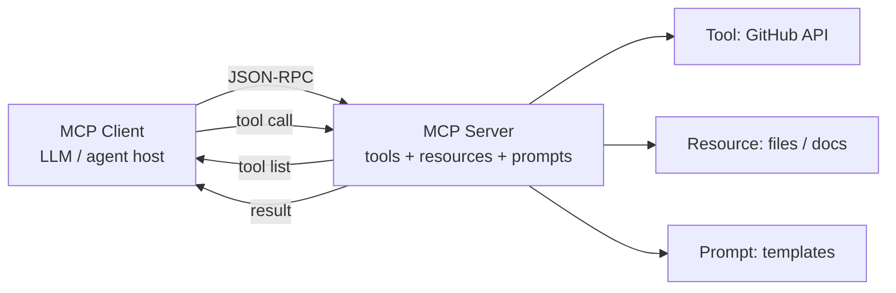
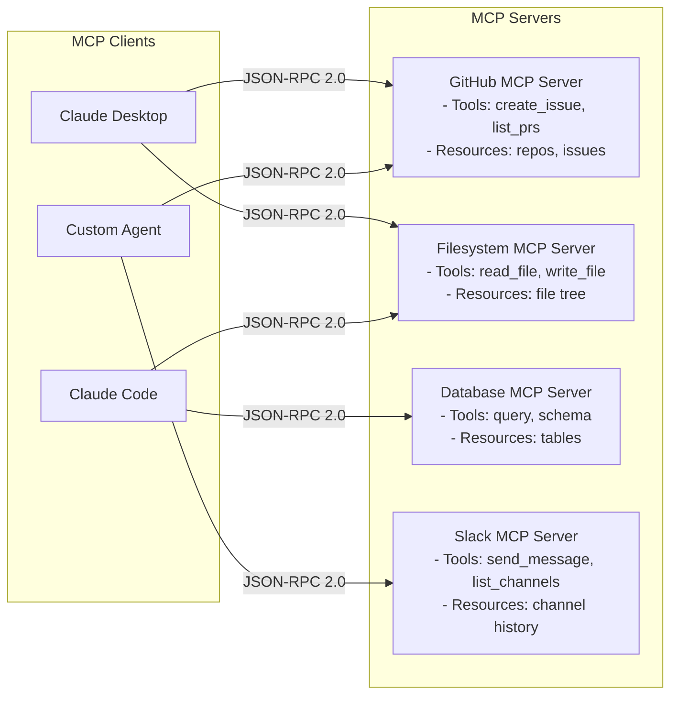

# Model Context Protocol (MCP)

**Level**: ⚫ Expert
**Reading Time**: 13 minutes

> Before MCP, every AI tool integration was a custom one-off. MCP is the USB standard for AI tools — build once, connect anywhere.

## 🗺️ Quick Overview



*MCP defines a standard JSON-RPC protocol so one server exposes tools, resources, and prompts to any MCP-compatible client — write once, use everywhere.*

## The Problem

Before MCP, integrating tools with LLMs worked like this:

- LangChain had its own tool format
- OpenAI function calling had its own JSON schema
- Claude API had its own tool format
- Every framework reinvented the wheel

Building a GitHub tool meant writing it for LangChain, then rewriting it for OpenAI, then rewriting it again for any custom framework. There was no standard interface.

This is the same problem USB solved for hardware: before USB, every device had its own proprietary connector. After USB, one standard connector worked with everything.

**Model Context Protocol (MCP)** is Anthropic's open standard for connecting LLMs to tools, data sources, and resources. Introduced in November 2024, it defines how "MCP Servers" expose capabilities and how "MCP Clients" (LLMs) discover and call them.

## Three MCP Primitives

MCP exposes three types of capabilities:

### 1. Tools

Functions the LLM can call — same concept as function calling, but with a standard interface.

```
// Tool definition in MCP
MCPTool = {
  name: "github_create_issue",
  description: "Create a new GitHub issue in a repository",
  inputSchema: {
    type: "object",
    properties: {
      owner: { type: "string", description: "Repository owner" },
      repo: { type: "string", description: "Repository name" },
      title: { type: "string", description: "Issue title" },
      body: { type: "string", description: "Issue body (markdown)" },
      labels: { type: "array", items: { type: "string" }, description: "Labels to add" }
    },
    required: ["owner", "repo", "title"]
  }
}
```

### 2. Resources

Data sources the LLM can read — files, database records, API responses. Resources have URIs.

```
// Resource definition in MCP
MCPResource = {
  uri: "github://repos/anthropics/claude-code/issues",
  name: "Open GitHub Issues",
  description: "Current open issues in the claude-code repository",
  mimeType: "application/json"
}

// Resource content (returned when LLM reads the resource)
MCPResourceContent = {
  uri: "github://repos/anthropics/claude-code/issues",
  mimeType: "application/json",
  text: "[{\"id\": 1, \"title\": \"Bug in tool parsing\", ...}]"
}
```

### 3. Prompts

Reusable prompt templates that can be parameterized and inserted into LLM conversations.

```
// Prompt definition in MCP
MCPPrompt = {
  name: "code_review",
  description: "Template for reviewing a code diff",
  arguments: [
    { name: "diff", description: "The git diff to review", required: true },
    { name: "focus", description: "Aspect to focus on: security | performance | style" }
  ]
}

// Prompt template rendered with arguments
MCPPromptMessage = {
  role: "user",
  content: "Review this code diff with focus on [focus]:\n\n[diff]\n\nProvide specific, actionable feedback."
}
```

## MCP Architecture



Each client can connect to multiple MCP servers. Each server exposes a set of tools, resources, and prompts. The protocol is JSON-RPC 2.0 over either stdio (for local servers) or HTTP with Server-Sent Events (for remote servers).

## MCP Server Implementation

```
// MCP Server pseudocode structure
MCPServer = {
  name: "github-server",
  version: "1.0.0",

  // Declare what this server exposes
  capabilities: {
    tools: {},
    resources: {}
  },

  // Tool implementations
  tools: {
    "github_create_issue": {
      schema: MCPTool(name="github_create_issue", ...),
      execute: function(args):
        response = GitHubAPI.post(
          "/repos/" + args.owner + "/" + args.repo + "/issues",
          body = { title: args.title, body: args.body, labels: args.labels }
        )
        return MCPToolResult(
          content = [{ type: "text", text: JSON.stringify(response) }]
        )
    },

    "github_list_issues": {
      schema: MCPTool(name="github_list_issues", ...),
      execute: function(args):
        issues = GitHubAPI.get("/repos/" + args.owner + "/" + args.repo + "/issues")
        return MCPToolResult(
          content = [{ type: "text", text: JSON.stringify(issues) }]
        )
    }
  },

  // Resource implementations
  resources: {
    "github://repos/{owner}/{repo}/issues": {
      schema: MCPResource(uri="github://repos/{owner}/{repo}/issues", ...),
      read: function(uri):
        params = parseUri(uri)
        issues = GitHubAPI.get("/repos/" + params.owner + "/" + params.repo + "/issues")
        return MCPResourceContent(
          uri = uri,
          mimeType = "application/json",
          text = JSON.stringify(issues)
        )
    }
  }
}

// JSON-RPC handler
function handleRequest(request):
  switch request.method:
    case "initialize":
      return { protocolVersion: "2024-11-05", capabilities: server.capabilities, serverInfo: server }

    case "tools/list":
      return { tools: server.tools.map(t => t.schema) }

    case "tools/call":
      tool = server.tools[request.params.name]
      result = tool.execute(request.params.arguments)
      return result

    case "resources/list":
      return { resources: server.resources.map(r => r.schema) }

    case "resources/read":
      resource = matchResource(request.params.uri, server.resources)
      return resource.read(request.params.uri)

    case "prompts/list":
      return { prompts: server.prompts.map(p => p.schema) }

    case "prompts/get":
      prompt = server.prompts[request.params.name]
      return prompt.render(request.params.arguments)
```

## MCP Client Implementation

```
// MCP Client pseudocode
MCPClient = {
  serverConnections: dict[serverName, ServerConnection],

  // Connect to an MCP server
  connect: function(serverName, transport):
    conn = ServerConnection(transport)
    response = conn.request({
      method: "initialize",
      params: {
        protocolVersion: "2024-11-05",
        capabilities: {},
        clientInfo: { name: "my-agent", version: "1.0.0" }
      }
    })
    conn.serverCapabilities = response.capabilities
    this.serverConnections[serverName] = conn
    return conn

  // Discover all tools across connected servers
  listAllTools: function():
    allTools = []
    for serverName, conn in this.serverConnections:
      response = conn.request({ method: "tools/list" })
      for tool in response.tools:
        allTools.append(MCPToolReference(
          serverName = serverName,
          tool = tool
        ))
    return allTools

  // Call a tool on a specific server
  callTool: function(serverName, toolName, args):
    conn = this.serverConnections[serverName]
    return conn.request({
      method: "tools/call",
      params: { name: toolName, arguments: args }
    })

  // Read a resource
  readResource: function(serverName, uri):
    conn = this.serverConnections[serverName]
    return conn.request({
      method: "resources/read",
      params: { uri: uri }
    })
}

// Using MCP client in an agent
function mcpAgent(query, mcpClient):
  // Discover available tools from all connected servers
  allTools = mcpClient.listAllTools()

  // Convert MCP tool schemas to LLM tool format
  llmTools = allTools.map(t => convertToLLMToolFormat(t))

  messages = [SystemMessage(buildSystemPrompt(llmTools)), HumanMessage(query)]

  while true:
    response = LLM.generate(messages, tools=llmTools)

    if response.type == FINAL_ANSWER:
      return response.text

    for toolCall in response.toolCalls:
      // Identify which MCP server has this tool
      toolRef = findToolRef(toolCall.toolName, allTools)
      result = mcpClient.callTool(toolRef.serverName, toolCall.toolName, toolCall.args)
      messages.append(ToolResult(toolCall.id, result.content))
```

## Transport Modes

MCP supports two transports:

```
// stdio transport — for local tools running as subprocesses
StdioTransport = {
  type: "stdio",
  command: "python",
  args: ["github_mcp_server.py"],
  env: { "GITHUB_TOKEN": "..." }
}

// HTTP + SSE transport — for remote servers
SSETransport = {
  type: "sse",
  url: "https://github-mcp.mycompany.com/sse",
  headers: { "Authorization": "Bearer " + token }
}
```

## Why MCP Matters for the Ecosystem

Before MCP:
```
build GitHubTool → once for LangChain format
build GitHubTool → again for OpenAI function calling format
build GitHubTool → again for Anthropic tool use format
build GitHubTool → again for your custom framework
```

After MCP:
```
build GitHubMCPServer → once
connects to Claude Desktop, Claude Code, any MCP-compatible agent
```

This created an ecosystem effect: community-maintained MCP servers for GitHub, Slack, Notion, filesystem, databases, web browsers — all reusable across any LLM client that speaks MCP.

As of early 2025, the MCP ecosystem includes:
- Official servers: filesystem, fetch, memory, git, github, sqlite, postgres
- Community servers: Slack, Notion, Linear, Jira, Google Drive, Kubernetes, and hundreds more

## Common Pitfalls

1. **Not handling initialize handshake**: The first message must be `initialize` with protocol version negotiation. Skipping it breaks the protocol.
2. **Blocking stdio**: When using stdio transport, the server must respond to all JSON-RPC requests without blocking. A slow tool call should not block protocol messages.
3. **No error handling in tool results**: If a tool fails, return `isError: true` with a human-readable message in the result content. Don't crash the server.
4. **Exposing sensitive tools without auth**: MCP servers over HTTP need authentication. The default stdio transport doesn't need it (only local processes connect), but HTTP SSE does.
5. **Tool names colliding across servers**: If two servers expose a tool named "search", the client needs to namespace them. Use `serverName__toolName` in the LLM's tool list.

## Key Takeaways

- MCP is a standard protocol for connecting LLMs to tools, resources, and prompt templates
- Three primitives: Tools (callable functions), Resources (readable data sources), Prompts (reusable templates)
- Architecture: MCP Clients (LLMs, agents) connect to MCP Servers (tools) via JSON-RPC 2.0
- Two transport modes: stdio (local subprocesses) and HTTP+SSE (remote services)
- MCP solves the ecosystem fragmentation problem — build a tool once, use it with any MCP-compatible LLM
- The MCP community has already built hundreds of servers for popular services — check before building your own
