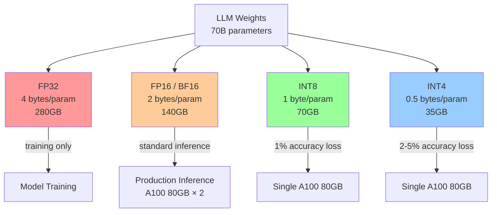
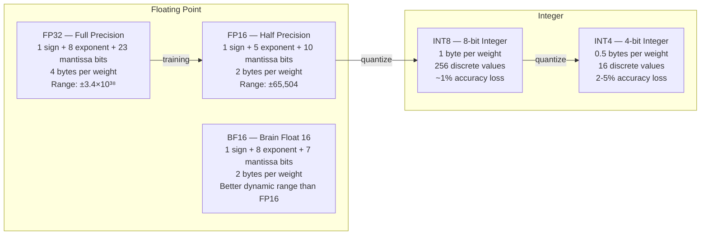
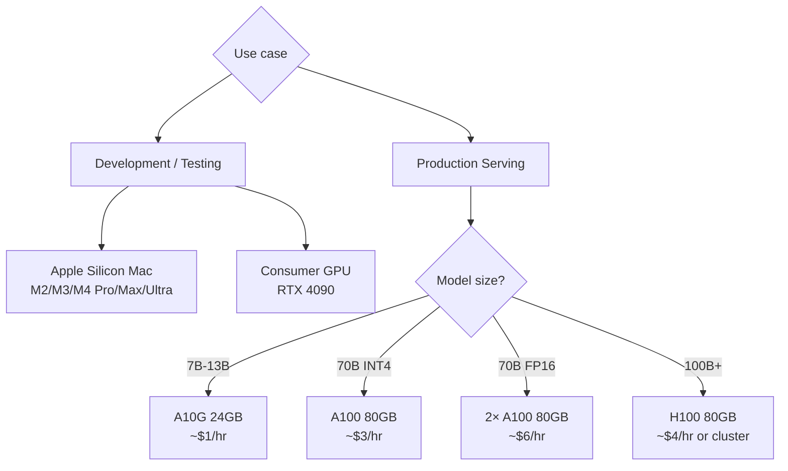

# Model Quantization — Shrinking LLMs for Efficient Inference

**Level**: 🔴 Advanced
**Reading Time**: 15 minutes

> Llama 3 70B requires 140GB of GPU VRAM in full precision. Quantize to 4-bit and it fits in a single A100 80GB. Same model, 75% less memory, 2-5% accuracy loss — that's the quantization bargain.

## 🗺️ Quick Overview



*Quantization trades a small amount of accuracy for dramatically lower VRAM requirements and higher throughput.*

## The Problem

GPU VRAM is the bottleneck for LLM inference. The relationship is unforgiving:

- **7B model in FP16**: 14GB VRAM minimum — fits on an A10G 24GB
- **13B model in FP16**: 26GB VRAM minimum — requires an A100 40GB
- **70B model in FP16**: 140GB VRAM minimum — requires two A100 80GB GPUs ($6/hr each)
- **70B model in INT4**: 35GB VRAM — fits on a single A100 80GB ($3/hr)

The cost difference between serving a 70B model in FP16 vs INT4 is 2× in GPU costs. For a team running 100K requests/day, that's the difference between $180/day and $90/day in GPU costs.

Quantization is the technique of reducing the numerical precision of model weights. The tradeoff is almost always worth it for inference: minimal accuracy loss at INT8, acceptable accuracy loss at INT4, dramatic memory savings.

## Precision Levels Explained



**When each is used:**
- **FP32**: Model training only. Too slow and memory-hungry for inference.
- **FP16/BF16**: Standard production inference. BF16 preferred on A100/H100 (native hardware support, better dynamic range).
- **INT8**: Production inference where accuracy matters. 1 byte/weight, ~1% accuracy loss on most benchmarks.
- **INT4**: Production inference for large models on constrained hardware. 0.5 bytes/weight, 2-5% accuracy loss.

## VRAM Requirements by Model Size

| Model Size | FP16 VRAM | INT8 VRAM | INT4 VRAM | GPU Options (INT4) |
|------------|-----------|-----------|-----------|-------------------|
| 1B | 2GB | 1GB | 0.6GB | RTX 3060, M2 MacBook |
| 3B | 6GB | 3GB | 1.5GB | RTX 3080, M1 Pro |
| 7B | 14GB | 7GB | 4GB | RTX 4090 24GB |
| 13B | 26GB | 13GB | 7GB | RTX 4090 24GB |
| 34B | 68GB | 34GB | 17GB | A100 40GB |
| 70B | 140GB | 70GB | 35GB | A100 80GB |
| 180B | 360GB | 180GB | 90GB | 4× A100 80GB |

*Add 20% overhead for KV cache and activation memory. A 70B INT4 model with active inference needs ~42GB, fitting on a single A100 80GB.*

## Quantization Methods

### GPTQ — Post-Training Quantization

The original high-quality quantization method. Quantizes layer by layer, minimizing the reconstruction error per layer using second-order information (Hessian matrix approximation).

```python
# Load a GPTQ quantized model
from transformers import AutoModelForCausalLM, AutoTokenizer

model_name = "TheBloke/Llama-2-70B-GPTQ"

tokenizer = AutoTokenizer.from_pretrained(model_name)
model = AutoModelForCausalLM.from_pretrained(
    model_name,
    device_map="auto",
    trust_remote_code=False,
    revision="main"
)

# Model is already quantized — load and use
inputs = tokenizer("Explain distributed systems:", return_tensors="pt").to("cuda")
output = model.generate(**inputs, max_new_tokens=200)
print(tokenizer.decode(output[0]))
```

**GPTQ characteristics:**
- Quantization time: 2-8 hours for 70B model
- Quality: Highest accuracy among INT4 methods
- Speed: Good on GPU, requires AutoGPTQ or ExLlama kernel
- Use when: maximizing accuracy at INT4, willing to wait for quantization

### AWQ — Activation-Aware Weight Quantization

AWQ improves on GPTQ by identifying the most "important" weights (those that activate frequently) and protecting them from quantization. Less important weights are quantized more aggressively.

```python
# Load an AWQ quantized model with vLLM
from vllm import LLM, SamplingParams

llm = LLM(
    model="TheBloke/Llama-2-70B-AWQ",
    quantization="awq",
    dtype="auto",
    gpu_memory_utilization=0.9
)

sampling_params = SamplingParams(temperature=0.7, max_tokens=200)
outputs = llm.generate(["Explain transformer attention:"], sampling_params)
print(outputs[0].outputs[0].text)
```

**AWQ characteristics:**
- Better accuracy than GPTQ at same bit width (protecting important weights)
- Faster inference than GPTQ (simpler dequantization kernel)
- Native vLLM support — best choice for production vLLM deployments
- Use when: deploying with vLLM, want balance of speed and accuracy

### GGUF — CPU+GPU Hybrid (llama.cpp)

GGUF (successor to GGML) is the format used by Ollama and llama.cpp. Supports mixed-precision quantization: different layers can be quantized to different bit widths.

```bash
# Pull a GGUF model via Ollama
ollama pull llama3.2:3b-instruct-q4_K_M

# Quantization variants:
# Q4_K_M = 4-bit, medium quality (recommended for most use cases)
# Q5_K_M = 5-bit, higher quality
# Q8_0 = 8-bit, near-lossless
# Q2_K = 2-bit, smallest but degraded quality
```

GGUF's key advantage: it can offload layers to CPU RAM when VRAM runs out. A 70B model can run on a machine with 24GB VRAM + 64GB RAM — running slowly but correctly. Throughput is ~5-15 tokens/s in CPU+GPU mode vs ~50-100 tokens/s on pure GPU.

**Use when:** development, Ollama, mixed CPU+GPU environments, Apple Silicon Macs.

### bitsandbytes — HuggingFace Native Quantization

The easiest entry point: add `load_in_8bit=True` or `load_in_4bit=True` to any HuggingFace model load. Quantizes on-the-fly at load time.

```python
from transformers import AutoModelForCausalLM, BitsAndBytesConfig
import torch

# 4-bit quantization with NF4 (NormalFloat4) data type
quantization_config = BitsAndBytesConfig(
    load_in_4bit=True,
    bnb_4bit_compute_dtype=torch.bfloat16,  # Use BF16 for compute
    bnb_4bit_use_double_quant=True,           # Nested quantization
    bnb_4bit_quant_type="nf4"                 # NF4 vs FP4
)

model = AutoModelForCausalLM.from_pretrained(
    "meta-llama/Meta-Llama-3.1-70B-Instruct",
    quantization_config=quantization_config,
    device_map="auto"
)

# Also works for QLoRA fine-tuning — train 70B on a single A100
```

**bitsandbytes characteristics:**
- No pre-quantized model needed — quantizes any HuggingFace model at load time
- Supports QLoRA (Quantized LoRA) for fine-tuning large models on single GPUs
- Slower inference than GPTQ/AWQ (quantization is dynamic, not precomputed)
- Use when: prototyping, fine-tuning with QLoRA, quick experiments

## Accuracy Impact: Benchmark Comparison

| Benchmark | FP16 (baseline) | INT8 | INT4 (GPTQ) | INT4 (AWQ) |
|-----------|----------------|------|-------------|------------|
| MMLU (Llama 3 70B) | 82.0% | 81.5% | 79.8% | 80.4% |
| ARC-Challenge | 68.5% | 68.0% | 66.2% | 67.1% |
| HellaSwag | 88.0% | 87.6% | 86.1% | 87.0% |
| GSM8K (math) | 77.2% | 76.8% | 73.4% | 75.1% |
| HumanEval (code) | 48.8% | 48.1% | 45.6% | 47.2% |

*Source: Aggregated from TheBloke model card benchmarks and AutoGPTQ paper. AWQ consistently outperforms GPTQ at INT4.*

**Key observation:** Math and code tasks show the largest accuracy drop from quantization. If your use case is code generation or mathematical reasoning, use INT8 or FP16 for that specific task.

## Hardware Selection Guide



| Hardware | VRAM | Best for | Approx cost |
|----------|------|---------|------------|
| M2 Ultra Mac | 192GB unified | 70B FP16 via Ollama (development) | $5,000 hardware |
| RTX 4090 24GB | 24GB | 7B FP16 or 13B INT4 (dev) | $1,600 hardware |
| A10G 24GB | 24GB | 7B FP16 or 13B INT4 (prod) | ~$1/hr cloud |
| A100 40GB | 40GB | 34B INT4 or 13B FP16 (prod) | ~$2/hr cloud |
| A100 80GB | 80GB | 70B INT4 or 34B FP16 (prod) | ~$3/hr cloud |
| H100 80GB | 80GB | 70B INT4 or FP16, fastest available | ~$4/hr cloud |

## Speculative Decoding: Beyond Quantization

Quantization reduces memory. Speculative decoding increases throughput — by 2-4× on top of quantization gains.

The idea: use a small "draft" model to generate N token candidates quickly, then have the large "verifier" model check them in parallel. If the verifier accepts the draft tokens (which it usually does), you get N tokens for the cost of roughly 1 large model forward pass.

```
# Example: Llama 3 70B + Llama 3 8B for speculative decoding
Draft model: Llama 3 8B — generates 5 candidate tokens at ~400 tokens/s
Target model: Llama 3 70B — verifies all 5 in one forward pass

Acceptance rate: ~80% (draft tokens match what 70B would generate)
Effective throughput: 70B model at ~200 tokens/s (vs ~60 tokens/s without speculative)
```

```python
# vLLM speculative decoding
from vllm import LLM, SamplingParams

llm = LLM(
    model="meta-llama/Meta-Llama-3.1-70B-Instruct",
    speculative_model="meta-llama/Meta-Llama-3.1-8B-Instruct",
    num_speculative_tokens=5,
    quantization="awq"
)
```

Requirements: draft and target models must use the same tokenizer. Available in vLLM 0.4+.

## KV Cache Quantization

Beyond weight quantization, KV (key-value) cache — the memory used to store attention states — can also be quantized. The KV cache grows with sequence length and is often the bottleneck for long-context inference.

- **INT8 KV cache**: 2× memory reduction, <0.5% accuracy loss
- **INT4 KV cache**: 4× memory reduction, ~1% accuracy loss
- Available in vLLM 0.5+ and TGI

```python
# vLLM with INT8 KV cache quantization
llm = LLM(
    model="meta-llama/Meta-Llama-3.1-70B-Instruct",
    quantization="awq",
    kv_cache_dtype="fp8"  # FP8 KV cache
)
```

A 70B model serving 100K token contexts: KV cache at FP16 = 100GB, at INT8 = 50GB. This can be the difference between fitting 4 concurrent users and fitting 8.

## Common Mistakes

1. **Using bitsandbytes in production**. Root cause: it's the easiest quantization to get started with, but it quantizes dynamically at runtime (slower). Fix: use pre-quantized GPTQ or AWQ models for production. bitsandbytes is for prototyping and QLoRA fine-tuning.

2. **Ignoring VRAM headroom for KV cache**. Root cause: calculating only model weight size. A 70B INT4 model weighs 35GB, but active inference with long contexts can use 60-80GB total. Fix: always leave 30-40% VRAM headroom for KV cache and activations.

3. **Quantizing math/code models too aggressively**. Root cause: applying INT4 uniformly across all use cases. Math, reasoning, and code generation tasks show 5-8% accuracy drops at INT4 (vs 2-3% for general tasks). Fix: use INT8 for specialized reasoning tasks, benchmark your specific use case before deploying INT4.

4. **Running 7B INT4 when 7B FP16 fits**. Root cause: over-applying quantization. If your GPU has room for FP16, use it — the 2-5% accuracy improvement is free. Quantize when you need to fit a larger model, not as a default.

5. **Not benchmarking on your actual workload**. Root cause: trusting published benchmarks on generic datasets. MMLU doesn't represent your domain. Fix: create a 100-sample golden set of your actual use cases and benchmark every quantization level against it before choosing.

## Key Takeaways

- Llama 3 70B requires 140GB VRAM in FP16 → 35GB in INT4 — quantization makes 70B models accessible on a single A100 80GB ($3/hr vs $6/hr)
- INT8 has ~1% accuracy loss; INT4 has 2-5% loss — math and code tasks degrade more than language tasks
- AWQ outperforms GPTQ at INT4 by 0.5-1% on benchmarks and has faster inference — prefer AWQ for vLLM deployments
- GGUF (Ollama/llama.cpp) enables CPU+GPU hybrid inference — the only option for running 70B on machines without enough VRAM
- Speculative decoding (small draft model + large verifier) adds 2-4× throughput on top of weight quantization — stack both for maximum efficiency
- Always benchmark your specific use case: published benchmarks on MMLU won't reflect performance on your domain-specific prompts

## References

> 📖 [GPTQ: Accurate Post-Training Quantization](https://arxiv.org/abs/2210.17323) — Original GPTQ paper, layer-wise quantization with Hessian approximation

> 📖 [AWQ: Activation-aware Weight Quantization](https://arxiv.org/abs/2306.00978) — AWQ paper, protecting salient weights for better accuracy

> 📚 [vLLM Quantization Documentation](https://docs.vllm.ai/en/latest/quantization/supported_hardware.html) — Supported quantization methods, hardware compatibility matrix

> 📚 [bitsandbytes Documentation](https://huggingface.co/docs/bitsandbytes/main/en/index) — 8-bit and 4-bit quantization with HuggingFace transformers

> 📖 [TheBloke Model Hub](https://huggingface.co/TheBloke) — Pre-quantized GPTQ and GGUF models with benchmark comparisons for 200+ open-source models
