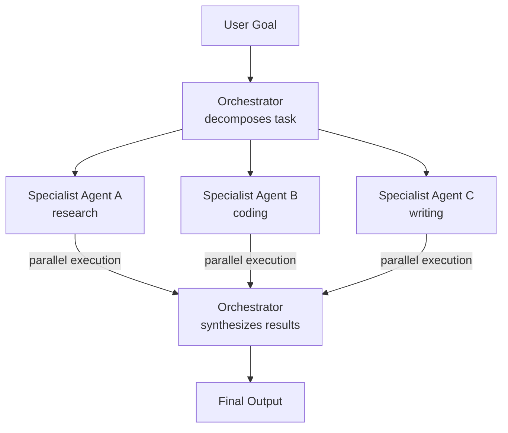
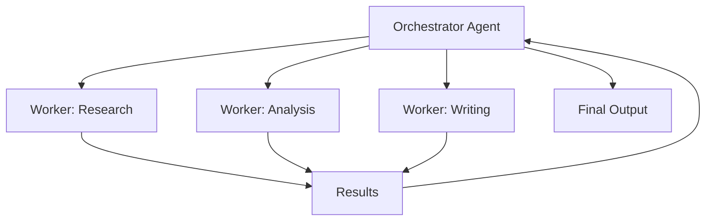
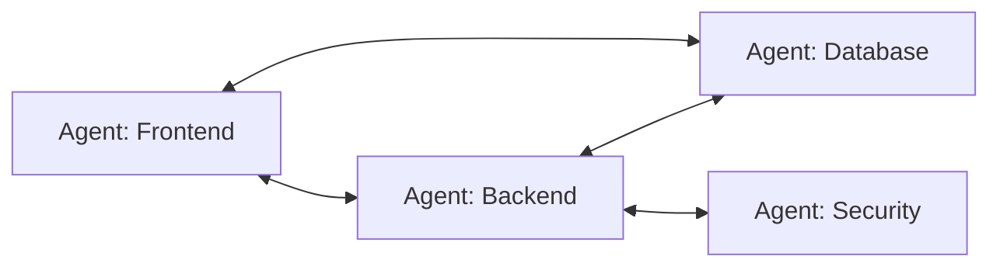
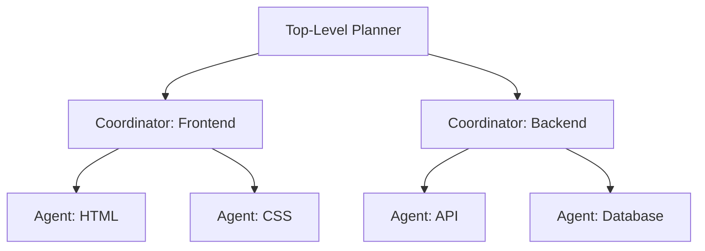
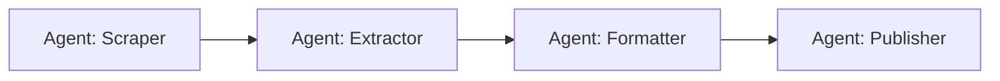

# Multi-Agent Systems

**Level**: 🟡 Intermediate
**Reading Time**: 12 minutes

> When tasks outgrow a single agent — too long, too parallel, or too complex — multiple specialized agents working together get the job done faster and more reliably.

## 🗺️ Quick Overview



*Multi-agent systems overcome context limits and sequential bottlenecks by distributing sub-tasks across parallel specialist agents coordinated by an orchestrator.*

## The Problem

A single agent hits three ceilings:

1. **Context limit**: A 200K token context sounds huge, but for a task that reads 50 files and makes 30 tool calls, you'll fill it. Agents can't hold the entire task in mind.
2. **Sequential bottleneck**: An agent that must research 20 companies one at a time takes 20x longer than 20 agents running in parallel.
3. **No specialization**: A single general-purpose agent is mediocre at everything. A security-focused agent trained on security patterns is better at security reviews than a general coding agent.

Multi-agent systems solve all three: break the task into sub-tasks, run them in parallel, and assign each to the right specialist.

## Four Multi-Agent Topologies

### 1. Orchestrator-Worker

A central orchestrator plans and delegates. Workers execute sub-tasks and return results.



**Best for**: Tasks with clear sub-tasks that can be defined upfront (research + analyze + write).

### 2. Peer-to-Peer

Agents can call each other directly. No central controller.



**Best for**: Collaborative review tasks where agents need to consult each other (code review, architecture critique).

### 3. Hierarchical

Multiple levels of orchestration. A top-level planner delegates to mid-level coordinators who delegate to leaf agents.



**Best for**: Very large tasks with nested structure (build a full application, conduct a multi-domain audit).

### 4. Pipeline

Agents form a sequential chain. Output of one feeds as input to the next.



**Best for**: ETL-like workflows where each stage transforms data (scrape → extract → format → publish).

## When to Use Each Topology

| Topology | Use When | Watch Out For |
|----------|----------|---------------|
| Orchestrator-Worker | Sub-tasks are well-defined and parallelizable | Orchestrator becomes a bottleneck |
| Peer-to-Peer | Agents need to consult each other freely | Communication loops, no clear owner |
| Hierarchical | Task requires multi-level decomposition | Coordination overhead multiplies |
| Pipeline | Data flows in one direction through stages | Single stage failure kills pipeline |

## Pseudocode: Multi-Agent Coordinator

```
// Agent definition
Agent = {
  name: string,
  systemPrompt: string,
  tools: list[Tool],
  run: function(task) -> AgentResult
}

// Orchestrator manages the workflow
function orchestratorRun(mainTask, workerAgents):
  // Step 1: Orchestrator plans sub-tasks
  orchestrator = agents["orchestrator"]
  plan = orchestrator.run("Break this task into sub-tasks: " + mainTask)
  subTasks = parsePlan(plan.text)

  // Step 2: Assign sub-tasks to appropriate workers
  assignments = []
  for subTask in subTasks:
    bestWorker = matchWorkerToTask(subTask, workerAgents)
    assignments.append({ worker: bestWorker, task: subTask })

  // Step 3: Run workers (potentially in parallel)
  results = parallel_map(assignments, function(a):
    return a.worker.run(a.task)
  )

  // Step 4: Orchestrator synthesizes results
  synthesisPrompt = buildSynthesisPrompt(mainTask, results)
  finalResult = orchestrator.run(synthesisPrompt)

  return finalResult

// Worker matching
function matchWorkerToTask(task, workers):
  // Simplest: keyword matching
  for worker in workers:
    if any(keyword in task for keyword in worker.keywords):
      return worker
  // Fallback: general worker
  return workers["general"]
```

## State Sharing Between Agents

Agents in a multi-agent system need to share state. Three patterns:

### Shared State Object

All agents read from and write to a central state object:

```
SharedState = {
  taskDescription: string,
  subTaskResults: dict[taskId, AgentResult],
  errors: list[Error],
  completedTasks: set[taskId],
  metadata: { startTime, totalTokens, cost }
}

// Agent reads context from shared state
function workerRun(task, sharedState):
  context = buildContextFromSharedState(task, sharedState)
  result = runAgent(context, task)
  sharedState.subTaskResults[task.id] = result
  sharedState.completedTasks.add(task.id)
  return result
```

### Message Passing

Agents communicate via a message bus:

```
MessageBus = {
  send: function(fromAgent, toAgent, message),
  receive: function(agentId) -> list[Message],
  broadcast: function(fromAgent, message)
}

// Agent checks inbox before starting
function agentWithInbox(agentId, task, bus):
  inboundMessages = bus.receive(agentId)
  context = buildContextFromMessages(inboundMessages)
  result = runAgent(context, task)
  bus.send(agentId, "orchestrator", { taskId: task.id, result: result })
  return result
```

## Result Aggregation

Combining multiple agent results into a coherent final output:

```
function aggregateResults(subTaskResults, aggregationStrategy):
  if aggregationStrategy == CONCATENATE:
    return joinAll(subTaskResults)

  if aggregationStrategy == LLM_SYNTHESIZE:
    synthesisPrompt = """
    You received outputs from multiple specialized agents working on sub-tasks.
    Synthesize them into a single coherent response.

    Sub-task results:
    """ + formatResults(subTaskResults)
    return LLM.generate(synthesisPrompt)

  if aggregationStrategy == VOTE:
    // For tasks with a single answer (classification, etc.)
    return mostCommonAnswer(subTaskResults)

  if aggregationStrategy == SEQUENTIAL:
    // Feed each result into the next agent
    current = subTaskResults[0]
    for result in subTaskResults[1:]:
      current = LLM.combine(current, result)
    return current
```

## Multi-Agent vs Single-Agent: Decision Guide

```
Decision Tree:

Does the task exceed context limits? (>50K tokens of content?)
  YES → Consider multi-agent
  NO  ↓

Can sub-tasks run in parallel to save meaningful time?
  YES → Consider multi-agent
  NO  ↓

Does the task require genuinely different skills? (e.g., legal + technical + financial)
  YES → Consider multi-agent
  NO  ↓

Use single agent.
```

## Challenges in Multi-Agent Systems

**Error propagation**: If agent A's result is wrong, agents B and C that depend on A will also be wrong. Add validation between stages.

**Communication overhead**: Every agent-to-agent message may be an LLM call. 5 agents calling each other in a loop = 10x the token cost.

**Non-determinism multiplied**: Each agent introduces variance. In a 5-agent pipeline, errors compound. Test multi-agent systems with deterministic seeds or LLM-as-judge evaluation.

**Debugging complexity**: "Why did the final output get X?" requires tracing across N agents, each with their own context. Good observability (traces, logs) is mandatory.

## Real-World Usage

**AutoGen (Microsoft)**: A framework specifically designed for multi-agent conversations. Their use case: a "coding assistant" (writer agent) + "code critic" (reviewer agent) + "execution agent" (runs the code). Three specialized agents vs one general one.

**CrewAI**: Popularized multi-agent with the concept of "crews" — define agents with roles (Researcher, Writer, Editor) and assign them tasks. Internally uses Orchestrator-Worker.

**Devin**: For complex software engineering, uses a planner agent (decides what to do) + an execution agent (runs commands, edits files). Hierarchical 2-level system.

**Claude Projects**: Multi-turn conversations where different "modes" (research, coding, summarization) can be thought of as specialized agents within the same session.

## Common Pitfalls

1. **Over-engineering**: Building a 5-agent system for a task a single agent handles fine. Start single, add agents only when you hit real limits.
2. **No validation between agents**: Worker A produces bad output → Worker B builds on bad output → catastrophic failure. Validate results at boundaries.
3. **Agents calling each other in loops**: Peer-to-peer without a loop detection mechanism causes infinite agent recursion. Add a call depth counter.
4. **Shared mutable state races**: Two agents writing to shared state simultaneously can corrupt it. Use locks or append-only state.
5. **Not tracking cost per agent**: In multi-agent, token costs multiply. Track per-agent costs to identify which agent is responsible for runaway spending.

## Key Takeaways

- Multi-agent systems add parallelism, specialization, and scalability beyond what a single agent can do
- Four topologies: orchestrator-worker, peer-to-peer, hierarchical, pipeline — pick based on task structure
- Agents share state via shared objects (synchronous) or message passing (decoupled)
- Result aggregation needs explicit design: concatenate, LLM-synthesize, vote, or chain
- Start with a single agent — go multi-agent only when you hit real context, parallelism, or specialization limits
- Multi-agent debugging requires observability: trace every agent call with its full context
