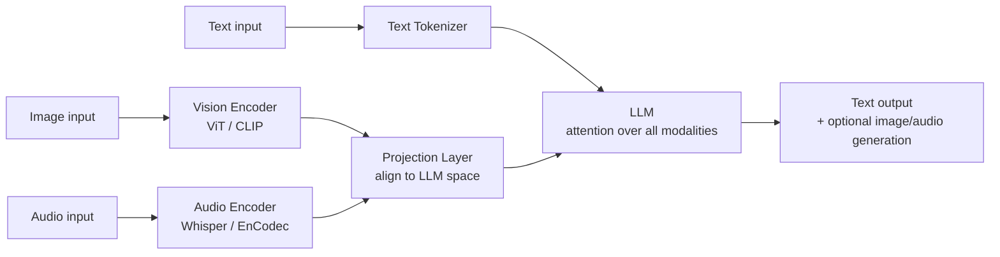
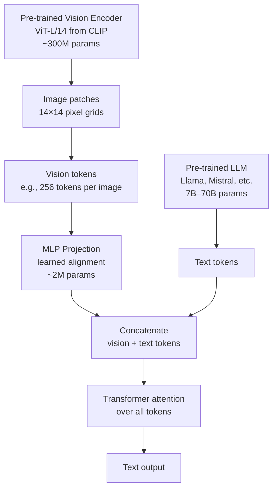
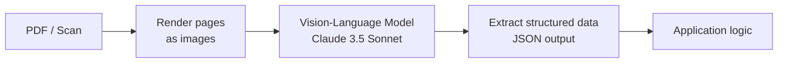

# Multimodal Models — Beyond Text

**Level**: 🟡 Intermediate
**Reading Time**: 13 minutes

> An agent that can only read text is like a developer who can only read documentation and never look at the screen — most real-world tasks require seeing things, not just reading descriptions of them.

## 🗺️ Quick Overview



*All input modalities are encoded into the same token space, then processed together by the LLM's attention mechanism.*

## The Problem

Most agent tutorials start and end with text. But real-world tasks rarely are:

- A user uploads a PDF contract and asks "does this include a non-compete clause?" — the agent needs to read a document, not structured text
- A computer-use agent needs to see the current state of the screen to decide what to click next
- An e-commerce agent processes product photos to extract attributes for catalog management
- A support agent receives a screenshot of an error message — parsing it as text is impractical; seeing it as an image works instantly

These are mainstream agent use cases today, not edge cases. Understanding how multimodal models work — and their costs, limitations, and API patterns — is now a core skill for agent builders.

---

## Architecture: How Multimodal Models Work

The dominant architecture for vision-language models connects a vision encoder to an existing language model through a learned projection layer.



**Three components:**

1. **Vision Encoder** — A pretrained image model (usually Vision Transformer, ViT) that converts an image into a sequence of patch embeddings. ViT-L/14 produces 256 embedding vectors from a 224×224 image.

2. **Projection Layer** — A small MLP that maps vision encoder output dimensions to the LLM's embedding dimensions. This is the "bridge" between visual and language spaces. In LLaVA, this is trained first; in GPT-4o, it's trained end-to-end.

3. **Language Model** — The LLM processes the concatenated sequence of vision tokens + text tokens using standard attention. From the LLM's perspective, vision tokens are just more tokens with special embeddings.

**Training approach**: Most open-source multimodal models (LLaVA, LLaVA-Next) freeze the vision encoder and LLM, then train only the projection layer on image-text pairs. GPT-4o and Gemini use end-to-end training across all components — more expensive but more integrated.

---

## Key Models in 2025

### Frontier / Commercial Models

| Model | Modalities In | Context | Strength | Cost per image |
|-------|--------------|---------|----------|---------------|
| **GPT-4o** | Text + Image + Audio | 128K tokens | Code from screenshots, OCR, chart analysis | ~$0.01–0.02 (1080p) |
| **Gemini 1.5 Pro** | Text + Image + Audio + Video | 1M tokens | Long video analysis, entire document libraries | ~$0.003–0.01 |
| **Claude 3.5 Sonnet** | Text + Image | 200K tokens | Document understanding, nuanced visual reasoning | ~$0.01–0.02 (high-res) |
| **Claude 3.5 Haiku** | Text + Image | 200K tokens | Fast, cheap image tasks | ~$0.002–0.005 |
| **GPT-4o-mini** | Text + Image | 128K tokens | Budget vision tasks | ~$0.001–0.003 |

### Open Source Models

| Model | Base LLM | Strength | VRAM |
|-------|----------|----------|------|
| **LLaVA-Next (34B)** | Vicuna/Llama | General vision-language | 24GB+ |
| **LLaVA-1.5 (13B)** | Vicuna | Good benchmark performance | 16GB |
| **InternVL2** | InternLM2 | Competitive with GPT-4V on benchmarks | 16GB+ |
| **Phi-3-Vision** | Phi-3 | Compact, fast, good for document tasks | 8GB |
| **Whisper (large-v3)** | — | Audio-to-text only | 8GB |

### Audio-Only Models

**Whisper** (OpenAI): state-of-the-art speech-to-text, available as API and open-source. Handles 99 languages, ~3% word error rate on English, ~10% on other languages. Cost via API: $0.006/minute.

---

## Image Tokens: The Hidden Cost Driver

Images are expensive because they consume a lot of tokens. Understanding image token math is critical for cost control:

### GPT-4o Image Token Calculation

GPT-4o uses a tile-based approach:
- Low detail mode: flat **85 tokens** per image (regardless of size)
- High detail mode: image is divided into 512×512 tiles + one base tile of 85 tokens

For a **1024×1024 image** in high detail mode:
- 4 tiles (each tile = 170 tokens) + base = 4 × 170 + 85 = **765 tokens**
- At $5/M input tokens = **$0.0038 per image**

For a **2048×2048 image** in high detail mode:
- 16 tiles × 170 + 85 = **2,805 tokens**
- At $5/M input tokens = **$0.014 per image**

### Claude Image Token Calculation

Claude uses width × height pixel dimensions divided by a scaling factor:
- Approximate: **1 token per ~750 pixels** of image area
- A 1024×768 image: ~1,048 tokens
- A 2048×1536 image: ~4,194 tokens

| Image Size | Approx Tokens (Claude) | Approx Tokens (GPT-4o HD) | Cost @ $3/M (Claude Haiku) |
|-----------|----------------------|--------------------------|---------------------------|
| 256×256 | ~87 | 255 | $0.0003 |
| 512×512 | ~350 | 765 | $0.001 |
| 1024×768 | ~1,048 | 765 | $0.003 |
| 1920×1080 | ~2,765 | 1,275 | $0.008 |
| 3840×2160 | ~11,059 | 2,805 | $0.033 |

**Practical rule**: Resize images before sending. For document OCR, 1024-wide is usually sufficient. For photo analysis, 800-1200px wide captures all relevant detail. Sending 4K images to extract text from a screenshot wastes 4–8x the tokens.

---

## API Patterns

### Sending Images to Claude

```python
import anthropic
import base64
from pathlib import Path

client = anthropic.Anthropic()

# Method 1: Base64 encoded local file
def analyze_image_file(image_path: str, question: str) -> str:
    image_data = base64.standard_b64encode(
        Path(image_path).read_bytes()
    ).decode("utf-8")

    # Detect media type from extension
    ext = Path(image_path).suffix.lower()
    media_type = {".jpg": "image/jpeg", ".png": "image/png",
                  ".gif": "image/gif", ".webp": "image/webp"}[ext]

    response = client.messages.create(
        model="claude-3-5-sonnet-20241022",
        max_tokens=1024,
        messages=[{
            "role": "user",
            "content": [
                {
                    "type": "image",
                    "source": {
                        "type": "base64",
                        "media_type": media_type,
                        "data": image_data,
                    },
                },
                {"type": "text", "text": question}
            ],
        }]
    )
    return response.content[0].text

# Method 2: URL reference (Claude fetches the image)
def analyze_image_url(url: str, question: str) -> str:
    response = client.messages.create(
        model="claude-3-5-sonnet-20241022",
        max_tokens=1024,
        messages=[{
            "role": "user",
            "content": [
                {
                    "type": "image",
                    "source": {"type": "url", "url": url},
                },
                {"type": "text", "text": question}
            ],
        }]
    )
    return response.content[0].text

# Usage
result = analyze_image_file(
    "error_screenshot.png",
    "What error is shown in this screenshot? What likely caused it?"
)
```

### Sending Images to GPT-4o

```python
from openai import OpenAI
import base64

client = OpenAI()

def analyze_with_gpt4o(image_path: str, question: str,
                        detail: str = "high") -> str:
    """
    detail: "low" (85 tokens, cheap) or "high" (tile-based, detailed)
    Use "low" for: classification, yes/no questions, rough descriptions
    Use "high" for: OCR, chart reading, detailed analysis
    """
    with open(image_path, "rb") as f:
        image_data = base64.b64encode(f.read()).decode("utf-8")

    response = client.chat.completions.create(
        model="gpt-4o",
        messages=[{
            "role": "user",
            "content": [
                {
                    "type": "image_url",
                    "image_url": {
                        "url": f"data:image/jpeg;base64,{image_data}",
                        "detail": detail  # "low" or "high"
                    },
                },
                {"type": "text", "text": question}
            ],
        }],
        max_tokens=500,
    )
    return response.choices[0].message.content
```

### Multi-image Comparison

```python
def compare_images(image_paths: list[str], comparison_question: str) -> str:
    """Compare multiple images in a single API call."""
    content = []

    for i, path in enumerate(image_paths):
        image_data = base64.standard_b64encode(
            Path(path).read_bytes()
        ).decode("utf-8")

        content.append({"type": "text", "text": f"Image {i+1}:"})
        content.append({
            "type": "image",
            "source": {"type": "base64", "media_type": "image/png", "data": image_data}
        })

    content.append({"type": "text", "text": comparison_question})

    response = client.messages.create(
        model="claude-3-5-sonnet-20241022",
        max_tokens=1024,
        messages=[{"role": "user", "content": content}]
    )
    return response.content[0].text
```

---

## Agent Use Cases for Multimodal

### Document Understanding



**When to use**: Contracts, invoices, medical records, handwritten forms, PDFs with complex layouts that break text extraction.

**Real example**: Klarna uses GPT-4o to extract merchant information from receipt images, replacing a rule-based parser that failed on unusual receipt formats. Accuracy improved from 82% to 97%.

### Computer-Use Agents

Agents that control computers (Anthropic's Computer Use) need to see the screen state to make decisions. The vision model outputs coordinates and actions based on what it sees.

```
Screen state → Screenshot → Vision model → "Click button at (450, 230)" → OS action
```

Current limitations: most vision models struggle with precise pixel coordinates and small UI elements. Accuracy on complex desktop UIs is 60–80%, not reliable enough for fully autonomous operation.

### Screen-Reading for Accessibility and Testing

```python
def extract_ui_elements(screenshot_path: str) -> dict:
    """Extract UI elements from a screenshot for testing or accessibility."""
    question = """Analyze this UI screenshot and return a JSON object with:
    - page_title: the main heading or page title
    - buttons: list of visible button labels
    - input_fields: list of form fields with their labels
    - navigation: list of navigation menu items
    - alerts_or_errors: any error messages or alerts visible"""

    result = analyze_image_file(screenshot_path, question)
    return json.loads(result)
```

---

## Limitations to Know

| Limitation | Description | Workaround |
|-----------|-------------|-----------|
| **No spatial precision** | Models struggle to give exact pixel coordinates | Use specialized UI detection tools alongside VLM |
| **Hallucinated OCR** | Small text may be misread, especially handwriting | Use specialized OCR (Tesseract, AWS Textract) for critical text extraction |
| **No temporal reasoning** | Single-frame models can't understand video motion | Use Gemini 1.5 for video; or extract key frames manually |
| **Image token cost** | Large images are expensive | Resize to minimum needed resolution; use low-detail mode for rough tasks |
| **Color inconsistency** | Some models describe colors inconsistently | Specify exact color values in prompts if precision needed |
| **No 3D understanding** | Depth perception is unreliable | Use specialized 3D vision models for geometry tasks |

---

## When NOT to Use Multimodal

Multimodal adds cost and complexity. Use it only when necessary:

| Situation | Use Multimodal? | Reason |
|-----------|----------------|--------|
| User uploads a PDF with clean text | No | Extract text with PDFplumber; much cheaper |
| Scanned document with complex layout | Yes | Text extraction breaks on multi-column, tables, etc. |
| Chart or graph in an image | Yes | Text extraction loses visual relationships |
| Product photo for classification | Yes | You need to see the product |
| Log file analysis | No | Plain text is cleaner and cheaper |
| Error message as text copy-paste | No | Text is already structured |
| Screenshot of error message | Yes | Can't always get the underlying text |

**Rule**: if text extraction gives you clean, complete, structured data — use text extraction. Reserve vision for cases where the visual layout carries information that text stripping loses.

---

## Common Mistakes

1. **Sending full-resolution images when low-res suffices** — A 4K screenshot sent to extract a button label uses 10x more tokens than a 400px crop of the relevant area. Always resize or crop to the minimum region needed before sending. This alone can reduce image API costs by 5–10x.

2. **Using vision for text documents that can be parsed** — PDFs, DOCX files, HTML pages — all can be converted to clean text. Sending a PDF page as an image costs $0.01–0.05; using `pypdf` to extract text costs essentially nothing and is more accurate for clean documents. Reserve vision for scanned or visually complex documents.

3. **Expecting precise spatial output** — Asking "what is the exact pixel location of the submit button?" will fail. Vision models are trained to understand visual semantics, not pixel geometry. For UI testing, use image detection libraries (OpenCV, YOLO-based UI detectors); use vision models only for high-level understanding.

4. **Ignoring hallucinated OCR on small text** — Vision models hallucinate on small, blurry, or stylized text. Serial numbers, model numbers, contract clause numbers — anything where character-level accuracy matters — should use dedicated OCR, not a vision model. Cross-validate critical text extraction against ground truth.

5. **Not batching images when processing documents** — Sending 50 document pages as 50 separate API calls adds 50x the latency of a tool that can batch them. Claude supports up to 20 images per message. Process multi-page documents by sending multiple pages per call; Gemini 1.5 Pro can receive entire documents (1M token context) as a sequence of images.

---

## Key Takeaways

- All multimodal models convert images into tokens and process them alongside text — a **1024×1024 image costs ~765–1,048 tokens** depending on the model and mode
- **Resize images before sending** — this is the single highest-leverage cost optimization for vision-heavy agents (5–10x savings)
- Vision models are excellent at **document understanding, UI description, and visual reasoning** — but poor at precise coordinates and character-perfect OCR of small text
- If the document can be text-extracted cleanly (PDF, DOCX, HTML), do that instead — **vision is the expensive fallback**, not the default
- The frontier models (GPT-4o, Gemini 1.5 Pro, Claude 3.5 Sonnet) have near-equivalent vision quality; choose based on **context window size, cost, and existing API integration**

---

## References

> 📖 [LLaVA: Visual Instruction Tuning](https://arxiv.org/abs/2304.08485) — Original LLaVA paper introducing the projection-layer architecture for open-source VLMs
> 📚 [Anthropic Claude Vision API Documentation](https://docs.anthropic.com/en/docs/build-with-claude/vision) — Official docs with image format requirements, token counting, and code examples
> 📚 [OpenAI Vision Documentation](https://platform.openai.com/docs/guides/vision) — GPT-4o vision guide with detail modes, token calculation, and limitations
> 📖 [Gemini 1.5: Unlocking Multimodal Understanding](https://arxiv.org/abs/2403.05530) — Google's paper on Gemini 1.5 with multimodal benchmarks and video understanding
> 📺 [LLaVA Explained — AI Explained](https://www.youtube.com/watch?v=6XSdNMkL8z8) — Visual walkthrough of the architecture connecting vision encoders to language models
