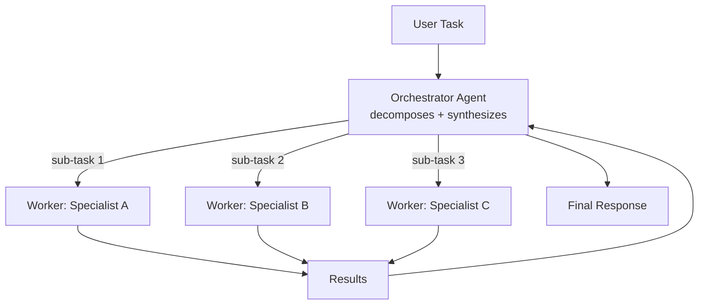
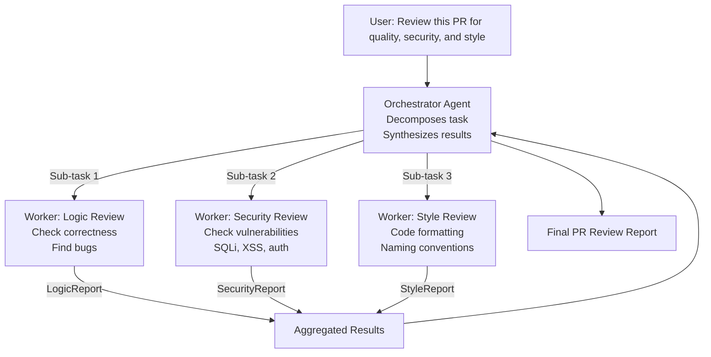

# Orchestrator-Worker Pattern

**Level**: 🟡 Intermediate
**Reading Time**: 11 minutes

> One agent plans; many agents execute. The orchestrator is the brain, workers are the hands — and neither does the other's job.

## 🗺️ Quick Overview



*The orchestrator decomposes the task and dispatches stateless, single-purpose workers in parallel; results are synthesized into one response.*

## The Problem

When a task has multiple independent sub-tasks, a single agent processes them one at a time: research company A, then company B, then company C. If each takes 30 seconds, 10 companies takes 5 minutes. With parallelism, it should take 30 seconds.

But parallelism requires a coordinator — something that breaks the task apart, assigns work, waits for results, and synthesizes them. That's the orchestrator.

The orchestrator-worker pattern is the most commonly used multi-agent architecture because it maps cleanly to the way complex human work is organized: a manager (orchestrator) decomposes and delegates; specialists (workers) execute within their domain.

## Roles

**Orchestrator**:
- Receives the main task from the user
- Decomposes it into concrete sub-tasks
- Decides which worker is best suited to each sub-task
- Dispatches workers (sequentially or in parallel)
- Collects and validates results
- Synthesizes a final response

**Workers**:
- Receive a single, well-scoped sub-task
- Have a specialized system prompt and limited tool set
- Execute the task without needing to know about the broader goal
- Return a structured result with their findings

The key design principle: **workers should be stateless and single-purpose**. They don't coordinate with other workers. They don't need the full context. They just do their job.

## Architecture Diagram



Workers run in parallel — the orchestrator doesn't wait for W1 to finish before starting W2.

## Pseudocode: Full Orchestrator-Worker

```
// Worker agent definition
WorkerAgent = {
  name: string,
  specialization: string,
  systemPrompt: string,
  tools: list[Tool],

  run: function(subTask, context):
    messages = [
      SystemMessage(this.systemPrompt),
      HumanMessage("Sub-task: " + subTask + "\nContext: " + context)
    ]
    result = runAgentLoop(messages, this.tools, maxSteps=10)
    return WorkerResult(
      worker: this.name,
      subTask: subTask,
      findings: result.text,
      confidence: result.confidence
    )
}

// Orchestrator logic
function orchestratorRun(mainTask, workers):

  // Phase 1: Task decomposition
  decompositionPrompt = """
  Task: """ + mainTask + """

  Decompose this into sub-tasks. For each sub-task, output:
  {
    "id": "task-1",
    "description": "...",
    "worker": "logic-reviewer | security-reviewer | style-reviewer",
    "context_needed": "which parts of the input are relevant"
  }
  Output as JSON array.
  """
  plan = LLM.generate(decompositionPrompt)
  subTasks = JSON.parse(plan.text)

  // Phase 2: Parallel worker dispatch
  workerResults = parallel_map(subTasks, function(subTask):
    worker = workers[subTask.worker]
    context = extractContext(mainTask, subTask.contextNeeded)
    return worker.run(subTask.description, context)
  )

  // Phase 3: Validation (optional but recommended)
  validatedResults = []
  for result in workerResults:
    if result.confidence < 0.5:
      // Re-run low-confidence tasks with a different worker
      backupWorker = workers["general"]
      retryResult = backupWorker.run(result.subTask, fullContext=mainTask)
      validatedResults.append(retryResult)
    else:
      validatedResults.append(result)

  // Phase 4: Synthesis
  synthesisPrompt = buildSynthesisPrompt(mainTask, validatedResults)
  finalAnswer = LLM.generate(synthesisPrompt)

  return OrchestratorResult(
    finalAnswer = finalAnswer.text,
    workerResults = validatedResults,
    totalTokens = sumTokens(workerResults) + finalAnswer.tokens
  )
```

## Orchestrator Responsibilities in Detail

### 1. Task Decomposition

The hardest part. The orchestrator needs to produce sub-tasks that are:
- **Self-contained**: Worker can complete them without knowing about other sub-tasks
- **Correctly scoped**: Not too big (worker runs out of context) or too small (overhead dominates)
- **Correctly assigned**: Right worker for each task

```
Good decomposition:
  Main: "Audit the payments module for correctness, security, and performance"
  Sub-tasks:
    - "Review payment calculation logic for correctness" → logic-worker
    - "Check for SQL injection and authentication issues" → security-worker
    - "Profile database queries and identify slow paths" → perf-worker

Bad decomposition:
  Sub-tasks:
    - "Check everything about payments" → too broad
    - "Check line 42" → too narrow
```

### 2. Worker Selection

```
function selectWorker(subTask, availableWorkers):
  // Strategy 1: Explicit routing in plan (LLM decides)
  // The decomposition step already assigned workers — use that

  // Strategy 2: Semantic matching
  taskEmbedding = embed(subTask.description)
  workerEmbeddings = workers.map(w => embed(w.specialization))
  bestMatch = cosineMax(taskEmbedding, workerEmbeddings)
  return workers[bestMatch.index]

  // Strategy 3: Keyword rules (fast but brittle)
  if "security" in subTask.description.lower():
    return workers["security"]
  if "performance" in subTask.description.lower():
    return workers["performance"]
  return workers["general"]
```

### 3. Result Synthesis

The orchestrator should not just concatenate worker outputs — it should make sense of them:

```
synthesisPrompt = """
You are a senior engineer reviewing reports from specialized agents.

Main task: """ + mainTask + """

Worker findings:
""" + formatWorkerResults(validatedResults) + """

Write a unified, prioritized report that:
1. Groups related findings across workers
2. Prioritizes by severity
3. Identifies any contradictions between workers
4. Gives an overall assessment
"""
```

## Real-World Example: Code Review Agent

Let's walk through a concrete example. Task: "Review this pull request before merging."

```
Input: Git diff of 500 lines changed across 8 files

Orchestrator:
  Decomposes into:
    - "Review business logic correctness in checkout.py" → LogicWorker
    - "Review authentication and authorization changes" → SecurityWorker
    - "Check test coverage and test quality" → TestWorker
    - "Review code style and documentation" → StyleWorker

Workers run in parallel (each sees the relevant file subset):
  LogicWorker: Found 2 off-by-one errors in cart calculations
  SecurityWorker: Found 1 missing auth check in /api/admin/refund
  TestWorker: Coverage dropped from 87% to 81% (new untested paths)
  StyleWorker: 14 style violations, 3 missing docstrings

Orchestrator synthesizes:
  CRITICAL: Missing auth check in refund endpoint (SecurityWorker)
  HIGH: 2 calculation errors in cart (LogicWorker)
  MEDIUM: Test coverage regression (TestWorker)
  LOW: Style violations (StyleWorker)

  Recommendation: Block merge. Fix critical and high before re-review.
```

A single agent doing this sequentially would take 4x longer and might lose context between files.

## Trade-offs

| Aspect | Orchestrator-Worker | Single Agent |
|--------|---------------------|--------------|
| Speed | Parallel — faster | Sequential |
| Cost | N workers + orchestrator | Single LLM |
| Correctness | Higher (specialized) | Medium |
| Debugging | Complex (multiple agents) | Simple |
| Consistency | Risk of contradictions | Consistent |
| Setup | High (define workers) | Low |

## Common Pitfalls

1. **Orchestrator micromanages**: If the orchestrator defines sub-tasks at the line-of-code level, workers can't make judgment calls. Trust workers with meaningful scope.
2. **Workers share context they shouldn't**: If workers can read each other's intermediate results, one biased worker can pollute others. Keep workers isolated.
3. **No fallback when worker fails**: If SecurityWorker crashes, the synthesis step either skips security (dangerous) or fails entirely. Add fallback workers.
4. **Orchestrator token blindness**: The synthesis step receives all worker results. If workers are verbose, synthesis context can be huge. Instruct workers to return concise structured summaries.
5. **Sequential disguised as parallel**: Launching workers in parallel but waiting for the slowest one before synthesis is still serial at the tail. Use partial results with timeouts.

## Key Takeaways

- Orchestrator plans and synthesizes; workers execute specialized sub-tasks
- Workers are stateless, single-purpose, and isolated from each other
- Parallel execution is the main benefit — 10 workers at 30s beats 1 agent at 5 minutes
- Decomposition quality determines outcome quality — garbage sub-tasks = garbage results
- The orchestrator must synthesize, not just concatenate — it reads across worker reports
- Always handle worker failures gracefully: retry, fallback worker, or partial synthesis
