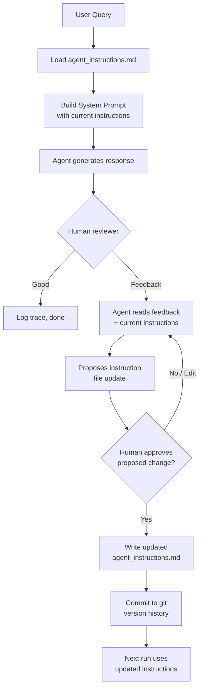

# POC: Procedural Memory — Agent That Learns Its Own Instructions

**Level**: 🟡 Intermediate
**Reading Time**: 14 minutes

> The agent makes the same mistake twice because it can't remember the correction. The fix: give the agent a file it can update.

## The Problem

A customer support agent gives an overly formal response. A human reviewer flags it: "Too stiff — say 'Sorry about that' not 'I sincerely apologize for any inconvenience.'"

You update the system prompt manually. Next week, a different reviewer flags the same pattern. Then again the week after.

Without procedural memory, every correction dies in a Slack thread. With it, corrections become permanent — and the agent gets measurably better over time.

## What Procedural Memory Solves

```
Without procedural memory:
  Run 1: Agent → "I sincerely apologize..." → Human: "Too formal" → fix discarded
  Run 2: Agent → "I sincerely apologize..." → Human: "Too formal again" → fix discarded
  Run N: Same mistake. Same correction. Nothing changes.

With procedural memory:
  Run 1: Agent → "I sincerely apologize..." → Human: "Too formal"
          → Agent proposes instruction update
          → Human approves
          → agent_instructions.md updated
  Run 2: Agent reads new instructions → "Sorry about that, let me help!"
  Run N: Mistake from Run 1 never happens again.
```

## Architecture



## The Instruction File (Procedural Memory)

The agent's procedural memory lives in a plain markdown file:

```markdown
# agent_instructions.md — Customer Support Agent v1.0

## Tone and Style
- Be conversational and warm. You're a helpful person, not a bureaucrat.
- Use the customer's name when you know it.
- Avoid corporate phrases: "I sincerely apologize", "please be advised", "at your earliest convenience".
- Use natural language: "Sorry about that", "Here's what I found", "Let me check that for you".

## Process for Refund Requests
1. Check order status using the CRM tool before responding.
2. If order is within 30 days: offer full refund, no escalation needed.
3. If order is 30-90 days: offer store credit, explain policy.
4. If order is over 90 days: escalate to billing team using escalate_billing tool.

## Things to Never Do
- Never promise a specific resolution timeline unless the CRM confirms it.
- Never mention competitor products.
- Never reveal internal tool names or system details.

## Common Questions
- "Where is my order?" → Always check order_status tool first before answering.
- "I want a refund" → Follow refund process above.
- "Speak to a human" → Acknowledge, then use escalate_human tool immediately.
```

## Full Implementation

### Core Classes

```python
from pathlib import Path
from dataclasses import dataclass
from typing import Optional

@dataclass
class AgentTrace:
    run_id: str
    user_query: str
    agent_response: str
    tool_calls: list
    score: Optional[float] = None

@dataclass
class InstructionUpdate:
    original: str
    proposed: str
    feedback: str
    approved: bool = False

class ProceduralMemory:
    """Manages the agent's procedural memory as a versioned text file."""

    def __init__(self, instructions_path: str):
        self.path = Path(instructions_path)
        if not self.path.exists():
            raise FileNotFoundError(f"Instructions file not found: {instructions_path}")

    def load(self) -> str:
        """Load current instructions. Called at the start of every agent run."""
        return self.path.read_text()

    def propose_update(self, feedback: str, current_instructions: str, llm) -> str:
        """
        Given feedback on the agent's behavior, ask the LLM to propose
        a minimal targeted update to the instructions.
        """
        proposal = llm.invoke(f"""
You are helping improve an AI agent's instruction file.

CURRENT INSTRUCTIONS:
{current_instructions}

FEEDBACK RECEIVED:
{feedback}

Your task: propose a minimal, targeted update to the instructions that directly addresses
this feedback. Do not rewrite sections that don't need to change.

Rules:
- Make the smallest change that fixes the problem
- Keep the same formatting and structure
- Do not add vague platitudes ("be better", "try harder")
- Add specific, actionable rules

Return ONLY the full updated instruction text, nothing else.
""")
        return proposal.content

    def apply_update(self, proposed_instructions: str):
        """Write approved instructions to file."""
        self.path.write_text(proposed_instructions)

    def show_diff(self, proposed: str) -> str:
        """Generate a human-readable diff for review."""
        import difflib
        current = self.load().splitlines(keepends=True)
        proposed_lines = proposed.splitlines(keepends=True)
        diff = difflib.unified_diff(
            current, proposed_lines,
            fromfile="current instructions",
            tofile="proposed instructions"
        )
        return "".join(diff)
```

### The Agent Loop

```python
class CustomerSupportAgent:
    """Customer support agent with procedural memory."""

    def __init__(self, instructions_path: str, llm, tools: list):
        self.memory = ProceduralMemory(instructions_path)
        self.llm = llm
        self.tools = tools

    def run(self, user_query: str, run_id: str) -> AgentTrace:
        """Run the agent on a query, reading current instructions each time."""
        # Load current procedural memory (instructions file)
        current_instructions = self.memory.load()

        # Build system prompt with current instructions
        system_prompt = f"""
{current_instructions}

You are a customer support agent. Use the tools available to you to help the customer.
Always check relevant tools before answering — don't guess at order status, inventory, etc.
"""
        messages = [
            {"role": "system", "content": system_prompt},
            {"role": "user", "content": user_query}
        ]

        # Agent loop (simplified)
        tool_calls_made = []
        for step in range(20):  # max 20 steps
            response = self.llm.invoke(messages, tools=self.tools)

            if response.type == "final_answer":
                return AgentTrace(
                    run_id=run_id,
                    user_query=user_query,
                    agent_response=response.content,
                    tool_calls=tool_calls_made
                )

            # Execute tool calls and continue
            for tool_call in response.tool_calls:
                result = self._dispatch_tool(tool_call)
                tool_calls_made.append(tool_call)
                messages.append({"role": "tool", "content": result})

        return AgentTrace(run_id=run_id, user_query=user_query,
                          agent_response="[MAX STEPS REACHED]", tool_calls=tool_calls_made)

    def incorporate_feedback(self, feedback: str, require_approval: bool = True) -> InstructionUpdate:
        """
        Process feedback and update procedural memory if approved.

        Args:
            feedback: Natural language description of what to improve
            require_approval: Whether to require human approval (set False for automated low-risk updates)
        """
        current = self.memory.load()
        proposed = self.memory.propose_update(feedback, current, self.llm)

        update = InstructionUpdate(
            original=current,
            proposed=proposed,
            feedback=feedback
        )

        if require_approval:
            # Show diff to human
            diff = self.memory.show_diff(proposed)
            print("\n=== PROPOSED INSTRUCTION UPDATE ===")
            print(f"Feedback: {feedback}\n")
            print("Diff:")
            print(diff)
            approval = input("\nApprove this update? (y/n/edit): ").strip().lower()

            if approval == 'y':
                self.memory.apply_update(proposed)
                update.approved = True
                print("Instructions updated.")
            elif approval == 'edit':
                # Allow human to edit the proposed instructions directly
                edited = self._open_editor(proposed)
                self.memory.apply_update(edited)
                update.proposed = edited
                update.approved = True
                print("Edited instructions applied.")
            else:
                print("Update rejected.")
        else:
            # Automated update (e.g., low-risk tone adjustment)
            self.memory.apply_update(proposed)
            update.approved = True

        return update
```

### Test Scenario: Tone Correction

```python
# Initial instruction file state (v1.0):
# instructions contain no specific tone guidance

# === RUN 1: Before feedback ===
agent = CustomerSupportAgent(
    instructions_path="agent_instructions.md",
    llm=llm,
    tools=[crm_tool, order_status_tool, escalate_tool]
)

trace1 = agent.run(
    user_query="My order #12345 hasn't arrived yet, I'm quite frustrated.",
    run_id="run-001"
)
# Agent responds:
# "I sincerely apologize for any inconvenience you may be experiencing.
#  I have reviewed your order #12345 and can confirm that it is currently
#  in transit. Please be advised that delivery is expected within 2-3 business days."

# Human reviewer: "Too formal. Use 'Sorry to hear that' not 'I sincerely apologize'.
#                  Also 'Please be advised' is awful — just say when it'll arrive."

update = agent.incorporate_feedback(
    feedback="""The agent's tone is too formal and corporate.
    - Replace 'I sincerely apologize for any inconvenience' with 'Sorry about that' or similar
    - Replace 'Please be advised' with direct language
    - The response should sound like a helpful person, not a legal document""",
    require_approval=True
)

# Diff shown to reviewer:
# - "I sincerely apologize for any inconvenience you may be experiencing."
# + "Sorry to hear that! Let me look into this for you."
# ...
# - "Please be advised that delivery is expected within 2-3 business days."
# + "It should arrive within 2-3 business days."

# Human approves. Instructions file updated.

# === RUN 2: After feedback ===
trace2 = agent.run(
    user_query="My order #99887 hasn't arrived yet, I'm quite frustrated.",
    run_id="run-002"
)
# Agent responds:
# "Sorry to hear that! I just checked order #99887 — it's on its way and should
#  arrive within 2-3 business days. Let me know if you'd like me to escalate
#  to get more precise tracking info."
```

## Git Diff: What an Instruction Update Looks Like

After the feedback above, the git history of `agent_instructions.md` shows:

```diff
commit a3f2b1c
Author: Support Team <team@company.com>
Date:   2026-03-22 14:23:11

    Update agent tone instructions based on reviewer feedback (run-001)

    Feedback: Agent was too formal. Replaced corporate phrases.

diff --git a/agent_instructions.md b/agent_instructions.md
index 7f3a2b1..c9d4e5f 100644
--- a/agent_instructions.md
+++ b/agent_instructions.md
@@ -1,8 +1,12 @@
 ## Tone and Style
-- Be professional and courteous in all interactions.
-- Acknowledge customer frustration formally.
+- Be conversational and warm. You're a helpful person, not a bureaucrat.
+- Use the customer's name when you know it.
+- Avoid corporate phrases: "I sincerely apologize", "please be advised",
+  "at your earliest convenience", "I understand your frustration".
+- Use natural language: "Sorry about that", "Here's what I found",
+  "Let me check that for you".
```

This diff is auditable, reversible, and explains why the change was made. A regression? `git revert a3f2b1c` restores the previous instructions instantly.

## Extension: Automated Low-Risk Updates

For some feedback categories, human approval isn't necessary (low-risk tone adjustments, adding a new FAQ entry). Use a risk classifier:

```python
def classify_update_risk(feedback: str, proposed_diff: str, llm) -> str:
    """
    Classify an instruction update as low, medium, or high risk.
    Low risk: automated update allowed.
    Medium/High: require human review.
    """
    classification = llm.invoke(f"""
Classify this agent instruction update as LOW, MEDIUM, or HIGH risk.

LOW risk: tone adjustments, adding clarification, spelling fixes
MEDIUM risk: changing process steps, adding new rules
HIGH risk: removing rules, changing escalation logic, modifying safety guardrails

Feedback: {feedback}

Proposed change (diff):
{proposed_diff}

Return one word: LOW, MEDIUM, or HIGH
""")
    return classification.content.strip()

# In the agent loop:
risk = classify_update_risk(feedback, diff, llm)
require_approval = (risk != "LOW")
update = agent.incorporate_feedback(feedback, require_approval=require_approval)
```

## Common Pitfalls

1. **Unbounded instruction growth**: Without pruning, the instruction file grows forever as you add rules. Periodically review and consolidate redundant rules.
2. **Conflicting instructions**: If you add "always be brief" and later add "always explain your reasoning fully", the agent gets confused. Audit for conflicts before applying updates.
3. **No version history**: Without git, you can't roll back a bad update. Commit every approved change with a descriptive message.
4. **Agent proposing self-serving updates**: An agent being corrected may propose changes that technically address the feedback but preserve its preferred behavior. Human review catches this.
5. **Feedback too vague**: "Be better" produces useless instruction updates. Feedback should be specific: "When the customer mentions 'frustrated', acknowledge it before jumping to solutions."

## Key Takeaways

- Procedural memory = instruction file + update loop
- Store instructions as a versioned markdown file, not embedded in code
- The update loop: feedback → LLM proposes diff → human reviews → apply → commit
- Low-risk updates can be automated; high-risk updates always require human review
- File-based memory is auditable, portable across model versions, and version-controlled with git
- Every approved correction is a permanent improvement: the mistake can't happen again after the update is deployed
