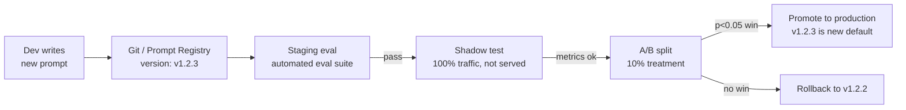
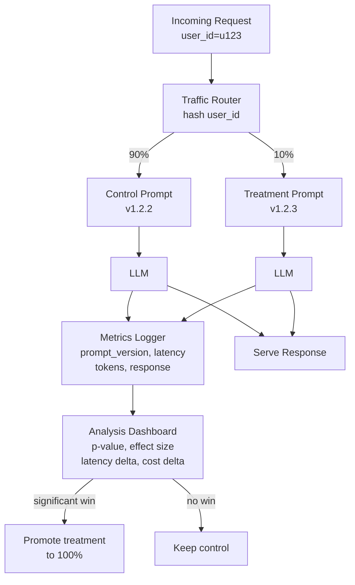

# Prompt Versioning & A/B Testing — Managing Prompt Lifecycle

**Level**: 🟡 Intermediate
**Reading Time**: 13 minutes

> A prompt is code. The moment it changes without a version number, a reviewer, or a rollback path, you've introduced untracked debt into your production system.

## 🗺️ Quick Overview



*A prompt change follows the same promotion pipeline as a code change — version, review, stage, experiment, promote or rollback.*

**When you need this**:
- Your team changes prompts more than once a month
- You want to measure if a prompt change actually improves user outcomes
- A model update broke your prompt and you need to rollback quickly
- Multiple engineers are working on the same prompts

## The Problem

A prompt that worked perfectly last month starts performing worse after a model update. Or you want to test if adding 3 few-shot examples improves classification accuracy by 5%. Without versioning, you have no way to track what changed — or run a controlled experiment to confirm the improvement is real.

The typical ungoverned prompt lifecycle looks like this:

1. Engineer edits prompt string directly in code, commits as part of a larger PR
2. Someone else tweaks the prompt in staging and forgets to update production
3. A model API update subtly changes how the model responds to the old prompt
4. No one knows whether the current prompt is worse than last month because no baseline was recorded

The result: prompt performance drifts silently. You only notice when user satisfaction metrics drop or a critical failure shows up in logs — by which time weeks of unmeasured regression have accumulated.

**Real stakes**: At 1,000 requests/day, a 10% quality drop from an untracked prompt change translates to 100 worse responses per day. Over a month, that's 3,000 degraded user interactions — and no one knows why.

## Prompt Versioning

### Storage Options

| Approach | Best For | Pros | Cons |
|----------|----------|------|------|
| Git (YAML/JSON files) | Small teams, simple prompts | Free, familiar tooling, diff/blame works | No runtime resolution, need deploy to change |
| LangSmith Hub | LangChain users | Built-in versioning, playground, sharing | Vendor lock-in, cost at scale |
| PromptLayer | Prompt-heavy apps | Analytics, A/B built in, team collaboration | $40-200/month |
| Custom DB | Full control needed | Any schema, integrate with your auth | Build and maintain yourself |

### Versioning Schema

Treat prompts as first-class artifacts with semantic versioning:

```python
from dataclasses import dataclass
from datetime import datetime
from typing import Any

@dataclass
class PromptVersion:
    prompt_id: str             # "customer-support-v1"
    version: str               # "1.2.3" or ISO timestamp "2026-03-15T10:00:00Z"
    content: str               # The actual prompt template
    model: str                 # "claude-3-5-sonnet-20241022"
    model_params: dict         # {"temperature": 0.3, "max_tokens": 1000}
    created_by: str            # "alice@example.com"
    created_at: datetime
    environment: str           # "dev" | "staging" | "production"
    status: str                # "draft" | "active" | "archived"
    tags: list[str]            # ["few-shot", "with-examples"]
    metadata: dict[str, Any]   # evaluation scores, notes

class PromptRegistry:
    def __init__(self, db):
        self.db = db

    def save(self, prompt: PromptVersion) -> str:
        """Save new version. Returns version ID."""
        return self.db.insert("prompt_versions", prompt.__dict__)

    def get_active(self, prompt_id: str, environment: str) -> PromptVersion:
        """Get the current active version for an environment."""
        return self.db.query_one(
            "SELECT * FROM prompt_versions WHERE prompt_id = ? AND environment = ? AND status = 'active'",
            [prompt_id, environment]
        )

    def rollback(self, prompt_id: str, environment: str, to_version: str):
        """Rollback to a previous version. Keeps audit trail."""
        # Archive current active
        current = self.get_active(prompt_id, environment)
        self.db.update("prompt_versions",
            {"status": "archived"},
            {"id": current.id}
        )
        # Activate target version
        self.db.update("prompt_versions",
            {"status": "active", "environment": environment},
            {"prompt_id": prompt_id, "version": to_version}
        )

    def list_versions(self, prompt_id: str, limit: int = 10) -> list[PromptVersion]:
        """List recent versions for diff/review."""
        return self.db.query(
            "SELECT * FROM prompt_versions WHERE prompt_id = ? ORDER BY created_at DESC LIMIT ?",
            [prompt_id, limit]
        )
```

### Promotion Workflow

```
dev branch  →  staging eval (automated)  →  shadow test  →  A/B experiment  →  production
    ↑                   ↓                       ↓                  ↓
  edit              must pass               log but             p < 0.05
  locally           score > 0.80            don't serve         winner
```

Each gate is enforced before the next step:
- **Staging eval**: run against 200-item golden dataset, must score > 0.80
- **Shadow test**: route 100% of production traffic to new prompt, log responses, do not serve — compare metrics for 24-48 hours
- **A/B experiment**: serve 10% treatment for 1,000+ samples, analyze with z-test
- **Production promote**: update `active` status, keep previous 5 versions for rollback

## A/B Testing Prompts

### Setting Up an Experiment

```python
import hashlib
from enum import Enum

class Bucket(Enum):
    CONTROL = "control"
    TREATMENT = "treatment"

def assign_bucket(user_id: str, experiment_id: str, treatment_pct: float = 0.1) -> Bucket:
    """
    Deterministic bucket assignment — same user always gets same bucket.
    Uses hash to avoid temporal bias (not random.random()).
    """
    hash_input = f"{user_id}:{experiment_id}".encode()
    hash_val = int(hashlib.sha256(hash_input).hexdigest(), 16)
    bucket_val = (hash_val % 10000) / 10000.0  # 0.0 to 1.0

    if bucket_val < treatment_pct:
        return Bucket.TREATMENT
    return Bucket.CONTROL

class PromptExperiment:
    def __init__(self, experiment_id: str, control_version: str, treatment_version: str):
        self.experiment_id = experiment_id
        self.control = control_version
        self.treatment = treatment_version
        self.results = {"control": [], "treatment": []}

    def get_prompt(self, user_id: str, registry: PromptRegistry) -> tuple[str, Bucket]:
        """Returns (prompt_content, bucket) for this user."""
        bucket = assign_bucket(user_id, self.experiment_id)
        version = self.treatment if bucket == Bucket.TREATMENT else self.control
        prompt = registry.get_version(version)
        return prompt.content, bucket

    def log_result(self, bucket: Bucket, metrics: dict):
        """Log outcome metrics for later analysis."""
        self.results[bucket.value].append(metrics)
```

### Metrics to Track

Track these four dimensions for every A/B test:

| Metric | How to Measure | Why It Matters |
|--------|---------------|----------------|
| Task accuracy | LLM-as-judge or golden dataset | Core quality signal |
| User satisfaction | Thumbs up/down, follow-up rate | Real user outcome |
| Latency (P95) | Wall clock time | Longer prompt = more tokens = slower |
| Cost per request | Input + output token count | Longer prompt = higher cost |

A "winning" prompt that adds 200ms latency and 30% cost increase may not be worth it for a 3% quality improvement.

### Statistical Significance Test

Run a z-test for proportions (task accuracy as pass/fail) or t-test for continuous metrics (RAGAS scores):

```python
import math
from scipy import stats

def compute_experiment_significance(
    control_scores: list[float],
    treatment_scores: list[float],
    alpha: float = 0.05
) -> dict:
    """
    Two-sided t-test for continuous metrics (e.g., RAGAS scores).
    Returns significance, effect size, and recommendation.
    """
    n_control = len(control_scores)
    n_treatment = len(treatment_scores)

    if n_control < 100 or n_treatment < 100:
        return {
            "sufficient_data": False,
            "message": f"Need ≥100 samples per bucket. Have {n_control} / {n_treatment}."
        }

    t_stat, p_value = stats.ttest_ind(control_scores, treatment_scores)

    # Effect size (Cohen's d)
    pooled_std = math.sqrt(
        ((n_control - 1) * statistics.stdev(control_scores)**2 +
         (n_treatment - 1) * statistics.stdev(treatment_scores)**2) /
        (n_control + n_treatment - 2)
    )
    cohens_d = (statistics.mean(treatment_scores) - statistics.mean(control_scores)) / pooled_std

    effect_label = "none"
    if abs(cohens_d) > 0.8:
        effect_label = "large"
    elif abs(cohens_d) > 0.5:
        effect_label = "medium"
    elif abs(cohens_d) > 0.2:
        effect_label = "small"

    significant = p_value < alpha
    improvement = statistics.mean(treatment_scores) - statistics.mean(control_scores)

    return {
        "sufficient_data": True,
        "n_control": n_control,
        "n_treatment": n_treatment,
        "control_mean": statistics.mean(control_scores),
        "treatment_mean": statistics.mean(treatment_scores),
        "improvement": improvement,
        "p_value": p_value,
        "significant": significant,
        "cohens_d": cohens_d,
        "effect_size": effect_label,
        "recommendation": "promote" if significant and improvement > 0 else "keep_control"
    }

# Minimum sample size calculator
def min_sample_size(
    baseline_rate: float,
    min_detectable_effect: float = 0.05,
    alpha: float = 0.05,
    power: float = 0.80
) -> int:
    """
    Calculate minimum samples needed before running an experiment.
    For accuracy 0.80, detecting a 5% improvement → ~1,000 per bucket.
    """
    from statsmodels.stats.power import NormalIndPower
    analysis = NormalIndPower()
    n = analysis.solve_power(
        effect_size=min_detectable_effect / math.sqrt(baseline_rate * (1 - baseline_rate)),
        alpha=alpha,
        power=power
    )
    return math.ceil(n)

# Example: test at 80% accuracy, detect 5% improvement
n = min_sample_size(baseline_rate=0.80, min_detectable_effect=0.05)
# n ≈ 1,028 per bucket → need 2,056 total requests minimum
```

### Shadow Testing

Before running a live A/B experiment, validate with shadow testing:

```python
class ShadowTester:
    """
    Routes all traffic through both prompt versions.
    Logs both responses but only serves control to users.
    Use this before any live A/B to validate the new prompt.
    """

    def __init__(self, control_version, treatment_version, registry):
        self.control = registry.get_version(control_version)
        self.treatment = registry.get_version(treatment_version)

    async def shadow_call(self, user_input: str) -> str:
        """Serve control, log treatment in background."""
        # Serve control response to user (primary path)
        control_response = await llm.generate(
            prompt=self.control.content,
            user=user_input
        )

        # Shadow: run treatment in background, don't await
        asyncio.create_task(
            self._log_treatment(user_input, control_response.text)
        )

        return control_response.text

    async def _log_treatment(self, user_input: str, control_answer: str):
        treatment_response = await llm.generate(
            prompt=self.treatment.content,
            user=user_input
        )
        # Log for offline comparison — no user impact
        metrics_store.log_shadow({
            "input": user_input,
            "control_answer": control_answer,
            "treatment_answer": treatment_response.text,
            "timestamp": datetime.utcnow()
        })
```

Shadow test for 24-48 hours (minimum 500 samples) before starting a live A/B split.

## A/B Testing Architecture



## Real-World Examples

**OpenAI (ChatGPT)**: OpenAI runs systematic A/B tests on system prompt variations, temperature settings, and response formatting. Their engineering blog mentions running hundreds of simultaneous experiments across different user segments. Prompt changes to ChatGPT go through multiple rounds of automated eval before any human exposure.

**Anthropic (Claude)**: Anthropic's RLHF and prompt optimization process involves comparing model behavior across thousands of prompt variations using Constitutional AI principles. The same rigor applied to model training is applied to prompt engineering at Anthropic's scale.

**Cursor (AI Coding Assistant)**: Cursor tests different suggestion strategies, code context window sizes, and completion prompt structures. Their ability to rapidly A/B test prompts against real developer workflows is a core competitive advantage in iterating on code quality.

## Common Mistakes

1. **Running tests too short**
   - Root cause: impatience — engineers see a 5% improvement after 200 samples and ship it
   - Fix: Calculate minimum sample size before starting; enforce it programmatically (don't show results until n_min reached)
   - Impact: 40% of "significant" results with n=200 are false positives at p=0.05

2. **Testing multiple variables at once**
   - Root cause: "Let's also add few-shot examples AND change the tone AND update the output format in this one test"
   - Fix: One hypothesis per experiment; isolate the variable being tested
   - Impact: Can't attribute improvement to any specific change; interaction effects confound results

3. **Not accounting for latency and cost in the win condition**
   - Root cause: Defining "win" as only accuracy improvement, ignoring that longer prompts add latency and cost
   - Fix: Define a composite win condition before starting: accuracy improvement must exceed latency and cost increase thresholds
   - Impact: A "winning" prompt that adds $0.002/request at 1M requests/day = $2,000/day extra cost

4. **Applying user-segment bias**
   - Root cause: Using `random.random()` for bucket assignment — users get different buckets on page reload, biasing results
   - Fix: Use deterministic hash of `user_id + experiment_id` — same user always gets same experience
   - Impact: Random assignment inflates noise, requiring 2-3x larger samples for the same power

5. **Not archiving experiment results**
   - Root cause: Teams run experiments, ship winners, and discard the experiment data
   - Fix: Archive all experiment metadata (hypothesis, results, statistical significance, winner) permanently
   - Impact: Six months later, no one knows why prompt v1.2.3 was chosen over v1.2.2 — can't learn from past experiments

## Key Takeaways

- Treat prompts as code: version control, diff, review, and rollback are non-negotiable for production prompts
- Minimum sample size for detecting a **5% improvement** at 80% baseline accuracy: **~1,000 responses per bucket**
- Shadow test (100% traffic, don't serve) before live A/B to validate the new prompt without user risk
- Define the win condition before the experiment: accuracy delta, latency budget, cost ceiling
- Use deterministic hash-based bucket assignment — `random.random()` biases results and inflates noise
- Cohen's d > 0.2 = small effect, > 0.5 = medium, > 0.8 = large — report effect size alongside p-value
- Archive all experiment results permanently; the historical record is how your team learns what works

## References

> 📖 [LangSmith Prompt Hub & Versioning](https://docs.smith.langchain.com/concepts/prompt_hub) — Official LangChain documentation on prompt versioning and lifecycle management

> 📖 [PromptLayer: Prompt Management in Production](https://promptlayer.com/blog/prompt-management-best-practices) — Engineering guide to prompt lifecycle and A/B testing patterns

> 📖 [A/B Testing for ML: Statistical Foundations](https://www.statsmodels.org/stable/stats.html#power-and-sample-size-calculations) — statsmodels documentation for power analysis and significance testing

> 📺 [Prompt Engineering at Scale — LangChain Webinar](https://www.youtube.com/watch?v=YdBJimBGAYc) — Practical guide to managing prompts in production with versioning and experiments

> 📖 [Trustworthy Online Controlled Experiments (Book)](https://experimentguide.com/) — The canonical reference for A/B testing methodology by former Microsoft experimentation leads
