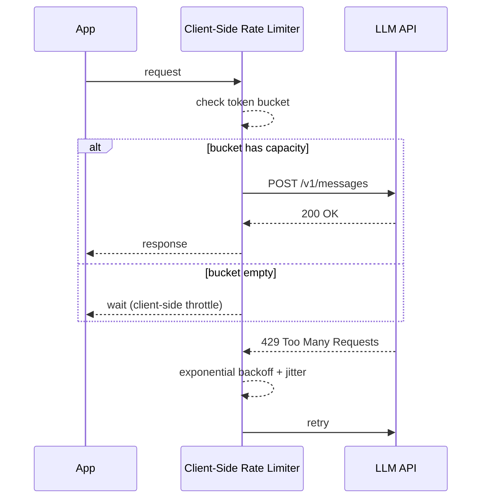
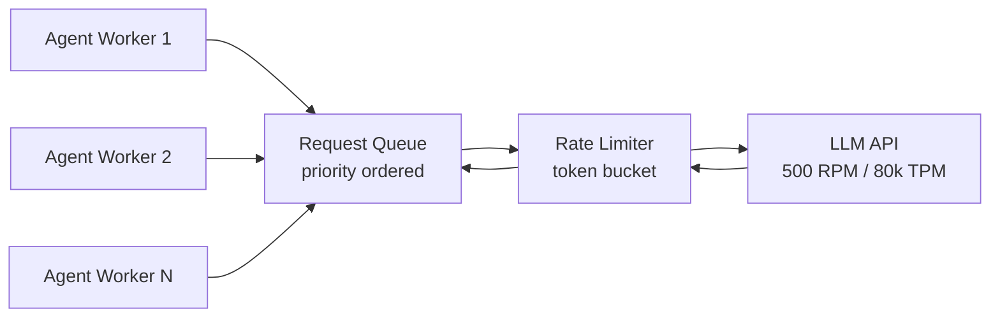

# Rate Limits & Throttling — Surviving LLM API Quotas in Production

**Level**: 🟡 Intermediate
**Reading Time**: 13 minutes

> A production agent that ignores rate limits will fail loudly in front of users. The fix isn't to ask for higher limits — it's to design your system to work within them.

## 🗺️ Quick Overview



*Client-side rate limiting prevents most 429s before they happen. When they do happen, exponential backoff with jitter prevents thundering herd on retry.*

## The Problem

Your agent works perfectly in development — 2–3 calls per test run. In production it handles 50 concurrent users, each triggering 10 LLM calls per session. Suddenly you're hitting 429 Too Many Requests errors, users see failures, and your retry logic makes it worse by creating burst traffic exactly when the API is already overloaded.

Understanding rate limits and implementing proper throttling is the difference between a reliable production agent and one that falls over under load.

---

## LLM Rate Limit Types

Every LLM provider enforces multiple independent limit dimensions:

| Limit Type | What it measures | Example |
|------------|-----------------|---------|
| **RPM** (Requests Per Minute) | Number of API calls | 500 RPM |
| **TPM** (Tokens Per Minute) | Total tokens in + out per minute | 80,000 TPM |
| **TPD** (Tokens Per Day) | Total tokens per 24-hour rolling window | 2.5M TPD |
| **Concurrent Requests** | Active in-flight requests at once | 10 concurrent |

You can hit any of these independently. A single long request with a large context window can consume your entire TPM budget in 2 calls even if you're well within RPM.

---

## Anthropic Tier System (2025)

Anthropic gates limits by tier, which you advance through by spending:

| Tier | Spend Required | Claude Sonnet RPM | Claude Sonnet TPM | Claude Sonnet TPD |
|------|---------------|-------------------|-------------------|-------------------|
| Tier 1 | $0 (new) | 50 RPM | 40,000 TPM | 1M TPD |
| Tier 2 | $40 spent | 1,000 RPM | 80,000 TPM | 2.5M TPD |
| Tier 3 | $200 spent | 2,000 RPM | 160,000 TPM | 5M TPD |
| Tier 4 | $4,000 spent | 4,000 RPM | 400,000 TPM | 25M TPD |

Key insight: **Tier 1 with 40,000 TPM can be exhausted in under a minute** if you're processing long documents. A single call with a 200k-token context uses 200,000 TPM — you'd need Tier 4 minimum for that.

---

## OpenAI Tier System (2025)

OpenAI uses a similar spend-based tier system:

| Tier | Spend / Credit Required | GPT-4o RPM | GPT-4o TPM |
|------|------------------------|------------|------------|
| Free | $0 | 3 RPM | 40,000 TPM |
| Tier 1 | $5 paid | 500 RPM | 30,000 TPM |
| Tier 2 | $50 paid | 5,000 RPM | 450,000 TPM |
| Tier 3 | $100 paid | 5,000 RPM | 800,000 TPM |
| Tier 4 | $250 paid | 10,000 RPM | 2,000,000 TPM |
| Tier 5 | $1,000 paid | 10,000 RPM | 30,000,000 TPM |

---

## What a 429 Response Looks Like

```http
HTTP/1.1 429 Too Many Requests
retry-after: 20
x-ratelimit-limit-requests: 500
x-ratelimit-limit-tokens: 80000
x-ratelimit-remaining-requests: 0
x-ratelimit-remaining-tokens: 12400
x-ratelimit-reset-requests: 2025-01-01T00:01:00Z
x-ratelimit-reset-tokens: 2025-01-01T00:00:05Z

{
  "error": {
    "type": "rate_limit_error",
    "message": "Rate limit exceeded: requests..."
  }
}
```

The `retry-after` and `x-ratelimit-reset-*` headers tell you exactly when the window resets. **Always read these headers** instead of using a fixed wait time.

---

## Retry Strategies

### Strategy 1: Fixed Delay (Bad)

```python
# DON'T do this
time.sleep(1)
retry()
```

Problem: if 100 clients all hit a 429 simultaneously and all retry after 1 second, they all hit the API again at the same time. This is the **thundering herd problem** — it makes the outage worse.

### Strategy 2: Exponential Backoff with Jitter (Good)

```python
import time
import random

def exponential_backoff(attempt: int, base: float = 1.0, max_wait: float = 60.0) -> float:
    """
    Returns wait time in seconds.
    attempt 0 -> ~1s, attempt 1 -> ~2s, attempt 2 -> ~4s, ...
    Jitter spreads retries across time to prevent thundering herd.
    """
    wait = min(base * (2 ** attempt), max_wait)
    jitter = random.uniform(0, wait * 0.1)  # 10% jitter
    return wait + jitter


def call_with_backoff(fn, max_retries: int = 5):
    """Generic retry wrapper with exponential backoff."""
    for attempt in range(max_retries):
        try:
            return fn()
        except RateLimitError as e:
            if attempt == max_retries - 1:
                raise

            # Prefer the retry-after header if available
            retry_after = getattr(e, 'retry_after', None)
            wait = retry_after if retry_after else exponential_backoff(attempt)

            print(f"Rate limited. Attempt {attempt + 1}/{max_retries}. Waiting {wait:.1f}s")
            time.sleep(wait)

    raise RuntimeError("Max retries exceeded")
```

### Strategy 3: Token Bucket (Client-Side Rate Limiting)

Instead of waiting for 429s, implement a token bucket that throttles requests before sending them:

```python
import time
import threading
from dataclasses import dataclass, field

@dataclass
class TokenBucket:
    """
    Client-side rate limiter using the token bucket algorithm.
    Prevents 429 errors by throttling before sending to the API.
    """
    capacity: float       # Max burst size (e.g., 500 for 500 RPM)
    refill_rate: float    # Tokens added per second (e.g., 500/60 ≈ 8.33 for 500 RPM)
    tokens: float = field(default=None, init=False)
    last_refill: float = field(default=None, init=False)
    lock: threading.Lock = field(default_factory=threading.Lock, init=False)

    def __post_init__(self):
        self.tokens = self.capacity
        self.last_refill = time.monotonic()

    def _refill(self):
        now = time.monotonic()
        elapsed = now - self.last_refill
        new_tokens = elapsed * self.refill_rate
        self.tokens = min(self.capacity, self.tokens + new_tokens)
        self.last_refill = now

    def acquire(self, tokens: float = 1.0, timeout: float = 60.0) -> bool:
        """
        Blocks until the requested number of tokens are available.
        Returns True if acquired, False if timed out.
        """
        deadline = time.monotonic() + timeout

        while True:
            with self.lock:
                self._refill()
                if self.tokens >= tokens:
                    self.tokens -= tokens
                    return True

            # Not enough tokens — calculate wait time
            wait = (tokens - self.tokens) / self.refill_rate
            wait = min(wait, deadline - time.monotonic())

            if wait <= 0:
                return False  # Timed out

            time.sleep(min(wait, 0.1))  # Check at most every 100ms


# Usage: 500 RPM = 8.33 requests/second
rpm_limiter = TokenBucket(capacity=50, refill_rate=500/60)

# Also limit by tokens per minute (80,000 TPM = 1,333 tokens/second)
tpm_limiter = TokenBucket(capacity=10000, refill_rate=80000/60)

def limited_api_call(messages, estimated_tokens: int = 1000):
    # Acquire from both limiters
    if not rpm_limiter.acquire(tokens=1):
        raise TimeoutError("Could not acquire RPM slot within 60s")
    if not tpm_limiter.acquire(tokens=estimated_tokens):
        raise TimeoutError("Could not acquire TPM budget within 60s")

    return client.messages.create(
        model="claude-sonnet-4-5",
        max_tokens=1024,
        messages=messages
    )
```

---

## Monitoring Rate Limit Headers

Parse rate limit headers to build dashboards and predict exhaustion:

```python
def extract_rate_limit_info(response_headers: dict) -> dict:
    """
    Extract rate limit state from Anthropic response headers.
    Use this to track remaining capacity and log before exhaustion.
    """
    return {
        "remaining_requests": int(response_headers.get("x-ratelimit-remaining-requests", -1)),
        "remaining_tokens": int(response_headers.get("x-ratelimit-remaining-tokens", -1)),
        "limit_requests": int(response_headers.get("x-ratelimit-limit-requests", -1)),
        "limit_tokens": int(response_headers.get("x-ratelimit-limit-tokens", -1)),
        "reset_requests": response_headers.get("x-ratelimit-reset-requests"),
        "reset_tokens": response_headers.get("x-ratelimit-reset-tokens"),
    }

# Alert when below 20% capacity
def check_capacity_warning(info: dict):
    if info["remaining_requests"] < info["limit_requests"] * 0.2:
        print(f"WARNING: Only {info['remaining_requests']} requests remaining in window")
    if info["remaining_tokens"] < info["limit_tokens"] * 0.2:
        print(f"WARNING: Only {info['remaining_tokens']} tokens remaining in window")
```

---

## Request Queue for Agent Workloads

For multi-agent systems where N tasks compete for rate-limited capacity:



```python
import asyncio
from dataclasses import dataclass, field
from typing import Any, Callable, Awaitable

@dataclass(order=True)
class PrioritizedRequest:
    priority: int               # Lower = higher priority (0 = urgent)
    fn: Callable = field(compare=False)
    future: asyncio.Future = field(compare=False)

class RateLimitedQueue:
    """
    Priority queue that serializes LLM calls through a rate limiter.
    User-facing requests get priority=0; background tasks get priority=10.
    """
    def __init__(self, requests_per_minute: int):
        self.queue = asyncio.PriorityQueue()
        self.interval = 60.0 / requests_per_minute  # Seconds between requests

    async def submit(self, fn: Callable[[], Awaitable[Any]], priority: int = 5) -> Any:
        """Submit a coroutine for rate-limited execution."""
        future = asyncio.get_event_loop().create_future()
        await self.queue.put(PrioritizedRequest(priority=priority, fn=fn, future=future))
        return await future

    async def worker(self):
        """Single worker that processes requests at the rate limit."""
        while True:
            item = await self.queue.get()
            try:
                result = await item.fn()
                item.future.set_result(result)
            except Exception as e:
                item.future.set_exception(e)
            finally:
                self.queue.task_done()
                await asyncio.sleep(self.interval)


# Usage
queue = RateLimitedQueue(requests_per_minute=500)

async def main():
    asyncio.create_task(queue.worker())

    # User-facing request (high priority)
    result = await queue.submit(
        fn=lambda: client.messages.create(...),
        priority=0
    )

    # Background processing (lower priority)
    result = await queue.submit(
        fn=lambda: client.messages.create(...),
        priority=10
    )
```

---

## Multi-Key Rotation for Higher Throughput

If your workload exceeds a single API key's limits, rotate across multiple keys:

```python
import itertools
import threading

class KeyRotator:
    """
    Round-robin across multiple API keys to multiply effective rate limits.
    Each key has independent limits — 3 keys at 500 RPM = 1,500 effective RPM.

    WARNING: Check provider ToS — some prohibit key pooling.
    """
    def __init__(self, api_keys: list[str]):
        self._cycle = itertools.cycle(api_keys)
        self._lock = threading.Lock()
        self._clients = {
            key: anthropic.Anthropic(api_key=key)
            for key in api_keys
        }

    def get_client(self):
        with self._lock:
            key = next(self._cycle)
        return self._clients[key]


# Usage
rotator = KeyRotator([
    "sk-ant-key-1",
    "sk-ant-key-2",
    "sk-ant-key-3",
])

def api_call(messages):
    client = rotator.get_client()
    return client.messages.create(
        model="claude-sonnet-4-5",
        max_tokens=1024,
        messages=messages
    )
```

---

## Common Mistakes

1. **Fixed sleep on 429**: `time.sleep(1)` after every 429 creates thundering herd at burst traffic. Use exponential backoff with jitter — spread retries across a window, not to a single point in time.

2. **Only throttling by RPM, ignoring TPM**: You might send 50 requests per minute (fine for 500 RPM) but each has a 10,000-token context — that's 500,000 TPM against an 80,000 TPM limit. Implement both RPM and TPM client-side limiters.

3. **Retrying non-retryable errors**: 401 (bad key), 400 (bad request), 404 (model not found) — these will never succeed on retry. Retrying them wastes time. Only retry 429, 500, 502, 503, and timeout errors.

4. **No backpressure to callers**: When the queue is full, you need to reject new work and return an error to the caller — not let the queue grow unboundedly. Set a max queue depth and return `503 Service Unavailable` when exceeded.

5. **Ignoring `retry-after` header**: When the API sends a `retry-after: 20` header, wait exactly that long — not 2 seconds, not 60 seconds. Ignoring it means either retrying too soon (another 429) or waiting longer than necessary.

---

## Key Takeaways

- **Rate limits have 3–4 dimensions**: RPM, TPM, TPD, and concurrent — you can hit any one independently; implement client-side tracking for all of them
- **Exponential backoff formula**: `wait = min(base * 2^attempt, max) + random(0, 10%)` — the jitter term is critical to prevent synchronized retries
- **Client-side token bucket**: Prevents 429s from ever occurring by throttling before sending; target 80% of your limit to leave headroom
- **Priority queue**: User-facing requests at priority 0, background tasks at priority 10 — ensures latency-sensitive work is never blocked by bulk processing
- **Tier 1 → Tier 2 upgrade**: Costs $40 in spend and doubles your RPM from 50 to 1,000 — the most cost-effective scaling lever for new projects
- **Multi-key rotation multiplies limits**: 3 keys at 500 RPM = 1,500 effective RPM — check provider ToS before implementing

---

## References

> 📚 [Anthropic Rate Limits Documentation](https://docs.anthropic.com/en/api/rate-limits) — Official tier table, header names, and error codes

> 📚 [OpenAI Rate Limits Documentation](https://platform.openai.com/docs/guides/rate-limits) — Tier system, limit types, and best practices

> 📖 [Token Bucket Algorithm](https://en.wikipedia.org/wiki/Token_bucket) — Wikipedia explanation of the rate limiting algorithm used in production

> 📖 [Exponential Backoff and Jitter (AWS Blog)](https://aws.amazon.com/blogs/architecture/exponential-backoff-and-jitter/) — AWS's analysis of why jitter is essential for distributed systems retry logic
