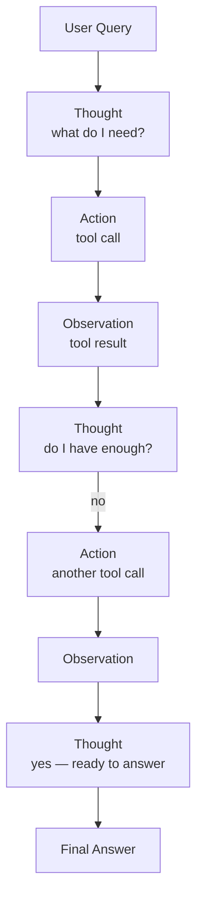
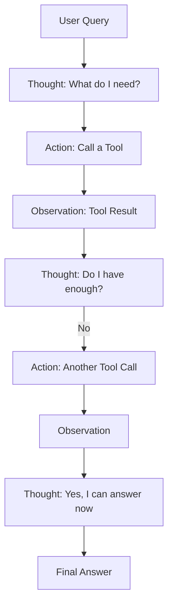

# ReAct Pattern

**Level**: 🟢 Beginner
**Reading Time**: 9 minutes

> ReAct is the simplest recipe for an agent that actually works: let the LLM think out loud before every action, and show it what happened after.

## 🗺️ Quick Overview



*ReAct interleaves Thought → Action → Observation in a loop so the LLM reasons before each action and updates based on real results.*

## The Problem

Early approaches to LLM agents tried two extremes:

- **Pure reasoning (chain-of-thought)**: Ask the LLM to think step by step and produce an answer — but it can't access real data, so it hallucinates.
- **Pure action**: Just have the LLM output tool calls with no reasoning — but without thinking, it makes poor decisions about which tool to call.

The insight of the ReAct paper (Yao et al., 2022) was simple: interleave reasoning and acting. Let the model think before each action, and update its reasoning based on what the action returned.

## How ReAct Works

ReAct is built on three primitives that alternate in a loop:

1. **Thought** — The LLM's internal reasoning. "I need to find the population of Tokyo. I'll search for it."
2. **Action** — A tool call based on the thought. `search("Tokyo population 2024")`
3. **Observation** — The result of the action, fed back to the LLM. `"Tokyo population: 13.96 million (2024)"`

Then the cycle repeats. The LLM reads the observation, decides what to think next, and decides whether to act again or give a final answer.



## The ReAct Loop in Pseudocode

```
function reactLoop(query, tools, maxSteps):
  messages = [systemPrompt, HumanMessage(query)]

  for step in 1..maxSteps:
    response = LLM.generate(messages)

    // LLM outputs one of:
    //   THOUGHT: "I need to look up X"
    //   ACTION: toolName + args
    //   FINAL_ANSWER: the answer text

    if response.type == FINAL_ANSWER:
      return response.text

    if response.type == THOUGHT:
      messages.append(AIMessage("Thought: " + response.text))
      continue  // LLM will output action next

    if response.type == ACTION:
      messages.append(AIMessage("Action: " + response.toolName + "(" + response.args + ")"))
      result = tools[response.toolName].execute(response.args)
      messages.append(HumanMessage("Observation: " + result))

  raise MaxStepsExceeded
```

The key detail: thoughts and observations both go into the message history. The LLM can see its own reasoning from previous steps, making decisions cumulative and coherent.

## A Concrete Example

Query: "How many days until the next US presidential election?"

```
Thought: I need today's date and the date of the next US presidential election.
         Presidential elections are every 4 years on the first Tuesday after Nov 1.
         The next one after 2024 would be November 3, 2028.
         I need today's date to compute the difference.

Action: get_current_date()
Observation: 2026-03-20

Thought: From 2026-03-20 to 2028-11-07 is approximately 2 years and 7 months.
         Let me calculate precisely.

Action: date_diff(start="2026-03-20", end="2028-11-07")
Observation: 962 days

Thought: I have the answer now.

Final Answer: There are 962 days until the next US presidential election (November 7, 2028).
```

Without ReAct, the LLM would guess a number. With ReAct, it fetches the real date and computes precisely.

## Why ReAct Outperforms the Alternatives

The original paper evaluated ReAct on benchmarks (HotpotQA, Fever, AlfWorld) and found:

| Approach | Accuracy on HotpotQA | Hallucination Rate |
|----------|---------------------|--------------------|
| Standard prompting | 28.7% | High |
| Chain-of-thought only | 29.4% | High |
| Action only (no thought) | 25.1% | Medium |
| **ReAct (thought + action)** | **35.1%** | **Low** |

The improvements come from two directions:
- **Thought helps action**: The LLM reasons about what tool to call and why, leading to better tool selection and argument formulation.
- **Observation helps thought**: The LLM sees real data, not just what it imagined, correcting its reasoning in real time.

## Structuring the System Prompt

A well-structured system prompt is half of what makes ReAct work. The LLM needs to know:
- What tools are available (name, description, parameters)
- That it should think before acting
- What format to use for thoughts, actions, and final answers

```
systemPrompt = """
You are a helpful assistant that answers questions by using tools.

For each step, output:
  Thought: Your reasoning about what to do next
  Action: tool_name(argument)

Or when done:
  Final Answer: Your complete response to the user

Available tools:
  - search(query: string) → Returns web search results
  - calculator(expression: string) → Evaluates a math expression
  - get_current_date() → Returns today's date in YYYY-MM-DD format

Think carefully before each action. Use observations to update your reasoning.
"""
```

## ReAct vs Chain-of-Thought vs Direct Action

```
Scenario: "What was the GDP of Germany in 2023?"

Chain-of-Thought only:
  "Germany is a major European economy. GDP was probably around 4 trillion USD."
  [Hallucinated — LLM guessing from training data]

Action only:
  search("Germany GDP 2023")
  → Returns: "Germany GDP 2023: $4.08 trillion"
  [Correct but fragile — no reasoning about what query to write]

ReAct:
  Thought: I need precise 2023 GDP data for Germany. I'll search for it.
  Action: search("Germany GDP 2023 World Bank")
  Observation: "World Bank: Germany GDP 2023 = $4.082 trillion USD"
  Thought: I have a reliable source with a precise figure.
  Final Answer: Germany's GDP in 2023 was approximately $4.08 trillion USD (World Bank).
  [Correct, with source, and the thought explains why the query was specific]
```

## Common Pitfalls

1. **Thought–action misalignment**: The LLM thinks "I'll search for X" but then calls a different tool. Fix by making the thought a required precursor — the next output must be an action matching the thought.
2. **Observations too long**: Tool results that are 10,000 tokens fill the context fast. Truncate or summarize tool results before appending them.
3. **Infinite thought loops**: The LLM keeps outputting thoughts without actions. Set a per-thought-without-action limit.
4. **Forgetting past observations**: If the context grows too long and gets truncated, the LLM loses earlier observations. Use a memory layer for long tasks.
5. **Mixing thought and answer**: The LLM starts giving the final answer inside a "Thought" block. Be explicit in the prompt about when to use "Final Answer."

## Key Takeaways

- ReAct = Reason + Act: interleave thought and action in a loop
- Thought happens before each action; observation happens after
- Observations are fed back into context so the LLM updates its reasoning
- ReAct outperforms both pure chain-of-thought (no real data) and pure action (no reasoning)
- The system prompt must define tools clearly and enforce the thought/action/observation format
- Always set a max step count and truncate long observations to control cost
