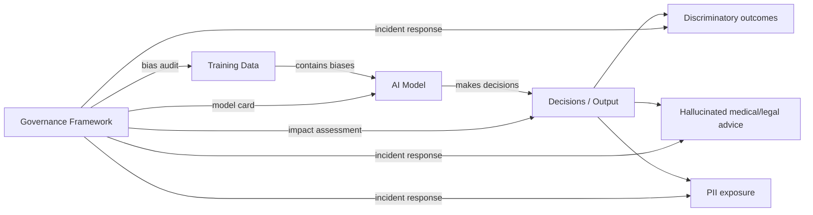
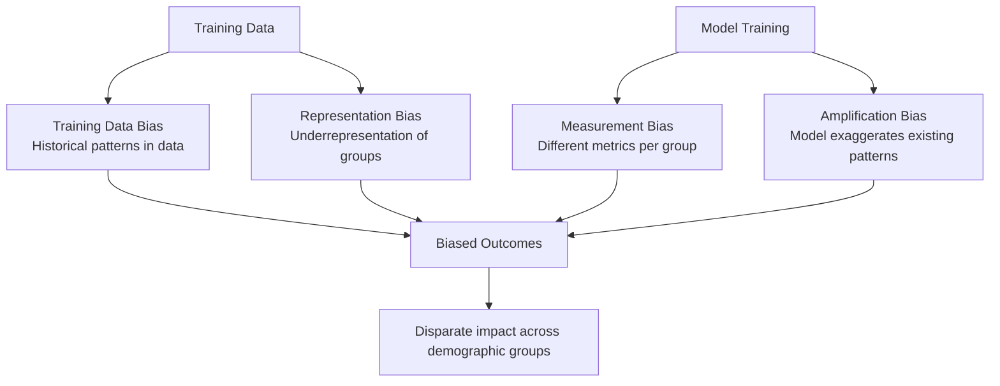
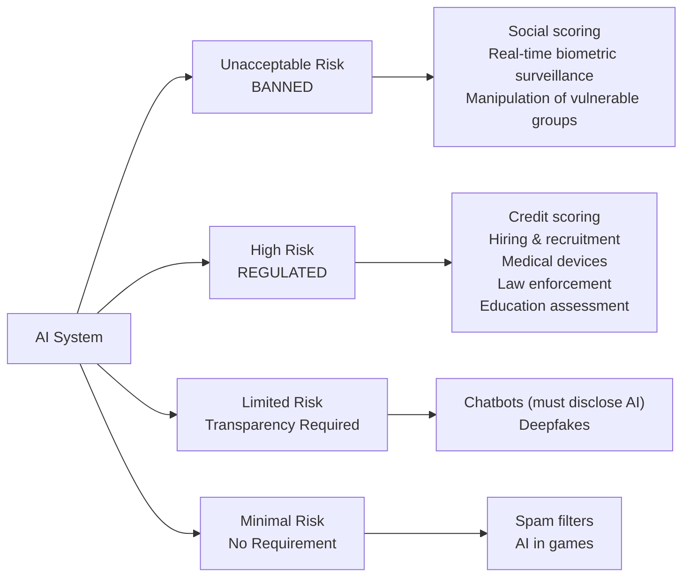

# Responsible AI — Ethics, Bias, and Governance

**Level**: 🟡 Intermediate
**Reading Time**: 12 minutes

> Bias and governance aren't policy team problems that engineers can ignore. The EU AI Act mandates compliance by 2026, GDPR creates liability for AI processing personal data, and Amazon already destroyed a recruiting tool after engineers shipped it into production.

## 🗺️ Quick Overview



*Responsible AI requires governing the full lifecycle — training data, model behavior, and outputs — not just adding a disclaimer.*

## The Problem

Responsible AI matters to engineers for concrete, practical reasons — not just ethics:

**Legal exposure**: The EU AI Act (enforced August 2026) imposes fines up to €35M or 7% of global revenue for violations involving high-risk AI. GDPR Article 22 gives individuals the right to explanation and human review of automated decisions.

**Operational incidents**: Amazon built a recruiting tool (2014-2017) that systematically downgraded resumes containing the word "women's" (as in "women's chess club"). It was trained on 10 years of male-dominated hiring history. The tool was scrapped after internal review — but only after 3 years of biased decisions.

**Legal liability**: The COMPAS recidivism prediction tool (used in US courts) was found to incorrectly flag Black defendants as high-risk at nearly twice the rate of white defendants. A 2016 ProPublica investigation triggered national attention. Courts that used COMPAS outputs without understanding the bias became legally exposed.

**Reputational risk**: ChatGPT providing incorrect medical dosage advice, AI systems denying insurance claims based on biased models — these make headlines and erode user trust across the entire industry.

## AI Bias Types



### 1. Training Data Bias

Model inherits systematic patterns from historical data. If past hiring decisions were biased (e.g., more male hires in tech), the model learns to prefer male candidates.

**Example**: Word embeddings trained on news corpora associate "programmer" more closely with male pronouns and "nurse" with female pronouns — not because this is true, but because news articles in 2000-2015 described it this way.

### 2. Representation Bias

Training data underrepresents certain groups, causing the model to perform worse for those groups.

**Example**: Facial recognition systems trained predominantly on lighter-skinned faces have error rates of <1% for light-skinned men but >35% for dark-skinned women (MIT Media Lab study, 2018). The model simply has less training signal for darker faces.

### 3. Measurement Bias

The way outcomes are measured differs systematically across groups.

**Example**: Credit scoring models use "default rate" as ground truth. But if a group was historically denied credit based on discriminatory policies, their "default rate" is artificially low because they had fewer credit opportunities — the measurement is biased by prior discrimination.

### 4. Amplification Bias

Models can amplify existing biases beyond what exists in training data. A model predicting "likely to commit crime" based on zip code amplifies residential segregation into individual risk scores. A 5% difference in training data can become a 20% difference in model outputs.

## Bias Detection Metrics

Three fairness criteria — these can mathematically conflict with each other:

| Criterion | Definition | Formula | When to Use |
|-----------|------------|---------|-------------|
| **Demographic Parity** | Equal positive prediction rate across groups | P(Y=1 \| A=0) = P(Y=1 \| A=1) | When base rates should be equal |
| **Equalized Odds** | Equal TPR and FPR across groups | TPR and FPR equal for all groups | Criminal justice, medical diagnosis |
| **Individual Fairness** | Similar individuals treated similarly | sim(x,y) → sim(f(x),f(y)) | When similarity can be defined |
| **Calibration** | Predicted probabilities accurate per group | P(Y=1 \| score=s, A=a) = s | Risk scoring applications |

Note: You cannot simultaneously achieve demographic parity AND equalized odds when base rates differ across groups (Chouldechova 2017). You must choose which fairness criterion your application requires.

```python
# Using Microsoft Fairlearn for bias detection
from fairlearn.metrics import MetricFrame
from sklearn.metrics import accuracy_score, precision_score, recall_score
import pandas as pd

def measure_bias(y_true, y_pred, sensitive_features):
    """Measure model performance disparities across demographic groups."""
    metrics = {
        'accuracy': accuracy_score,
        'precision': precision_score,
        'recall': recall_score
    }

    metric_frame = MetricFrame(
        metrics=metrics,
        y_true=y_true,
        y_pred=y_pred,
        sensitive_features=sensitive_features
    )

    print("Overall metrics:")
    print(metric_frame.overall)
    print("\nMetrics by group:")
    print(metric_frame.by_group)

    # Flag if recall disparity > 10% between groups
    recall_by_group = metric_frame.by_group['recall']
    disparity = recall_by_group.max() - recall_by_group.min()
    if disparity > 0.10:
        print(f"\nWARNING: Recall disparity of {disparity:.1%} across groups exceeds threshold")

    return metric_frame
```

## EU AI Act (2024) — What Engineers Must Know



### High-Risk AI Requirements (mandatory for compliance)

| Requirement | What It Means | Engineering Impact |
|-------------|---------------|-------------------|
| **Risk management system** | Document risks before deployment | Pre-deployment impact assessment |
| **Data governance** | Training data must be auditable, bias-tested | Data lineage tracking |
| **Technical documentation** | Describe model capabilities, limitations, training | Model card required |
| **Transparency** | Users must know they're interacting with AI | UI disclosure requirement |
| **Human oversight** | Humans can intervene and override decisions | Human-in-the-loop mandatory |
| **Accuracy, robustness** | Measure and document performance | Ongoing evaluation metrics |
| **Logging** | Keep logs for 6 months minimum | Audit trail infrastructure |

Enforcement starts August 2026 for high-risk AI. GPAI (General Purpose AI) requirements (like Claude, GPT-4) started February 2025.

## Hallucination Risks in High-Stakes Domains

Using LLMs for medical, legal, or financial advice requires extra safeguards:

```
Domain         | Hallucination Risk | Required Mitigation
---------------|-------------------|-----------------------
Medical advice | Critical — wrong dosage can kill | RAG from medical databases,
               |                    | disclaimer, "consult a doctor"
Legal advice   | High — wrong law varies by jurisdiction | Jurisdiction-specific RAG,
               |                    | lawyer review for any formal advice
Financial      | High — wrong tax or investment advice | Cite sources, "consult advisor",
               |                    | no specific stock recommendations
Code generation| Medium — bugs can create security holes | Automated testing,
               |                    | human review for security-sensitive code
```

Never deploy an LLM as the final decision-maker in medical, legal, or safety-critical domains. LLMs must be decision support tools with human oversight, not autonomous decision systems.

## GDPR and AI

GDPR creates specific obligations for AI systems:

- **Article 13-14**: Inform users about automated processing of their data
- **Article 22**: Right not to be subject to solely automated decisions with legal/significant effects
- **Article 17**: Right to erasure — if user data was in training set, this creates challenges
- **Data minimization (Article 5)**: Only process what you need — don't log full conversation if you only need to log errors

Practical implications:
- Log only what's necessary for debugging/safety (not full conversation by default)
- If you use user conversations to fine-tune models, get explicit consent
- Document what personal data flows through your AI system

## AI Governance Framework

### Model Card Template

Every model in production should have a model card:

```markdown
## Model Card: [System Name]

**Model**: Claude 3.5 Sonnet (via Anthropic API)
**Purpose**: Customer support for billing questions
**Deployment date**: 2025-03-01
**Owner**: Platform Team

### Intended Use
- Handle billing questions for existing customers
- Escalate complex cases to human support
- NOT intended for: medical advice, legal advice, account security decisions

### Performance Metrics
- CSAT score: 4.2/5.0 (human baseline: 4.4/5.0)
- Resolution rate: 78% (human: 85%)
- Latency P50: 1.2s, P99: 4.5s

### Known Limitations
- May not handle highly technical billing disputes accurately
- Performance degrades on queries not in English
- Hallucination rate on product details: ~3%

### Bias and Fairness Testing
- Tested across: English/Spanish/French queries
- No significant performance disparity found (within 5%)
- NOT tested: other languages

### Guardrails
- Input: prompt injection filter, PII detection
- Output: PII redaction, harm classifier
- Human escalation: triggered when confidence < 0.7

### Incident Log
- 2025-03-15: 3 cases of incorrect refund amounts quoted — patched with RAG fix
```

### Impact Assessment Checklist

Before deploying any AI system that affects people:

```
Pre-Deployment Checklist:
[ ] Identified all demographic groups the system will serve
[ ] Measured performance across groups (recall, precision, accuracy)
[ ] Performance disparity < 10% across groups (or justified exception)
[ ] System does not use protected characteristics as inputs
[ ] Human review path exists for all decisions affecting individuals
[ ] Data privacy review completed (GDPR/local laws)
[ ] Model card written and approved
[ ] Incident response plan documented
[ ] Logging and audit trail in place
[ ] EU AI Act risk classification determined
[ ] If high-risk: technical documentation and conformity assessment done
```

## Constitutional AI (Anthropic's Approach)

Anthropic encodes ethics into model training through a "constitution" — a set of principles used during RLHF:

- The model is trained to evaluate its own outputs against these principles
- Training uses AI feedback (RLAIF) rather than relying purely on human labelers
- Principles include: be helpful, be harmless, be honest, avoid deception, support human oversight

For application developers, this means: Anthropic's safety training is a first layer, but it's not sufficient for all applications. Domain-specific safety (medical, legal, financial) requires additional application-level guardrails.

## Real-World Cases

| Case | Bias Type | Impact | What Should Have Been Done |
|------|-----------|--------|---------------------------|
| Amazon Recruiting (2014-2017) | Training data + amplification bias | 3 years of biased hiring decisions | Bias audit before deployment, regular fairness metrics |
| COMPAS (2013-present) | Measurement bias via proxy features | Racial disparity in criminal sentencing | Equalized odds testing, demographic parity analysis |
| Apple Card (2019) | Proxy discrimination via address/spending patterns | Systematic gender disparity in credit limits | Fairness audit, test for protected attribute correlations |
| Healthcare Algorithm (2019) | Measurement bias — cost as proxy for health need | Black patients received worse care recommendations | Change proxy metric, add disparate impact analysis |

## Common Mistakes

1. **Treating bias as a post-deployment problem**: By the time bias is discovered in production, it has already harmed users. Bias testing must happen before deployment using the same data distribution as production.

2. **Optimizing for overall accuracy, ignoring group performance**: A model that's 95% accurate overall can be 80% accurate for a minority group (5% of population) and 96% for the majority. The aggregate metric hides the disparity completely.

3. **Using proxies for protected characteristics**: Models trained without gender or race as features can still discriminate via proxy features (zip code, name, shopping patterns). Proxy discrimination is still discrimination under most laws.

4. **No human oversight path**: For any decision that affects a person's employment, credit, healthcare, or housing, there must be a path to human review. "The model decided" is not legally sufficient for high-impact decisions.

5. **Skipping the model card**: Model cards feel like documentation overhead until an incident happens and you need to explain what the system does, what its limitations are, and what safeguards were in place. Write the model card before deployment.

## Key Takeaways

- EU AI Act mandates compliance for high-risk AI (credit scoring, hiring, medical, law enforcement) by August 2026 — fines up to €35M or 7% of global revenue
- 4 bias types: training data, representation, measurement, and amplification — all require different mitigations
- Demographic parity and equalized odds cannot both be achieved when base rates differ across groups — choose your fairness criterion explicitly
- Every high-risk AI system needs: model card, impact assessment, bias testing (>10% disparity is a red flag), human oversight path, and audit logs
- GDPR Article 22 gives users the right to contest automated decisions — build an explanation and appeal path
- Hallucination in medical/legal/financial domains requires extra safeguards: RAG from authoritative sources, mandatory disclaimers, human review
- Amazon's recruiting tool ran for 3 years before discovery — bias auditing must be ongoing, not a one-time check

## References

> 📖 [EU AI Act Full Text](https://eur-lex.europa.eu/legal-content/EN/TXT/?uri=CELEX:32024R1689) — Official EU regulation document

> 📖 [Machine Bias — ProPublica Investigation of COMPAS](https://www.propublica.org/article/machine-bias-risk-assessments-in-criminal-sentencing) — Landmark bias investigation

> 📚 [Microsoft Fairlearn Documentation](https://fairlearn.org/) — Open-source toolkit for bias detection and mitigation

> 📖 [Gender Shades: Intersectional Accuracy Disparities](http://proceedings.mlr.press/v81/buolamwini18a.html) — Buolamwini & Gebru, facial recognition bias study

> 📖 [Constitutional AI: Harmlessness from AI Feedback](https://arxiv.org/abs/2212.08073) — Anthropic's approach to encoding ethics in training

> 📺 [What is the EU AI Act?](https://www.youtube.com/watch?v=Q3oKDFkC_RA) — Overview of the regulation's requirements for engineers
