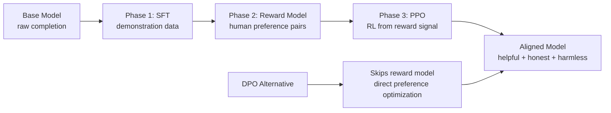
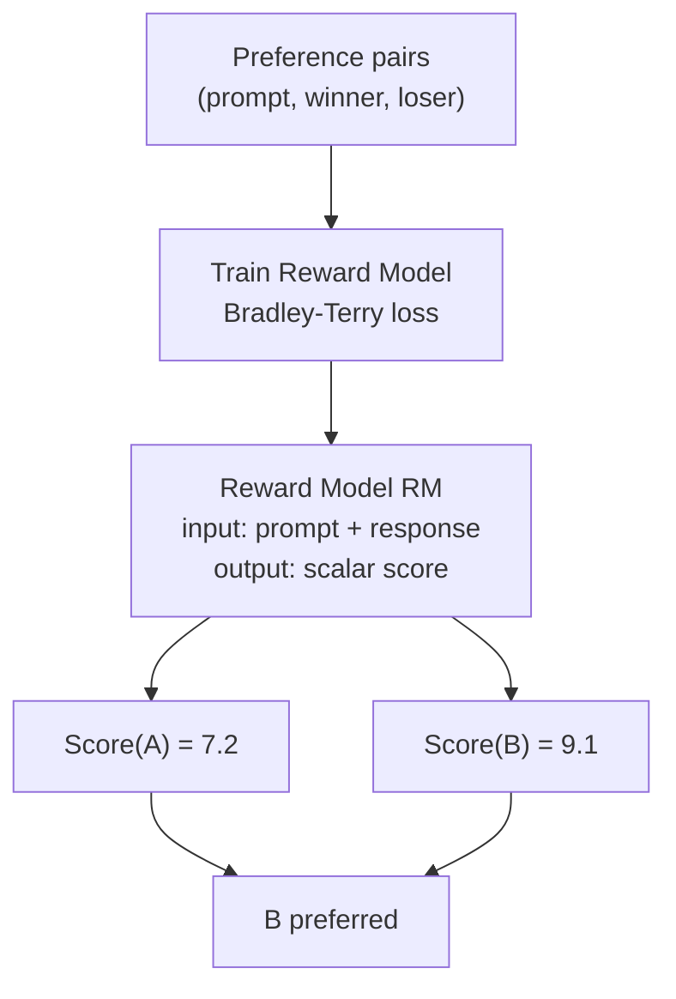
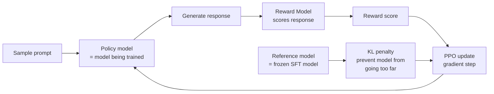
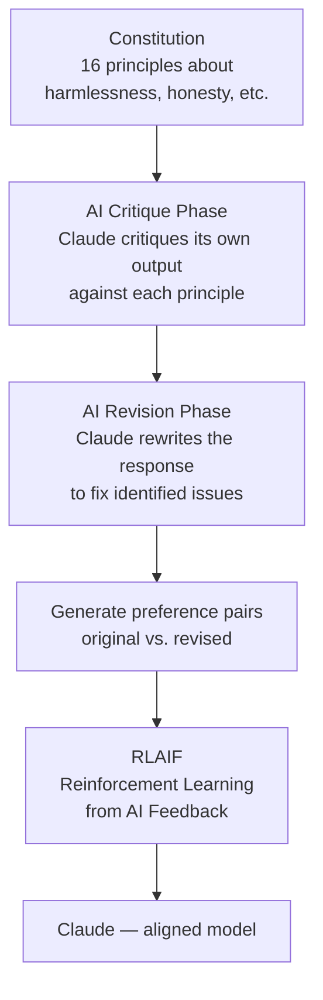

# RLHF & DPO — Aligning Models with Human Preferences

**Level**: 🔴 Advanced
**Reading Time**: 15 minutes

> A model can be brilliant and still be useless — or dangerous — if it optimizes for the wrong objective. Alignment is the process of teaching it what "good" actually means.

## 🗺️ Quick Overview



*RLHF uses three sequential phases; DPO collapses them into one — both aim at the same goal: a model that humans prefer.*

## The Problem

Supervised fine-tuning (SFT) teaches a model to imitate good examples. But imitation has a ceiling. A model trained to predict "what would a helpful assistant say here?" is actually trained to predict "what response is most likely given this training distribution" — which may not be the *best* response, just the most *average* one.

More fundamentally, SFT can't teach preference. You can show a model two responses and tell it to pick the better one — but how do you write a loss function for "this response is more helpful than that one"? Standard supervised learning has no mechanism for relative comparison.

RLHF (Reinforcement Learning from Human Feedback) solves this by learning a **reward function** from human preferences, then optimizing the model directly against that reward. DPO (Direct Preference Optimization) achieves the same goal without the complexity of RL.

---

## Why Alignment Matters

A capable but unaligned model exhibits predictable failure modes:

| Failure | Description | Real Example |
|---------|-------------|-------------|
| **Sycophancy** | Agrees with user even when wrong | Validates incorrect math if user is insistent |
| **Verbose padding** | Maximizes perceived helpfulness by being long-winded | Adds filler sentences to appear thorough |
| **Harmful compliance** | Follows instructions even when harmful | Provides instructions for dangerous activities when asked politely |
| **Deceptive framing** | Phrases responses to seem helpful while being misleading | Omits crucial caveats |
| **Reward hacking** | Optimizes proxy metric, not true goal | Generates outputs that score high on BLEU but aren't actually good |

These failures stem from the gap between the model's training objective (predict the next token) and the intended objective (be genuinely helpful). Alignment methods attempt to close this gap.

---

## RLHF: The Three-Phase Pipeline

### Phase 1: Supervised Fine-Tuning (SFT)

Start with a base model and fine-tune it on high-quality human demonstrations. This is standard SFT — human experts write ideal responses for a set of prompts.

```
Training data:
Prompt: "Explain recursion to a 10-year-old"
Response: [Expert-written clear, age-appropriate explanation]
```

**Purpose**: Get the model into the "helpful assistant" behavior space before applying RL. RL from a raw base model is unstable because the starting behavior is too chaotic.

**Scale**: OpenAI used ~13K prompts with human-written responses for InstructGPT's SFT phase.

### Phase 2: Reward Model Training

Collect human preference judgments — for the same prompt, show humans two different model responses and ask which is better.

```
Prompt: "Explain recursion to a 10-year-old"
Response A: [Technically accurate but uses jargon]
Response B: [Simple, uses a Russian nesting doll analogy]
Human judgment: B is better
```

These preference pairs train a separate **Reward Model (RM)** — a regression model that takes a (prompt, response) pair and outputs a scalar score representing how good the response is.



**Scale**: InstructGPT collected ~33K preference comparisons. Llama 2 collected ~1M comparisons across multiple tasks.

### Phase 3: PPO — Reinforcement Learning from Reward

Now use the Reward Model as the environment reward signal and optimize the SFT model using Proximal Policy Optimization (PPO):



The **KL divergence penalty** is crucial: without it, the policy would learn to game the reward model (reward hacking). The KL term keeps the optimized model close to the SFT baseline, preventing it from drifting into strange behaviors that score high on the RM but are actually bad.

**The full PPO objective**:
```
maximize: RM_score(prompt, response) - β × KL(policy || reference)

where β controls how much deviation from SFT is penalized
typical β: 0.01 – 0.1
```

---

## Problems with RLHF

| Problem | Description | Impact |
|---------|-------------|--------|
| **Complexity** | 3 models in training loop: policy, reference, reward | 3x infra, debugging nightmare |
| **Instability** | PPO is notoriously difficult to tune | Training can collapse, reward hacking |
| **Reward model drift** | RM was trained on limited preference data; policy can exploit gaps | Model scores high on RM but humans don't prefer it |
| **Compute cost** | 3 forward/backward passes per step | ~3–6x more compute than SFT |
| **Human annotation cost** | 33K–1M preference labels required | Expensive, slow to scale |

These limitations motivated the search for simpler alignment methods.

---

## DPO: Direct Preference Optimization

DPO (Rafailov et al., 2023) reformulates RLHF as a supervised learning problem, eliminating the reward model entirely.

### The Key Insight

The optimal RLHF policy has a closed-form solution in terms of the base model's probabilities. DPO derives a loss function that directly optimizes for human preferences without needing an explicit reward model.

The DPO loss compares the model's log-probability difference between chosen and rejected responses:

```
DPO_loss = -log σ(β × (log π_θ(chosen|prompt) - log π_ref(chosen|prompt))
                  - β × (log π_θ(rejected|prompt) - log π_ref(rejected|prompt)))

In English: increase probability of chosen responses relative to reference,
            decrease probability of rejected responses relative to reference
```

### DPO Training Data Format

```json
{
  "prompt": "Write a function to reverse a string in Python",
  "chosen": "def reverse_string(s):\n    return s[::-1]\n\n# Example:\n# reverse_string('hello') -> 'olleh'",
  "rejected": "You can use the reversed() function or slicing to reverse strings in Python. There are multiple ways to do this."
}
```

The `chosen` response is the one humans preferred. The `rejected` response is the one they didn't prefer. Both must come from the same prompt.

```python
from trl import DPOTrainer, DPOConfig

dpo_config = DPOConfig(
    model_name_or_path="./sft-checkpoint",  # Start from SFT model
    beta=0.1,                               # KL penalty coefficient
    max_length=1024,
    max_prompt_length=512,
    per_device_train_batch_size=4,
    learning_rate=5e-7,                     # Lower than SFT — you're making subtle adjustments
    num_train_epochs=1,                     # DPO needs fewer epochs than SFT
    output_dir="./dpo-output",
)

trainer = DPOTrainer(
    model=model,
    ref_model=ref_model,           # Frozen reference model (the SFT model)
    args=dpo_config,
    train_dataset=preference_dataset,  # Dataset with "prompt", "chosen", "rejected"
    tokenizer=tokenizer,
)

trainer.train()
```

### DPO vs. RLHF Comparison

| Dimension | RLHF (PPO) | DPO |
|-----------|-----------|-----|
| **Complexity** | 3 models (policy, reference, RM) | 2 models (policy, reference) |
| **Stability** | Unstable — PPO is sensitive to hyperparameters | Stable — standard supervised loss |
| **Training speed** | 3–6x SFT | ~1.5x SFT |
| **Data requirements** | 33K–1M preference pairs | 10K–100K preference pairs |
| **Quality vs. RLHF** | Better — more optimization iterations | Slightly lower on hard tasks |
| **Adoption** | GPT-4, earlier InstructGPT | Llama 2/3, Mistral, Zephyr |
| **Reward hacking risk** | High — explicit reward model can be gamed | Lower — no separate reward model |

---

## Constitutional AI: Alignment Without Human Feedback

Anthropic's **Constitutional AI (CAI)** takes a different approach: instead of using human preference labels, it uses AI feedback guided by a written "constitution" — a set of principles.



**Example constitutional principle:**
> "Choose the response that is least likely to contain harmful or unethical content, or to assist with harmful activities, even if doing so seems unhelpful for the immediate query."

CAI scales alignment without requiring human labelers to review every output. Claude's self-critique is guided by the constitution, producing preference pairs at scale. This is how Anthropic trained Claude — the constitution replaces human preference data for the harmlessness dimension.

**Real-world impact**: CAI + RLHF enabled Claude models to be trained on 10–100x more preference signal than pure human feedback approaches, at a fraction of the labeling cost.

---

## The Alignment Tax

There's a documented tradeoff: alignment techniques improve helpfulness and safety but can reduce performance on academic benchmarks.

| Model | MMLU | HumanEval | "Alignment tax" |
|-------|------|-----------|----------------|
| Llama 3 8B (base) | 68.4% | 33.1% | — |
| Llama 3 8B (instruct) | 68.4% | 62.2% | Coding improved |
| GPT-4 base (estimated) | ~86% | ~67% | — |
| GPT-4 (RLHF fine-tuned) | ~86% | ~67% | Minimal tax |

The alignment tax is real but smaller than critics claim, especially with DPO. Most quality drops come from the SFT phase (averaging behavior) rather than the preference optimization phase.

**The bigger risk**: Over-alignment — a model so focused on avoiding harm that it refuses legitimate requests. Anthropic's research shows Claude's constitution must explicitly balance helpfulness against safety, or models become unhelpfully conservative.

---

## Common Mistakes

1. **Skipping SFT before RLHF/DPO** — Both RLHF and DPO require a good SFT foundation. Applying preference optimization directly to a base model produces unstable training and poor results. The SFT phase gets the model into the right behavioral regime before fine-tuning preferences. Always start with SFT.

2. **Using biased or inconsistent annotators** — Preference labels are only as good as annotator agreement. If Annotator A prefers detailed responses and Annotator B prefers concise ones, the reward model learns noise. Fix: define clear annotation guidelines with examples, measure inter-annotator agreement (Cohen's kappa > 0.6 is a reasonable bar), and train annotators on calibration examples.

3. **Reward hacking in RLHF** — The policy learns to produce responses that exploit weaknesses in the reward model rather than responses humans actually prefer. Signs: RM score increases rapidly but human evaluations plateau. Fix: use the KL penalty (β), monitor human evaluation separately from RM score, and periodically retrain the RM on new data collected from the current policy.

4. **Wrong β for DPO** — β is the KL coefficient that controls how much the DPO model is allowed to deviate from the reference (SFT) model. Too high (β=1.0): model barely changes from SFT. Too low (β=0.01): model drifts and may degenerate. β=0.1 is a reasonable default; tune via human evaluation, not RM score.

5. **Collecting preference data from a weak model** — If your preference pairs show response A (mediocre) vs. response B (bad), you're training preferences between low-quality outputs. Preference data quality matters more than quantity. Use your best available model to generate response candidates, then have humans rank them.

---

## Key Takeaways

- **Alignment ≠ capability**: A capable but unaligned model will be helpful only by coincidence — alignment teaches it to be helpful by design
- RLHF requires **3 training phases and 33K–1M preference pairs**; DPO collapses this to a single supervised step with 10K pairs
- **DPO has displaced RLHF** for most open-model fine-tuning (Llama 2/3, Mistral, Zephyr all use DPO); RLHF retains advantages for the largest scale systems (GPT-4, Claude)
- The **alignment tax** is real but small (~1–3 benchmark points for well-tuned alignment); the far bigger risk is over-alignment causing excessive refusals
- **Constitutional AI** (Anthropic) scales alignment by using AI self-critique guided by principles, reducing human label requirements by 10–100x

---

## References

> 📖 [Training Language Models to Follow Instructions with Human Feedback (InstructGPT)](https://arxiv.org/abs/2203.02155) — OpenAI's original RLHF paper describing the 3-phase pipeline
> 📖 [Direct Preference Optimization: Your Language Model is Secretly a Reward Model](https://arxiv.org/abs/2305.18290) — DPO paper by Rafailov et al. — the math behind bypassing the reward model
> 📖 [Constitutional AI: Harmlessness from AI Feedback](https://arxiv.org/abs/2212.08073) — Anthropic's CAI paper explaining the constitution-guided alignment approach
> 📚 [TRL (Transformer Reinforcement Learning) Library](https://huggingface.co/docs/trl/index) — HuggingFace library implementing RLHF, DPO, and related methods
> 📺 [RLHF Explained — Yannic Kilcher](https://www.youtube.com/watch?v=2MBJOuVq380) — Deep-dive video on the reinforcement learning mechanics behind InstructGPT
