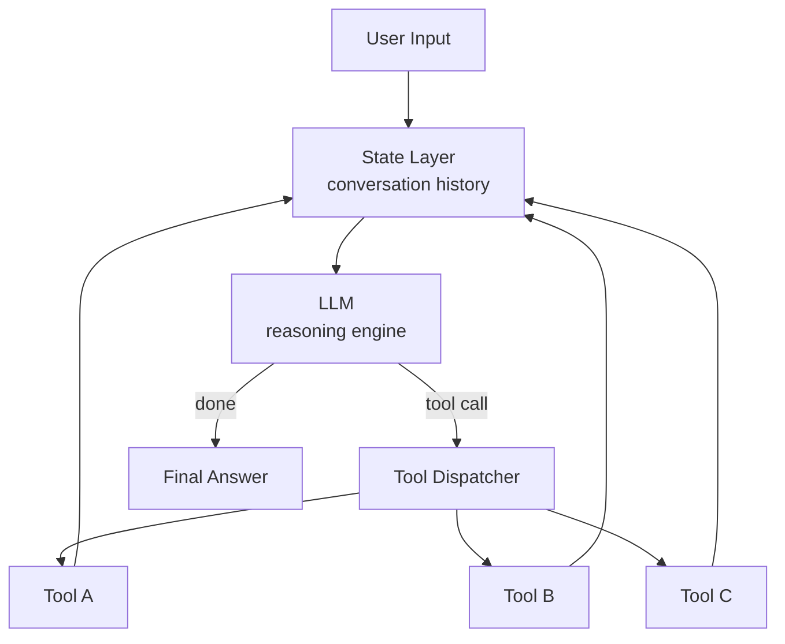
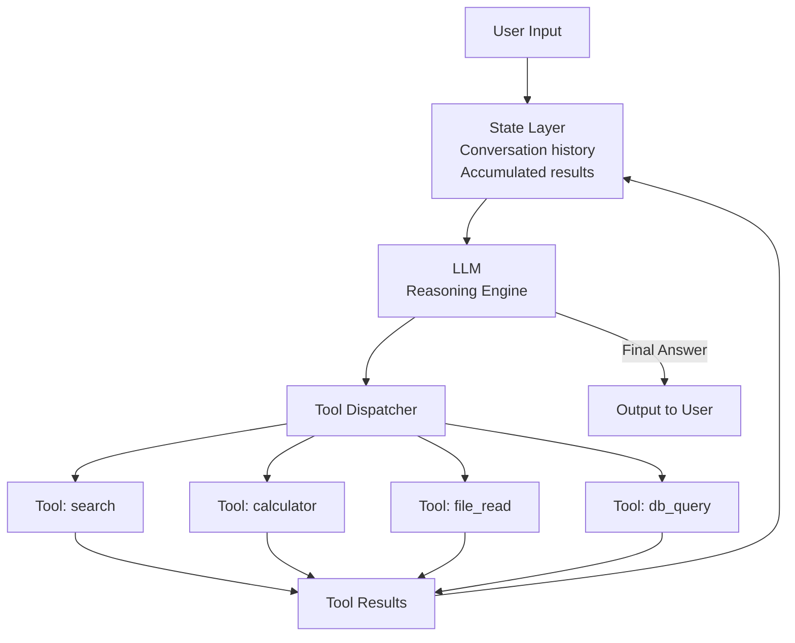

# Single-Agent Architecture

**Level**: 🟡 Intermediate
**Reading Time**: 11 minutes

> Before adding more agents, make sure one agent with the right tools can't already do the job — complexity compounds, and single agents are far easier to debug.

## 🗺️ Quick Overview



*A single agent runs one LLM that reads accumulated state, dispatches tools, and loops until done — simpler to debug and sufficient for most production tasks.*

## The Problem

Most real-world tasks that "sound complex" can be handled by a single agent with a good set of tools and a clear system prompt. The temptation to immediately go multi-agent is real, but it introduces coordination overhead, communication failures, and debugging complexity you often don't need.

This article covers the full architecture of a production-grade single agent — state management, tool dispatch, memory integration, and the control loop.

## What a Single Agent Looks Like

A single agent has one LLM doing all the reasoning. It has access to multiple tools and manages state as accumulated context.



The state layer (conversation history) is the glue. Every input, every reasoning step, every tool call and result flows through it.

## State Management

State is the accumulated context the agent carries across steps. It's typically represented as a list of messages:

```
AgentState = {
  messages: [
    SystemMessage(content=systemPrompt),
    HumanMessage(content=userQuery),
    // ...these grow as the agent works:
    AIMessage(content=thought, toolCalls=[...]),
    ToolResult(toolCallId="...", content=toolOutput),
    AIMessage(content=thought, toolCalls=[...]),
    ToolResult(toolCallId="...", content=toolOutput),
    // ...
    AIMessage(content=finalAnswer)
  ],
  metadata: {
    sessionId: "session_abc",
    userId: "user_123",
    startedAt: timestamp,
    stepCount: 0,
    totalTokensUsed: 0
  }
}
```

State grows with every step. Managing it well means:
1. Tracking total tokens to detect when you're approaching limits
2. Optionally summarizing or compressing old steps
3. Persisting state to disk/DB for long-running tasks

## The Full Single-Agent Loop

```
function singleAgent(userQuery, config):
  // Initialize state
  state = AgentState(
    messages = [SystemMessage(config.systemPrompt), HumanMessage(userQuery)],
    metadata = { stepCount: 0, totalTokens: 0 }
  )

  for step in 1..config.maxSteps:
    state.metadata.stepCount += 1

    // Check if context is getting too large
    if countTokens(state.messages) > config.contextLimit:
      state = compressContext(state, keepLast=20)

    // Generate next action
    response = LLM.generate(
      messages = state.messages,
      tools = config.tools,
      temperature = 0.0   // Deterministic for agent reasoning
    )

    state.metadata.totalTokens += response.tokensUsed

    // Check budget
    if state.metadata.totalTokens > config.tokenBudget:
      return AgentResult(
        status = BUDGET_EXCEEDED,
        partial = state.lastSummary
      )

    // Handle final answer
    if response.type == FINAL_ANSWER:
      return AgentResult(status = SUCCESS, answer = response.text)

    // Handle tool calls
    state.messages.append(AIMessage(response))

    for toolCall in response.toolCalls:
      result = dispatchTool(toolCall, config.tools)
      state.messages.append(result)

  return AgentResult(status = MAX_STEPS_EXCEEDED, partial = state.lastSummary)
```

## Context Compression

When the context grows large, you have several strategies:

```
function compressContext(state, keepLast):
  // Strategy 1: Rolling window — keep only the most recent N messages
  recentMessages = state.messages[-keepLast:]
  return AgentState(messages=[state.messages[0]] + recentMessages)  // Always keep system prompt

  // Strategy 2: Summarize old context
  oldMessages = state.messages[1:-keepLast]  // Skip system prompt and recent
  summary = LLM.summarize(oldMessages,
    prompt="Summarize the key findings and decisions so far in 3-5 bullet points")
  summaryMessage = SystemMessage("Summary of earlier work: " + summary)
  return AgentState(
    messages = [state.messages[0], summaryMessage] + state.messages[-keepLast:]
  )

  // Strategy 3: Extract key facts
  facts = LLM.extract(oldMessages, schema={
    toolResultsFound: list[string],
    decisionsRemaining: list[string],
    importantNumbers: dict
  })
  factsMessage = SystemMessage("Key facts from earlier steps: " + facts.toJson())
  return AgentState(
    messages = [state.messages[0], factsMessage] + state.messages[-keepLast:]
  )
```

## System Prompt Design

The system prompt is the agent's personality, constraints, and tool knowledge. A good system prompt answers:

1. Who is the agent (role)?
2. What is it trying to do (goal)?
3. What tools does it have (capabilities)?
4. What must it never do (constraints)?
5. What format should it use (output format)?

```
systemPrompt = """
You are a research assistant that answers questions by searching the web and
synthesizing information from multiple sources.

GOAL: Help the user find accurate, up-to-date answers. Prefer primary sources.

TOOLS:
  web_search(query) — search the internet
  get_page_content(url) — fetch full text of a webpage
  calculator(expression) — evaluate math expressions

CONSTRAINTS:
  - Never fabricate statistics or quotes. If you don't find it, say so.
  - Always cite your sources with URLs in the final answer.
  - Do not access URLs that look like internal network addresses (10.x.x.x, etc.)

FORMAT: Give a thorough answer, then list Sources at the end.
"""
```

## Single Agent Limitations

Understanding these limitations helps you decide when to graduate to multi-agent:

| Limitation | Impact | Mitigation |
|------------|--------|------------|
| Sequential execution | Can't parallelize sub-tasks | Multi-agent or async tools |
| Context overflow | Long tasks exhaust context | Compression, summarization |
| No specialization | One LLM does everything | Add more specific tools |
| Single point of failure | One bug kills the whole task | Checkpoints, retries |
| Hard to scale | One agent = one thread | Horizontal multi-agent scaling |

## When One Agent Is Enough

Single agents work well when:
- The task is sequential (step A must complete before step B)
- Total work fits within context limits (under ~50K tokens)
- No subtasks can run independently in parallel
- The task requires a single coherent "voice" (writing, summarizing)

Examples that work well as single agents:
- "Summarize this 50-page report"
- "Help me debug this function"
- "Research X and write a 3-paragraph summary"
- "Answer my customer support question"

Examples that need multi-agent:
- "Research 20 competitors simultaneously" (parallelizable)
- "Analyze code across 200 files" (exceeds context)
- "Continuously monitor my server logs" (needs specialized agents)

## Real-World Usage

**Linear (project management AI)**: Their AI issue triager is a single agent — reads a new issue, searches existing issues for duplicates, categorizes and assigns it. Simple, sequential, single agent.

**Intercom Fin (customer support AI)**: Single agent per conversation. It searches the knowledge base, reads conversation history, and either answers or escalates. Each conversation is one agent run.

**Cursor (AI code editor)**: The "chat" mode runs a single agent per conversation. It reads files, searches code, and writes responses. The "composer" that edits multiple files uses a more complex setup.

## Common Pitfalls

1. **Infinite loop on error**: If a tool returns an error, the agent may keep retrying forever. Implement retry limits per tool.
2. **Growing context without compression**: Never letting the context window management kick in means you hit API limits mid-task.
3. **Forgetting to persist state**: For tasks longer than a minute, always checkpoint state so a crash doesn't lose all progress.
4. **Too many tools**: Giving the agent 50 tools confuses the LLM. It can't pick the right one. 5-10 focused tools work better.
5. **Wrong temperature**: Use temperature=0 for reliable, consistent agent reasoning. High temperature makes decisions random.

## Key Takeaways

- Single agent = one LLM + tools + message history as state
- State grows with every step — manage token count and compress when needed
- The system prompt controls the agent's behavior as much as the LLM itself
- Context compression (rolling window or summarization) lets agents run longer tasks
- Single agents are easier to build, debug, and maintain than multi-agent systems
- Graduate to multi-agent only when you hit parallelism, context, or specialization limits
