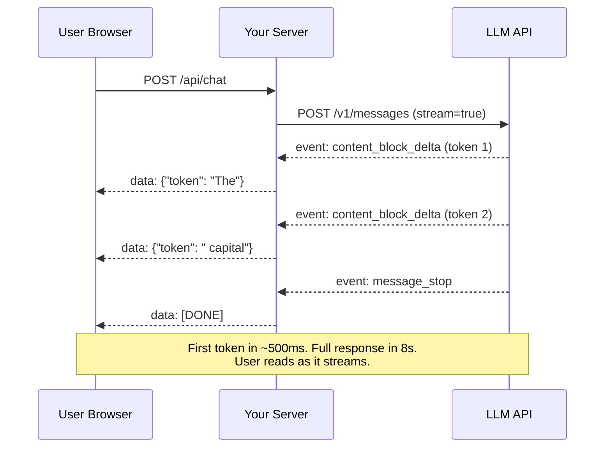
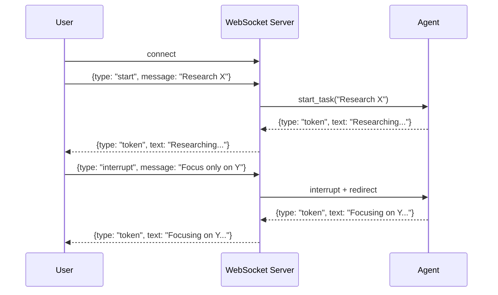

# Streaming with SSE & WebSocket — Real-Time Agent Output

**Level**: 🟡 Intermediate
**Reading Time**: 14 minutes

> Without streaming, users stare at a spinner for 10 seconds. With streaming, they see tokens appearing in under 500ms. Same model, same answer — dramatically different experience.

## 🗺️ Quick Overview



*Streaming uses Server-Sent Events (SSE) to push each token to the client as it's generated. Perceived latency drops from "wait for full response" to "see first token" — typically 10× improvement.*

## The Problem

LLM generation is inherently sequential — tokens are produced one at a time, taking 3–15 seconds for a full response. Without streaming:

1. User sends a message
2. Server waits 8–12 seconds for the complete response
3. Server sends the entire response at once
4. User sees nothing for 10 seconds, then a wall of text appears

This is jarring. Every successful AI product (Claude.ai, ChatGPT, Cursor) streams tokens as they're generated. Users perceive the latency as near-zero because they start reading at 500ms even though the full response isn't ready until 10s.

---

## SSE vs WebSocket

Both protocols enable real-time communication, but they have different trade-offs:

| Feature | Server-Sent Events (SSE) | WebSocket |
|---------|--------------------------|-----------|
| **Direction** | Server → Client only | Bidirectional |
| **Protocol** | HTTP/1.1 (persistent connection) | WS:// (upgrade from HTTP) |
| **Browser API** | `EventSource` | `WebSocket` |
| **Proxy/CDN support** | Excellent — just HTTP | Requires special config |
| **Auto-reconnect** | Built-in (EventSource) | Manual implementation |
| **Overhead per message** | Low (text headers) | Very low (binary frames) |
| **State management** | Stateless per event | Stateful connection |
| **LLM streaming fit** | Ideal | Overkill unless bidirectional needed |

**For LLM streaming, SSE is the standard choice.** The server pushes tokens, the client reads them — no bidirectional communication needed. SSE works transparently through Nginx, CloudFront, and most CDNs with zero configuration.

**When to use WebSocket instead:**
- Users can interrupt generation mid-stream (e.g., voice agents)
- Bidirectional real-time interaction (e.g., turn-by-turn conversation with interruption)
- Multiplexing many message types over one connection (e.g., tool progress updates + token stream simultaneously)

---

## Anthropic Streaming API

### Python: Using the Stream Context Manager

```python
import anthropic

client = anthropic.Anthropic()

# Method 1: High-level stream() context manager (recommended)
with client.messages.stream(
    model="claude-sonnet-4-5",
    max_tokens=1024,
    messages=[{"role": "user", "content": "Write a poem about distributed systems"}]
) as stream:
    # text_stream yields each text token as it arrives
    for text in stream.text_stream:
        print(text, end="", flush=True)

    # After the loop, access final message with usage stats
    final_message = stream.get_final_message()
    print(f"\nInput tokens: {final_message.usage.input_tokens}")
    print(f"Output tokens: {final_message.usage.output_tokens}")
```

### Python: Low-Level Event Streaming (for advanced control)

```python
# Method 2: Raw event stream (needed for tool use in streaming)
with client.messages.stream(
    model="claude-sonnet-4-5",
    max_tokens=1024,
    tools=[{"name": "search", "description": "Search the web", "input_schema": {...}}],
    messages=[{"role": "user", "content": "What's the latest news about AI?"}]
) as stream:
    current_tool_input = ""
    tool_name = ""

    for event in stream:
        event_type = type(event).__name__

        if event_type == "RawContentBlockStartEvent":
            if hasattr(event.content_block, "name"):
                # Tool use block starting
                tool_name = event.content_block.name
                print(f"\n[Calling tool: {tool_name}]")

        elif event_type == "RawContentBlockDeltaEvent":
            delta = event.delta
            if hasattr(delta, "text"):
                # Text token
                print(delta.text, end="", flush=True)
            elif hasattr(delta, "partial_json"):
                # Tool input being built up
                current_tool_input += delta.partial_json

        elif event_type == "RawContentBlockStopEvent":
            if tool_name and current_tool_input:
                # Tool input complete — execute tool
                import json
                tool_args = json.loads(current_tool_input)
                print(f"\nExecuting {tool_name}({tool_args})")
                tool_name = ""
                current_tool_input = ""

        elif event_type == "RawMessageStopEvent":
            print(f"\n[Stream complete, stop_reason: {event.message.stop_reason}]")
```

---

## OpenAI Streaming

```python
from openai import OpenAI

client = OpenAI()

# OpenAI streaming with stream=True
stream = client.chat.completions.create(
    model="gpt-4o",
    max_tokens=1024,
    stream=True,
    messages=[{"role": "user", "content": "Explain microservices in 3 paragraphs"}]
)

for chunk in stream:
    # Each chunk may have delta content
    delta_content = chunk.choices[0].delta.content
    if delta_content is not None:
        print(delta_content, end="", flush=True)

    # Check for finish
    finish_reason = chunk.choices[0].finish_reason
    if finish_reason:
        print(f"\n[Finished: {finish_reason}]")
```

---

## Server-Side: Proxying SSE to the Browser

Your backend needs to forward the LLM stream to the browser as SSE:

```python
# FastAPI example — streams Anthropic tokens directly to browser
from fastapi import FastAPI
from fastapi.responses import StreamingResponse
import anthropic
import json

app = FastAPI()
client = anthropic.Anthropic()

@app.post("/api/chat")
async def chat_stream(request: dict):
    """
    Accepts: {"message": "..."}
    Returns: SSE stream of tokens
    """
    def generate():
        with client.messages.stream(
            model="claude-sonnet-4-5",
            max_tokens=1024,
            messages=[{"role": "user", "content": request["message"]}]
        ) as stream:
            for text in stream.text_stream:
                # SSE format: "data: {json}\n\n"
                yield f"data: {json.dumps({'token': text})}\n\n"

            # Send completion event
            final = stream.get_final_message()
            yield f"data: {json.dumps({'done': True, 'input_tokens': final.usage.input_tokens, 'output_tokens': final.usage.output_tokens})}\n\n"

    return StreamingResponse(
        generate(),
        media_type="text/event-stream",
        headers={
            "Cache-Control": "no-cache",
            "Connection": "keep-alive",
            "X-Accel-Buffering": "no",  # Disable Nginx buffering
        }
    )
```

---

## Browser Client: Consuming SSE

```typescript
// TypeScript/JavaScript — consuming the SSE stream
async function streamChat(message: string, onToken: (token: string) => void): Promise<void> {
  const response = await fetch("/api/chat", {
    method: "POST",
    headers: { "Content-Type": "application/json" },
    body: JSON.stringify({ message }),
  });

  if (!response.ok) throw new Error(`HTTP ${response.status}`);
  if (!response.body) throw new Error("No response body");

  const reader = response.body.getReader();
  const decoder = new TextDecoder();
  let buffer = "";

  while (true) {
    const { done, value } = await reader.read();
    if (done) break;

    buffer += decoder.decode(value, { stream: true });

    // SSE events are separated by double newlines
    const lines = buffer.split("\n\n");
    buffer = lines.pop() ?? "";  // Keep incomplete last chunk

    for (const chunk of lines) {
      if (chunk.startsWith("data: ")) {
        const data = JSON.parse(chunk.slice(6));
        if (data.token) {
          onToken(data.token);  // Update UI with each token
        }
        if (data.done) {
          console.log(`Tokens: ${data.input_tokens} in / ${data.output_tokens} out`);
        }
      }
    }
  }
}

// React usage
function ChatComponent() {
  const [output, setOutput] = useState("");

  async function handleSend(message: string) {
    setOutput("");  // Clear previous
    await streamChat(message, (token) => {
      setOutput(prev => prev + token);  // Append each token
    });
  }

  return <div>{output}</div>;  // Text appears token by token
}
```

### Alternative: Using Native EventSource API

```typescript
// EventSource is simpler but requires GET requests — not ideal for POST bodies
// Use fetch + ReadableStream (above) for POST-based streaming
const es = new EventSource("/api/stream?session_id=abc123");

es.onmessage = (event) => {
  const data = JSON.parse(event.data);
  if (data.token) appendToken(data.token);
  if (data.done) es.close();
};

es.onerror = (err) => {
  console.error("SSE error:", err);
  es.close();  // EventSource auto-reconnects — close explicitly if done
};
```

---

## Nginx Configuration for SSE

SSE requires disabling Nginx's response buffering. Without this config, Nginx buffers the entire response and defeats the purpose of streaming:

```nginx
location /api/chat {
    proxy_pass http://localhost:8000;
    proxy_http_version 1.1;

    # Critical for SSE — disable buffering
    proxy_buffering off;
    proxy_cache off;

    # Keep connection alive for long-running streams
    proxy_read_timeout 300s;      # 5 minutes max for a single stream
    proxy_connect_timeout 10s;

    # SSE headers
    proxy_set_header Connection "";
    proxy_set_header X-Accel-Buffering "no";

    # Pass real client IP
    proxy_set_header X-Real-IP $remote_addr;
    proxy_set_header Host $host;
}
```

---

## WebSocket for Bidirectional Agent Interaction

Use WebSocket when users need to interrupt, redirect, or interact with the agent mid-generation:



```python
# FastAPI WebSocket example
from fastapi import WebSocket
import asyncio
import json

@app.websocket("/ws/agent")
async def agent_websocket(websocket: WebSocket):
    await websocket.accept()
    agent_task = None

    try:
        while True:
            message = await websocket.receive_json()

            if message["type"] == "start":
                # Cancel previous task if running
                if agent_task and not agent_task.done():
                    agent_task.cancel()

                # Start new streaming task
                agent_task = asyncio.create_task(
                    stream_to_websocket(websocket, message["content"])
                )

            elif message["type"] == "interrupt":
                if agent_task and not agent_task.done():
                    agent_task.cancel()
                await websocket.send_json({"type": "interrupted"})

    except Exception:
        if agent_task:
            agent_task.cancel()


async def stream_to_websocket(ws: WebSocket, content: str):
    """Stream LLM tokens over WebSocket."""
    async with client.messages.stream(
        model="claude-sonnet-4-5",
        max_tokens=2048,
        messages=[{"role": "user", "content": content}]
    ) as stream:
        async for text in stream.text_stream:
            await ws.send_json({"type": "token", "text": text})

        await ws.send_json({"type": "done"})
```

---

## Common Mistakes

1. **Not disabling Nginx buffering**: By default, Nginx buffers proxy responses. Without `proxy_buffering off`, your SSE tokens are held in Nginx's buffer and released all at once when the stream ends — exactly what you're trying to avoid.

2. **Using SSE with POST bodies via EventSource**: The browser's native `EventSource` API only supports GET requests. For POST-based streaming (which you need to send the conversation history), use `fetch()` with `response.body.getReader()` instead.

3. **Not handling mid-stream errors**: If the network drops after token 50, a naive client just stops. Always wrap the stream reader in try/catch and implement reconnection logic with the last received token position.

4. **Forgetting `flush=True` in Python print during streaming**: In development, Python buffers stdout. Without `flush=True`, you won't see tokens as they arrive. In production, ensure your WSGI/ASGI server (uvicorn, gunicorn) isn't adding its own buffering.

5. **Setting `proxy_read_timeout` too low**: A complex agent task might take 120+ seconds for a full response. Default Nginx `proxy_read_timeout` is 60 seconds — users see a 504 error mid-stream. Set it to 300s (5 minutes) for agent endpoints.

---

## Key Takeaways

- **SSE is the right choice for LLM streaming** — unidirectional, works through all proxies/CDNs, built-in reconnection, no special infra
- **First-token latency**: streaming drops perceived wait from ~10s to ~500ms — users read while the model generates
- **Nginx critical config**: `proxy_buffering off` + `proxy_read_timeout 300s` — without these, SSE doesn't work or times out
- **WebSocket only when bidirectional**: voice agents or interrupt-capable UIs justify the added complexity; for basic text streaming, SSE is always simpler
- **SSE wire format**: `data: {json}\n\n` — the double newline terminates each event; parse accordingly in the browser
- **Production timeout**: set `max_tokens` to a reasonable limit (2048–4096) so streams don't run for minutes — open-ended generation is both expensive and hard to interrupt gracefully

---

## References

> 📚 [Anthropic Streaming Messages Documentation](https://docs.anthropic.com/en/api/messages-streaming) — Official docs on event types, streaming modes, and tool use in streaming

> 📚 [MDN: Server-Sent Events](https://developer.mozilla.org/en-US/docs/Web/API/Server-sent_events/Using_server-sent_events) — Browser EventSource API reference and SSE protocol specification

> 📚 [MDN: Streams API (ReadableStream)](https://developer.mozilla.org/en-US/docs/Web/API/Streams_API/Using_readable_streams) — fetch() + ReadableStream for SSE without EventSource

> 📖 [OpenAI Streaming Guide](https://platform.openai.com/docs/api-reference/streaming) — OpenAI's SSE streaming format and delta structure

> 📖 [FastAPI StreamingResponse](https://fastapi.tiangolo.com/advanced/custom-response/#streamingresponse) — How to implement SSE endpoints in FastAPI

> 📺 [Building Real-Time AI Apps with Streaming (Vercel)](https://vercel.com/blog/ai-sdk) — Practical patterns for SSE in Next.js and React applications
