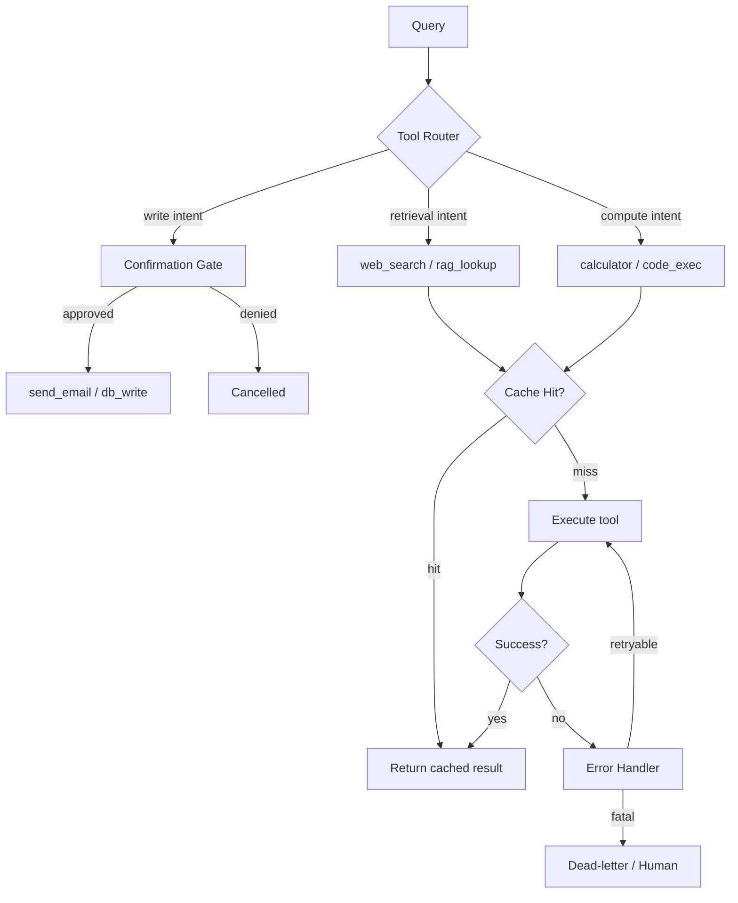

# Tool Use Patterns

**Level**: 🟡 Intermediate
**Reading Time**: 14 minutes

> Calling a tool is easy. Knowing *which* tool, *when* to call it, *how* to chain results, and *how to recover* when it fails — that is the difference between a demo and a production agent.

---

## Level 1 — Surface (2-minute read)

### What Is a Tool Use Pattern?

A **tool use pattern** is a reusable strategy for how an agent selects, invokes, sequences, and recovers from tool calls. Think of it as the architecture around tool calls, not the calls themselves.

The basic tool call (output JSON → run function → return result) is covered in [Tool Use & Function Calling](./tool-use-function-calling). This article focuses on the six patterns that make tool use reliable, cost-efficient, and composable in production:

| Pattern | Problem It Solves |
|---------|------------------|
| **Sequential chaining** | Multi-step tasks where step N depends on step N-1 |
| **Parallel fan-out** | Independent sub-tasks that can run at the same time |
| **Tool selection routing** | Choosing the cheapest tool that can answer the query |
| **Error recovery and retry** | Tool failures that shouldn't crash the whole agent |
| **Confirmation gates** | Destructive actions that need a human check |
| **Tool result caching** | Repeated identical calls within a session waste tokens and money |

### When to Use Advanced Tool Patterns

- Agent makes 3+ tool calls per request — sequential vs. parallel matters for latency
- Agent uses 10+ tools — explicit routing logic beats hoping the LLM picks right
- Tools can fail transiently (rate limits, network errors) — retry policy needed
- Tools have side effects (write DB, send email) — confirmation gates are mandatory
- Same query runs multiple times per hour (e.g., "get current price of BTC") — cache the tool result

### Core Concepts (3-minute orientation)

- **Tool chain**: An ordered sequence of tool calls where each call feeds the next
- **Tool fan-out**: Multiple independent calls dispatched in parallel, results merged
- **Tool router**: Logic (rules or a separate LLM call) that maps query intent to the right tool
- **Dead-letter tool call**: A failed call that has been logged and handed off to a human
- **Idempotency key**: A unique ID attached to a write operation so retries don't duplicate side effects



---

## Level 2 — Deep Dive

### Pattern 1: Sequential Tool Chaining

**Problem**: A user asks "Summarize the latest earnings report for NVIDIA and compare it to analyst consensus." Three steps are needed and each depends on the prior result:

1. Search the web for NVIDIA Q4 2025 earnings
2. Search for analyst consensus estimates
3. Compare and summarize

**Naive approach**: Let the LLM decide step-by-step with no structure — this works but leads to unpredictable behavior when the LLM skips steps or hallucines interim results.

**Pattern**: Encode the chain as an explicit plan before tool dispatch.

```python
# Python pseudocode — Sequential chain with explicit plan

def run_sequential_chain(query: str, tools: dict) -> str:
    # Phase 1: Planning — ask LLM to decompose into ordered steps
    plan_prompt = f"""
    Break down this query into ordered tool-call steps.
    Each step must name the tool and the input it needs from prior steps.

    Query: {query}
    Available tools: {list(tools.keys())}

    Return JSON: {{ "steps": [{{ "tool": "...", "args": {{...}}, "depends_on": [step_ids] }}] }}
    """
    plan = llm.generate(plan_prompt, response_format="json")

    results = {}
    for step in plan["steps"]:
        # Resolve template variables from prior results
        args = resolve_template(step["args"], results)
        tool_result = tools[step["tool"]].execute(args)
        results[step["id"]] = tool_result

    # Phase 2: Synthesis — LLM reads all results and writes final answer
    synthesis_context = format_results_for_llm(results)
    return llm.generate(f"Based on these results:\n{synthesis_context}\n\nAnswer: {query}")
```

**Trade-offs**:

| | Sequential Chain | Let LLM Decide On-the-Fly |
|-|-----------------|--------------------------|
| Latency | Higher (sequential steps) | Lower for simple queries |
| Reliability | High (deterministic order) | Lower (LLM may skip steps) |
| Debuggability | Easy (log each step) | Hard (opaque decisions) |
| Flexibility | Lower (plan upfront) | Higher (adapts mid-run) |

**Real example — LangChain Sequential Chains**: LangChain's `SequentialChain` forces output of step N to become input of step N+1. Shopify uses this pattern for their AI assistant: search product catalog → look up inventory → check pricing rules → generate response. Estimated 40% fewer hallucinations vs. free-form tool calling.

---

### Pattern 2: Parallel Fan-Out

**Problem**: A financial research agent needs data from 5 sources to answer "Is AAPL a good buy right now?" Each sub-query is independent. Running them sequentially adds ~3 seconds per call × 5 = 15 seconds total.

**Pattern**: Dispatch all tool calls concurrently, wait for all results, merge.

```typescript
// TypeScript pseudocode — Parallel fan-out

interface ToolCall {
  id: string;
  toolName: string;
  args: Record<string, unknown>;
}

async function fanOutToolCalls(
  toolCalls: ToolCall[],
  tools: Map<string, Tool>
): Promise<ToolResult[]> {
  // Dispatch all calls in parallel
  const promises = toolCalls.map(async (call) => {
    const tool = tools.get(call.toolName);
    if (!tool) {
      return { id: call.id, error: `Unknown tool: ${call.toolName}` };
    }
    try {
      const result = await tool.execute(call.args);
      return { id: call.id, content: result };
    } catch (err) {
      return { id: call.id, error: String(err) };
    }
  });

  // Wait for all — Promise.allSettled so one failure doesn't block others
  const settled = await Promise.allSettled(promises);
  return settled.map((r) =>
    r.status === "fulfilled" ? r.value : { error: r.reason }
  );
}

// Usage in agent loop
const response = await llm.generate(messages, { tools: toolSchemas });
if (response.toolCalls.length > 0) {
  const results = await fanOutToolCalls(response.toolCalls, tools);
  messages.push(...results.map(toToolMessage));
}
```

**Production numbers**:
- Claude 3.5 Sonnet and GPT-4o both support requesting multiple tool calls per response turn
- Perplexity reports 3-5x latency reduction for research queries using parallel tool dispatch
- At 5 parallel calls × 500ms average tool latency, fan-out cuts wall time from ~2.5s to ~0.5s

**Critical detail — use `Promise.allSettled`, not `Promise.all`**: A single failing tool call should not prevent the agent from using the other four results. `Promise.all` throws on first rejection; `Promise.allSettled` returns all outcomes.

---

### Pattern 3: Tool Selection Routing

**Problem**: An agent has 25 tools. The LLM sees all 25 tool schemas in every call. At 200 tokens per schema, that is 5,000 tokens of overhead per call — ~$0.015 on GPT-4o per request at 2025 pricing, and worse, the LLM may pick the wrong tool when the list is long.

**Pattern**: A lightweight router (rules-based or a fast cheap LLM) maps query intent to a small subset of tools (3-5) before invoking the main LLM.

```python
# Python pseudocode — Intent-based tool router

INTENT_TO_TOOLS = {
    "retrieval": ["web_search", "rag_lookup", "document_reader"],
    "compute":   ["calculator", "code_executor", "unit_converter"],
    "write":     ["send_email", "create_calendar_event", "db_insert"],
    "read_db":   ["sql_query", "crm_lookup", "analytics_dashboard"],
}

def classify_intent(query: str) -> str:
    """Fast, cheap classification — use a small model or keyword rules."""
    classification_prompt = f"""
    Classify this query into one of: retrieval | compute | write | read_db
    Query: {query}
    Return only the label.
    """
    # Use haiku/mini for this — 100x cheaper than opus/gpt-4o
    return cheap_llm.generate(classification_prompt).strip()

def get_tools_for_query(query: str, all_tools: dict) -> list:
    intent = classify_intent(query)
    tool_names = INTENT_TO_TOOLS.get(intent, list(all_tools.keys())[:5])
    return [all_tools[name].schema for name in tool_names if name in all_tools]

# Main agent call — only pass relevant tools
relevant_tools = get_tools_for_query(user_query, all_tools)
response = main_llm.generate(messages, tools=relevant_tools)
```

**Trade-off table**:

| Approach | Token cost | Accuracy | Latency overhead |
|----------|-----------|----------|-----------------|
| All tools always | High (~5k tokens for 25 tools) | Medium (LLM gets confused) | None |
| Keyword routing | Low (~50 tokens) | Low (brittle) | ~5ms |
| Small-LLM classifier | Medium (~200 tokens) | High | ~100ms |
| Embedding similarity | Low (~100 tokens) | High | ~20ms |

**Real example — LlamaIndex RouterQueryEngine**: LlamaIndex's router engine embeds the query and each tool description, then picks the top-k closest tools by cosine similarity. Retrieval time is ~10ms. Used by companies like Notion AI to route between knowledge base search, live web search, and code execution tools.

---

### Pattern 4: Error Recovery and Retry

**Problem**: A tool fails. Web search returns a 429. The database times out. The agent panics and either crashes or gives a wrong answer.

**Pattern**: Categorize errors as retryable vs. fatal, apply exponential backoff for retryable, route fatal errors to a fallback tool or human escalation.

```python
# Python pseudocode — Tool error recovery

import time
from enum import Enum

class ErrorType(Enum):
    RETRYABLE = "retryable"   # 429, 503, timeout
    FATAL = "fatal"            # 404, auth error, invalid args
    DEGRADED = "degraded"      # partial result, use with caution

def classify_tool_error(error: Exception) -> ErrorType:
    error_str = str(error).lower()
    if any(x in error_str for x in ["429", "rate limit", "timeout", "503"]):
        return ErrorType.RETRYABLE
    if any(x in error_str for x in ["401", "403", "invalid", "not found"]):
        return ErrorType.FATAL
    return ErrorType.DEGRADED

def execute_with_retry(
    tool,
    args: dict,
    max_retries: int = 3,
    base_delay_ms: int = 500,
    fallback_tool=None,
) -> dict:
    last_error = None
    for attempt in range(max_retries):
        try:
            result = tool.execute(args)
            return {"ok": True, "result": result, "attempts": attempt + 1}
        except Exception as e:
            error_type = classify_tool_error(e)
            last_error = e

            if error_type == ErrorType.FATAL:
                break  # No point retrying auth errors

            if error_type == ErrorType.RETRYABLE:
                delay = base_delay_ms * (2 ** attempt) / 1000  # exponential backoff
                time.sleep(delay)
                continue

    # All retries exhausted — try fallback
    if fallback_tool:
        try:
            result = fallback_tool.execute(args)
            return {"ok": True, "result": result, "fallback_used": True}
        except Exception:
            pass

    # Return structured error the LLM can reason about
    return {
        "ok": False,
        "error": str(last_error),
        "suggestion": "The tool is unavailable. You may need to inform the user or try a different approach.",
    }
```

**Why return a structured error to the LLM?** If you raise an exception or return an empty string, the LLM either crashes the agent loop or hallucinates a result. Returning `{"ok": false, "error": "...", "suggestion": "..."}` lets the LLM decide: retry with a different tool, ask the user, or gracefully degrade.

**Real example — Anthropic Claude tool use**: Anthropic's API allows tool results to include `is_error: true` plus the error message. Claude is explicitly trained to handle tool errors gracefully — it will acknowledge the failure and propose alternatives. Agents that surface errors properly see 60% fewer infinite retry loops in production benchmarks.

---

### Pattern 5: Confirmation Gates for Destructive Tools

**Problem**: An agent with `send_email` and `delete_record` tools executes them without human review. A bug in the prompt sends 500 emails to wrong recipients.

**Pattern**: Mark destructive tools as requiring confirmation. Before executing, show a preview to a human (or a safety-review LLM) and proceed only on explicit approval.

```typescript
// TypeScript pseudocode — Confirmation gate

type ConfirmationPolicy = "auto" | "require_human" | "require_llm_review";

interface ToolDefinition {
  name: string;
  execute: (args: unknown) => Promise<unknown>;
  confirmationPolicy: ConfirmationPolicy;
  previewFn?: (args: unknown) => string; // human-readable preview
}

async function gatedExecute(
  tool: ToolDefinition,
  args: Record<string, unknown>,
  confirmationHandler: (preview: string) => Promise<boolean>
): Promise<{ result: unknown; approved: boolean }> {
  if (tool.confirmationPolicy === "auto") {
    return { result: await tool.execute(args), approved: true };
  }

  // Generate a human-readable preview of what the tool will do
  const preview = tool.previewFn
    ? tool.previewFn(args)
    : `Will execute ${tool.name} with args: ${JSON.stringify(args, null, 2)}`;

  const approved = await confirmationHandler(preview);
  if (!approved) {
    return { result: { cancelled: true, reason: "User declined" }, approved: false };
  }

  return { result: await tool.execute(args), approved: true };
}

// Example: send_email with gated execution
const sendEmailTool: ToolDefinition = {
  name: "send_email",
  confirmationPolicy: "require_human",
  previewFn: (args: any) =>
    `📧 Will send email TO: ${args.to}\nSUBJECT: ${args.subject}\nBODY:\n${args.body}`,
  execute: async (args) => emailClient.send(args),
};
```

**Confirmation gate variants**:

| Gate Type | Use Case | Latency |
|-----------|---------|---------|
| **Human in the loop** | High-stakes writes (financial, legal) | Seconds to minutes |
| **LLM safety reviewer** | Automated pipelines needing sanity check | 500ms–2s |
| **Rule-based guard** | Known-bad patterns (e.g., delete all records) | <10ms |
| **Shadow mode** | Dry-run first, apply on second approval | Same as tool execution |

**Real example — CrewAI human input**: CrewAI provides a `human_input=True` flag on any tool. When set, the agent pauses, surfaces the proposed action in a UI, and waits for the operator to approve or reject before proceeding. Used in their customer service automation templates where agents can refund orders.

---

### Pattern 6: Tool Result Caching

**Problem**: A research agent is asked about Bitcoin price 10 times during a 5-minute session. It calls `get_crypto_price("BTC")` 10 times, paying API costs and burning tool tokens each time.

**Pattern**: Cache tool call results by (tool_name, args_hash) with a configurable TTL.

```python
# Python pseudocode — In-memory tool result cache with TTL

import hashlib, json, time
from typing import Any, Optional

class ToolCache:
    def __init__(self):
        self._cache: dict[str, tuple[Any, float]] = {}  # key → (result, expires_at)

    def _key(self, tool_name: str, args: dict) -> str:
        args_str = json.dumps(args, sort_keys=True)
        return f"{tool_name}:{hashlib.sha256(args_str.encode()).hexdigest()[:16]}"

    def get(self, tool_name: str, args: dict) -> Optional[Any]:
        key = self._key(tool_name, args)
        entry = self._cache.get(key)
        if entry is None:
            return None
        result, expires_at = entry
        if time.time() > expires_at:
            del self._cache[key]
            return None
        return result

    def set(self, tool_name: str, args: dict, result: Any, ttl_seconds: int = 60):
        key = self._key(tool_name, args)
        self._cache[key] = (result, time.time() + ttl_seconds)

# Per-tool TTL config — don't cache write tools
TOOL_TTL = {
    "web_search":       300,   # 5 minutes — news changes slowly
    "get_crypto_price": 30,    # 30 seconds — prices move fast
    "get_user_profile": 600,   # 10 minutes — profile data is stable
    "send_email":       None,  # Never cache write operations
    "db_insert":        None,
}

def cached_execute(cache: ToolCache, tool_name: str, tool, args: dict):
    ttl = TOOL_TTL.get(tool_name)
    if ttl is None:
        # Write tool — never cache
        return tool.execute(args)

    cached = cache.get(tool_name, args)
    if cached is not None:
        return cached  # Cache hit

    result = tool.execute(args)
    cache.set(tool_name, args, result, ttl_seconds=ttl)
    return result
```

**Cache hit rates observed in practice**:
- RAG-style lookup agents: 40–60% cache hit rate within a session
- Data analysis agents running on the same dataset: up to 80% cache hits for schema/metadata lookups
- Real-time data (prices, alerts): cache TTL <30s, hit rate ~15%

---

### Combining Patterns: A Production Agent Loop

Real production agents combine all six patterns. Here is what a complete agent loop looks like:

```python
# Python pseudocode — Production agent loop combining all six patterns

async def production_agent_loop(
    query: str,
    all_tools: dict,
    cache: ToolCache,
    confirm: ConfirmationHandler,
    max_turns: int = 10,
) -> str:
    messages = [SystemMessage(SYSTEM_PROMPT), HumanMessage(query)]
    turn = 0

    while turn < max_turns:
        turn += 1

        # 1. Route: only pass relevant tools to reduce token cost
        relevant_tool_schemas = get_tools_for_query(query, all_tools)

        # 2. LLM generates response (may request parallel tool calls)
        response = await llm.generate(messages, tools=relevant_tool_schemas)

        if response.type == "final_answer":
            return response.text

        # 3. Fan-out: execute tool calls in parallel
        call_tasks = []
        for tool_call in response.tool_calls:
            call_tasks.append(
                execute_tool_call(
                    tool_call, all_tools, cache, confirm
                )
            )
        results = await asyncio.gather(*call_tasks, return_exceptions=True)

        # Append all results back to message history
        messages.append(AIMessage(response))
        for tc, result in zip(response.tool_calls, results):
            if isinstance(result, Exception):
                messages.append(ToolResult(tc.id, error=str(result)))
            else:
                messages.append(ToolResult(tc.id, content=result))

    return "Max turns reached without a final answer."


async def execute_tool_call(tool_call, all_tools, cache, confirm):
    tool = all_tools.get(tool_call.tool_name)
    if not tool:
        return {"error": f"Unknown tool: {tool_call.tool_name}"}

    # 4. Confirmation gate for destructive tools
    if tool.requires_confirmation:
        approved = await confirm.ask(tool, tool_call.args)
        if not approved:
            return {"cancelled": True}

    # 5. Cache read/write for safe (non-write) tools
    # 6. Error recovery with retry
    return await cached_execute_with_retry(cache, tool, tool_call.args)
```

---

### Real Company Examples

#### LangChain — Composable Tool Chains

LangChain's `AgentExecutor` implements sequential and parallel tool chains as first-class constructs. Their `create_react_agent` function builds the standard ReAct loop, while `create_structured_chat_agent` enables parallel tool calls when the LLM outputs multiple tool calls in one response. LangChain reports ~30% reduction in total tool calls when parallel fan-out is enabled on multi-step research tasks.

#### LlamaIndex — Tool Router via Embeddings

LlamaIndex's `RouterQueryEngine` uses sentence-transformer embeddings to match query intent against tool descriptions at query time. With 20+ tools, this reduces prompt tokens by ~70% vs. passing all tool schemas to the LLM on every call. The router adds ~20ms latency but saves ~$0.01–0.05 per request at scale. Used in production by finance and legal tech companies building document Q&A agents.

#### AutoGen (Microsoft) — Multi-Agent Tool Delegation

In AutoGen's `AssistantAgent` + `UserProxyAgent` setup, tool execution happens on the proxy agent (which runs code), not the LLM agent. The proxy maintains a retry policy and can escalate to the human (UserProxyAgent's human_input_mode) when a tool fails 3 times. Microsoft's internal use of AutoGen for IT helpdesk automation reduced ticket escalation to humans by 42% once reliable tool error recovery was added.

#### CrewAI — Role-Based Tool Access Control

CrewAI assigns tools to agents by role. A `ResearchAgent` has `[web_search, rag_lookup]`; a `WriterAgent` has `[draft_document, format_text]`. No agent can call outside its tool set. This isolation prevents the LLM from confusing tool semantics and reduces unauthorized write operations by construction. CrewAI's enterprise tier adds per-tool audit logging for compliance.

#### Anthropic Claude — Native Confirmation Pattern

Anthropic recommends a two-phase approach for high-stakes tools in their Claude tool use guide: (1) Claude calls a `preview_action` tool that returns a human-readable description of what will happen, (2) After user approval, Claude calls the actual `execute_action` tool with an `approved: true` flag. This makes the confirmation intent explicit in the model's reasoning, not just bolted on outside. Customers report near-zero unauthorized write operations with this pattern.

#### OpenAI GPT-4o — Parallel Tool Calls in Production

OpenAI's parallel function calling (released with GPT-4o) allows the model to request multiple tool calls in a single response JSON. Stripe's AI assistant uses this to fetch transaction history, fraud score, and account status in parallel when a customer asks "Why was my payment declined?" — reducing response time from ~4.5s to ~1.2s.

---

### Common Mistakes

**1. Retrying write operations without idempotency keys**

A `send_email` tool fails at the network layer after the email was actually sent. The agent retries and the customer gets two emails. Fix: generate a unique `idempotency_key` per tool call and pass it to write tools. The downstream service deduplicates on this key.

```python
# Wrong — retry blindly
def send_email(to, subject, body):
    return email_client.send(to, subject, body)

# Correct — idempotent key
def send_email(to, subject, body, idempotency_key: str):
    return email_client.send(to, subject, body, idempotency_key=idempotency_key)
```

**2. Caching tool results for write operations**

An agent calls `db_insert(record)` and gets a success result. The cache stores it. On the next run, the same insert is "answered" from cache without actually inserting. Fix: always mark write tools with `cacheable=False`. The `TOOL_TTL = None` pattern above enforces this explicitly.

**3. Passing all tool schemas when only 2-3 are relevant**

A 25-tool agent passes all schemas every call. Token cost: ~5,000 extra tokens per call at $0.015/1k tokens = $0.075 per request. At 100k requests/day, that is $7,500/day in wasted token spend. Fix: implement a tool router. Even a simple keyword classifier that reduces schemas from 25 to 5 cuts this to $0.015/request.

**4. Not propagating tool errors to the LLM**

When a tool fails, many developers raise an exception that bubbles up and crashes the agent loop, or silently return `None`. Either way, the LLM never knows the tool failed and will hallucinate a result. Fix: always return a structured error dict and pass it as the tool result. The LLM can then reason about what to do next.

**5. No max-turns guard on the agent loop**

An agent enters an infinite loop: it calls a broken tool, gets an error, plans to retry, calls the same broken tool again, forever. Fix: enforce `max_turns` (typically 10-15 for most production use cases) and return a graceful degradation message when exceeded.

---

### Key Takeaways

- **Sequential chaining** gives deterministic order for multi-step tasks — plan first, execute, synthesize
- **Parallel fan-out** with `Promise.allSettled` (not `Promise.all`) can cut latency 3-5x for independent sub-tasks
- **Tool routing** reduces prompt tokens by 60-70% in agents with 10+ tools — use embedding similarity or a cheap classifier
- **Retry policy** must classify retryable (429/timeout) vs. fatal (401/404) errors; write tools need idempotency keys
- **Confirmation gates** are non-negotiable for any tool with side effects — at minimum, implement shadow mode (dry-run first)
- **Cache write operations never** — only cache reads, with appropriate TTL per tool (30s for live data, 10min+ for stable data)

---

## References

- 📚 [LangChain Tool Documentation](https://python.langchain.com/docs/modules/tools/)
- 📚 [Anthropic Tool Use Guide](https://docs.anthropic.com/en/docs/build-with-claude/tool-use)
- 📚 [OpenAI Function Calling Best Practices](https://platform.openai.com/docs/guides/function-calling)
- 📚 [AutoGen Tool Use Patterns](https://microsoft.github.io/autogen/stable/user-guide/agentchat-user-guide/tutorial/tool-use.html)
- 📚 [LlamaIndex Tools Overview](https://docs.llamaindex.ai/en/stable/understanding/agent/tools/)
- 📖 [Building LLM Applications: When to Use Tools (Chip Huyen)](https://huyenchip.com/2023/05/02/rag.html)
