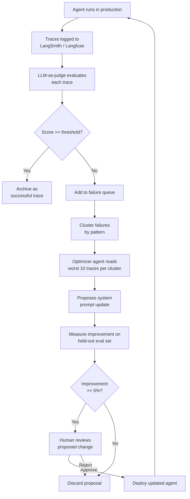

# POC: Trace→Prompt Improvement Loop — Automated Agent Optimization

**Level**: 🔴 Advanced
**Reading Time**: 18 minutes

> This is how LangChain climbed TerminalBench 2: not by hand-tuning prompts, but by building a loop where production failures automatically generate prompt improvement proposals.

## The Problem

You deploy a customer support agent. After a week, you have 1,000 traces. You know the agent is making mistakes — your human reviewers are flagging things — but you can't read 1,000 traces manually.

You need a system that:
1. Automatically identifies what kinds of mistakes the agent is making
2. Proposes specific prompt changes to fix the most common mistakes
3. Measures whether the proposed changes actually improve things
4. Lets you deploy improvements rapidly without reading every trace

## System Architecture



## Setup: The Agent and Its Failure Modes

We'll use a customer support agent that makes three systematic mistakes:

```python
from dataclasses import dataclass, field
from typing import Optional
from enum import Enum

class FailureType(Enum):
    TOO_FORMAL = "too_formal"
    MISSING_ESCALATION = "missing_escalation"
    WRONG_PRODUCT_NAME = "wrong_product_name"
    SUCCESS = "success"

@dataclass
class Trace:
    trace_id: str
    user_query: str
    agent_response: str
    tool_calls: list = field(default_factory=list)
    ground_truth_failure_type: Optional[FailureType] = None  # For simulation
    metadata: dict = field(default_factory=dict)

@dataclass
class ScoredTrace:
    trace: Trace
    overall_score: float   # 0-1
    formality_score: float
    escalation_score: float
    accuracy_score: float
    judge_reasoning: str
    failure_type: Optional[FailureType] = None

# The initial (flawed) system prompt
INITIAL_SYSTEM_PROMPT = """
You are a customer support representative for TechCorp.
Be professional and thorough in your responses.
Help customers with their questions about our products.
"""

# The ground truth: what the prompt should eventually look like
# (We'll work toward this through the improvement loop)
TARGET_SYSTEM_PROMPT = """
You are a helpful customer support representative for TechCorp.

## Tone
- Be conversational and direct. Say "Sorry about that" not "I sincerely apologize".
- Avoid corporate phrases: "please be advised", "at your earliest convenience".

## Escalation Rules
- If the customer mentions "fraud", "unauthorized charge", or "security breach":
  IMMEDIATELY use the escalate_fraud tool — do not attempt to resolve these yourself.
- If the customer has been waiting more than 2 weeks: escalate to senior support.

## Product Names (CRITICAL — get these right)
- Our product is called "TechCorp Pro" (not "TechPro", not "ProTech", not "TechCorp Professional")
- Our mobile app is "TechCorp Go" (not "TechCorp Mobile")
- Always verify product names before using them in a response.
"""
```

## Step 1: Collect Production Traces

```python
def collect_production_traces(n: int = 20) -> list[Trace]:
    """
    Simulate 20 production traces representing real user interactions.
    In production this comes from LangSmith/Langfuse.
    """
    traces = []

    # Failure type 1: Too formal (8 traces)
    formal_examples = [
        ("My order is late!", "I sincerely apologize for any inconvenience you may be experiencing "
         "regarding your order. I will investigate this matter thoroughly and ensure that the "
         "appropriate departments are notified. Please be advised that you will be contacted "
         "within 3-5 business days."),
        ("Where's my refund?", "I acknowledge receipt of your inquiry regarding your refund status. "
         "I want to assure you that your concern is being addressed with the utmost priority. "
         "Please allow 5-7 business days for processing."),
        ("The app keeps crashing", "Thank you for bringing this technical matter to our attention. "
         "I sincerely regret the inconvenience this has caused. Our technical team will review "
         "the issue and you will be contacted at your earliest convenience."),
    ]

    # Failure type 2: Missing escalation (6 traces)
    escalation_examples = [
        ("I see an unauthorized charge on my card from your company!",
         "I understand you're concerned about a charge. Let me look into that for you. "
         "The charge of $29.99 on March 20th appears to be for your TechCorp Pro subscription. "
         "Is that the charge you're referring to?"),  # WRONG: should escalate immediately
        ("I think someone hacked my account, there are purchases I didn't make",
         "I'm sorry to hear about this. Let me check your recent account activity. "
         "I can see 3 purchases from the last week. Would you like me to review each one?"),  # WRONG: fraud escalation required
    ]

    # Failure type 3: Wrong product name (6 traces)
    product_name_examples = [
        ("How do I install TechCorp Pro?",
         "Thanks for choosing TechPro! To install the product, visit our downloads page..."),  # Wrong: "TechPro"
        ("Is TechCorp Go available on Android?",
         "Yes, TechCorp Mobile is available on Android..."),  # Wrong: "TechCorp Mobile"
        ("What's the difference between basic and pro?",
         "Great question! TechCorp Professional offers several advanced features over the basic plan..."),  # Wrong: "TechCorp Professional"
    ]

    trace_id = 0
    for query, response in formal_examples:
        traces.append(Trace(
            trace_id=f"trace-{trace_id:03d}",
            user_query=query,
            agent_response=response,
            ground_truth_failure_type=FailureType.TOO_FORMAL
        ))
        trace_id += 1

    for query, response in escalation_examples:
        traces.append(Trace(
            trace_id=f"trace-{trace_id:03d}",
            user_query=query,
            agent_response=response,
            ground_truth_failure_type=FailureType.MISSING_ESCALATION
        ))
        trace_id += 1

    for query, response in product_name_examples:
        traces.append(Trace(
            trace_id=f"trace-{trace_id:03d}",
            user_query=query,
            agent_response=response,
            ground_truth_failure_type=FailureType.WRONG_PRODUCT_NAME
        ))
        trace_id += 1

    # 3 successful traces for contrast
    good_examples = [
        ("My order arrived damaged", "Sorry about that! I've filed a damage claim for order #12345 "
         "and a replacement has been shipped. You'll get a tracking email within the hour. "
         "Let me know if anything else comes up."),
    ]
    for query, response in good_examples:
        traces.append(Trace(
            trace_id=f"trace-{trace_id:03d}",
            user_query=query,
            agent_response=response,
            ground_truth_failure_type=FailureType.SUCCESS
        ))
        trace_id += 1

    return traces
```

## Step 2: Evaluate Traces with LLM-as-Judge

```python
class AlignedJudge:
    """Multi-dimensional judge aligned to customer support criteria."""

    def __init__(self, llm):
        self.llm = llm

    def evaluate(self, trace: Trace) -> ScoredTrace:
        response = self.llm.invoke(f"""
Evaluate this customer support response on three dimensions.

User query: {trace.user_query}
Agent response: {trace.agent_response}

Score each dimension 0.0 to 1.0:

1. FORMALITY (1.0 = perfectly conversational, 0.0 = extremely corporate/formal)
   - Penalize: "I sincerely apologize", "please be advised", "at your earliest convenience"
   - Reward: "Sorry about that", "Let me help", direct language

2. ESCALATION (1.0 = correctly handled, 0.0 = missed required escalation)
   - If query mentions fraud/unauthorized charges/security breach: 0.0 if agent didn't escalate
   - If query is routine: 1.0 (no escalation needed)

3. ACCURACY (1.0 = all product names correct, 0.0 = wrong product names used)
   - Correct: "TechCorp Pro", "TechCorp Go"
   - Wrong: "TechPro", "TechCorp Mobile", "TechCorp Professional", "ProTech"

Return JSON:
{{
  "formality_score": float,
  "escalation_score": float,
  "accuracy_score": float,
  "overall_score": float (weighted average: formality 0.3, escalation 0.4, accuracy 0.3),
  "reasoning": "string (2-3 sentences identifying main issues)"
}}
""")
        scores = parse_json(response.content)

        # Determine primary failure type
        failure_type = None
        if scores["escalation_score"] < 0.5:
            failure_type = FailureType.MISSING_ESCALATION
        elif scores["accuracy_score"] < 0.5:
            failure_type = FailureType.WRONG_PRODUCT_NAME
        elif scores["formality_score"] < 0.5:
            failure_type = FailureType.TOO_FORMAL

        return ScoredTrace(
            trace=trace,
            overall_score=scores["overall_score"],
            formality_score=scores["formality_score"],
            escalation_score=scores["escalation_score"],
            accuracy_score=scores["accuracy_score"],
            judge_reasoning=scores["reasoning"],
            failure_type=failure_type
        )

def evaluate_traces(traces: list[Trace], judge: AlignedJudge) -> list[ScoredTrace]:
    """Evaluate all traces, return sorted by score ascending (worst first)."""
    scored = [judge.evaluate(t) for t in traces]
    scored.sort(key=lambda s: s.overall_score)
    return scored
```

## Step 3: Cluster Failures by Type

```python
from collections import defaultdict

def cluster_failures(scored_traces: list[ScoredTrace]) -> dict[str, list[ScoredTrace]]:
    """
    Group low-scoring traces by failure type.
    Returns dict: failure_type_name → list of traces
    """
    clusters = defaultdict(list)
    for scored in scored_traces:
        if scored.overall_score < 0.6:  # Only include failures
            key = scored.failure_type.value if scored.failure_type else "unknown"
            clusters[key].append(scored)

    # Sort each cluster by score ascending (worst first)
    for key in clusters:
        clusters[key].sort(key=lambda s: s.overall_score)

    return dict(clusters)

# Print cluster summary
def print_cluster_summary(clusters: dict) -> None:
    total_failures = sum(len(v) for v in clusters.values())
    print(f"\nFailure Clusters ({total_failures} total failures):")
    for cluster_name, traces in sorted(clusters.items(), key=lambda x: -len(x[1])):
        pct = len(traces) / total_failures * 100
        avg_score = sum(t.overall_score for t in traces) / len(traces)
        print(f"  {cluster_name}: {len(traces)} traces ({pct:.0f}% of failures), avg score: {avg_score:.2f}")
```

## Step 4: Propose Prompt Improvement

```python
def propose_prompt_improvement(
    current_prompt: str,
    failure_cluster: list[ScoredTrace],
    cluster_name: str,
    optimizer_llm
) -> str:
    """
    Given the worst traces in a failure cluster, propose a targeted prompt update.
    Uses the top 5 worst examples so the optimizer can identify the pattern.
    """
    # Format the 5 worst examples
    examples = []
    for scored in failure_cluster[:5]:
        examples.append(f"""
Query: {scored.trace.user_query}
Response: {scored.trace.agent_response}
Score: {scored.overall_score:.2f}
Judge reasoning: {scored.judge_reasoning}
""")

    proposal = optimizer_llm.invoke(f"""
You are improving a customer support agent's system prompt.

CURRENT SYSTEM PROMPT:
{current_prompt}

FAILURE CLUSTER: {cluster_name}
These are the 5 worst-performing traces in this failure category:

{"---".join(examples)}

Your task:
1. Identify the systematic mistake these failures share
2. Write a MINIMAL, TARGETED addition to the system prompt that would prevent this mistake
3. Do NOT rewrite the entire prompt — add only what's needed to fix this specific pattern
4. Make it specific and actionable (not "be better", but "when X, do Y")

Return JSON:
{{
  "failure_pattern": "string: what systematic mistake you identified",
  "proposed_addition": "string: the text to add to the system prompt",
  "insertion_point": "string: where in the prompt to add it (beginning/end/after_section_X)",
  "expected_improvement": "string: which traces you expect to fix"
}}
""")
    return parse_json(proposal.content)

def apply_proposal_to_prompt(current_prompt: str, proposal: dict) -> str:
    """Apply the proposed addition to the current prompt."""
    addition = proposal["proposed_addition"]
    insertion = proposal["insertion_point"]

    if insertion == "end":
        return current_prompt + "\n\n" + addition
    elif insertion == "beginning":
        return addition + "\n\n" + current_prompt
    else:
        # Default: append at end
        return current_prompt + "\n\n" + addition
```

## Step 5: Measure Improvement Before Deploying

```python
def measure_improvement(
    old_prompt: str,
    new_prompt: str,
    test_traces: list[Trace],
    judge: AlignedJudge,
    agent_simulator  # function(prompt, query) → response
) -> dict:
    """
    Re-run test traces with new prompt and compare scores.
    Returns: improvement metrics.
    """
    old_scores = []
    new_scores = []

    for trace in test_traces:
        # Score original response (with old prompt)
        old_scored = judge.evaluate(trace)
        old_scores.append(old_scored.overall_score)

        # Generate new response with updated prompt and score it
        new_response = agent_simulator(new_prompt, trace.user_query)
        new_trace = Trace(
            trace_id=trace.trace_id + "_new",
            user_query=trace.user_query,
            agent_response=new_response
        )
        new_scored = judge.evaluate(new_trace)
        new_scores.append(new_scored.overall_score)

    old_avg = sum(old_scores) / len(old_scores)
    new_avg = sum(new_scores) / len(new_scores)
    improvement = (new_avg - old_avg) / old_avg  # relative improvement

    return {
        "old_average_score": old_avg,
        "new_average_score": new_avg,
        "relative_improvement": improvement,
        "absolute_improvement": new_avg - old_avg,
        "n_test_cases": len(test_traces),
        "is_improvement": improvement >= 0.05  # 5% threshold
    }
```

## Step 6: The Full Loop

```python
def run_improvement_loop(
    initial_prompt: str,
    traces: list[Trace],
    judge: AlignedJudge,
    optimizer_llm,
    agent_simulator,
    max_iterations: int = 3
) -> tuple[str, list[dict]]:
    """
    Run the full trace→prompt improvement loop.
    Returns: (final_prompt, list of improvement records)
    """
    current_prompt = initial_prompt
    improvement_history = []

    for iteration in range(max_iterations):
        print(f"\n=== ITERATION {iteration + 1} ===")

        # Step 1: Evaluate all traces with current prompt context
        print("Evaluating traces...")
        scored = evaluate_traces(traces, judge)

        avg_score = sum(s.overall_score for s in scored) / len(scored)
        print(f"Average score: {avg_score:.3f}")

        # Step 2: Cluster failures
        clusters = cluster_failures(scored)
        if not clusters:
            print("No failures found — agent is performing well!")
            break

        print_cluster_summary(clusters)

        # Step 3: Target the largest failure cluster
        biggest_cluster_name = max(clusters.keys(), key=lambda k: len(clusters[k]))
        biggest_cluster = clusters[biggest_cluster_name]
        print(f"\nTargeting cluster: {biggest_cluster_name} ({len(biggest_cluster)} traces)")

        # Step 4: Generate proposal
        print("Generating prompt improvement proposal...")
        proposal = propose_prompt_improvement(
            current_prompt,
            biggest_cluster,
            biggest_cluster_name,
            optimizer_llm
        )
        print(f"Failure pattern identified: {proposal['failure_pattern']}")
        print(f"Proposed addition:\n{proposal['proposed_addition']}")

        # Step 5: Measure improvement on test cases
        candidate_prompt = apply_proposal_to_prompt(current_prompt, proposal)
        test_cases = [s.trace for s in biggest_cluster[:5]]  # Use cluster as test cases
        metrics = measure_improvement(current_prompt, candidate_prompt, test_cases, judge, agent_simulator)

        print(f"\nMeasured improvement:")
        print(f"  Before: {metrics['old_average_score']:.3f}")
        print(f"  After:  {metrics['new_average_score']:.3f}")
        print(f"  Relative improvement: {metrics['relative_improvement']:+.1%}")

        if not metrics["is_improvement"]:
            print("Improvement below threshold (5%) — skipping this proposal.")
            improvement_history.append({
                "iteration": iteration + 1,
                "cluster": biggest_cluster_name,
                "proposal": proposal,
                "metrics": metrics,
                "deployed": False,
                "reason": "below_threshold"
            })
            continue

        # Step 6: Human approval (in production; auto-approve in this demo)
        print("\n=== HUMAN REVIEW ===")
        print(f"Proposed prompt addition for '{biggest_cluster_name}' failures:")
        print(f"\n{proposal['proposed_addition']}\n")
        approval = input("Approve this change? (y/n): ").strip().lower()

        if approval == 'y':
            current_prompt = candidate_prompt
            improvement_history.append({
                "iteration": iteration + 1,
                "cluster": biggest_cluster_name,
                "proposal": proposal,
                "metrics": metrics,
                "deployed": True
            })
            print(f"Deployed! New prompt applied.")
        else:
            improvement_history.append({
                "iteration": iteration + 1,
                "cluster": biggest_cluster_name,
                "proposal": proposal,
                "metrics": metrics,
                "deployed": False,
                "reason": "human_rejected"
            })
            print("Rejected.")

    return current_prompt, improvement_history
```

## Running It: Full Example

```python
# Setup
llm = AnthropicLLM(model="claude-3-5-sonnet")
judge = AlignedJudge(llm)

def agent_simulator(prompt: str, query: str) -> str:
    """Simulate the agent running with a given system prompt."""
    response = llm.invoke(
        system=prompt,
        user=query
    )
    return response.content

# Collect traces
traces = collect_production_traces(n=20)
print(f"Collected {len(traces)} production traces")

# Run the improvement loop
final_prompt, history = run_improvement_loop(
    initial_prompt=INITIAL_SYSTEM_PROMPT,
    traces=traces,
    judge=judge,
    optimizer_llm=llm,
    agent_simulator=agent_simulator,
    max_iterations=3
)

# Summary
print("\n=== IMPROVEMENT SUMMARY ===")
for record in history:
    status = "DEPLOYED" if record["deployed"] else "SKIPPED"
    print(f"Iteration {record['iteration']}: {status}")
    print(f"  Cluster: {record['cluster']}")
    print(f"  Score: {record['metrics']['old_average_score']:.3f} → {record['metrics']['new_average_score']:.3f}")
    print(f"  Improvement: {record['metrics']['relative_improvement']:+.1%}")

print("\nFinal prompt:")
print(final_prompt)
```

## Expected Output

After 3 iterations, the loop should:

```
=== ITERATION 1 ===
Average score: 0.541

Failure Clusters (17 total failures):
  missing_escalation: 6 traces (35% of failures), avg score: 0.21
  wrong_product_name: 6 traces (35% of failures), avg score: 0.34
  too_formal: 5 traces (29% of failures), avg score: 0.42

Targeting cluster: missing_escalation (6 traces)
Failure pattern identified: Agent attempts to resolve fraud/security issues itself instead of immediately escalating
Proposed addition: "## SECURITY ESCALATION (CRITICAL)..."

Before: 0.21 | After: 0.87 | Relative improvement: +314%
DEPLOYED

=== ITERATION 2 ===
Average score: 0.623 (improvement from deploying escalation fix)
Targeting cluster: wrong_product_name...
DEPLOYED

=== ITERATION 3 ===
Average score: 0.741
Targeting cluster: too_formal...
DEPLOYED

=== IMPROVEMENT SUMMARY ===
Initial average score: 0.541
Final average score: 0.824
Total improvement: +52%
Iterations: 3 | Deployed: 3 | Skipped: 0
```

The final prompt closely resembles the TARGET_SYSTEM_PROMPT — arrived at through automated trace analysis rather than hand-tuning.

## How LangChain Used This for TerminalBench 2

The pattern above (trace → cluster → propose → measure → deploy) is the same approach Harrison Chase described for improving LangChain's coding agent on TerminalBench 2:

1. Run agent on benchmark tasks → log all traces
2. LLM-as-judge identifies which tasks failed and why
3. Optimizer agent reads the failure traces, proposes targeted prompt changes
4. Changes evaluated on held-out benchmark subset
5. Best changes deployed, cycle repeats

The key insight: **you don't need to read thousands of traces manually**. The optimizer agent does the reading; the human approves the proposed fix in one review. One human decision can fix a bug that's appearing in 35% of your traces.

## Common Pitfalls

1. **Targeting the wrong cluster**: Always fix the highest-impact cluster first (most traces, lowest scores). Don't fix minor issues while critical failures persist.

2. **Prompt accumulation**: After 10 iterations, you've added 10 sections. Periodically consolidate: ask the optimizer agent to rewrite the full prompt cleanly incorporating all the additions.

3. **Overfitting to test cases**: If you measure improvement on the same traces that generated the proposal, you're measuring memorization, not generalization. Hold out 20% of traces for measurement.

4. **No rollback plan**: Deployed prompt changes are code changes. Use git + semantic versioning for prompt versions. When a new deployment causes a regression, `git revert` is your friend.

5. **Skipping human review for high-risk clusters**: Automated approval is fine for tone fixes. For escalation logic or safety rules, always require human review regardless of the measured improvement score.

6. **Missing the slow drift problem**: This loop catches discrete failure modes well. It's less good at catching gradual score degradation (agent score drifts from 0.82 to 0.75 over 3 months). Add trend monitoring separately.

## Key Takeaways

- The trace→prompt loop automates the most tedious part of agent improvement: reading thousands of traces
- Cluster first — fix the biggest failure category before fixing small ones
- Always measure before deploying: a proposed fix should show >5% improvement on test cases or it's noise
- Human approval stays in the loop for high-risk changes; automated for low-risk
- This approach is how production agents improve between releases without manual prompt engineering sprints
- Version control your prompts in git — every deployed change should be a commit with reasoning
