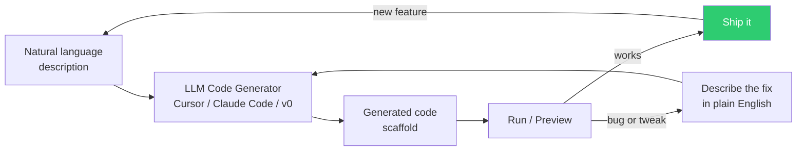
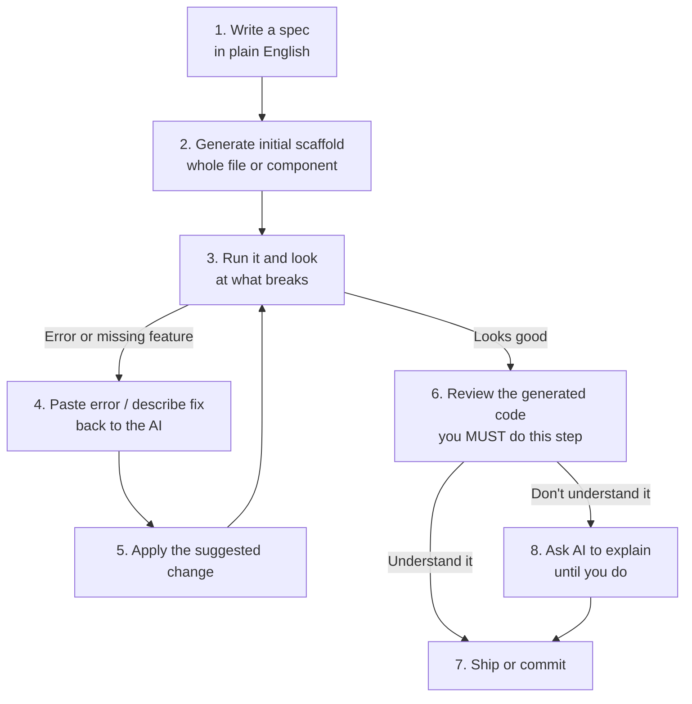
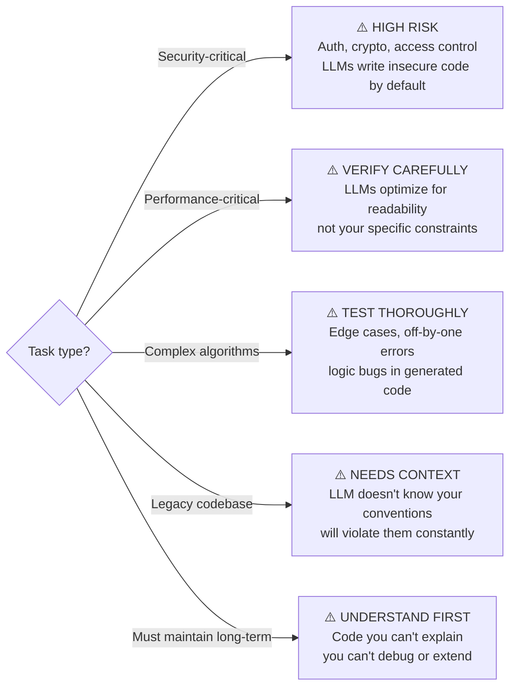
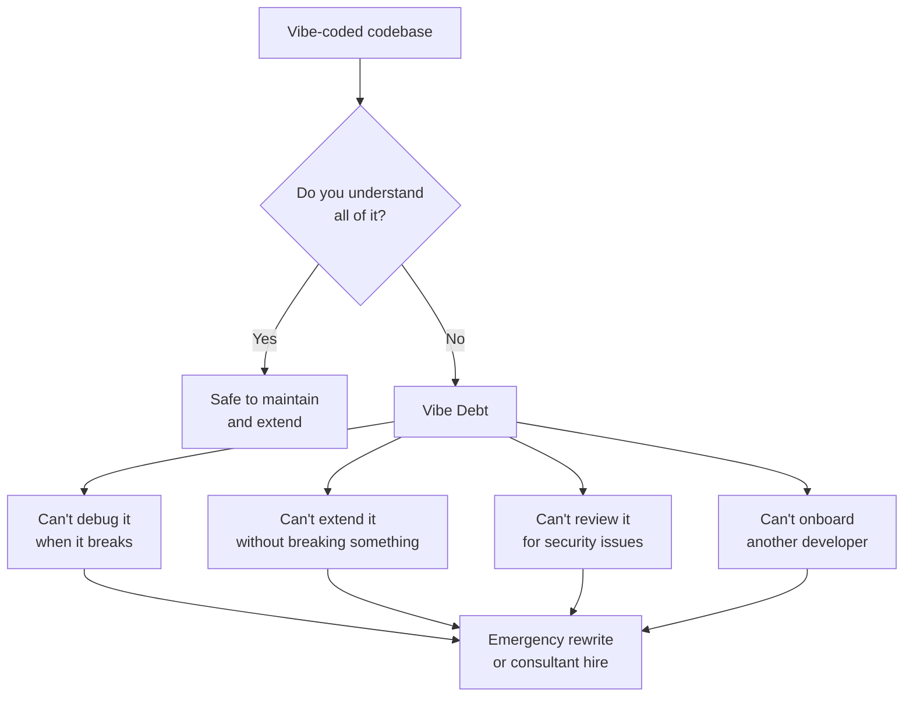

# Vibe Coding — LLM-Driven Development from Natural Language

**Level**: 🟢 Beginner
**Reading Time**: 11 minutes

> "Fully give in to the vibes, embrace exponentials, forget that the code even exists." — Andrej Karpathy, February 2025

## 🗺️ Quick Overview



*The vibe coding loop: describe → generate → run → iterate in English. No manual typing of boilerplate.*

## The Problem

Traditional software development has a steep access barrier: you need to know the syntax, the framework idioms, the boilerplate patterns, the CLI commands, and the debugging workflow before you can build anything that works. For experienced developers, up to 60% of daily work is writing code that is mostly mechanical — CRUD operations, API wrappers, UI forms, test scaffolding.

LLMs can write that 60% faster than any human, in any language, for any framework — if you can describe what you want clearly.

Vibe coding is the practice of **leaning into this capability fully**: you describe intent, the AI writes implementation, and you stay in the design and problem-solving role rather than the typing role.

---

## What "Vibe Coding" Means

The term was coined by Andrej Karpathy (ex-Tesla AI Director, ex-OpenAI founding team) in a February 2025 tweet:

> "There's a new kind of coding I call 'vibe coding', where you fully give in to the vibes, embrace exponentials, and forget that the code even exists. It's possible because the LLMs are (still) getting better so fast, and most of the time I only have a vague sense of what I want."

The spectrum from "vibe-assisted" to "pure vibe":

| Mode | Description | You write | AI writes |
|------|-------------|-----------|-----------|
| Copilot (light) | AI completes lines as you type | Structure + logic | Syntax + completions |
| AI pair programmer | Describe functions, AI implements them | Architecture + intent | Implementation |
| Scaffold then edit | Generate full files, edit key parts | Business logic | Boilerplate |
| Pure vibe | Describe app in English, AI writes everything | Descriptions | All code |

Most production developers operate in the middle two modes. "Pure vibe" works well for prototypes and personal tools.

---

## The Vibe Coding Workflow in Practice



**Step 1 example — writing the spec**:
```
"Create a Next.js API route at /api/users/[id]/posts that:
- Accepts GET requests
- Takes an optional 'page' query param (default 1, max 50)
- Takes an optional 'limit' query param (default 10, max 100)
- Queries a PostgreSQL database using Prisma
- Returns posts with: id, title, createdAt, tags array
- Returns 404 if user doesn't exist
- Returns 400 if page/limit are invalid numbers
- Include proper TypeScript types"
```

That's the spec. No boilerplate to memorize. No Prisma query syntax to look up. No Next.js routing conventions to remember.

**Step 4 example — describing a fix**:
```
"The build is failing with: 'Type 'string | undefined' is not assignable to type 'string'.
The error is on line 23 in the page param parsing. Fix the type error, and make sure
null/undefined values default to 1."
```

---

## Tools Landscape

| Tool | Type | Best For | Pricing |
|------|------|---------|---------|
| **Cursor** | IDE (VSCode fork) | Full dev environment, file awareness, multi-file edits | $20/month |
| **GitHub Copilot** | IDE plugin | Inline completion, existing codebases, VS Code + JetBrains | $10-19/month |
| **Claude Code** | CLI agent | Agentic file editing, complex multi-step tasks, test + fix loops | Pay-per-token |
| **v0 by Vercel** | Web app | React/Next.js UI generation from description | Free tier + $20/month |
| **Lovable** | Web app | Full-stack apps (React + Supabase) from description | $20/month |
| **Bolt.new (StackBlitz)** | Web IDE | Interactive prototyping, instant preview | Free tier + paid |
| **Replit Agent** | Web IDE | Backend + frontend + database, deployment included | $25/month |
| **Windsurf (Codeium)** | IDE | Cascade mode: AI edits multiple files in sequence | Free tier + $15/month |
| **Devin (Cognition)** | Autonomous agent | Fully autonomous, runs in its own environment | Enterprise pricing |

**Which tool for which job:**
- Building a new UI component: **v0**
- Pair programming in an existing codebase: **Cursor or Copilot**
- Greenfield full-stack prototype: **Lovable or Bolt.new**
- Complex multi-file refactoring: **Claude Code or Cursor**
- Fully hands-off agent for well-defined tasks: **Devin or Replit Agent**

---

## When Vibe Coding Works Well

**Best-fit scenarios:**

- **Prototypes and MVPs** — speed matters, perfection doesn't, you'll throw it away anyway
- **Frontend/UI components** — visual feedback loop is fast; you see it in seconds
- **Boilerplate-heavy code** — CRUD APIs, database migrations, form validation, test fixtures
- **Unfamiliar frameworks** — "Create a FastAPI endpoint in Python that..." without knowing FastAPI
- **Small, well-defined features** — the more specific your description, the better the output
- **Converting existing code** — "Convert this Python class to TypeScript with the same logic"
- **Writing tests** — "Write Jest tests for this function covering edge cases"

**Productivity numbers (real data, 2024):**
- GitHub reports 55% of Copilot users say they code faster
- Microsoft research: 46% of developers feel more productive
- Andreessen Horowitz study: 10-20% productivity gain for experienced developers on real tasks
- For non-engineers building internal tools: up to 10x productivity vs hiring a developer

---

## When Vibe Coding Struggles

**Problem-fit mismatches:**



**Security is the biggest risk:**

LLMs will generate functional-looking authentication code that has subtle vulnerabilities:
- Missing rate limiting on login endpoints
- JWT secrets hardcoded or with weak defaults
- SQL injection possible in dynamic queries
- Authorization checks that can be bypassed with crafted input
- Password hashing with outdated algorithms (MD5, SHA1)

Vibe-coded security code should be reviewed by someone who understands security. Do not ship AI-generated auth code without expert review.

---

## Example: Creating a Component with Natural Language

**The prompt** (real example using Cursor or Claude Code):
```
Create a React component called UserCard that:
- Accepts props: user (with id, name, email, avatarUrl, role, createdAt)
- Shows the avatar image with a fallback initial if avatarUrl is null
- Shows the user's name (bold), email (muted), and role badge
- Role badge: "admin" = red background, "member" = blue, "viewer" = gray
- Shows "Joined [relative time]" using date-fns formatDistanceToNow
- Has a hover state that slightly lifts the card
- Uses Tailwind CSS for styling
- Is fully typed with TypeScript
- Exports the User type too
```

**Generated output** (Cursor, Claude Code, or v0 produces this in ~5 seconds):

```typescript
import { formatDistanceToNow } from 'date-fns';

export interface User {
  id: string;
  name: string;
  email: string;
  avatarUrl: string | null;
  role: 'admin' | 'member' | 'viewer';
  createdAt: Date;
}

interface UserCardProps {
  user: User;
}

const roleBadgeStyles: Record<User['role'], string> = {
  admin: 'bg-red-100 text-red-800',
  member: 'bg-blue-100 text-blue-800',
  viewer: 'bg-gray-100 text-gray-800',
};

export function UserCard({ user }: UserCardProps) {
  const initials = user.name
    .split(' ')
    .map((n) => n[0])
    .join('')
    .toUpperCase()
    .slice(0, 2);

  return (
    <div className="flex items-center gap-4 p-4 bg-white rounded-lg border border-gray-200
                    shadow-sm transition-transform duration-150 hover:-translate-y-0.5 hover:shadow-md">
      {user.avatarUrl ? (
        
      ) : (
        <div className="w-12 h-12 rounded-full bg-gray-300 flex items-center justify-center
                        text-gray-700 font-semibold text-sm">
          {initials}
        </div>
      )}
      <div className="flex-1 min-w-0">
        <div className="flex items-center gap-2">
          <p className="font-semibold text-gray-900 truncate">{user.name}</p>
          <span className={`text-xs px-2 py-0.5 rounded-full font-medium ${roleBadgeStyles[user.role]}`}>
            {user.role}
          </span>
        </div>
        <p className="text-sm text-gray-500 truncate">{user.email}</p>
        <p className="text-xs text-gray-400 mt-0.5">
          Joined {formatDistanceToNow(user.createdAt, { addSuffix: true })}
        </p>
      </div>
    </div>
  );
}
```

This took 30 seconds. Writing it manually: 5-10 minutes. That's the vibe coding proposition.

---

## The "Vibe Coding Debt" Problem

Vibe coding creates a new category of technical debt: **code you can run but don't understand**.



Signs of vibe debt accumulation:
- "I'm not sure what this file does but I'm afraid to delete it"
- "When I change X, Y breaks and I don't know why"
- "Let me just ask the AI to fix it" — when the AI then makes it worse
- "We can't add a new engineer because nobody can explain the codebase"

**Mitigations:**

1. **Always read the generated code** before committing — not just "does it work," but "do I understand it"
2. **Ask the AI to explain parts you don't understand** — "explain this function line by line"
3. **Use AI for scaffolding, write core logic yourself** — don't vibe-code your business rules
4. **Write tests before asking AI to write implementation** — you understand the tests, so you understand the contract
5. **Review diffs, not just results** — in Cursor or Claude Code, look at what files changed and why

---

## Production Patterns for Using AI Code Generation

**Pattern 1: AI pair programmer** (recommended for experienced developers)
- Human architect: defines system structure, module boundaries, data models
- AI implementer: writes the code for each module to spec
- Human reviewer: reads every generated function before merging

**Pattern 2: Test-Driven Vibe Coding** (highest quality output)
```
1. Write the test cases yourself (you understand the requirements)
2. Commit the tests
3. Prompt: "Write the implementation that makes these tests pass"
4. AI writes code constrained by your tests — much less likely to go off-rails
5. Verify tests pass, review the implementation
```

**Pattern 3: AI scaffolding, human fills core logic**
```
Prompt: "Scaffold a UserService class with methods:
- getUserById(id: string): Promise<User>
- createUser(data: CreateUserDto): Promise<User>
- updateUser(id: string, data: UpdateUserDto): Promise<User>
- deleteUser(id: string): Promise<void>
- Include error handling stubs, TypeScript types, and JSDoc comments.
Leave the actual implementation as TODO comments."
```
You get the structure, types, and error handling stubs. You write the actual logic. The 20% that is truly your thinking stays yours.

---

## Impact on Software Engineering

The role of the software engineer is shifting:

| Before LLMs | With LLM Code Generation |
|------------|--------------------------|
| Writing code = core skill | Writing code = table stakes |
| Syntax knowledge = valuable | Syntax knowledge = commoditized |
| Typing speed matters | Thinking speed matters |
| Knowing APIs by heart | Knowing what to ask for |
| Code review optional | Code review mandatory (AI output) |
| Architecture secondary | Architecture primary skill |
| Testing optional | Testing enforces what you actually want |

The developers who will thrive: **those who can precisely specify what they want, verify what they get, and identify where AI output is subtly wrong**.

"AI can generate 90% of a CRUD app. But 90% is not shipping. The 10% — the edge cases, the security, the production readiness — is where engineering judgment still matters."

---

## Common Mistakes

1. **Trusting AI-generated security code without review**: LLMs produce functional-looking auth and crypto code that frequently has subtle vulnerabilities — missing rate limits, weak secrets, bypassable authorization checks. Security code generated by AI must be reviewed by someone with security expertise. This is non-negotiable.

2. **Not reviewing generated code before shipping**: "It worked in testing" is not the same as "I understand it." Code you ship to production that you cannot explain is a liability. When it breaks at 2am, you will have no mental model for what to look for. Force yourself to read every generated file.

3. **Accumulating vibe debt without addressing it**: It is very easy to just keep prompting the AI to fix problems rather than building understanding of the codebase. Over time this creates a codebase that nobody on the team understands. Set a personal rule: if you ask the AI to fix something three times and don't understand the fix, pause and ask it to explain until you do.

4. **Using vibe coding for business-critical algorithms**: Rate calculations, pricing logic, access control rules, financial computations — these must be written by engineers who can reason about correctness. AI will produce plausible-looking code that may have edge-case bugs in exactly the scenarios that matter most (large transactions, boundary conditions, adversarial inputs).

5. **Not specifying constraints in the prompt**: Prompting "write a function to hash passwords" gets you SHA256 or bcrypt depending on the AI's mood. Prompting "write a function to hash passwords using bcrypt with work factor 12, reject empty passwords, and return a hex string" gets you exactly what you need. The more specific your constraints, the less you need to review.

---

## Key Takeaways

- **Vibe coding = describing intent, AI writes implementation** — coined by Andrej Karpathy in Feb 2025; shifts developer role from typing to thinking
- **55% of Copilot users report coding faster**; productivity gains are real but concentrated in mechanical/boilerplate code, not complex logic
- **Security is the critical exception** — AI-generated auth, crypto, and access control code has systematic vulnerability patterns; never ship without expert review
- **Vibe debt accumulates silently** — code you can run but don't understand is a liability when it breaks or needs extension
- **Best workflow: test-driven vibe coding** — write tests yourself (forces you to specify the contract), let AI write the implementation constrained by your tests
- **Right tools by task**: v0 for UI components, Cursor for codebase editing, Claude Code for agentic multi-file tasks, Lovable/Bolt for greenfield prototypes

## References

> 📖 [Andrej Karpathy: "Vibe Coding" — Original Tweet (February 2025)](https://twitter.com/karpathy/status/1886192184808149052) — The tweet that coined the term and sparked the discussion

> 📖 [GitHub Copilot Productivity Study — Microsoft Research (2022)](https://github.blog/2022-09-07-research-quantifying-github-copilots-impact-on-developer-productivity-and-happiness/) — Controlled study: 55% faster at documented tasks, 46% overall feel more productive

> 📺 [v0 by Vercel — Demo and Documentation](https://v0.dev) — Official documentation and live demo of Vercel's UI generation tool

> 📖 [The End of Programming As We Know It — Tim O'Reilly (2023)](https://www.oreilly.com/radar/the-end-of-programming-as-we-know-it/) — Thoughtful analysis of how LLM code generation changes the software engineering profession

> 📺 [Cursor AI Demo — Full Workflow Walkthrough](https://www.youtube.com/watch?v=WUJC8xHMPeU) — Practical walkthrough of Cursor's AI features for vibe coding workflows
