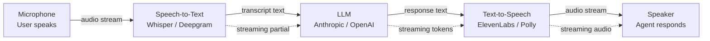

# Voice AI Pipeline — STT → LLM → TTS Agents

**Level**: 🟡 Intermediate
**Reading Time**: 12 minutes

> Text-based chatbots have a 40% drop-off rate on mobile. Voice reduces friction to near zero — you just talk. But every 100ms of added latency above 500ms is perceptible, and every dropped word in transcription is a broken user experience.

## 🗺️ Quick Overview



*The classic pipeline: STT → LLM → TTS. Streaming at each stage minimizes time-to-first-audio. Total latency target: under 1500ms end-to-end for acceptable voice UX.*

## The Problem

Human conversation has a natural latency expectation: a 200-400ms pause before responding feels normal. A 1000ms pause is noticeable. A 2000ms pause breaks the conversational flow and signals to the user that the system is struggling.

Building a voice AI pipeline that consistently achieves <1500ms end-to-end on real-world conditions (varied accents, background noise, network variability) requires understanding where each millisecond goes:

```
Latency budget (turn-based pipeline):
├── Silence detection (end of user speech): 300-500ms
├── STT processing: 150-300ms
├── LLM Time-to-First-Token (TTFT): 300-800ms
├── TTS generation for first audio chunk: 150-300ms
└── Audio playback buffering: 50-100ms
Total: 950ms - 2000ms
```

The hard part is the 300-800ms of LLM latency. Even with fast models, this is the dominant term at scale.

## Pipeline Components

### STT (Speech-to-Text)

```python
import anthropic
import httpx
import asyncio
from pathlib import Path

# Option 1: OpenAI Whisper (self-hosted, Python)
async def transcribe_with_whisper(audio_path: str) -> str:
    """Transcribe using local Whisper model."""
    import whisper
    model = whisper.load_model("base")  # tiny/base/small/medium/large
    result = model.transcribe(audio_path)
    return result["text"]

# Option 2: Deepgram streaming STT (production recommended)
async def transcribe_streaming_deepgram(audio_stream) -> str:
    """Real-time transcription with Deepgram Nova-2."""
    from deepgram import DeepgramClient, LiveOptions

    deepgram = DeepgramClient(api_key="your-deepgram-key")
    transcript_parts = []

    connection = deepgram.listen.live.v("1")

    def on_message(self, result, **kwargs):
        sentence = result.channel.alternatives[0].transcript
        if result.is_final:
            transcript_parts.append(sentence)

    connection.on(LiveTranscriptionEvents.Transcript, on_message)

    options = LiveOptions(
        model="nova-2",
        language="en-US",
        smart_format=True,
        interim_results=True,
        endpointing=300,  # ms of silence to detect end of speech
    )

    connection.start(options)
    async for chunk in audio_stream:
        connection.send(chunk)

    connection.finish()
    return " ".join(transcript_parts)
```

### LLM Processing with Streaming

```python
async def process_with_llm_streaming(transcript: str, history: list):
    """Stream LLM response to minimize TTFT."""
    client = anthropic.Anthropic()

    # Keep conversation history for multi-turn
    history.append({"role": "user", "content": transcript})

    full_response = ""
    sentence_buffer = ""

    with client.messages.stream(
        model="claude-haiku-4-5",  # Haiku for lower latency, Sonnet for quality
        max_tokens=500,
        system="You are a helpful voice assistant. Keep responses concise and conversational. Aim for 1-3 sentences.",
        messages=history,
    ) as stream:
        for text_chunk in stream.text_stream:
            full_response += text_chunk
            sentence_buffer += text_chunk

            # Yield complete sentences for TTS (don't wait for full response)
            if any(sentence_buffer.endswith(p) for p in ['. ', '! ', '? ', '.\n']):
                yield sentence_buffer
                sentence_buffer = ""

    # Yield any remaining text
    if sentence_buffer:
        yield sentence_buffer

    history.append({"role": "assistant", "content": full_response})
```

### TTS (Text-to-Speech)

```python
# Option 1: ElevenLabs (highest quality, lowest latency commercial)
async def synthesize_elevenlabs_streaming(text: str):
    """Stream TTS audio from ElevenLabs."""
    import elevenlabs
    from elevenlabs.client import ElevenLabs

    client = ElevenLabs(api_key="your-elevenlabs-key")

    audio_stream = client.text_to_speech.convert_as_stream(
        voice_id="pNInz6obpgDQGcFmaJgB",  # Adam voice
        text=text,
        model_id="eleven_turbo_v2_5",  # Lowest latency model
        output_format="mp3_22050_32",
    )

    for chunk in audio_stream:
        yield chunk  # Stream to speaker immediately


# Option 2: OpenAI TTS (good quality, simple API)
async def synthesize_openai_tts(text: str) -> bytes:
    from openai import OpenAI
    client = OpenAI()
    response = client.audio.speech.create(
        model="tts-1",  # tts-1 = fast, tts-1-hd = high quality
        voice="alloy",  # alloy, echo, fable, onyx, nova, shimmer
        input=text,
        speed=1.0
    )
    return response.read()


# Option 3: Amazon Polly (good for AWS deployments)
async def synthesize_polly(text: str) -> bytes:
    import boto3
    polly = boto3.client('polly')
    response = polly.synthesize_speech(
        Engine='neural',
        LanguageCode='en-US',
        OutputFormat='mp3',
        Text=text,
        VoiceId='Joanna'
    )
    return response['AudioStream'].read()
```

### Full End-to-End Pipeline

```python
import asyncio
import time

async def voice_pipeline(audio_input: bytes, conversation_history: list) -> bytes:
    """Complete STT → LLM → TTS pipeline with timing."""
    timings = {}

    # Stage 1: STT
    t0 = time.monotonic()
    transcript = await transcribe_with_whisper_or_deepgram(audio_input)
    timings['stt_ms'] = int((time.monotonic() - t0) * 1000)

    # Stage 2 + 3: Stream LLM → pipe to TTS sentence by sentence
    t1 = time.monotonic()
    audio_chunks = []
    first_audio_received = False

    async for sentence in process_with_llm_streaming(transcript, conversation_history):
        # TTS each sentence as it arrives (pipelining)
        t_tts = time.monotonic()
        audio_chunk = await synthesize_elevenlabs_streaming(sentence)
        audio_chunks.append(audio_chunk)

        if not first_audio_received:
            timings['ttfa_ms'] = int((time.monotonic() - t1) * 1000)  # time to first audio
            first_audio_received = True

    timings['total_ms'] = int((time.monotonic() - t0) * 1000)

    print(f"Pipeline timings: {timings}")
    # Expected: {'stt_ms': 200, 'ttfa_ms': 650, 'total_ms': 1800}

    # Concatenate all audio chunks
    return b"".join(audio_chunks)
```

## OpenAI Realtime API

OpenAI's Realtime API (October 2024) takes a different approach: instead of separate STT/LLM/TTS components, a single WebSocket connection handles everything:

```python
import websockets
import json
import asyncio

async def openai_realtime_voice():
    """Single WebSocket connection for full duplex voice."""
    uri = "wss://api.openai.com/v1/realtime"
    headers = {
        "Authorization": f"Bearer {OPENAI_API_KEY}",
        "OpenAI-Beta": "realtime=v1"
    }

    async with websockets.connect(uri, extra_headers=headers) as ws:
        # Configure session
        await ws.send(json.dumps({
            "type": "session.update",
            "session": {
                "modalities": ["text", "audio"],
                "instructions": "You are a helpful voice assistant.",
                "voice": "alloy",
                "input_audio_format": "pcm16",
                "output_audio_format": "pcm16",
                "input_audio_transcription": {"model": "whisper-1"},
                "turn_detection": {
                    "type": "server_vad",  # Server detects when user stops speaking
                    "threshold": 0.5,
                    "silence_duration_ms": 500
                }
            }
        }))

        async def send_audio(audio_stream):
            """Send audio chunks as they arrive."""
            async for chunk in audio_stream:
                await ws.send(json.dumps({
                    "type": "input_audio_buffer.append",
                    "audio": base64.b64encode(chunk).decode()
                }))

        async def receive_events():
            """Handle incoming events (audio, text, etc)."""
            async for message in ws:
                event = json.loads(message)
                if event["type"] == "response.audio.delta":
                    # Stream audio to speaker
                    audio_data = base64.b64decode(event["delta"])
                    play_audio_chunk(audio_data)
                elif event["type"] == "response.text.delta":
                    print(event["delta"], end="", flush=True)
                elif event["type"] == "input_audio_buffer.speech_stopped":
                    print("\n[User stopped speaking]")

        await asyncio.gather(send_audio(microphone_stream()), receive_events())
```

**OpenAI Realtime API advantages**:
- Latency: ~500ms vs ~1200ms for separate STT/LLM/TTS
- Built-in interruption handling (user can interrupt agent mid-sentence)
- Server-side Voice Activity Detection (VAD)
- No audio format conversion overhead

**Disadvantages**: Locked to OpenAI models, more expensive ($0.06/min input + $0.24/min output audio).

## Latency Budget Breakdown

| Stage | Technology | P50 | P99 | Optimization |
|-------|-----------|-----|-----|-------------|
| Silence detection | VAD | 200ms | 600ms | Reduce silence threshold (300ms vs 800ms) |
| STT | Deepgram Nova-2 streaming | 150ms | 400ms | Use streaming, not batch |
| LLM TTFT | Claude Haiku | 300ms | 900ms | Haiku over Sonnet saves 200-400ms |
| TTS first chunk | ElevenLabs Turbo | 150ms | 400ms | Turbo model, stream by sentence |
| Network round trips | CDN proximity | 50ms | 200ms | Deploy near users |
| **Total (pipeline)** | | **850ms** | **2500ms** | |
| **Total (Realtime API)** | OpenAI | **400ms** | **800ms** | Single WebSocket |

## Turn-Based vs Real-Time

| Dimension | Turn-Based | Real-Time (WebSocket) |
|-----------|------------|----------------------|
| Latency | 800-2000ms | 300-600ms |
| Interruption handling | Manual (complex) | Built-in |
| Architecture complexity | Moderate | Lower (single WS) |
| Provider flexibility | Any LLM + any TTS | Locked to provider |
| Cost | ~$0.02-0.10/minute | ~$0.30/minute (OpenAI) |
| Control | Full | Limited |
| Best for | Custom models, cost-sensitive | Low latency, simplicity |

## Voice-Specific Challenges

### Barge-In (Interruption Handling)

User speaks while agent is talking. Most critical for natural conversation:

```python
class InterruptionManager:
    def __init__(self):
        self.agent_speaking = False
        self.interrupt_threshold = 0.6  # VAD confidence threshold

    async def handle_audio_input(self, audio_chunk: bytes, vad_score: float):
        if self.agent_speaking and vad_score > self.interrupt_threshold:
            # User is speaking while agent is talking — interrupt
            await self.stop_agent_speaking()
            await self.clear_audio_buffer()
            print("[INTERRUPTION] User spoke, stopping agent")

    async def stop_agent_speaking(self):
        self.agent_speaking = False
        # Signal TTS to stop streaming
        # Clear audio playback queue
```

### Silence Detection (End-of-Turn)

When did the user finish speaking?

- Too aggressive (200ms): cuts off users mid-sentence
- Too conservative (1000ms): adds 1 second latency to every turn
- Sweet spot: 300-500ms for most use cases
- Use VAD (Voice Activity Detection) + energy-based detection together

### Filler Words and Disfluencies

Whisper transcribes "um", "uh", "like" literally. Filter them:

```python
FILLER_WORDS = ["um", "uh", "like", "you know", "sort of", "kind of", "basically"]

def clean_transcript(transcript: str) -> str:
    words = transcript.split()
    cleaned = [w for w in words if w.lower() not in FILLER_WORDS]
    return " ".join(cleaned)
```

## Provider Comparison

| Provider | Type | Latency | Quality | Cost/Hour | Notes |
|----------|------|---------|---------|-----------|-------|
| **Deepgram Nova-2** | STT streaming | 150ms | Very good | $0.26 | Best streaming STT |
| **Whisper (OpenAI)** | STT batch | 1-3s | Excellent | $0.36 | Batch only via API |
| **Whisper (self-hosted)** | STT local | 500ms-2s | Excellent | Free | GPU required |
| **Azure STT** | STT streaming | 200ms | Good | $0.30 | Good for Azure users |
| **ElevenLabs Turbo v2.5** | TTS streaming | 150ms | Best quality | $11/million chars | Voice cloning available |
| **OpenAI TTS-1** | TTS | 300ms | Good | $15/million chars | Simple API |
| **Amazon Polly Neural** | TTS | 200ms | Good | $4/million chars | Best cost |
| **Kokoro-82M** | TTS local | 100ms | Good | Free | Open-source, GPU |
| **OpenAI Realtime API** | STT+LLM+TTS | 400ms | Good | $0.30/min | Full duplex |

## Use Cases

- **Customer service**: Tier-1 support agents. 78% of customer queries resolved by voice AI (no human required)
- **Voice assistants**: Smart home, car, accessibility assistants
- **Meeting bots**: Automated meeting transcription and Q&A (Otter.ai, Fireflies)
- **Healthcare**: Patient intake, symptom checking (Nabla, Nuance)
- **Accessibility**: Screen reader replacement for visually impaired users
- **Language learning**: Pronunciation feedback, conversation practice

## Common Mistakes

1. **Using Whisper batch API instead of streaming STT**: OpenAI's Whisper API is batch processing — you upload the full audio file and wait. For <300ms STT latency, you need a streaming STT provider (Deepgram, Azure, AssemblyAI). Whisper self-hosted can stream.

2. **Waiting for full LLM response before starting TTS**: This adds 300-500ms of unnecessary latency. Start TTS as soon as the LLM produces the first complete sentence. Pipeline the stages.

3. **No interruption handling**: Users will speak while the agent is talking. Without barge-in detection, the agent finishes its response and then processes the interruption as a new turn — terrible UX. Implement VAD-based interruption.

4. **Fixed silence detection threshold**: 500ms works for English, quiet environments. Background noise, non-native speakers, and natural speech pauses require adaptive VAD. Don't hardcode the silence threshold.

5. **Not compressing audio**: Sending uncompressed PCM audio (2 bytes/sample × 16kHz = 32 KB/s) wastes bandwidth. Use MP3/Opus encoding (4-8 KB/s). ElevenLabs supports mp3_22050_32 format which cuts bandwidth by 4x.

## Key Takeaways

- Voice pipeline latency target: <1500ms end-to-end for acceptable UX; <800ms for natural conversation feel
- Three-stage pipeline: STT (~200ms) + LLM TTFT (~400ms) + TTS first chunk (~200ms) = ~800ms minimum
- Pipeline the stages: start TTS as soon as the first sentence arrives from LLM — don't wait for full response
- OpenAI Realtime API achieves ~400ms via single WebSocket — best latency, but locks you to OpenAI and costs 3-10x more than separate components
- Deepgram Nova-2 is the leading streaming STT ($0.26/hr); ElevenLabs Turbo v2.5 is leading TTS quality ($11/million chars); Kokoro-82M for free self-hosted TTS
- Interruption handling is not optional for production voice — implement VAD-based barge-in detection
- Silence detection sweet spot: 300-500ms; adjust for use case (300ms for quick Q&A, 500ms for natural conversation)

## References

> 📚 [OpenAI Realtime API Documentation](https://platform.openai.com/docs/guides/realtime) — Full duplex voice API guide

> 📚 [Deepgram Nova-2 Streaming STT](https://developers.deepgram.com/docs/getting-started-with-live-streaming-audio) — Streaming transcription documentation

> 📚 [ElevenLabs TTS API](https://elevenlabs.io/docs/api-reference/text-to-speech) — Text-to-speech with streaming and voice cloning

> 📖 [Kokoro-82M Open Source TTS](https://github.com/hexgrad/kokoro) — Free self-hosted high-quality TTS model

> 📺 [Building Real-Time Voice Agents](https://www.youtube.com/watch?v=fkZEMO_oVg4) — End-to-end voice pipeline tutorial

> 📖 [Whisper: Robust Speech Recognition](https://arxiv.org/abs/2212.04356) — OpenAI's Whisper paper and model details
