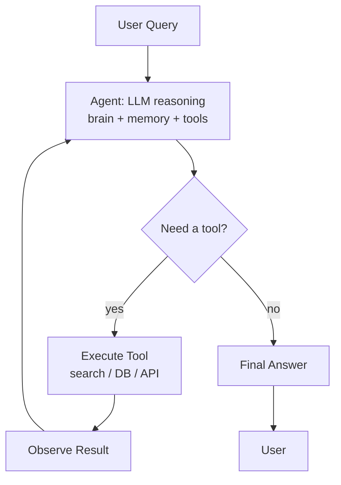
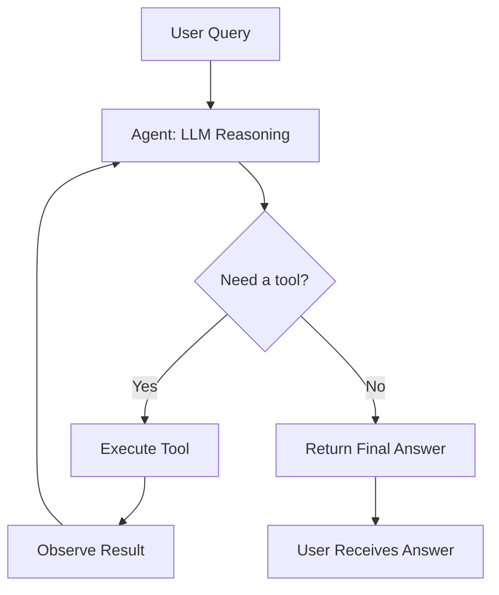

# What is an AI Agent?

**Level**: 🟢 Beginner
**Reading Time**: 8 minutes

> A chatbot responds to what you say. An agent acts on what you need — and keeps going until it's done.

## 🗺️ Quick Overview



*An agent combines an LLM brain, memory, tools, and an action loop — cycling until the task is done rather than stopping after one response.*

## The Problem

A plain LLM call is stateless and single-turn: you send a prompt, you get back text. That's fine for summarization or Q&A. But what about a task like: "Research the top 5 competitors to our product, write a comparison table, and save it to our Notion workspace"?

That requires multiple steps, external data, and side effects. A single LLM prompt can't do that. You need something that can loop, reason about progress, use tools, and track state. You need an agent.

## What Makes Something an Agent

An AI agent has four components working together:

1. **LLM (brain)** — the reasoning engine. It reads the current state and decides what to do next.
2. **Memory** — what the agent remembers across steps (conversation history, retrieved documents, accumulated results).
3. **Tools** — functions the agent can call (web search, code execution, database queries, API calls).
4. **Action loop** — the cycle that keeps running until the task is complete.

A chatbot has #1 and sometimes #2. An agent has all four.

## The Sense-Plan-Act Loop

Every agent, from simple to complex, runs a version of this loop:



The agent doesn't just call a tool once — it loops. It looks at the tool result, decides if it has enough information, and either calls another tool or gives a final answer.

## How It Works Step by Step

Imagine the query: "What is the current stock price of Apple and how does it compare to last week?"

```
Step 1:
  LLM reads query
  Decides: I need to call stock_price_tool("AAPL")
  → Tool returns: $185.30 (today)

Step 2:
  LLM sees result
  Decides: I also need last week's price
  → Tool call: stock_price_tool("AAPL", date="7 days ago")
  → Tool returns: $179.10

Step 3:
  LLM now has both numbers
  Decides: I have enough information to answer
  → Returns: "Apple is currently at $185.30, up $6.20 (3.5%) from last week's $179.10"
```

The key insight: the LLM decides when it has enough information. You don't pre-program the steps.

## Pseudocode: The Agent Loop

```
function runAgent(userQuery, tools, maxSteps):
  context = [systemPrompt, HumanMessage(userQuery)]

  for step in 1..maxSteps:
    response = LLM.generate(context)

    if response.type == FINAL_ANSWER:
      return response.text

    if response.type == TOOL_CALL:
      tool = tools.find(response.toolName)
      if tool is null:
        context.append(ToolError("Unknown tool: " + response.toolName))
        continue

      result = tool.execute(response.toolArgs)
      context.append(AIMessage(response))
      context.append(ToolResult(response.toolCallId, result))

  raise MaxStepsExceeded("Agent did not finish in " + maxSteps + " steps")
```

The loop is simple. The power comes from the LLM's ability to reason about what tool to call next and when it's done.

## Agent vs Chatbot: The Key Differences

| Dimension | Chatbot | Agent |
|-----------|---------|-------|
| Turns | Single response | Multiple steps |
| State | Stateless (usually) | Stateful — accumulates results |
| Side effects | None | Can call APIs, write files, send messages |
| Loops | No | Yes — runs until task done |
| Tool use | Rare / limited | Core feature |
| Failure modes | Hallucination | Hallucination + runaway loops + tool errors |

## Real-World Examples

**GitHub Copilot Workspace**: When you ask it to implement a feature, it doesn't just write code. It reads your codebase, plans steps, edits multiple files, and checks for errors — all in a loop.

**Claude Code** (this tool): Given "add a new API endpoint", it reads existing files, understands patterns, writes new code, updates tests, and commits — using file read/write/execute tools in a loop.

**ChatGPT with browsing**: Given "what's the news today?", it searches the web, reads articles, synthesizes across sources, and gives you a summary. Multiple tool calls, one final answer.

**Devin (AI software engineer)**: Claimed to close GitHub issues end-to-end — read issue, clone repo, write code, run tests, create PR. Pure agentic loop.

## When to Use an Agent vs a Simple LLM Call

Not everything needs an agent. Agents add latency, cost, and complexity.

Use a **simple LLM call** when:
- The answer can come from training data or a single context injection
- No external data or actions needed
- Single-turn is sufficient ("Summarize this text")

Use an **agent** when:
- The task requires multiple steps or unknown steps upfront
- You need to fetch real-time data (prices, weather, docs)
- You need side effects (write a file, send an email, update a database)
- The task requires planning and adaptation ("Research X and write a report")

## Common Pitfalls

1. **Using an agent when a simple prompt works**: Agents are slower and more expensive. Don't over-engineer.
2. **No max step limit**: Without a cap, a confused agent loops forever and burns your API budget.
3. **No error handling on tool results**: If a tool returns an error, the agent needs to handle it gracefully — not just retry infinitely.
4. **Trusting agent output blindly**: Agents can hallucinate tool call arguments or misinterpret tool results. Validate outputs.
5. **Stateless tool design**: Tools that have no side effects are safer and more repeatable. Prefer idempotent tools.

## Key Takeaways

- An agent = LLM + tools + memory + action loop
- The defining feature is the loop: the agent decides what to do next at each step
- Chatbots respond; agents act
- Every agent runs a sense-plan-act cycle until the task is complete or a step limit is hit
- Use agents only when a task genuinely requires multiple steps, real-time data, or side effects
- Always set a maximum step count to prevent runaway loops
