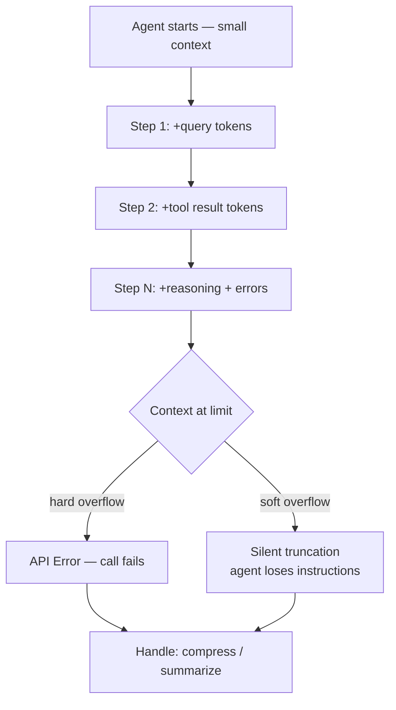
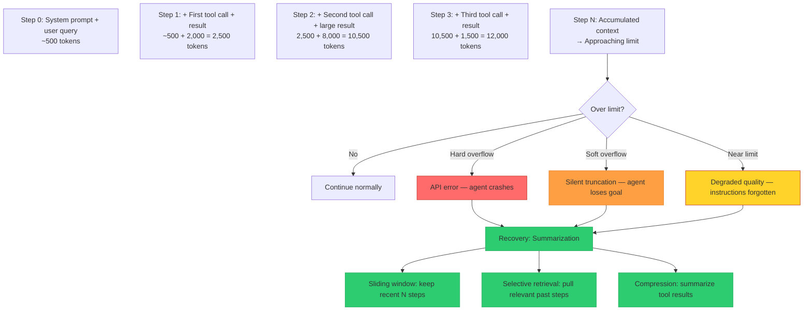

# Context Window Overflow

**Level**: 🟡 Intermediate
**Reading Time**: 15 minutes

> A context window is a buffer. Like all buffers, it fills up. The question is what happens when it does.

## 🗺️ Quick Overview



*Tool results and reasoning steps accumulate until the model limit is hit; without proactive management the agent crashes or silently degrades.*

---

## The Problem Class `[Agent Reliability — Severity: High]`

Every LLM has a finite context window — the total number of tokens it can process in a single call. For simple Q&A, this limit is rarely an issue. But agents are different: they accumulate history. Each step in the agent loop adds:

- The user's original query
- All previous tool calls and their arguments
- All tool results (which can be large — entire web pages, database query results, file contents)
- All LLM reasoning steps
- All error messages

A long-running agent will always hit the context limit eventually. The question is whether you handle it gracefully or let it fail silently.

---

## How It Manifests

### Hard overflow — explicit error

The cleanest failure: the API returns an error when the total tokens exceed the model's limit.

```
Error: This model's maximum context length is 128000 tokens.
Your request has 134,521 tokens (128,521 in messages, 6,000 max_tokens).
Please reduce the length of the messages.
```

This is recoverable because you know exactly what happened.

### Soft overflow — silent truncation

Some models and frameworks silently truncate older messages when the context fills. This is more dangerous because:

- The agent loses its original instructions (system prompt truncated from the front)
- It loses early context about the task goal
- It may lose the user's query entirely
- It continues generating responses that don't relate to the original task

**Symptom**: Agent starts giving answers unrelated to the original question, or violates its own stated plan from earlier steps.

### Degraded quality before hard overflow

Even before hitting the hard limit, context length degrades model performance. Models trained on sequences up to N tokens perform worse on inputs that approach N — "lost in the middle" is a documented phenomenon where facts buried in a long context are reliably forgotten.

**Symptom**: Agent forgets constraints stated early in the conversation, stops following instructions given in the system prompt, or loses track of sub-goals established in earlier steps.

---

## Token Accumulation Over Agent Steps



---

## Detection Strategy

### Count tokens before every LLM call

Don't wait for the API to error. Count proactively:

```javascript
import { encoding_for_model } from 'tiktoken';

const enc = encoding_for_model('gpt-4o');

function countTokens(messages) {
  return messages.reduce((total, msg) => {
    return total + enc.encode(msg.content).length + 4; // 4 for role/metadata overhead
  }, 0);
}

async function agentStep(context, tools) {
  const tokenCount = countTokens(context.messages);
  const limit = context.modelLimit; // e.g., 128000

  const utilizationPct = tokenCount / limit;

  if (utilizationPct > 0.9) {
    console.warn(`Context at ${(utilizationPct * 100).toFixed(0)}% — triggering compression`);
    context = await compressContext(context);
  }

  if (utilizationPct > 0.95) {
    console.error('Context critically full — forcing summarization');
    context = await summarizeAndReset(context);
  }

  return llm.generate(context);
}
```

### Context utilization thresholds

| Utilization | Action |
|-------------|--------|
| < 50% | Normal operation |
| 50–75% | Monitor; start compressing large tool results |
| 75–90% | Trigger proactive summarization of early steps |
| 90–95% | Sliding window — drop oldest non-critical messages |
| > 95% | Emergency: summarize everything, keep only goal + recent 3 steps |

---

## Mitigation Strategies

### 1. Proactive summarization

When context reaches a threshold, summarize older steps into a compact representation:

```javascript
async function summarizeOldSteps(messages, keepRecentN = 5) {
  const systemMessage = messages.find(m => m.role === 'system');
  const recentMessages = messages.slice(-keepRecentN);
  const olderMessages = messages.slice(1, -keepRecentN); // Exclude system prompt

  if (olderMessages.length === 0) return messages;

  const summary = await llm.generate({
    system: "Summarize the following agent conversation steps into a compact representation. Preserve: key findings, decisions made, data collected, errors encountered. Discard: verbose tool outputs, intermediate reasoning that led to dead ends.",
    user: olderMessages.map(m => `${m.role}: ${m.content}`).join('\n')
  });

  return [
    systemMessage,
    { role: 'assistant', content: `[Summary of earlier steps]: ${summary}` },
    ...recentMessages
  ];
}
```

### 2. Sliding window — keep recent N messages

The simplest approach: always keep only the last N messages plus the system prompt and original user query:

```javascript
function applyContextWindow(messages, maxMessages = 20) {
  const systemMessages = messages.filter(m => m.role === 'system');
  const userInitialQuery = messages.find(m => m.role === 'user');
  const recentMessages = messages.slice(-maxMessages);

  // Ensure system prompt and original query are never dropped
  const required = [...systemMessages];
  if (!recentMessages.includes(userInitialQuery)) {
    required.push(userInitialQuery);
  }

  return [...required, ...recentMessages.filter(m => !required.includes(m))];
}
```

**Tradeoff**: The agent loses access to early discoveries. For tasks where all historical context matters (debugging a long workflow), this causes the agent to re-discover things it already found.

### 3. Compress large tool results at ingestion

The biggest contributors to context bloat are tool results that return large payloads — full web pages, entire file contents, large SQL query results. Compress these at the point of ingestion:

```javascript
async function ingestToolResult(toolName, result) {
  const resultTokens = countTokens([{ content: JSON.stringify(result) }]);

  // If result is > 2000 tokens, compress before injecting
  if (resultTokens > 2000) {
    const compressed = await llm.generate({
      system: "Extract only the facts relevant to the current task. Discard formatting, boilerplate, and irrelevant sections. Output should be under 500 tokens.",
      user: `Task context: ${currentTask}\n\nTool result to compress:\n${JSON.stringify(result)}`
    });
    return { content: compressed, note: `[Compressed from ${resultTokens} to ~500 tokens]` };
  }

  return result;
}
```

### 4. Selective retrieval from vector store (long-running agents)

For agents that run over many steps or across multiple sessions, store historical steps in a vector database and retrieve only the relevant ones:

```javascript
// On each step, store result in vector store
async function storeStepResult(step, result, vectorStore) {
  await vectorStore.upsert({
    id: `step-${step.id}`,
    vector: await embedText(JSON.stringify(result)),
    metadata: { step: step.id, toolName: step.toolName, timestamp: Date.now() }
  });
}

// Before each LLM call, retrieve relevant past steps
async function retrieveRelevantContext(currentGoal, vectorStore, topK = 3) {
  const relevant = await vectorStore.search(currentGoal, { topK });
  return relevant.map(r => r.metadata);
}
```

---

## Real Example: LangChain Agent Context Accumulation

A common production issue with LangChain's `AgentExecutor`: each tool call appends the full tool output to the chat history. When searching the web, results can be 5,000–20,000 tokens per call. After 5 searches, the context is at 25,000–100,000 tokens — rapidly approaching GPT-4's 128k limit.

Teams that hit this typically add `trim_messages` middleware to their LangChain chains, but the default behavior has no trimming. The fix: set `max_iterations` low (10–15) and add a `return_intermediate_steps=False` option to avoid accumulating verbose intermediate outputs in the final context.

**Claude Code's approach**: This tool (Claude Code) uses a sliding-window summarization approach — when context approaches the limit, earlier conversation turns are summarized into compact "prior context" entries. The system prompt and most recent turns are always preserved in full.

---

## Prevention Checklist

- [ ] Token counting implemented before every LLM call in the agent loop
- [ ] Context utilization logged as a metric per agent run
- [ ] Proactive summarization triggered at 75% context utilization
- [ ] Large tool results (> 2000 tokens) compressed before injection into context
- [ ] System prompt and original user query pinned — never eligible for dropping
- [ ] `max_steps` set low enough that typical runs don't fill context
- [ ] Sliding window implemented as fallback for near-overflow situations
- [ ] Vector store used for agents with > 20 expected steps or multi-session memory
- [ ] Alert when any agent run exceeds 60% context utilization (early warning)

---

## Related Failures

- [Cost Runaway](./cost-runaway) — Large contexts multiply token cost at every step
- [Infinite Loops & Cycles](./infinite-loops) — Long loops fill context faster than normal execution
- [Tool Call Failures](./tool-call-failures) — Accumulated error messages are a major source of context bloat
