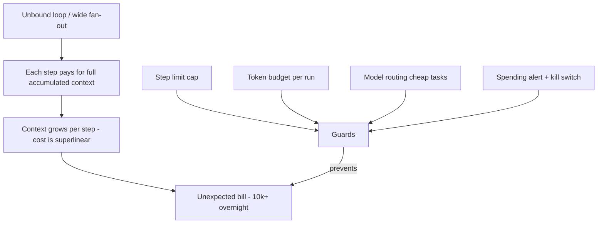
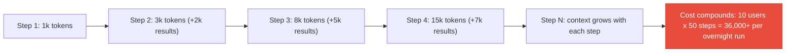

# Cost Runaway & Token Budget Exhaustion

**Level**: 🟡 Intermediate
**Reading Time**: 17 minutes

> An agent that loops 200 times instead of 20 doesn't cost 10× more — it costs 100× more, because each step pays for the entire accumulated context.

## 🗺️ Quick Overview



*Agent costs compound because every step re-sends the entire accumulated context; hard caps and alerts stop runaway before the bill arrives.*

---

## The Problem Class `[Agent Cost — Severity: High]`

A single LLM API call costs fractions of a cent. An agent loop that runs 50 steps with an accumulated 100k-token context costs orders of magnitude more — and if multiple users trigger such loops concurrently, a single night of runaway agents can generate a bill that shocks even well-funded teams.

Unlike most infrastructure costs that scale linearly, agent costs have a superlinear property: each step must send the entire accumulated context, so cost per step grows as the run continues. A loop that can't terminate doesn't just burn tokens — it burns an exponentially growing number of tokens per additional step.

---

## The Cost Compounding Problem



At GPT-4o pricing (~\$2.50/1M input tokens), a 50-step loop with a 100k accumulated context costs approximately \$12.50 per agent run. That's manageable for 10 runs per day. It's \$12,500/day for 1,000 runs.

---

## Primary Causes of Cost Runaway

### 1. Infinite or unbound loops

The most catastrophic cause. An agent without a `max_steps` guard that encounters an unresolvable situation will loop until you manually intervene or hit your API provider's rate limits. See: [Infinite Loops & Cycles](./infinite-loops).

**Cost profile**: Exponential. Each new step costs more than the previous one.

### 2. High fan-out in parallel agents

A "map-reduce" pattern where one orchestrator spawns N parallel sub-agents:

```
Orchestrator: "Analyze these 500 customer reviews"
→ Spawns 500 parallel sub-agents, one per review
→ Each sub-agent: 5 steps × 10k tokens = 50k tokens
→ Total: 500 × 50k = 25M tokens = $62.50 per run
→ Run this hourly: $1,500/day
```

The fan-out multiplier turns a manageable per-run cost into an unmanageable aggregate.

### 3. Passing full context to every parallel step

When parallel agents share context unnecessarily:

```javascript
// Bad: each parallel agent gets the entire 50k-token shared context
await Promise.all(reviews.map(review =>
  runAgent({ context: fullSharedContext, task: review })
));

// Better: each parallel agent gets only what it needs
await Promise.all(reviews.map(review =>
  runAgent({ context: minimalContext, task: review })
));
```

### 4. Retry storms on expensive models

Using a powerful (expensive) model for retries when a cheap model would detect the error:

```javascript
// Bad: retries on GPT-4o even when error is a simple format issue
async function callWithRetry(prompt) {
  for (let i = 0; i < 5; i++) {
    try {
      return await gpt4o.generate(prompt); // $10/1M tokens
    } catch (e) {
      continue; // Retry on same expensive model
    }
  }
}
```

### 5. No caching of repeated sub-tasks

An agent that answers the same question 10 times in one run pays for 10 LLM calls instead of 1:

```
Step 3: What is the current date? → LLM call ($0.001)
Step 7: What is the current date? → LLM call ($0.001)  [same question]
Step 12: What is the current date? → LLM call ($0.001) [same question]
```

---

## Cost Accumulation by Agent Pattern

| Pattern | Cost Profile | Risk Level |
|---------|-------------|------------|
| Simple single-agent, 10 steps | Low, linear | Low |
| Agent with web fetch (large results) | Medium — context grows fast | Medium |
| Retry loop (unclassified errors) | High — each retry re-processes full context | High |
| Parallel fan-out (100+ agents) | Very high — N × per-agent cost | High |
| Infinite loop | Catastrophic — exponential + no cap | Critical |
| Multi-agent with shared context | Very high — full context passed at each hop | High |

---

## Monitoring & Detection

### Real-time cost tracking

```javascript
class AgentCostTracker {
  constructor(perRunBudget, perDayBudget) {
    this.perRunBudget = perRunBudget;
    this.perDayBudget = perDayBudget;
    this.runCost = 0;
    this.dailyCost = getDailyAccumulator(); // Persistent across runs
  }

  // Call before each LLM invocation
  async checkBudget(estimatedTokens, model) {
    const estimatedCost = estimateCallCost(estimatedTokens, model);

    if (this.runCost + estimatedCost > this.perRunBudget) {
      throw new BudgetExceededError(
        `Run budget $${this.perRunBudget} would be exceeded. ` +
        `Current: $${this.runCost.toFixed(4)}, Estimated call: $${estimatedCost.toFixed(4)}`
      );
    }

    if (this.dailyCost + estimatedCost > this.perDayBudget) {
      throw new DailyBudgetExceededError(
        `Daily budget $${this.perDayBudget} would be exceeded.`
      );
    }
  }

  recordActualCost(inputTokens, outputTokens, model) {
    const cost = calculateCost(inputTokens, outputTokens, model);
    this.runCost += cost;
    this.dailyCost += cost;

    // Alert at 80% of daily budget
    if (this.dailyCost > this.perDayBudget * 0.8) {
      sendAlert(`Daily AI cost at 80% of budget: $${this.dailyCost.toFixed(2)}`);
    }
  }
}
```

### Cost anomaly detection

```javascript
// Track rolling average cost per agent run
// Alert when a run exceeds 5× the rolling average
function detectCostAnomaly(currentRunCost, rollingAverage) {
  if (currentRunCost > rollingAverage * 5) {
    alert(`Anomalous agent run cost: $${currentRunCost.toFixed(2)} vs avg $${rollingAverage.toFixed(2)}`);
    return true;
  }
  return false;
}
```

---

## Mitigation & Prevention

### 1. Per-run hard cost cap

Set a maximum dollar amount per agent run. Abort the run gracefully when reached:

```javascript
const MAX_COST_PER_RUN = 0.50; // $0.50 per run maximum

async function runAgent(task, { maxCost = MAX_COST_PER_RUN } = {}) {
  let totalCost = 0;

  for (let step = 0; step < MAX_STEPS; step++) {
    const estimatedCost = estimateNextCallCost(context);

    if (totalCost + estimatedCost > maxCost) {
      return {
        answer: 'Budget limit reached. Partial result: ...',
        cost: totalCost,
        incomplete: true
      };
    }

    const { response, inputTokens, outputTokens } = await llm.generate(context);
    totalCost += calculateCost(inputTokens, outputTokens);

    if (response.type === 'FINAL_ANSWER') {
      return { answer: response.text, cost: totalCost };
    }
  }
}
```

### 2. Cheap routing model for classification

Use the cheapest model for decisions that don't require deep reasoning (error classification, intent detection, routing):

```javascript
// Bad: use expensive model to decide if input is a simple greeting
const isGreeting = await gpt4o.classify(userInput);  // Overkill

// Good: use cheap fast model for classification
const isGreeting = await gpt4omini.classify(userInput);  // 10× cheaper

// Use expensive model only for complex reasoning
const complexAnalysis = await gpt4o.reason(fullContext);
```

**Rule of thumb**: Use the cheapest model that can reliably perform the task. For classification: `gpt-4o-mini` or `claude-haiku`. For complex multi-step reasoning: `gpt-4o` or `claude-sonnet`. For frontier tasks: `claude-opus` or `o3`.

### 3. Result caching

Cache LLM outputs for identical inputs within a run (and across runs for deterministic sub-tasks):

```javascript
const cache = new Map(); // Or Redis for cross-run caching

async function cachedLLMCall(prompt, { ttl = 3600 } = {}) {
  const key = hashPrompt(prompt);

  if (cache.has(key)) {
    metrics.increment('llm.cache_hit');
    return cache.get(key);
  }

  const result = await llm.generate(prompt);
  cache.set(key, result);
  metrics.increment('llm.cache_miss');
  return result;
}
```

Common cacheable sub-tasks: format validation, classification, entity extraction from the same document.

### 4. Fan-out budget — limit parallel agent count

```javascript
async function runParallelAgents(tasks, { maxParallel = 20, budgetPerTask = 0.10 } = {}) {
  // Hard cap on parallelism to limit peak cost
  const limit = pLimit(maxParallel);

  const results = await Promise.all(
    tasks.slice(0, 500).map(task =>  // Also cap total task count
      limit(() => runAgent(task, { maxCost: budgetPerTask }))
    )
  );

  return results;
}
```

### 5. Context compression to reduce per-step cost

Large contexts multiply cost at every step. Aggressive summarization of tool results keeps context lean:

```javascript
// Before injecting large tool result, compress it
async function ingestWithBudget(toolResult, maxTokens = 1000) {
  const tokens = countTokens(toolResult);
  if (tokens > maxTokens) {
    return await compress(toolResult, maxTokens);
  }
  return toolResult;
}
```

See: [Context Window Overflow](./context-overflow) for full compression strategies.

---

## Real Incidents

**Notion AI (2023)**: Internal reports of teams accidentally running batch AI jobs against their full document corpus with no per-run limits. A single misconfigured job processed 50,000 documents at 5 LLM calls each — 250,000 API calls overnight.

**AutoGPT open-source deployments**: Many early AutoGPT users reported accidentally generating \$50–\$500 bills overnight when the agent encountered an ambiguous task and looped trying to resolve it. The framework had no default cost cap.

**GPT-4-based coding agents**: Several companies building coding agents reported that agents instructed to "make all tests pass" would loop attempting increasingly complex fixes — each attempt re-reading large codebases. Without a step limit, a single failed test could trigger hours of looping.

The common thread: **no per-run budget cap** and **no max_steps guard**.

---

## Prevention Checklist

- [ ] Per-run cost cap set (`maxCost`) for every agent type — different caps for different task types
- [ ] Daily aggregate cost budget set with alerting at 50%, 80%, and 100%
- [ ] `max_steps` guard on every agent loop (primary protection against loops → cost)
- [ ] Cheap routing model used for classification, intent detection, error triage
- [ ] LLM result caching implemented for deterministic sub-tasks
- [ ] Tool results compressed to < 1000 tokens before context injection
- [ ] Parallel fan-out capped (max parallel agents per run)
- [ ] Cost logged as a metric per agent run (enables anomaly detection)
- [ ] Anomaly alert when run cost exceeds 5× rolling average
- [ ] Cost attribution per user/team for multi-tenant deployments
- [ ] Budget exhaustion returns a partial result with explanation — not a crash

---

## Related Failures

- [Infinite Loops & Cycles](./infinite-loops) — The primary mechanism of catastrophic cost runaway
- [Context Window Overflow](./context-overflow) — Large contexts are the multiplier that makes loops expensive
- [Tool Call Failures](./tool-call-failures) — Unclassified retry loops compound cost exponentially
