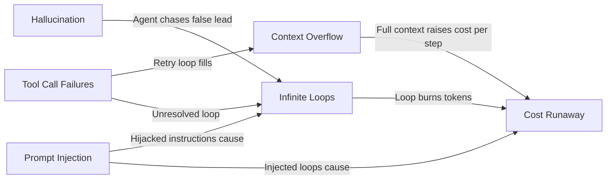

# Agent Workflow Failure Modes

Agents are more failure-prone than simple LLM calls because they run in loops, interact with external systems, and make decisions based on accumulated state. A single failure in step 3 can corrupt every downstream step. Some failures are invisible until the damage is done.

This section covers the six most common and highest-impact failure modes in production agent systems.

---

## Failure Mode Index

| Failure | Severity | Core Risk | Primary Defense |
|---------|----------|-----------|-----------------|
| [Tool Call Failures](./tool-call-failures) | 🟡 High | Retry spirals exhaust step budget | Error classification + targeted retry |
| [Hallucination in Agents](./hallucination-in-agents) | 🔴 Critical | Fabricated facts compound across steps | RAG grounding + schema enforcement |
| [Context Window Overflow](./context-overflow) | 🟡 High | Truncation causes silent quality loss | Token counting + proactive summarization |
| [Infinite Loops & Cycles](./infinite-loops) | 🔴 Critical | Budget exhaustion, no result delivered | `max_steps` + progress assertion |
| [Prompt Injection](./prompt-injection-agents) | 🔴 Critical | External content hijacks agent actions | Context labeling + sandboxed execution |
| [Cost Runaway](./cost-runaway) | 🟡 High | Exponential token spend overnight | Per-run cost cap + daily budget alert |

---

## Why Agent Failures Are Different

A single-call LLM failure is isolated: one bad response. An agent failure can:

1. **Compound** — A wrong fact in step 2 is used as ground truth in steps 3–10
2. **Act** — Unlike a chatbot, an agent can send emails, write files, make API calls based on wrong reasoning
3. **Loop** — Without a termination condition, agents run until you stop them manually or run out of budget
4. **Scale** — A bug in the agent logic affects every user who triggers that agent

---

## Failure Interaction Map

These failures often co-occur and amplify each other:

Addressing [Infinite Loops](./infinite-loops) and [Cost Runaway](./cost-runaway) first gives you a safety net that limits the blast radius of all other failures.

---

## Minimum Viable Safety Checklist

Before deploying any agent to production, verify:

- [ ] `max_steps` guard set (prevents infinite loops and limits cost)
- [ ] Per-run cost cap set (prevents overnight billing surprises)
- [ ] Tool call error classification implemented (prevents retry spirals)
- [ ] Token counting before each LLM call (prevents hard context overflow)
- [ ] External content labeled as `[UNTRUSTED DATA]` in context (prevents injection)
- [ ] High-impact actions require human approval after processing external content
- [ ] All failure modes produce a partial result with explanation — not a crash or hang

---

## Articles in This Section

- [Tool Call Failures & Retry Strategies](./tool-call-failures) — Error classification, exponential backoff, fallback tools
- [Hallucination in Agent Decisions](./hallucination-in-agents) — RAG grounding, schema enforcement, critic agents
- [Context Window Overflow](./context-overflow) — Token counting, summarization, sliding windows
- [Agent Infinite Loops & Cycles](./infinite-loops) — Progress detection, cycle detection, max steps
- [Prompt Injection in Agents](./prompt-injection-agents) — Attack vectors, sandboxing, defense layers
- [Cost Runaway & Token Budget Exhaustion](./cost-runaway) — Budget caps, model routing, caching
