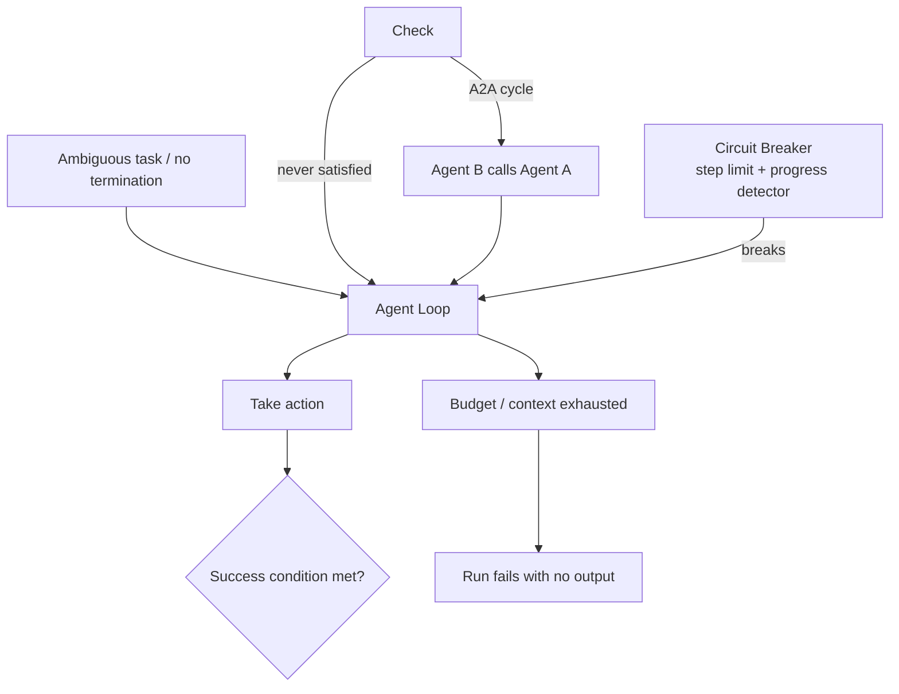
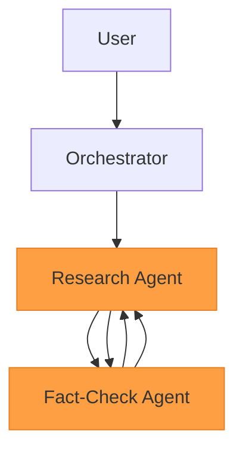
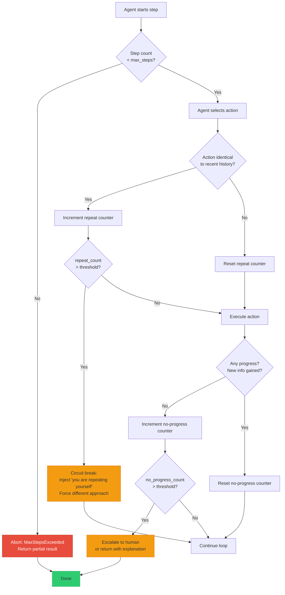

# Agent Infinite Loops & Cycles

**Level**: 🔴 Advanced
**Reading Time**: 18 minutes

> Every agent needs two things: a reason to keep going, and a reason to stop. Most bugs involve the second one.

## 🗺️ Quick Overview



*Single-agent self-loops and multi-agent cycles both exhaust budgets; circuit breakers and explicit termination conditions are the fix.*

---

## The Problem Class `[Agent Reliability — Severity: Critical]`

An agent loop is designed to continue until a task is complete. The problem arises when the agent cannot determine that the task is complete — or when it incorrectly believes it needs to keep working. The result is an infinite loop that burns token budget, accumulates context, drives up costs, and never delivers an answer.

Loops come in two forms:

1. **Single-agent self-loop**: One agent repeatedly calls the same tool or takes the same action because it can't detect that it's making no progress.
2. **Multi-agent cycle**: Agent A delegates to Agent B, which calls back to Agent A, which calls Agent B again — a cycle that can run indefinitely.

Both are catastrophic in production without circuit breakers.

---

## How Loops Form

### Root Cause 1: Ambiguous success criterion

The agent doesn't know what "done" looks like, so it keeps trying:

```
Goal: "Make sure the database is consistent"

Step 1: Check consistency → 3 inconsistencies found
Step 2: Fix inconsistency 1 → Fixed
Step 3: Check consistency → 2 inconsistencies remain (and 1 new one appeared)
Step 4: Fix inconsistency 2 → Fixed
Step 5: Check consistency → 2 inconsistencies remain (new ones keep appearing)
Step 6: Fix... (loop continues indefinitely)
```

The task as specified has no natural completion point. The agent is doing real work but can never satisfy the success condition.

### Root Cause 2: Missing termination condition in code

```javascript
// Bug: no max steps, no done check
async function runAgent(task) {
  let context = [systemPrompt, HumanMessage(task)];

  while (true) {  // ← no exit condition
    const response = await llm.generate(context);
    if (response.toolCall) {
      const result = await executeTool(response.toolCall);
      context.push(response, ToolResult(result));
      // Bug: never checks if agent said FINAL_ANSWER
    }
    // Bug: loop never exits
  }
}
```

### Root Cause 3: Multi-agent cycle with no coordinator



Research Agent asks Fact-Check Agent to verify a claim. Fact-Check Agent asks Research Agent for the source. Research Agent asks Fact-Check Agent to verify the source. Neither agent tracks that it's in a cycle.

### Root Cause 4: Repeated action without progress detection

```
Step 1: search_web("Python async tutorial")          → 10 results found
Step 2: search_web("Python async tutorial")          → same 10 results
Step 3: search_web("Python async tutorial")          → same 10 results
Step 4: search_web("Python async tutorial advanced") → 10 results found
Step 5: search_web("Python async tutorial")          → same 10 results
...
```

The agent never notices it already has this information. It lacks memory of what it's already fetched.

---

## Loop Detection Architecture



---

## Detection Implementation

### 1. Step counter (minimum viable protection)

```javascript
async function runAgent(task, { maxSteps = 20 } = {}) {
  let context = [systemPrompt, HumanMessage(task)];
  let steps = 0;

  while (steps < maxSteps) {
    steps++;
    const response = await llm.generate(context);

    if (response.type === 'FINAL_ANSWER') {
      return { answer: response.text, steps };
    }

    if (response.type === 'TOOL_CALL') {
      const result = await executeTool(response.toolCall);
      context.push(AIMessage(response), ToolResult(result));
    }
  }

  // Graceful exit instead of hanging forever
  return {
    answer: 'Reached step limit. Partial progress: ...',
    steps,
    incomplete: true
  };
}
```

### 2. Repeated action detection via hashing

```javascript
class ActionHistory {
  constructor(windowSize = 5) {
    this.history = [];
    this.windowSize = windowSize;
  }

  hash(toolName, args) {
    return `${toolName}:${JSON.stringify(args, Object.keys(args).sort())}`;
  }

  record(toolName, args) {
    this.history.push(this.hash(toolName, args));
    if (this.history.length > this.windowSize) {
      this.history.shift();
    }
  }

  isRepeating(toolName, args) {
    const h = this.hash(toolName, args);
    const recentCount = this.history.filter(x => x === h).length;
    return recentCount >= 2; // Seen same action twice in the window
  }

  hasCycle() {
    // Detect A→B→A→B pattern (not just exact repeats)
    if (this.history.length < 4) return false;
    const half = Math.floor(this.history.length / 2);
    const first = this.history.slice(0, half).join(',');
    const second = this.history.slice(half).join(',');
    return first === second;
  }
}
```

### 3. Progress assertion

Define "progress" concretely for your task type:

```javascript
function measureProgress(previousState, currentState) {
  return {
    // Did we collect new unique facts?
    newFactsGained: currentState.facts.size - previousState.facts.size,
    // Did we reduce the list of pending tasks?
    tasksCompleted: previousState.pending.length - currentState.pending.length,
    // Did any output artifact grow?
    outputGrown: currentState.output.length > previousState.output.length,
  };
}

function isProgressSufficient(progress) {
  return progress.newFactsGained > 0
    || progress.tasksCompleted > 0
    || progress.outputGrown;
}
```

If progress is insufficient for N consecutive steps, the agent is looping without advancing.

---

## Multi-Agent Cycle Prevention

### Pass a lineage trace

Every agent call should carry a lineage trace — the chain of agents that delegated to it. Any agent that sees itself in the lineage knows it's in a cycle:

```javascript
async function callAgent(agentName, task, lineage = []) {
  if (lineage.includes(agentName)) {
    throw new CycleDetectedError(
      `Cycle detected: ${[...lineage, agentName].join(' → ')}`
    );
  }

  return agents[agentName].run(task, {
    lineage: [...lineage, agentName]
  });
}

// Usage
await callAgent('FactCheck', { claim, source }, lineage=['Research', 'Orchestrator']);
// If FactCheck tries to call Research: lineage=['Research', 'Orchestrator', 'FactCheck']
// Research sees itself → throws CycleDetectedError
```

### Orchestrator-only delegation

Enforce a DAG topology: only the orchestrator can delegate, and sub-agents communicate only through the orchestrator:

```
Allowed:  Orchestrator → Research → (result back to Orchestrator)
Allowed:  Orchestrator → FactCheck → (result back to Orchestrator)
BLOCKED:  Research → FactCheck  (direct agent-to-agent call)
BLOCKED:  FactCheck → Research  (creates potential cycle)
```

### Max depth per agent

```javascript
const MAX_DELEGATION_DEPTH = 3;

async function runAgentWithDepth(task, depth = 0) {
  if (depth >= MAX_DELEGATION_DEPTH) {
    return { error: 'Max delegation depth reached', partialResult: getCurrentResult() };
  }

  // Pass depth+1 when calling sub-agents
  const subResult = await callSubAgent(subtask, { depth: depth + 1 });
}
```

---

## Real Example: LLM Agent Framework Loops

A well-documented production issue with AutoGPT-style agents: when given a vague goal like "research and summarize the latest AI news", the agent would:

1. Search for AI news
2. Read an article
3. Save it to memory
4. Decide it should find more articles
5. Search again (slightly different query)
6. Read another article
7. Decide it needs more articles to write a "comprehensive" summary
8. ... indefinitely

The agent never declared the task complete because it had no concrete completion criterion ("summary of N articles" or "after 10 minutes of research"). The fix: always define concrete completion conditions in the task specification, and add a hard step limit.

**OpenAI Swarm / Assistants API**: The Assistants API has a `max_prompt_tokens` and `max_completion_tokens` limit per run, and each `run` has an implicit step limit. These are safety valves, but they're set high by default (32k steps). Always override them with task-appropriate limits.

---

## Prevention Checklist

- [ ] Every agent run has an explicit `max_steps` set to a task-appropriate value (not framework default)
- [ ] Repeated action detection implemented — same tool + same args triggers intervention
- [ ] Progress assertion defined and checked every N steps
- [ ] Agent system prompt includes concrete success criteria ("task is complete when X")
- [ ] Multi-agent systems use lineage tracing to detect cycles
- [ ] Sub-agents cannot call peer agents directly — all delegation through orchestrator
- [ ] Max delegation depth enforced in multi-agent orchestration
- [ ] Loop detection triggers a human escalation rather than silent failure
- [ ] Step count and progress metrics logged per agent run for post-incident analysis

---

## Related Failures

- [Tool Call Failures](./tool-call-failures) — Retry spirals are a specialized form of single-tool loop
- [Cost Runaway](./cost-runaway) — Infinite loops are the primary cause of catastrophic cost overruns
- [Context Window Overflow](./context-overflow) — Long loops fill context before hitting max_steps
