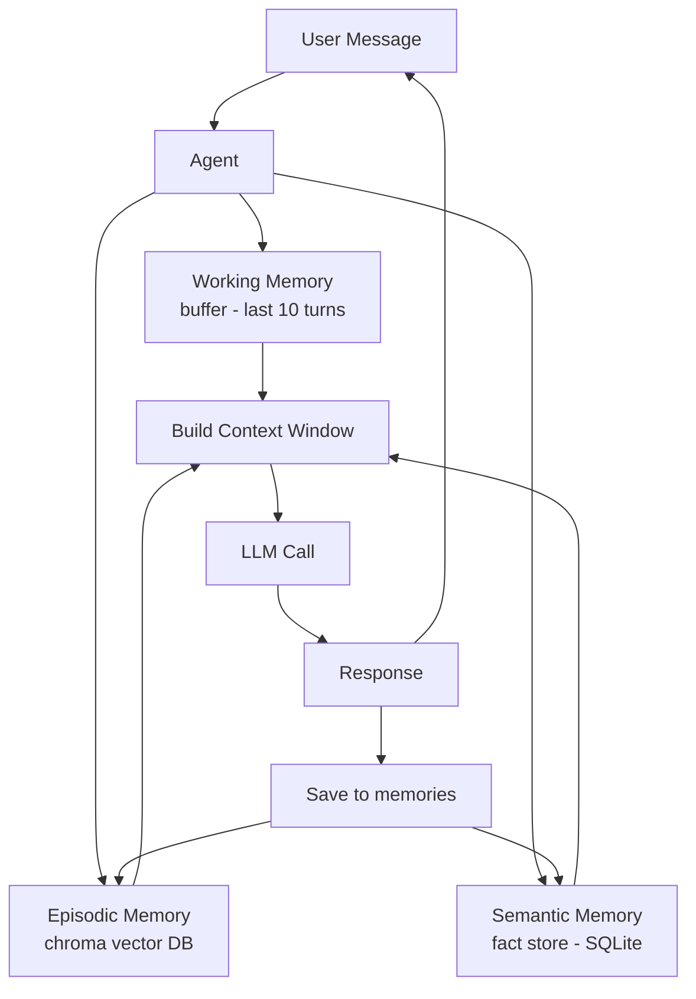

# POC: Agent with Memory

> **Difficulty:** 🟡 Intermediate
> **Time:** 60 minutes
> **Prerequisites:** Python 3.9+, Anthropic API key, `chromadb` or `sqlite3`

## Quick Overview



*Three memory layers work together: working memory (recent context), episodic memory (past conversations via vector search), and semantic memory (extracted facts in SQLite).*

---

## What You'll Build

A stateful agent (~200 lines of Python) that remembers conversations across sessions using three complementary memory types:

- **Working memory**: The raw message buffer of the last N turns (fits in the context window)
- **Episodic memory**: Embeddings of past conversation summaries stored in ChromaDB — retrieved by semantic similarity
- **Semantic memory**: Key-value fact store in SQLite — explicit facts the agent extracts and stores (e.g., "user's name is Alice")
- **Memory consolidation**: After every 5 turns, summarize and archive the working memory to episodic storage
- **Memory retrieval**: Before each LLM call, search episodic memory for relevant past context

---

## Problem Statement

Most agent tutorials use a plain list of messages as "context." This works for a single 20-turn conversation, but breaks in three ways at scale:

1. **Context window overflow**: After ~40 messages (depending on length), you exceed the LLM's context window. Simple truncation loses important early context.
2. **Cross-session amnesia**: Each new conversation starts blank. A customer support agent that forgets the user's name and issue history after each session is useless.
3. **Fact drift**: Users correct the agent ("No, my budget is $500, not $5000"). Without explicit fact storage, the agent forgets corrections after the conversation ends.

Real production agents at companies like Mem.ai, Notion AI, and Anthropic's Claude.ai use all three layers: a short working buffer, a vector store for semantic retrieval, and a structured store for facts.

---

## Architecture: The Three Layers

```
┌─────────────────────────────────────────────────────────┐
│                    AGENT CONTEXT WINDOW                  │
│                                                         │
│  [System Prompt]                                        │
│  [Semantic Memory: user_name=Alice, budget=$500]        │  ← SQLite facts
│  [Episodic Memory: "Alice asked about Redis on Jan 5"]  │  ← ChromaDB retrieval
│  [Working Memory: last 10 turns of THIS conversation]   │  ← in-process list
│  [Current User Message]                                 │
└─────────────────────────────────────────────────────────┘

After RESPONSE:
  - Append turn to working memory
  - Extract any new facts → SQLite
  - If working memory hits 10 turns:
      → Summarize with LLM
      → Embed summary → ChromaDB
      → Truncate working memory to last 4 turns
```

---

## Memory Layer Comparison

| Layer | Storage | Max Size | Retrieval | Persistent? | Use Case |
|-------|---------|----------|-----------|-------------|----------|
| Working | In-process list | ~4k tokens | Sequential (all) | No (session) | Active conversation |
| Episodic | ChromaDB (vectors) | Unlimited | Semantic search | Yes | Past conversations |
| Semantic | SQLite (key-value) | Unlimited | Exact key lookup | Yes | Extracted facts |

---

## Implementation

```python
# agent_with_memory.py
# Stateful agent with working, episodic, and semantic memory layers.

import json
import os
import sqlite3
import time
from dataclasses import dataclass, field
from typing import Any, Dict, List, Optional, Tuple

import anthropic

# pip install anthropic chromadb
try:
    import chromadb
    from chromadb.utils.embedding_functions import DefaultEmbeddingFunction
    CHROMA_AVAILABLE = True
except ImportError:
    CHROMA_AVAILABLE = False
    print("[WARN] chromadb not installed. Episodic memory will be disabled.")
    print("       Install with: pip install chromadb")

client = anthropic.Anthropic(api_key=os.environ["ANTHROPIC_API_KEY"])

MODEL = "claude-3-5-haiku-20241022"
WORKING_MEMORY_LIMIT = 10   # consolidate after this many turns
WORKING_MEMORY_KEEP  = 4    # keep this many turns after consolidation
EPISODIC_TOP_K       = 3    # how many past episodes to retrieve per query


# ── Semantic Memory (SQLite) ──────────────────────────────────────────────────

class SemanticMemory:
    """
    Structured fact store. The agent explicitly writes facts here.
    Example facts: user_name=Alice, preferred_language=Python, budget=500
    """

    def __init__(self, db_path: str = "agent_memory.db"):
        self.conn = sqlite3.connect(db_path)
        self._init_db()

    def _init_db(self):
        self.conn.execute("""
            CREATE TABLE IF NOT EXISTS facts (
                key       TEXT PRIMARY KEY,
                value     TEXT NOT NULL,
                updated_at REAL NOT NULL
            )
        """)
        self.conn.commit()

    def set(self, key: str, value: str):
        self.conn.execute(
            "INSERT OR REPLACE INTO facts (key, value, updated_at) VALUES (?, ?, ?)",
            (key, value, time.time()),
        )
        self.conn.commit()
        print(f"    [MEMORY:SEMANTIC] Set {key} = {value!r}")

    def get(self, key: str) -> Optional[str]:
        row = self.conn.execute(
            "SELECT value FROM facts WHERE key = ?", (key,)
        ).fetchone()
        return row[0] if row else None

    def get_all(self) -> Dict[str, str]:
        rows = self.conn.execute("SELECT key, value FROM facts").fetchall()
        return {k: v for k, v in rows}

    def format_for_prompt(self) -> str:
        facts = self.get_all()
        if not facts:
            return ""
        lines = ["[Known facts about the user and context]"]
        for k, v in facts.items():
            lines.append(f"  {k}: {v}")
        return "\n".join(lines)

    def close(self):
        self.conn.close()


# ── Episodic Memory (ChromaDB) ────────────────────────────────────────────────

class EpisodicMemory:
    """
    Vector store for past conversation summaries.
    Each episode = LLM-generated summary of a conversation segment.
    Retrieval = semantic similarity to current query.
    """

    def __init__(self, collection_name: str = "agent_episodes"):
        if not CHROMA_AVAILABLE:
            self._available = False
            return

        self._available = True
        self._chroma = chromadb.PersistentClient(path="./chroma_data")
        self._collection = self._chroma.get_or_create_collection(
            name=collection_name,
            # Uses a lightweight local embedding model — no external API calls
            embedding_function=DefaultEmbeddingFunction(),
        )
        print(f"    [MEMORY:EPISODIC] Collection '{collection_name}' ready "
              f"({self._collection.count()} episodes stored)")

    def add_episode(self, episode_id: str, summary: str, metadata: Dict = None):
        if not self._available:
            return
        self._collection.add(
            ids=[episode_id],
            documents=[summary],
            metadatas=[metadata or {}],
        )
        print(f"    [MEMORY:EPISODIC] Stored episode {episode_id!r} ({len(summary)} chars)")

    def search(self, query: str, top_k: int = EPISODIC_TOP_K) -> List[str]:
        """Return top_k most relevant episode summaries for the given query."""
        if not self._available or self._collection.count() == 0:
            return []

        results = self._collection.query(
            query_texts=[query],
            n_results=min(top_k, self._collection.count()),
        )
        return results["documents"][0] if results["documents"] else []

    def format_for_prompt(self, query: str) -> str:
        episodes = self.search(query)
        if not episodes:
            return ""
        lines = ["[Relevant past conversations]"]
        for i, ep in enumerate(episodes, 1):
            lines.append(f"  Episode {i}: {ep}")
        return "\n".join(lines)


# ── Working Memory ────────────────────────────────────────────────────────────

@dataclass
class WorkingMemory:
    """
    In-process message buffer for the current conversation.
    Consolidates to episodic memory when it exceeds WORKING_MEMORY_LIMIT turns.
    """
    messages: List[Dict] = field(default_factory=list)
    consolidation_count: int = 0

    def append(self, role: str, content: Any):
        self.messages.append({"role": role, "content": content})

    def turn_count(self) -> int:
        return len([m for m in self.messages if m["role"] == "user"])

    def should_consolidate(self) -> bool:
        return self.turn_count() >= WORKING_MEMORY_LIMIT

    def get_oldest_segment(self) -> List[Dict]:
        """Return the oldest messages (up to WORKING_MEMORY_LIMIT - WORKING_MEMORY_KEEP turns)."""
        keep_start = max(0, len(self.messages) - WORKING_MEMORY_KEEP * 2)
        return self.messages[:keep_start]

    def trim_to_recent(self):
        """Keep only the last WORKING_MEMORY_KEEP turns."""
        keep_start = max(0, len(self.messages) - WORKING_MEMORY_KEEP * 2)
        self.messages = self.messages[keep_start:]
        self.consolidation_count += 1


# ── Fact Extraction Tools ─────────────────────────────────────────────────────

MEMORY_TOOLS = [
    {
        "name": "store_fact",
        "description": (
            "Store an important fact about the user or context for future reference. "
            "Use this when the user shares their name, preferences, constraints, or "
            "any information that should persist across conversations."
        ),
        "input_schema": {
            "type": "object",
            "properties": {
                "key": {
                    "type": "string",
                    "description": "Snake_case key for the fact (e.g., user_name, budget_usd, preferred_db)",
                },
                "value": {
                    "type": "string",
                    "description": "The value to store",
                },
            },
            "required": ["key", "value"],
        },
    },
    {
        "name": "retrieve_fact",
        "description": "Look up a previously stored fact by key.",
        "input_schema": {
            "type": "object",
            "properties": {
                "key": {"type": "string", "description": "The fact key to retrieve"},
            },
            "required": ["key"],
        },
    },
]


# ── Consolidation Helper ──────────────────────────────────────────────────────

def summarize_segment(messages: List[Dict]) -> str:
    """
    Ask the LLM to summarize a segment of the conversation.
    Used during working-memory consolidation.
    """
    if not messages:
        return ""

    # Build a plain-text version of the conversation segment
    text_lines = []
    for m in messages:
        role = m["role"].upper()
        content = m["content"]
        if isinstance(content, list):
            # Handle content blocks
            for block in content:
                if isinstance(block, dict) and block.get("type") == "text":
                    text_lines.append(f"{role}: {block['text']}")
        elif isinstance(content, str):
            text_lines.append(f"{role}: {content}")

    conversation_text = "\n".join(text_lines)

    response = client.messages.create(
        model=MODEL,
        max_tokens=512,
        system="You are a memory consolidation assistant. Summarize the conversation below in 2-4 sentences, capturing the key topics, decisions, and any user preferences mentioned. Be specific and include any numbers or names mentioned.",
        messages=[{"role": "user", "content": f"Summarize this conversation segment:\n\n{conversation_text}"}],
    )

    return response.content[0].text if response.content else ""


# ── Core Agent ────────────────────────────────────────────────────────────────

class MemoryAgent:
    """
    A stateful agent that persists memory across conversations.
    
    Memory hierarchy:
      1. Semantic (SQLite) — explicit facts
      2. Episodic (ChromaDB) — past conversation summaries
      3. Working (in-memory) — current conversation buffer
    """

    def __init__(self, user_id: str = "default_user"):
        self.user_id = user_id
        self.semantic = SemanticMemory(db_path=f"{user_id}_memory.db")
        self.episodic = EpisodicMemory(collection_name=f"episodes_{user_id}")
        self.working  = WorkingMemory()
        self._total_input_tokens  = 0
        self._total_output_tokens = 0

        print(f"\n[AGENT] Initialized for user '{user_id}'")
        existing_facts = self.semantic.get_all()
        if existing_facts:
            print(f"[AGENT] Loaded {len(existing_facts)} known facts from previous sessions")
            for k, v in existing_facts.items():
                print(f"         {k}: {v}")

    def _build_system_prompt(self, current_query: str) -> str:
        sections = [
            "You are a helpful assistant with persistent memory across conversations.",
            "You have access to two memory tools: store_fact and retrieve_fact.",
            "When users share personal information, preferences, or constraints, use store_fact to save them.",
            "At the start of each response, check if you know relevant facts about the user.",
            "",
        ]

        # Inject semantic memory
        facts_context = self.semantic.format_for_prompt()
        if facts_context:
            sections.append(facts_context)
            sections.append("")

        # Inject episodic memory (semantic search on current query)
        episodes_context = self.episodic.format_for_prompt(current_query)
        if episodes_context:
            sections.append(episodes_context)
            sections.append("")

        return "\n".join(sections)

    def _handle_tool_call(self, tool_name: str, tool_input: Dict) -> str:
        if tool_name == "store_fact":
            key   = tool_input["key"]
            value = tool_input["value"]
            self.semantic.set(key, value)
            return json.dumps({"status": "stored", "key": key, "value": value})

        if tool_name == "retrieve_fact":
            key   = tool_input["key"]
            value = self.semantic.get(key)
            if value is not None:
                return json.dumps({"key": key, "value": value, "found": True})
            else:
                return json.dumps({"key": key, "found": False})

        return json.dumps({"error": f"Unknown tool: {tool_name}"})

    def _maybe_consolidate(self):
        """If working memory is full, summarize the oldest segment and archive it."""
        if not self.working.should_consolidate():
            return

        print(f"\n[CONSOLIDATION] Working memory has {self.working.turn_count()} turns — consolidating...")

        segment = self.working.get_oldest_segment()
        if not segment:
            return

        summary = summarize_segment(segment)
        if summary:
            episode_id = f"{self.user_id}_{int(time.time())}_{self.working.consolidation_count}"
            self.episodic.add_episode(
                episode_id=episode_id,
                summary=summary,
                metadata={
                    "user_id":    self.user_id,
                    "created_at": time.time(),
                    "turn_count": len(segment) // 2,
                },
            )
            print(f"[CONSOLIDATION] Archived summary: {summary[:120]}...")

        self.working.trim_to_recent()
        print(f"[CONSOLIDATION] Working memory trimmed to {self.working.turn_count()} turns")

    def chat(self, user_message: str) -> str:
        """Send a message and get a response, using all memory layers."""
        print(f"\n{'─'*60}")
        print(f"USER: {user_message}")
        print(f"{'─'*60}")

        # Check if we need to consolidate before this turn
        self._maybe_consolidate()

        # Add user message to working memory
        self.working.append("user", user_message)

        # Build system prompt with memory context
        system_prompt = self._build_system_prompt(user_message)

        # Agent loop (handles tool calls inline)
        MAX_INNER_STEPS = 5
        for step in range(MAX_INNER_STEPS):
            response = client.messages.create(
                model=MODEL,
                max_tokens=1024,
                system=system_prompt,
                tools=MEMORY_TOOLS,
                messages=self.working.messages,
            )

            self._total_input_tokens  += response.usage.input_tokens
            self._total_output_tokens += response.usage.output_tokens

            if response.stop_reason == "end_turn":
                # Extract text response
                final_text = "\n".join(
                    b.text for b in response.content if hasattr(b, "text")
                )
                self.working.append("assistant", response.content)
                print(f"AGENT: {final_text}")
                return final_text

            if response.stop_reason == "tool_use":
                self.working.append("assistant", response.content)

                # Execute memory tools
                tool_results = []
                for block in response.content:
                    if block.type == "tool_use":
                        print(f"    [TOOL] {block.name}({json.dumps(block.input)})")
                        result = self._handle_tool_call(block.name, block.input)
                        tool_results.append({
                            "type":        "tool_result",
                            "tool_use_id": block.id,
                            "content":     result,
                        })

                self.working.append("user", tool_results)
                continue

            break

        return "[Agent did not produce a response]"

    def stats(self):
        print(f"\n{'='*60}")
        print("MEMORY STATS")
        print(f"{'='*60}")
        print(f"  Working memory turns : {self.working.turn_count()}")
        print(f"  Consolidations       : {self.working.consolidation_count}")
        print(f"  Known facts (SQLite) : {len(self.semantic.get_all())}")
        if CHROMA_AVAILABLE:
            print(f"  Stored episodes      : {self.episodic._collection.count()}")
        print(f"  Total input tokens   : {self._total_input_tokens:,}")
        print(f"  Total output tokens  : {self._total_output_tokens:,}")
        est_cost = (
            self._total_input_tokens  / 1_000_000 * 0.80 +
            self._total_output_tokens / 1_000_000 * 4.00
        )
        print(f"  Estimated cost       : ${est_cost:.4f}")

    def close(self):
        self.semantic.close()


# ── Demo Conversations ────────────────────────────────────────────────────────

def run_demo():
    # Session 1: Introduce the user
    print("\n" + "="*60)
    print("SESSION 1: Initial conversation")
    print("="*60)

    agent = MemoryAgent(user_id="demo_user")

    agent.chat("Hi! My name is Alice and I'm a backend engineer.")
    agent.chat("I mostly work with Python and PostgreSQL. My team is ~5 people.")
    agent.chat("What are the most important things to know about database indexing?")
    agent.chat("My company's biggest table has about 50 million rows. Any specific advice?")

    agent.stats()
    agent.close()

    # Session 2: New agent instance, but memory persists
    print("\n" + "="*60)
    print("SESSION 2: New session (memory should persist)")
    print("="*60)

    agent2 = MemoryAgent(user_id="demo_user")

    agent2.chat("What do you remember about me?")
    agent2.chat("Can you remind me of the indexing advice you gave last time?")
    agent2.chat("Actually, we recently migrated to a 200 million row table.")

    agent2.stats()
    agent2.close()


if __name__ == "__main__":
    run_demo()
```

---

## Setup

```bash
# Install dependencies
pip install anthropic chromadb

# Set your API key
export ANTHROPIC_API_KEY="sk-ant-..."

# Run the demo
python agent_with_memory.py
```

> **Note**: ChromaDB downloads a small local embedding model (~50MB) on first run.
> It stores vectors in `./chroma_data/`. SQLite facts are stored in `demo_user_memory.db`.

---

## Expected Output

```
==============================
SESSION 1: Initial conversation
==============================

[AGENT] Initialized for user 'demo_user'
    [MEMORY:EPISODIC] Collection 'episodes_demo_user' ready (0 episodes stored)

────────────────────────────────────────────────────────────
USER: Hi! My name is Alice and I'm a backend engineer.
────────────────────────────────────────────────────────────
    [TOOL] store_fact({"key": "user_name", "value": "Alice"})
    [MEMORY:SEMANTIC] Set user_name = 'Alice'
    [TOOL] store_fact({"key": "role", "value": "backend engineer"})
    [MEMORY:SEMANTIC] Set role = 'backend engineer'
AGENT: Nice to meet you, Alice! I've noted that you're a backend engineer.
       How can I help you today?

────────────────────────────────────────────────────────────
USER: I mostly work with Python and PostgreSQL. My team is ~5 people.
────────────────────────────────────────────────────────────
    [TOOL] store_fact({"key": "primary_language", "value": "Python"})
    [TOOL] store_fact({"key": "primary_database", "value": "PostgreSQL"})
    [TOOL] store_fact({"key": "team_size", "value": "~5 people"})
AGENT: Got it! I've saved your stack preferences. Python + PostgreSQL is a
       great combination for backend work...

[CONSOLIDATION] Working memory has 10 turns — consolidating...
[CONSOLIDATION] Archived summary: "Alice is a backend engineer using Python and
PostgreSQL on a 5-person team. She asked about database indexing for a 50 million
row table. Key advice given: composite indexes, partial indexes, EXPLAIN ANALYZE."

==============================
SESSION 2: New session (memory should persist)
==============================

[AGENT] Initialized for user 'demo_user'
[AGENT] Loaded 5 known facts from previous sessions
         user_name: Alice
         role: backend engineer
         primary_language: Python
         primary_database: PostgreSQL
         team_size: ~5 people

────────────────────────────────────────────────────────────
USER: What do you remember about me?
────────────────────────────────────────────────────────────
AGENT: I remember quite a bit, Alice! From our previous conversation:
       - You're a backend engineer working with Python and PostgreSQL
       - Your team is about 5 people
       - Your largest table has 50 million rows
       We also discussed database indexing strategies in detail last time.
```

---

## What to Observe

Run the demo twice to see the full memory persistence effect:

**First run:**
- The agent introduces itself with no prior knowledge
- Watch `store_fact` calls appear as the agent extracts information
- After 10 turns, see the consolidation event fire and an episode get archived

**Second run (re-run without deleting the `.db` and `chroma_data/` files):**
- The agent loads all facts from session 1 immediately on init
- When asked "what do you remember?", it answers without needing tool calls
- When asked about previous advice, it retrieves the episodic summary via semantic search

**Ablation test — comment out one layer:**
- Remove `facts_context` from `_build_system_prompt`: agent no longer knows user's name in session 2
- Remove `episodes_context`: agent can't recall specific advice from previous conversations
- Set `WORKING_MEMORY_LIMIT = 999`: no consolidation ever fires; agent breaks on very long conversations

---

## Memory Layer Trade-offs

| Concern | Working | Episodic | Semantic |
|---------|---------|----------|----------|
| Token cost per turn | High (all messages re-sent) | Low (3 summaries) | Negligible |
| Precision | Exact | Approximate (summarized) | Exact |
| Recall on old context | No (truncated) | Yes (by similarity) | Yes (by key) |
| Setup complexity | None | Medium (ChromaDB) | Low (SQLite) |
| Suitable for | Active turns | Past conversations | Extracted facts |

---

## Common Pitfalls

```python
# BAD: Storing entire conversations in ChromaDB
# Large documents reduce embedding quality and retrieval precision
episodic.add(documents=[entire_50_turn_conversation])

# GOOD: Summarize first, then embed the summary
summary = summarize_with_llm(segment)
episodic.add(documents=[summary])   # 3-5 sentences

# BAD: Injecting all facts + all episodes every turn regardless of relevance
# This burns tokens even when the user just says "hi"
system += all_500_facts + all_100_episodes

# GOOD: Retrieve only semantically relevant episodes
episodes = episodic.search(query=current_user_message, top_k=3)

# BAD: Relying solely on the LLM to "remember" by leaving everything in context
messages = [msg1, msg2, ..., msg_200]  # context window overflow crash

# GOOD: Consolidate proactively before overflow
if working_memory.turn_count() >= LIMIT:
    consolidate_and_archive(working_memory)
```

---

## Extension Ideas

| Extension | How | Difficulty |
|-----------|-----|------------|
| Multi-user isolation | Separate ChromaDB collection + SQLite DB per `user_id` | Easy |
| Importance scoring | Score each fact on write (1-5), only inject high-score facts | Medium |
| Memory decay | Add `last_accessed_at` to facts; surface stale facts less often | Medium |
| Contradiction detection | Before `store_fact`, check if key already exists and flag conflict | Medium |
| Session tagging | Tag episodes with topics (e.g., "redis", "indexing") for filtered retrieval | Medium |
| External vector DB | Replace local ChromaDB with Pinecone or Weaviate for production scale | Hard |
| Privacy / deletion | Implement `forget_fact(key)` and `delete_episode(id)` for GDPR compliance | Medium |

---

## Production Considerations

### Token Budget

Each turn injects up to:
- Semantic memory: ~20 tokens per fact × N facts
- Episodic memory: ~150 tokens per episode × 3 episodes = ~450 tokens
- Working memory: ~200 tokens per turn × 10 turns = ~2,000 tokens

For a 200k token context window (Claude 3.5), this headroom is comfortable. For GPT-3.5 (16k), you need to be selective — reduce `EPISODIC_TOP_K` to 1 and `WORKING_MEMORY_LIMIT` to 6.

### Embedding Model Choice

The `DefaultEmbeddingFunction` in ChromaDB uses `all-MiniLM-L6-v2` (22M params). For production:

| Model | Dimensions | Cost | Best for |
|-------|-----------|------|----------|
| all-MiniLM-L6-v2 | 384 | Free (local) | Prototypes, small scale |
| text-embedding-3-small | 1536 | $0.02/M tokens | Production, good quality |
| text-embedding-3-large | 3072 | $0.13/M tokens | High-stakes retrieval |

### Concurrency Warning

This implementation is single-user, single-threaded. For a multi-user API server:
- Use one `MemoryAgent` instance per user session (not a shared singleton)
- Use connection pooling for SQLite (`check_same_thread=False` + `threading.Lock`)
- Use a hosted vector DB (Pinecone, Qdrant) instead of local ChromaDB for multi-process deployments

---

## Real-World Memory Patterns

### How Mem.ai Uses It
Mem.ai's AI uses a similar three-layer approach:
1. **Working**: The current note/context the user is editing
2. **Episodic**: All past notes embedded and searchable by semantic similarity
3. **Semantic**: Explicit "smart tags" (dates, people, projects) extracted from notes

### How Anthropic's Claude.ai Uses It
In Claude.ai's Projects feature:
1. **Semantic**: Project "Memory" section — explicit key-value facts the user or Claude adds
2. **Episodic**: Past conversation history in the same Project
3. **Working**: The current conversation window

### How AutoGen Multi-Agent Systems Use It
AutoGen provides a `ConversableAgent` with a `memory` parameter. Each agent maintains:
- Its own working memory (message buffer)
- Optionally, a shared `TextMemory` or `VectorMemory` for group retrieval
- Agents can "teach" each other by writing to the shared memory

---

## Key Takeaways

- Three layers solve three distinct problems: working memory for active context, episodic for past conversations, semantic for extracted facts
- Consolidation at 10 turns prevents context window overflow while preserving important context
- `store_fact` / `retrieve_fact` tools let the LLM explicitly control what gets remembered — more reliable than hoping the model "just remembers"
- In session 2, the agent loads all facts instantly from SQLite — zero LLM calls needed to "recall" the user's name
- Episodic retrieval costs only ~450 tokens per turn (3 summaries × 150 tokens) regardless of how many past conversations exist
