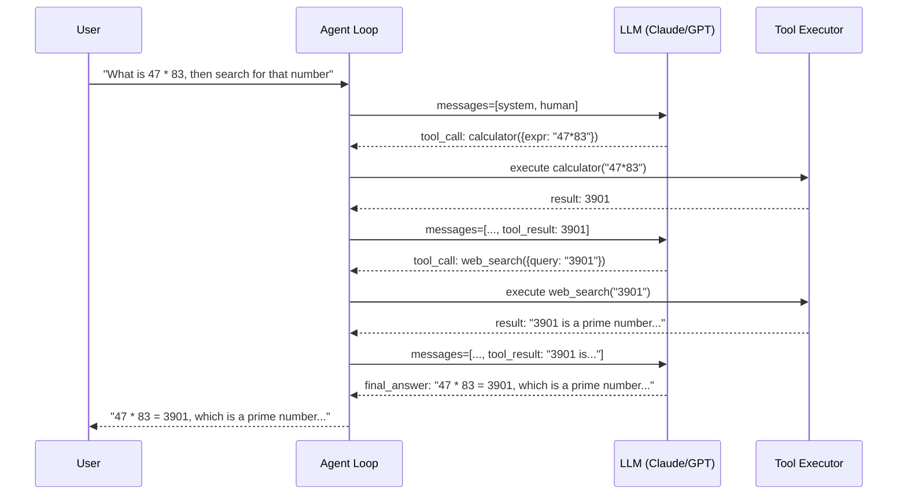

# POC: Build a Basic Agent Loop

> **Difficulty:** 🟢 Beginner
> **Time:** 30 minutes
> **Prerequisites:** Node.js basics, an Anthropic or OpenAI API key

## Quick Overview



*The agent loops until the LLM decides it has enough information — no pre-programmed steps.*

## What You'll Build

A minimal **ReAct** (Reasoning + Acting) agent from scratch — no LangChain, no frameworks. You will:

1. Write a system prompt that describes available tools
2. Parse tool calls from the raw LLM JSON response
3. Execute the tool and inject the result back into the conversation
4. Loop until the LLM returns a final answer

Tools implemented:
- `calculator` — evaluates safe arithmetic expressions
- `web_search` — stub that returns realistic fake results

---

## Problem Statement

Every agent framework (LangChain, CrewAI, AutoGen) is just wrapping this same loop. Understanding the raw mechanics — what messages look like at each step, how tool calls are structured in the JSON — is essential for debugging agents in production and building custom orchestration logic.

---

## Architecture

```
Agent State (messages array):
┌────────────────────────────────────────────────────────┐
│  [0] system   — tool descriptions + behavior rules     │
│  [1] human    — user's initial query                   │
│  [2] assistant — LLM response with tool_call           │
│  [3] tool     — result of executing the tool           │
│  [4] assistant — LLM response (may call another tool)  │
│  [5] tool     — result of second tool                  │
│  [6] assistant — final answer (no tool call)           │
└────────────────────────────────────────────────────────┘

Loop exit conditions:
  - LLM returns text with no tool call  →  final answer
  - Step count exceeds MAX_STEPS        →  force stop
  - Tool returns an error               →  inject error, continue
```

---

## Implementation

```javascript
// agent-loop.js
// Minimal ReAct agent using the Anthropic Claude API directly.
// No frameworks. Shows raw JSON at every step.

const Anthropic = require("@anthropic-ai/sdk");

const client = new Anthropic({
  apiKey: process.env.ANTHROPIC_API_KEY,
});

const MODEL = "claude-3-5-haiku-20241022"; // cheap model for demos
const MAX_STEPS = 10;

// ============================================================
// TOOL DEFINITIONS
// These are sent to the LLM so it knows what tools exist.
// ============================================================

const TOOLS = [
  {
    name: "calculator",
    description:
      "Evaluate a mathematical expression and return the numeric result. " +
      "Use standard arithmetic: +, -, *, /, **, parentheses. " +
      "Do NOT use this for string operations.",
    input_schema: {
      type: "object",
      properties: {
        expression: {
          type: "string",
          description: "The arithmetic expression to evaluate, e.g. '(42 * 17) + 5'",
        },
      },
      required: ["expression"],
    },
  },
  {
    name: "web_search",
    description:
      "Search the web for current information about a topic. " +
      "Returns a short summary of top results. " +
      "Use for facts, news, definitions, anything requiring real-world knowledge.",
    input_schema: {
      type: "object",
      properties: {
        query: {
          type: "string",
          description: "The search query",
        },
      },
      required: ["query"],
    },
  },
];

// ============================================================
// TOOL IMPLEMENTATIONS
// calculator: real arithmetic evaluation (safe subset)
// web_search: stub returning realistic fake results
// ============================================================

function executeTool(toolName, toolInput) {
  console.log(`\n  [TOOL EXEC] ${toolName}(${JSON.stringify(toolInput)})`);

  if (toolName === "calculator") {
    try {
      // Safe evaluation: only allow numbers and operators
      const sanitized = toolInput.expression.replace(/[^0-9+\-*/().\s**]/g, "");
      // Use Function constructor to evaluate (safer than eval in controlled contexts)
      const result = new Function(`"use strict"; return (${sanitized})`)();
      const output = String(result);
      console.log(`  [TOOL RESULT] ${output}`);
      return output;
    } catch (err) {
      const error = `Error evaluating expression: ${err.message}`;
      console.log(`  [TOOL ERROR] ${error}`);
      return error;
    }
  }

  if (toolName === "web_search") {
    // Stub: returns realistic-looking fake search results
    const stubs = {
      default: `Search results for "${toolInput.query}": According to multiple sources, ${toolInput.query} is a well-documented topic. Key facts: (1) it has been studied extensively since the early 2000s, (2) major companies including Google and Amazon have published research on it, (3) the most common implementation uses distributed systems principles.`,
      "3901": `Search results for "3901": 3901 is a prime number. It appears in various mathematical sequences. The number 3901 is also the ZIP code for several small towns. In Roman numerals it is MMMDCCCI.`,
      prime: `Search results for "prime number": A prime number is a natural number greater than 1 that is not a product of two smaller natural numbers. The first few primes are 2, 3, 5, 7, 11, 13...`,
    };

    const key = Object.keys(stubs).find((k) =>
      toolInput.query.toLowerCase().includes(k)
    );
    const result = stubs[key] || stubs.default;
    console.log(`  [TOOL RESULT] ${result.substring(0, 80)}...`);
    return result;
  }

  return `Unknown tool: ${toolName}`;
}

// ============================================================
// THE AGENT LOOP
// This is the core of every agent framework.
// ============================================================

async function runAgent(userQuery) {
  console.log("\n" + "=".repeat(60));
  console.log("AGENT LOOP STARTING");
  console.log("Query:", userQuery);
  console.log("=".repeat(60));

  // The messages array is the agent's entire working memory.
  // We start with just the user query.
  const messages = [{ role: "user", content: userQuery }];

  for (let step = 1; step <= MAX_STEPS; step++) {
    console.log(`\n--- Step ${step} ---`);
    console.log("[LLM INPUT] Sending", messages.length, "messages to LLM...");

    // Log the full messages array so you can see exactly what the LLM receives
    if (process.env.VERBOSE) {
      console.log("[MESSAGES]", JSON.stringify(messages, null, 2));
    }

    // Call the LLM
    const response = await client.messages.create({
      model: MODEL,
      max_tokens: 1024,
      tools: TOOLS,
      messages: messages,
      system:
        "You are a helpful assistant with access to tools. " +
        "Use tools when you need to calculate something or look up information. " +
        "Always show your reasoning before calling a tool. " +
        "When you have a final answer, respond with plain text (no tool call).",
    });

    console.log("[LLM RESPONSE] stop_reason:", response.stop_reason);

    // --------------------------------------------------------
    // CASE 1: LLM is done — return final answer
    // --------------------------------------------------------
    if (response.stop_reason === "end_turn") {
      const finalText = response.content
        .filter((block) => block.type === "text")
        .map((block) => block.text)
        .join("\n");

      console.log("\n[FINAL ANSWER]");
      console.log(finalText);
      console.log("\n[DONE] Completed in", step, "step(s)");
      return finalText;
    }

    // --------------------------------------------------------
    // CASE 2: LLM wants to use tools
    // --------------------------------------------------------
    if (response.stop_reason === "tool_use") {
      // Add the assistant's response to messages (includes text + tool_call blocks)
      messages.push({ role: "assistant", content: response.content });

      // The content array may contain both text blocks (reasoning) and tool_use blocks
      const textBlocks = response.content.filter((b) => b.type === "text");
      const toolUseBlocks = response.content.filter((b) => b.type === "tool_use");

      if (textBlocks.length > 0) {
        console.log("[LLM REASONING]", textBlocks.map((b) => b.text).join(" "));
      }

      // Execute each tool call and collect results
      const toolResults = [];

      for (const toolUse of toolUseBlocks) {
        console.log(`\n[TOOL CALL] id=${toolUse.id} name=${toolUse.name}`);
        console.log("[TOOL INPUT]", JSON.stringify(toolUse.input));

        const result = executeTool(toolUse.name, toolUse.input);

        // Tool results must be paired with the tool_use id
        toolResults.push({
          type: "tool_result",
          tool_use_id: toolUse.id,
          content: result,
        });
      }

      // Inject all tool results back into messages as a single user turn
      messages.push({ role: "user", content: toolResults });

      console.log("[LOOP] Feeding", toolResults.length, "tool result(s) back to LLM...");
      continue;
    }

    // --------------------------------------------------------
    // CASE 3: Unexpected stop reason
    // --------------------------------------------------------
    console.log("[WARN] Unexpected stop_reason:", response.stop_reason);
    break;
  }

  throw new Error(`Agent did not complete within ${MAX_STEPS} steps`);
}

// ============================================================
// DEMO: Run three example queries
// ============================================================

async function main() {
  // Query 1: Pure calculation
  await runAgent("What is 47 multiplied by 83?");

  // Query 2: Tool chaining — calculate then search
  await runAgent(
    "Calculate 17 squared, then search the web to find out if that number has any special mathematical properties."
  );

  // Query 3: Multi-step with both tools
  await runAgent(
    "What is (144 / 12) + (7 * 8)? Search the web for information about the final result."
  );
}

main().catch((err) => {
  console.error("Fatal error:", err.message);
  process.exit(1);
});
```

---

## Setup

```bash
# Install the Anthropic SDK
npm install @anthropic-ai/sdk

# Set your API key
export ANTHROPIC_API_KEY="sk-ant-..."

# Run the agent
node agent-loop.js

# Enable verbose mode to see full message arrays at each step
VERBOSE=1 node agent-loop.js
```

**To use OpenAI instead**, replace the client and model:

```javascript
// OpenAI version — same loop, different client
const OpenAI = require("openai");
const client = new OpenAI({ apiKey: process.env.OPENAI_API_KEY });
const MODEL = "gpt-4o-mini";

// In the LLM call, move system to messages[0]:
const response = await client.chat.completions.create({
  model: MODEL,
  tools: TOOLS.map(t => ({ type: "function", function: t })),
  messages: [{ role: "system", content: "..." }, ...messages],
});

// OpenAI uses finish_reason instead of stop_reason:
// "stop"      → end_turn equivalent
// "tool_calls" → tool_use equivalent
```

---

## Expected Output

```
============================================================
AGENT LOOP STARTING
Query: What is 47 multiplied by 83?
============================================================

--- Step 1 ---
[LLM INPUT] Sending 1 messages to LLM...
[LLM RESPONSE] stop_reason: tool_use
[LLM REASONING] I'll calculate 47 multiplied by 83 using the calculator tool.

[TOOL CALL] id=toolu_01ABC name=calculator
[TOOL INPUT] {"expression":"47 * 83"}

  [TOOL EXEC] calculator({"expression":"47 * 83"})
  [TOOL RESULT] 3901
[LOOP] Feeding 1 tool result(s) back to LLM...

--- Step 2 ---
[LLM INPUT] Sending 3 messages to LLM...
[LLM RESPONSE] stop_reason: end_turn

[FINAL ANSWER]
47 multiplied by 83 equals **3901**.

[DONE] Completed in 2 step(s)
```

For the chained query (calculate then search), you will see 3 steps: one tool call per step, then a final answer on step 3.

---

## What to Observe

1. **Message growth**: Each step adds 2 messages (assistant + tool_result). After 3 tool calls the messages array has 7 entries. This is why long agentic tasks get expensive.

2. **stop_reason drives the loop**: `tool_use` means loop again; `end_turn` means we're done. There is no magic — it's just a conditional.

3. **tool_use_id pairing**: The `tool_result` message must reference the `tool_use_id` from the assistant turn. Mismatching these causes the LLM to lose track of results.

4. **Reasoning before tools**: With `VERBOSE=1` you can see that Claude often emits a text block explaining its plan before the tool_use block. This is the "reasoning" in ReAct.

---

## Extension Ideas

- **Add a real search tool**: Replace the web_search stub with a SerpAPI or Tavily API call.
- **Persist memory**: Save the messages array to a file between runs to create a persistent agent.
- **Token counting**: Log `response.usage` at each step and accumulate total cost.
- **Streaming**: Use `client.messages.stream()` to show the LLM reasoning tokens as they arrive.
- **Tool timeout**: Wrap `executeTool` in a `Promise.race` with a 5-second timeout.

---

## Key Takeaways

- An agent loop is ~50 lines: call LLM, check stop_reason, execute tools, repeat
- The messages array is the agent's entire state — everything lives there
- `tool_use_id` pairing is critical — broken IDs cause silent failures
- Every step adds to your context window; plan for token growth on long tasks
- Frameworks like LangChain wrap exactly this loop — understanding the raw version makes debugging 10x easier
