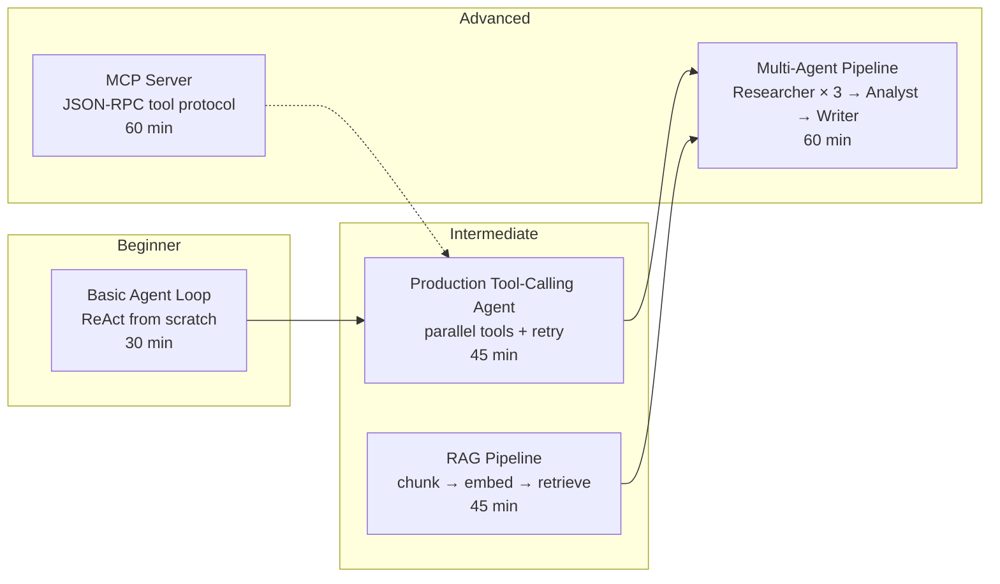

# Hands-On: Agent Workflows

Practical, runnable implementations for building agent workflows. Each POC is standalone: you can run it in under an hour with a single API key and a standard Python or Node.js install.

## POCs in This Section

| # | Article | Level | Time | Language |
|---|---------|-------|------|----------|
| 1 | [Build a Basic Agent Loop](./basic-agent-loop) | 🟢 Beginner | 30 min | Node.js |
| 2 | [Build a RAG Pipeline](./rag-pipeline) | 🟡 Intermediate | 45 min | Python |
| 3 | [Build an MCP Server](./mcp-server) | 🔴 Advanced | 60 min | TypeScript |
| 4 | [Production Tool-Calling Agent](./tool-calling-agent) | 🟡 Intermediate | 45 min | Python |
| 5 | [Multi-Agent Research Pipeline](./multi-agent-pipeline) | 🔴 Advanced | 60 min | Python |

---

## POC Descriptions

### 1. Build a Basic Agent Loop — 🟢 Beginner

The foundational POC. Build a minimal **ReAct agent from scratch** using the Anthropic API directly — no LangChain, no frameworks. You will see the raw JSON messages at every step: how tool calls look in the response, how tool results get injected back into the conversation, and exactly how the loop terminates.

**Tools implemented:** `calculator` (real evaluation) + `web_search` (realistic stub)

**You'll understand:** Why every agent framework is just a thin wrapper around this ~50-line loop.

→ [Start here](./basic-agent-loop)

---

### 2. Build a RAG Pipeline — 🟡 Intermediate

End-to-end **Retrieval-Augmented Generation** in pure Python. Build both pipelines:
- **Ingestion**: load `.md` files → chunk with token-based overlap → embed → in-memory vector store
- **Query**: embed question → cosine similarity retrieval → inject chunks → LLM answer

Includes retrieval quality measurement (Recall@K, MRR) and a local embedding option (sentence-transformers, no API key needed).

**You'll understand:** Why chunk size and overlap matter more than embedding model choice; how to measure whether your retriever is actually finding the right content.

→ [Build the pipeline](./rag-pipeline)

---

### 3. Build an MCP Server — 🔴 Advanced

Build a fully working **Model Context Protocol server** using the official TypeScript SDK. Exposes three real tools (`get_weather`, `search_db`, `create_note`) with JSON Schema definitions and proper error handling.

Covers: connecting to Claude Desktop, testing with the MCP Inspector GUI, and testing via the MCP CLI. Shows why `isError: true` in tool results is safer than throwing protocol-level errors.

**You'll understand:** How MCP's JSON-RPC protocol works under the hood; why the same server code works with Claude Desktop, Cursor, and any MCP-compatible host.

→ [Build the server](./mcp-server)

---

### 4. Production Tool-Calling Agent — 🟡 Intermediate

Takes the basic agent loop to production level (~150 lines of Python). Adds:
- **Parallel tool execution** with `asyncio.gather` (3x+ speedup when LLM calls multiple tools)
- **Retry with exponential backoff** for transient failures
- **Tool result validation** (shape checking before injecting into context)
- **Cost tracking** across all LLM calls in a session
- **Error injection testing** to verify partial-failure behavior

**You'll understand:** The three things that break agents in production (no parallel execution, no retry, no cost cap) and how to fix each.

→ [Build the agent](./tool-calling-agent)

---

### 5. Multi-Agent Research Pipeline — 🔴 Advanced

A 3-agent pipeline (Researcher × 3 → Analyst → Writer) coordinated by an Orchestrator. Uses a shared `PipelineState` object as the single source of truth. Researchers run in parallel; Analyst and Writer are sequential.

Covers: state passing between agents, handling one researcher failing (pipeline continues with partial data), final report assembly, and checkpointing patterns.

**You'll understand:** When to use multi-agent vs single-agent; how to design the state contract that lets specialized agents collaborate without tight coupling.

→ [Build the pipeline](./multi-agent-pipeline)

---

## Suggested Learning Path

**If you're new to agents:**
1. [Basic Agent Loop](./basic-agent-loop) — understand the mechanics first
2. [Production Tool-Calling Agent](./tool-calling-agent) — add the production requirements
3. [RAG Pipeline](./rag-pipeline) — add retrieval to ground your agents in real data

**If you're building integrations:**
1. [MCP Server](./mcp-server) — make your tools available to any MCP host
2. [Basic Agent Loop](./basic-agent-loop) — understand what the host is doing on the other side

**If you're building workflows:**
1. [Production Tool-Calling Agent](./tool-calling-agent) — single-agent with real production patterns
2. [Multi-Agent Research Pipeline](./multi-agent-pipeline) — coordinate multiple specialized agents

---

## API Keys Required

| POC | Required |
|-----|---------|
| Basic Agent Loop | Anthropic API key |
| RAG Pipeline | OpenAI API key (or none with local sentence-transformers) |
| MCP Server | None (Claude Desktop optional for end-to-end test) |
| Production Tool-Calling Agent | Anthropic API key |
| Multi-Agent Pipeline | Anthropic API key |
