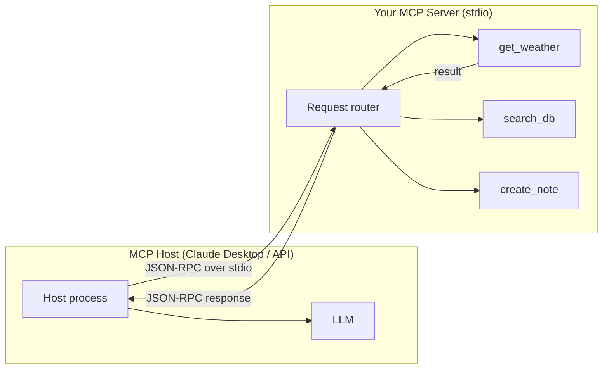

# POC: Build an MCP Server

> **Difficulty:** 🔴 Advanced
> **Time:** 60 minutes
> **Prerequisites:** TypeScript/Node.js basics, Claude Desktop installed (optional for integration test)

## Quick Overview



*MCP uses JSON-RPC over stdio (or HTTP). The host discovers your tools via `tools/list`, then calls them via `tools/call`.*

## What You'll Build

A fully working **MCP (Model Context Protocol) server** that exposes three tools:

| Tool | Description |
|------|-------------|
| `get_weather` | Returns weather data for a city (stubbed) |
| `search_db` | Full-text search across a local in-memory database |
| `create_note` | Persists a titled note to a local JSON file |

You will also learn:
- How to connect the server to Claude Desktop
- How to test with the MCP Inspector (official GUI)
- How to use the MCP CLI for scriptable testing

---

## Problem Statement

MCP (announced by Anthropic in November 2024) is a universal protocol for connecting AI agents to tools and data sources. Instead of every agent framework inventing its own tool integration format, MCP provides a standard. Building an MCP server means your tools work with **any** MCP-compatible host: Claude Desktop, Cursor, Zed, your own API agent, or third-party platforms.

---

## Architecture

```
MCP Server lifecycle:

1. Host spawns server process: node dist/server.js
2. Host sends: initialize  →  server responds with capabilities
3. Host sends: tools/list  →  server returns tool schemas
4. User asks LLM something → LLM picks a tool
5. Host sends: tools/call  →  server executes, returns result
6. LLM gets result, continues conversation

JSON-RPC message format:
{
  "jsonrpc": "2.0",
  "id": 1,
  "method": "tools/call",
  "params": {
    "name": "get_weather",
    "arguments": { "city": "London" }
  }
}

Response:
{
  "jsonrpc": "2.0",
  "id": 1,
  "result": {
    "content": [{ "type": "text", "text": "London: 12°C, overcast" }]
  }
}
```

---

## Implementation

### Project Setup

```bash
mkdir mcp-demo-server
cd mcp-demo-server
npm init -y
npm install @modelcontextprotocol/sdk typescript tsx
npx tsc --init --target ES2022 --module Node16 --outDir dist --rootDir src
mkdir src
```

### `src/server.ts`

```typescript
// src/server.ts
// A working MCP server exposing 3 tools:
//   get_weather(city)       - weather stub
//   search_db(query)        - in-memory DB search
//   create_note(title, content) - persist to notes.json

import { Server } from "@modelcontextprotocol/sdk/server/index.js";
import { StdioServerTransport } from "@modelcontextprotocol/sdk/server/stdio.js";
import {
  CallToolRequestSchema,
  ListToolsRequestSchema,
  Tool,
} from "@modelcontextprotocol/sdk/types.js";
import fs from "fs";
import path from "path";

// ── In-memory database (seeded at startup) ─────────────────────────────────

interface DbRecord {
  id: number;
  title: string;
  body: string;
  tags: string[];
}

const DATABASE: DbRecord[] = [
  {
    id: 1,
    title: "System Design: Caching",
    body: "Cache-aside is the most common pattern. Use Redis with TTL of 300-3600s for product data. Add jitter to prevent stampede.",
    tags: ["caching", "redis", "system-design"],
  },
  {
    id: 2,
    title: "System Design: Message Queues",
    body: "Kafka handles 1M+ messages/second per broker. Use for event streaming. RabbitMQ is better for task queues with complex routing.",
    tags: ["kafka", "rabbitmq", "queues"],
  },
  {
    id: 3,
    title: "System Design: Database Replication",
    body: "Primary-replica replication uses WAL streaming. Replication lag is 1-100ms in same datacenter. Read replicas scale read throughput.",
    tags: ["databases", "replication", "postgres"],
  },
  {
    id: 4,
    title: "API Design: REST vs GraphQL",
    body: "REST is simpler and cacheable. GraphQL avoids over-fetching but adds complexity. Use REST for public APIs, GraphQL for complex client needs.",
    tags: ["api", "rest", "graphql"],
  },
  {
    id: 5,
    title: "Security: JWT Tokens",
    body: "JWT tokens are stateless. Sign with RS256 in production. Set expiry to 15min for access tokens, 7 days for refresh tokens.",
    tags: ["security", "jwt", "authentication"],
  },
];

// ── Notes storage ───────────────────────────────────────────────────────────

const NOTES_FILE = path.join(process.cwd(), "notes.json");

interface Note {
  id: string;
  title: string;
  content: string;
  created_at: string;
}

function loadNotes(): Note[] {
  if (!fs.existsSync(NOTES_FILE)) return [];
  try {
    return JSON.parse(fs.readFileSync(NOTES_FILE, "utf-8"));
  } catch {
    return [];
  }
}

function saveNote(note: Note): void {
  const notes = loadNotes();
  notes.push(note);
  fs.writeFileSync(NOTES_FILE, JSON.stringify(notes, null, 2));
}

// ── Tool definitions (JSON Schema) ─────────────────────────────────────────

const TOOL_DEFINITIONS: Tool[] = [
  {
    name: "get_weather",
    description:
      "Get the current weather for a city. Returns temperature (Celsius), " +
      "conditions, humidity, and wind speed. Data is updated hourly.",
    inputSchema: {
      type: "object",
      properties: {
        city: {
          type: "string",
          description: "The city name, e.g. 'London', 'Tokyo', 'New York'",
        },
        units: {
          type: "string",
          enum: ["celsius", "fahrenheit"],
          description: "Temperature units (default: celsius)",
        },
      },
      required: ["city"],
    },
  },
  {
    name: "search_db",
    description:
      "Search the internal knowledge base using a text query. " +
      "Returns matching articles ranked by relevance. " +
      "Use this to find system design notes, architecture decisions, and best practices.",
    inputSchema: {
      type: "object",
      properties: {
        query: {
          type: "string",
          description: "The search query, e.g. 'caching strategies' or 'kafka throughput'",
        },
        limit: {
          type: "number",
          description: "Maximum number of results to return (default: 3, max: 10)",
        },
      },
      required: ["query"],
    },
  },
  {
    name: "create_note",
    description:
      "Create and persist a new note with a title and content. " +
      "Notes are saved to a local file and can be retrieved later. " +
      "Use this to save important information, summaries, or action items.",
    inputSchema: {
      type: "object",
      properties: {
        title: {
          type: "string",
          description: "The note title (max 100 characters)",
        },
        content: {
          type: "string",
          description: "The note content (markdown is supported)",
        },
        tags: {
          type: "array",
          items: { type: "string" },
          description: "Optional tags for organizing notes",
        },
      },
      required: ["title", "content"],
    },
  },
];

// ── Tool handlers ───────────────────────────────────────────────────────────

function handleGetWeather(args: Record<string, unknown>): string {
  const city = String(args.city || "").trim();
  const units = String(args.units || "celsius");

  if (!city) {
    throw new Error("city is required");
  }

  // Stub: deterministic fake weather based on city name hash
  const hash = city.split("").reduce((acc, ch) => acc + ch.charCodeAt(0), 0);
  const conditions = ["sunny", "partly cloudy", "overcast", "light rain", "clear"][hash % 5];
  let tempC = 10 + (hash % 25);  // 10°C to 34°C
  const humidity = 40 + (hash % 50);
  const windKph = 5 + (hash % 30);

  const tempDisplay =
    units === "fahrenheit"
      ? `${Math.round(tempC * 9/5 + 32)}°F`
      : `${tempC}°C`;

  return JSON.stringify({
    city,
    temperature: tempDisplay,
    conditions,
    humidity: `${humidity}%`,
    wind: `${windKph} km/h`,
    updated: new Date().toISOString(),
  }, null, 2);
}

function handleSearchDb(args: Record<string, unknown>): string {
  const query = String(args.query || "").toLowerCase().trim();
  const limit = Math.min(Number(args.limit || 3), 10);

  if (!query) {
    throw new Error("query is required");
  }

  // Simple relevance scoring: count how many query words appear in title/body/tags
  const queryWords = query.split(/\s+/);

  const scored = DATABASE.map((record) => {
    const haystack = `${record.title} ${record.body} ${record.tags.join(" ")}`.toLowerCase();
    const score = queryWords.reduce((acc, word) => {
      const titleMatch = record.title.toLowerCase().includes(word) ? 3 : 0;
      const bodyMatch  = record.body.toLowerCase().includes(word)  ? 1 : 0;
      const tagMatch   = record.tags.some(t => t.includes(word))   ? 2 : 0;
      return acc + titleMatch + bodyMatch + tagMatch;
    }, 0);
    return { record, score };
  });

  const results = scored
    .filter(({ score }) => score > 0)
    .sort((a, b) => b.score - a.score)
    .slice(0, limit)
    .map(({ record, score }) => ({
      id: record.id,
      title: record.title,
      excerpt: record.body.substring(0, 150) + "...",
      tags: record.tags,
      relevance_score: score,
    }));

  if (results.length === 0) {
    return JSON.stringify({ results: [], message: "No results found for: " + query });
  }

  return JSON.stringify({ results, total: results.length }, null, 2);
}

function handleCreateNote(args: Record<string, unknown>): string {
  const title   = String(args.title   || "").trim();
  const content = String(args.content || "").trim();
  const tags    = Array.isArray(args.tags) ? args.tags.map(String) : [];

  if (!title)   throw new Error("title is required");
  if (!content) throw new Error("content is required");
  if (title.length > 100) throw new Error("title must be 100 characters or fewer");

  const note: Note = {
    id: `note_${Date.now()}`,
    title,
    content,
    created_at: new Date().toISOString(),
  };

  saveNote(note);

  return JSON.stringify({
    success: true,
    note_id: note.id,
    title: note.title,
    created_at: note.created_at,
    saved_to: NOTES_FILE,
  }, null, 2);
}

// ── Server setup ────────────────────────────────────────────────────────────

async function main() {
  const server = new Server(
    {
      name: "mcp-demo-server",
      version: "1.0.0",
    },
    {
      capabilities: {
        tools: {},   // declare that this server provides tools
      },
    }
  );

  // Handle tools/list request: return all tool definitions
  server.setRequestHandler(ListToolsRequestSchema, async () => {
    return { tools: TOOL_DEFINITIONS };
  });

  // Handle tools/call request: dispatch to the right handler
  server.setRequestHandler(CallToolRequestSchema, async (request) => {
    const { name, arguments: args = {} } = request.params;

    let resultText: string;

    try {
      switch (name) {
        case "get_weather":
          resultText = handleGetWeather(args as Record<string, unknown>);
          break;
        case "search_db":
          resultText = handleSearchDb(args as Record<string, unknown>);
          break;
        case "create_note":
          resultText = handleCreateNote(args as Record<string, unknown>);
          break;
        default:
          throw new Error(`Unknown tool: ${name}`);
      }

      return {
        content: [{ type: "text", text: resultText }],
      };
    } catch (err) {
      const message = err instanceof Error ? err.message : String(err);
      // Return error as tool result (not a protocol error)
      // This lets the LLM handle the failure gracefully
      return {
        content: [{ type: "text", text: `Error: ${message}` }],
        isError: true,
      };
    }
  });

  // Connect to the host via stdio transport
  const transport = new StdioServerTransport();
  await server.connect(transport);

  // Log to stderr (stdout is reserved for JSON-RPC messages)
  console.error("MCP demo server running. Tools: get_weather, search_db, create_note");
}

main().catch((err) => {
  console.error("Fatal:", err);
  process.exit(1);
});
```

---

## Setup

```bash
# Install dependencies and compile
npm install
npx tsc

# Run the server standalone (you'll see it waiting for JSON-RPC input on stdin)
node dist/server.js
```

---

## Testing with MCP Inspector

The **MCP Inspector** is the official GUI for testing MCP servers without needing Claude Desktop.

```bash
# Install the inspector globally
npm install -g @modelcontextprotocol/inspector

# Launch inspector pointing at your server
npx @modelcontextprotocol/inspector node dist/server.js
```

Open the URL shown in your terminal (usually `http://localhost:5173`). You will see:

```
Tools tab:
  get_weather    — [city: string, units?: "celsius"|"fahrenheit"]
  search_db      — [query: string, limit?: number]
  create_note    — [title: string, content: string, tags?: string[]]

Test: get_weather({ city: "Tokyo" })
Response:
{
  "city": "Tokyo",
  "temperature": "26°C",
  "conditions": "partly cloudy",
  "humidity": "72%",
  "wind": "18 km/h",
  "updated": "2026-03-20T10:00:00.000Z"
}
```

---

## Testing with MCP CLI

```bash
# Install CLI
npm install -g @modelcontextprotocol/cli

# List tools
mcp tools node dist/server.js

# Call get_weather
mcp call node dist/server.js get_weather '{"city": "Paris"}'

# Call search_db
mcp call node dist/server.js search_db '{"query": "kafka throughput", "limit": 2}'

# Call create_note
mcp call node dist/server.js create_note \
  '{"title": "Test Note", "content": "This note was created via MCP CLI", "tags": ["test"]}'
```

Expected CLI output for `search_db`:
```json
{
  "results": [
    {
      "id": 2,
      "title": "System Design: Message Queues",
      "excerpt": "Kafka handles 1M+ messages/second per broker...",
      "tags": ["kafka", "rabbitmq", "queues"],
      "relevance_score": 4
    }
  ],
  "total": 1
}
```

---

## Connecting to Claude Desktop

Add the server to `~/Library/Application Support/Claude/claude_desktop_config.json` (macOS):

```json
{
  "mcpServers": {
    "demo": {
      "command": "node",
      "args": ["/absolute/path/to/mcp-demo-server/dist/server.js"]
    }
  }
}
```

Restart Claude Desktop. In the conversation, you will see a tools icon (hammer) appear. Claude can now call your tools directly.

Example Claude Desktop interaction:
```
User: What's the weather in Berlin and save a note about it

Claude: [calls get_weather(city="Berlin")]
        [calls create_note(title="Berlin Weather", content="Berlin: 8°C, overcast, 65% humidity")]

        Berlin is currently 8°C with overcast conditions. I've saved a note
        about it — check notes.json for the record.
```

---

## What to Observe

1. **stdout is sacred**: All JSON-RPC traffic goes over stdout. Any `console.log` to stdout will corrupt the protocol. Always use `console.error` for debug output.

2. **isError in tool result**: When a tool fails, return `{ isError: true }` in the tool result rather than throwing a protocol-level error. This lets the LLM acknowledge the failure and adapt.

3. **JSON Schema is the contract**: The `inputSchema` you define is what Claude uses to decide when and how to call the tool. Vague descriptions lead to wrong arguments.

4. **stdio vs HTTP transport**: This demo uses stdio (simplest). For remote servers, use `StreamableHTTPServerTransport` from the SDK — same handler code, different transport layer.

---

## Extension Ideas

- **Add a `list_notes` tool** that reads notes.json and returns all saved notes
- **Real weather API**: Replace the stub with a call to `api.open-meteo.com` (free, no key needed)
- **Persistent DB**: Replace the in-memory DATABASE array with a SQLite file using `better-sqlite3`
- **HTTP transport**: Swap `StdioServerTransport` for `StreamableHTTPServerTransport` to make the server accessible over the network
- **Authentication**: Add an API key check in the request handler for multi-user deployments

---

## Key Takeaways

- MCP uses JSON-RPC over stdio (or HTTP) — the protocol is simple once you see it raw
- `ListTools` returns your tool catalog; `CallTool` routes to the right handler
- JSON Schema in `inputSchema` is what guides the LLM to call your tool correctly — write clear descriptions
- `isError: true` in a tool result is preferable to throwing — it gives the LLM a chance to recover
- The same server code works with Claude Desktop, Cursor, Zed, and any MCP-compatible host
