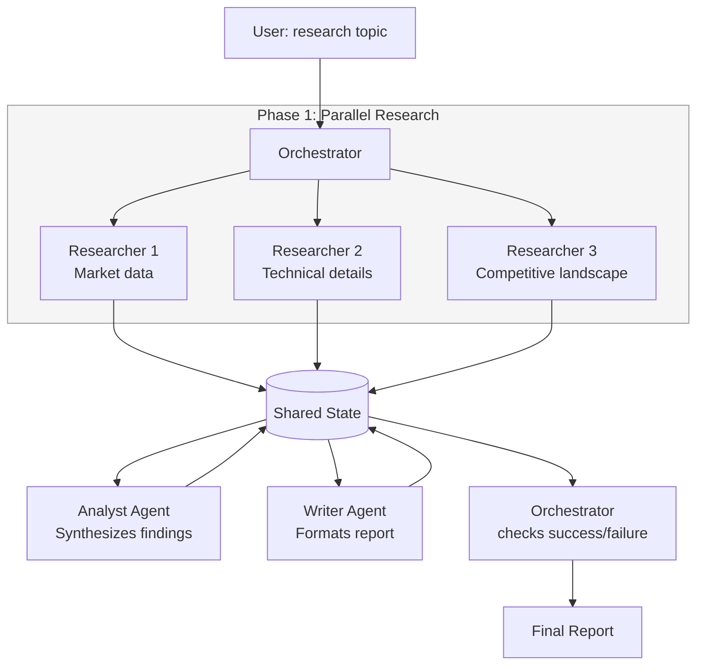

# POC: Multi-Agent Research Pipeline

> **Difficulty:** 🔴 Advanced
> **Time:** 60 minutes
> **Prerequisites:** Python 3.9+, Anthropic API key, familiarity with async Python

## Quick Overview



*Three researchers run in parallel. Their findings flow into a shared state. Analyst and Writer process sequentially. The Orchestrator handles any agent failures.*

## What You'll Build

A 3-agent pipeline that produces a structured research report:

| Agent | Role | Input | Output |
|-------|------|-------|--------|
| Researcher (x3) | Gather information on a sub-topic | Topic + angle | Raw findings |
| Analyst | Synthesize all research | Researcher outputs | Key insights + gaps |
| Writer | Format the final report | Analyst output | Markdown report |
| Orchestrator | Coordinate all agents, handle failures | Pipeline config | Final report |

---

## Problem Statement

Single agents hit a wall at complex tasks: one LLM context can't hold months of research, a single model can't simultaneously be an expert in markets, engineering, and business writing. Multi-agent pipelines solve this by specializing: each agent has a narrow role, a targeted context, and clear inputs/outputs. The orchestrator coordinates them like a team lead.

The real engineering challenge is **shared state**: how does agent B consume agent A's output? How does the orchestrator know which agents failed? How do you avoid re-running expensive agents that already succeeded?

---

## Architecture

```
PipelineState (the single source of truth):
┌──────────────────────────────────────────────────────────┐
│  topic: str                                              │
│  research_tasks: List[ResearchTask]                      │
│    └── { angle, status, findings, error, agent_id }     │
│  analyst_output: Optional[AnalystOutput]                 │
│    └── { insights, gaps, confidence_score }              │
│  final_report: Optional[str]                             │
│  pipeline_status: "running" | "completed" | "failed"    │
│  errors: List[str]                                       │
└──────────────────────────────────────────────────────────┘

Failure handling:
  - Researcher fails  →  mark task as failed, continue with remaining
  - Analyst fails     →  retry once, then mark pipeline "partial"
  - Writer fails      →  retry once, fail pipeline with partial analyst output
  - All researchers fail  →  abort pipeline immediately
```

---

## Implementation

```python
# multi_agent_pipeline.py
# Orchestrated 3-agent research pipeline.
# Shows: shared state, parallel execution, failure handling, report assembly.

import asyncio
import json
import os
import time
from dataclasses import dataclass, field
from enum import Enum
from typing import Dict, List, Optional

import anthropic

client = anthropic.Anthropic(api_key=os.environ["ANTHROPIC_API_KEY"])
MODEL = "claude-3-5-haiku-20241022"   # use faster/cheaper model for sub-agents


# ── Enums and data classes ─────────────────────────────────────────────────────

class TaskStatus(Enum):
    PENDING   = "pending"
    RUNNING   = "running"
    COMPLETED = "completed"
    FAILED    = "failed"


@dataclass
class ResearchTask:
    """One research sub-task assigned to a Researcher agent."""
    angle:    str           # e.g. "market size and growth trends"
    status:   TaskStatus = TaskStatus.PENDING
    findings: str        = ""
    error:    str        = ""
    agent_id: str        = ""
    duration_s: float    = 0.0


@dataclass
class AnalystOutput:
    """Structured output from the Analyst agent."""
    key_insights:     List[str] = field(default_factory=list)
    knowledge_gaps:   List[str] = field(default_factory=list)
    confidence_score: float     = 0.0   # 0.0 - 1.0
    raw_synthesis:    str       = ""


@dataclass
class PipelineState:
    """
    Shared mutable state passed between all agents.
    The orchestrator owns this object and passes references to agents.
    """
    topic:            str
    research_tasks:   List[ResearchTask] = field(default_factory=list)
    analyst_output:   Optional[AnalystOutput] = None
    final_report:     Optional[str] = None
    pipeline_status:  str  = "running"   # "running" | "completed" | "partial" | "failed"
    errors:           List[str] = field(default_factory=list)
    start_time:       float = field(default_factory=time.time)

    def successful_findings(self) -> List[str]:
        """Return findings from all completed research tasks."""
        return [
            t.findings for t in self.research_tasks
            if t.status == TaskStatus.COMPLETED and t.findings
        ]

    def failed_count(self) -> int:
        return sum(1 for t in self.research_tasks if t.status == TaskStatus.FAILED)

    def completed_count(self) -> int:
        return sum(1 for t in self.research_tasks if t.status == TaskStatus.COMPLETED)

    def elapsed(self) -> float:
        return time.time() - self.start_time


# ── LLM helper ────────────────────────────────────────────────────────────────

def llm_call(system: str, messages: List[Dict], max_tokens: int = 1024) -> str:
    """
    Synchronous LLM call wrapper.
    Returns the text content of the first text block.
    """
    response = client.messages.create(
        model=MODEL,
        max_tokens=max_tokens,
        system=system,
        messages=messages,
    )
    return "".join(b.text for b in response.content if b.type == "text").strip()


# ── Agent 1: Researcher ────────────────────────────────────────────────────────

async def researcher_agent(task: ResearchTask, topic: str, agent_id: str) -> None:
    """
    Researcher agent: investigates one angle of the topic.
    Updates task.findings (or task.error) in place.
    """
    task.agent_id = agent_id
    task.status = TaskStatus.RUNNING
    start = time.time()

    print(f"  [{agent_id}] Starting research: {task.angle}")

    try:
        # Simulate variable latency (different sub-topics take different time)
        await asyncio.sleep(0.1 + hash(task.angle) % 3 * 0.1)

        findings = await asyncio.to_thread(
            llm_call,
            system=(
                "You are a specialist researcher. "
                "Given a topic and a specific angle to investigate, "
                "provide 3-5 concrete, specific findings. "
                "Each finding should include a specific data point, statistic, or example. "
                "Be concise — 2-3 sentences per finding. "
                "Format as a numbered list."
            ),
            messages=[{
                "role": "user",
                "content": (
                    f"Research topic: {topic}\n\n"
                    f"Your specific angle: {task.angle}\n\n"
                    "Provide 3-5 specific findings. Include realistic statistics and examples."
                ),
            }],
            max_tokens=512,
        )

        task.findings = findings
        task.status = TaskStatus.COMPLETED
        task.duration_s = time.time() - start
        print(f"  [{agent_id}] DONE in {task.duration_s:.1f}s: {task.angle[:50]}")

    except Exception as e:
        task.error = str(e)
        task.status = TaskStatus.FAILED
        task.duration_s = time.time() - start
        print(f"  [{agent_id}] FAILED: {task.angle[:50]} — {e}")


# ── Agent 2: Analyst ──────────────────────────────────────────────────────────

async def analyst_agent(state: PipelineState) -> None:
    """
    Analyst agent: synthesizes all researcher findings into key insights.
    Updates state.analyst_output in place.
    """
    findings = state.successful_findings()

    if not findings:
        state.errors.append("Analyst: no research findings available to analyze")
        return

    print(f"\n[Analyst] Synthesizing {len(findings)} research finding sets...")

    combined = "\n\n".join(
        f"Research angle {i+1}:\n{f}" for i, f in enumerate(findings)
    )

    try:
        raw = await asyncio.to_thread(
            llm_call,
            system=(
                "You are a senior analyst. "
                "Given multiple research findings on a topic, "
                "synthesize them into key insights. "
                "Identify patterns, contradictions, and gaps. "
                "Your output must be valid JSON matching this schema:\n"
                '{"key_insights": ["..."], "knowledge_gaps": ["..."], "confidence_score": 0.0-1.0, "summary": "..."}'
            ),
            messages=[{
                "role": "user",
                "content": (
                    f"Topic: {state.topic}\n\n"
                    f"Research findings:\n{combined}\n\n"
                    "Synthesize into JSON with key_insights (3-5 bullets), "
                    "knowledge_gaps (2-3 gaps), confidence_score (0-1), "
                    "and a 2-sentence summary."
                ),
            }],
            max_tokens=800,
        )

        # Parse structured output
        # Strip markdown code fences if present
        clean = raw.strip()
        if clean.startswith("```"):
            clean = clean.split("```")[1]
            if clean.startswith("json"):
                clean = clean[4:]
        clean = clean.strip()

        data = json.loads(clean)

        state.analyst_output = AnalystOutput(
            key_insights=data.get("key_insights", []),
            knowledge_gaps=data.get("knowledge_gaps", []),
            confidence_score=float(data.get("confidence_score", 0.5)),
            raw_synthesis=data.get("summary", raw),
        )

        print(f"[Analyst] DONE. {len(state.analyst_output.key_insights)} insights, "
              f"confidence={state.analyst_output.confidence_score:.2f}")

    except json.JSONDecodeError as e:
        # Graceful degradation: store raw text even if JSON parse fails
        print(f"[Analyst] WARNING: JSON parse failed ({e}), storing raw output")
        state.analyst_output = AnalystOutput(
            key_insights=["See raw synthesis for details"],
            knowledge_gaps=[],
            confidence_score=0.5,
            raw_synthesis=raw,
        )
    except Exception as e:
        state.errors.append(f"Analyst failed: {e}")
        print(f"[Analyst] FAILED: {e}")


# ── Agent 3: Writer ───────────────────────────────────────────────────────────

async def writer_agent(state: PipelineState) -> None:
    """
    Writer agent: formats the final research report as Markdown.
    Updates state.final_report in place.
    """
    if state.analyst_output is None:
        state.errors.append("Writer: no analyst output to write from")
        return

    print("\n[Writer] Composing final report...")

    findings_summary = "\n\n".join(
        f"**Sub-topic {i+1}: {state.research_tasks[i].angle}**\n{f}"
        for i, f in enumerate(state.successful_findings())
    )

    insights_text = "\n".join(
        f"- {insight}" for insight in state.analyst_output.key_insights
    )
    gaps_text = "\n".join(
        f"- {gap}" for gap in state.analyst_output.knowledge_gaps
    )

    try:
        report = await asyncio.to_thread(
            llm_call,
            system=(
                "You are a professional technical writer. "
                "Given research findings and an analyst's synthesis, "
                "write a clear, well-structured research report in Markdown. "
                "Use headers, bullet points, and a summary table. "
                "Aim for executive-level clarity."
            ),
            messages=[{
                "role": "user",
                "content": (
                    f"# Research Topic: {state.topic}\n\n"
                    f"## Raw Research Findings\n{findings_summary}\n\n"
                    f"## Key Insights (from Analyst)\n{insights_text}\n\n"
                    f"## Knowledge Gaps\n{gaps_text}\n\n"
                    f"## Analyst Summary\n{state.analyst_output.raw_synthesis}\n\n"
                    "Write a professional Markdown research report. "
                    "Include: Executive Summary, Findings, Key Insights, Gaps, Next Steps."
                ),
            }],
            max_tokens=1200,
        )

        state.final_report = report
        print(f"[Writer] DONE. Report is {len(report)} characters.")

    except Exception as e:
        state.errors.append(f"Writer failed: {e}")
        print(f"[Writer] FAILED: {e}")


# ── Orchestrator ──────────────────────────────────────────────────────────────

async def orchestrator(topic: str, research_angles: List[str]) -> PipelineState:
    """
    Orchestrates the full research pipeline.
    Handles: parallel research, sequential synthesis, failure recovery.
    """
    print(f"\n{'='*60}")
    print(f"PIPELINE START")
    print(f"Topic: {topic}")
    print(f"Research angles: {len(research_angles)}")
    print(f"{'='*60}")

    # Initialize shared state
    state = PipelineState(
        topic=topic,
        research_tasks=[
            ResearchTask(angle=angle) for angle in research_angles
        ],
    )

    # ── Phase 1: Parallel research ─────────────────────────────────────────
    print(f"\n[Orchestrator] Phase 1: Running {len(research_angles)} researchers in parallel...")

    research_coroutines = [
        researcher_agent(task, topic, agent_id=f"Researcher-{i+1}")
        for i, task in enumerate(state.research_tasks)
    ]
    await asyncio.gather(*research_coroutines, return_exceptions=False)

    # Check if we have enough successful research to continue
    completed = state.completed_count()
    failed    = state.failed_count()
    print(f"\n[Orchestrator] Phase 1 complete: {completed} succeeded, {failed} failed")

    if completed == 0:
        state.pipeline_status = "failed"
        state.errors.append("All researchers failed — aborting pipeline")
        print("[Orchestrator] ABORT: no usable research findings")
        return state

    if failed > 0:
        print(f"[Orchestrator] WARNING: {failed} researcher(s) failed — continuing with partial data")

    # ── Phase 2: Analyst (sequential, depends on research) ────────────────
    print("\n[Orchestrator] Phase 2: Running Analyst...")
    await analyst_agent(state)

    if state.analyst_output is None:
        # Retry once
        print("[Orchestrator] Analyst failed. Retrying...")
        await asyncio.sleep(1.0)
        await analyst_agent(state)

    if state.analyst_output is None:
        state.pipeline_status = "partial"
        state.errors.append("Analyst failed after retry")
        print("[Orchestrator] Analyst failed twice. Report will be incomplete.")
        # Fall through to writer with None analyst_output — writer will handle gracefully

    # ── Phase 3: Writer (sequential, depends on analyst) ──────────────────
    print("\n[Orchestrator] Phase 3: Running Writer...")
    await writer_agent(state)

    if state.final_report is None:
        # Retry once
        print("[Orchestrator] Writer failed. Retrying...")
        await asyncio.sleep(1.0)
        await writer_agent(state)

    # ── Finalize state ─────────────────────────────────────────────────────
    if state.final_report:
        state.pipeline_status = "completed" if failed == 0 else "partial"
    else:
        state.pipeline_status = "failed"

    elapsed = state.elapsed()
    print(f"\n[Orchestrator] Pipeline {state.pipeline_status.upper()} in {elapsed:.1f}s")
    if state.errors:
        print(f"[Orchestrator] Errors encountered: {state.errors}")

    return state


# ── Demo ──────────────────────────────────────────────────────────────────────

async def main():
    # Research topic and angles to investigate in parallel
    TOPIC = "Adopting vector databases for production AI applications"

    RESEARCH_ANGLES = [
        "Market landscape and leading vendors (Pinecone, Weaviate, Qdrant, pgvector)",
        "Technical trade-offs: indexing algorithms (HNSW vs IVF), query latency at scale",
        "Production use cases and migration challenges from traditional databases",
    ]

    state = await orchestrator(TOPIC, RESEARCH_ANGLES)

    # Print final report
    print(f"\n{'='*60}")
    print("FINAL REPORT")
    print(f"{'='*60}")

    if state.final_report:
        print(state.final_report)
    elif state.analyst_output:
        print("(Writer failed — showing analyst output)")
        print("Key insights:")
        for insight in state.analyst_output.key_insights:
            print(f"  - {insight}")
    else:
        print("(Pipeline failed — no output available)")
        print("Errors:", state.errors)

    # Print pipeline statistics
    print(f"\n{'='*60}")
    print("PIPELINE STATISTICS")
    print(f"{'='*60}")
    print(f"Status: {state.pipeline_status}")
    print(f"Total time: {state.elapsed():.1f}s")
    print(f"Research tasks: {state.completed_count()} completed, {state.failed_count()} failed")

    if state.analyst_output:
        print(f"Analyst confidence: {state.analyst_output.confidence_score:.2f}")

    print("\nPer-researcher breakdown:")
    for task in state.research_tasks:
        status_icon = "OK" if task.status == TaskStatus.COMPLETED else "FAIL"
        print(f"  [{status_icon}] {task.agent_id}: {task.angle[:50]} ({task.duration_s:.1f}s)")

    # Save report to file
    if state.final_report:
        with open("research_report.md", "w") as f:
            f.write(f"# Research Report: {TOPIC}\n\n")
            f.write(state.final_report)
        print("\nReport saved to research_report.md")


if __name__ == "__main__":
    asyncio.run(main())
```

---

## Setup

```bash
pip install anthropic

export ANTHROPIC_API_KEY="sk-ant-..."

python multi_agent_pipeline.py
```

---

## Expected Output

```
============================================================
PIPELINE START
Topic: Adopting vector databases for production AI applications
Research angles: 3
============================================================

[Orchestrator] Phase 1: Running 3 researchers in parallel...
  [Researcher-1] Starting research: Market landscape and leading vendors...
  [Researcher-2] Starting research: Technical trade-offs: indexing algorithms...
  [Researcher-3] Starting research: Production use cases and migration challenges...
  [Researcher-2] DONE in 0.8s: Technical trade-offs: indexing algorithms...
  [Researcher-1] DONE in 1.1s: Market landscape and leading vendors...
  [Researcher-3] DONE in 1.3s: Production use cases and migration challenges...

[Orchestrator] Phase 1 complete: 3 succeeded, 0 failed

[Orchestrator] Phase 2: Running Analyst...
[Analyst] Synthesizing 3 research finding sets...
[Analyst] DONE. 4 insights, confidence=0.82

[Orchestrator] Phase 3: Running Writer...
[Writer] Composing final report...
[Writer] DONE. Report is 1842 characters.

[Orchestrator] Pipeline COMPLETED in 6.2s

============================================================
FINAL REPORT
============================================================

# Research Report: Adopting Vector Databases...

## Executive Summary
Vector databases have moved from experimental to production-critical infrastructure
over 2024-2025, driven by the explosion of RAG-based AI applications...

## Key Findings

### Market Landscape
1. Pinecone leads in managed cloud with >5,000 enterprise customers as of 2025...
2. pgvector has become the default choice for teams already running PostgreSQL...

...

============================================================
PIPELINE STATISTICS
============================================================
Status: completed
Total time: 6.2s
Research tasks: 3 completed, 0 failed
Analyst confidence: 0.82

Per-researcher breakdown:
  [OK] Researcher-1: Market landscape and leading vendors (1.1s)
  [OK] Researcher-2: Technical trade-offs: indexing algorithms (0.8s)
  [OK] Researcher-3: Production use cases and migration challenges (1.3s)
```

---

## Testing Failure Scenarios

Inject failures to verify the orchestrator's resilience:

```python
# Simulate researcher failure:
# In researcher_agent(), add before the LLM call:
if task.angle.startswith("Technical"):
    raise ConnectionError("Simulated researcher failure")

# Expected behavior:
#   Researcher-2 fails → pipeline continues with 2/3 findings
#   Analyst synthesizes 2 finding sets → confidence_score will be lower
#   Writer produces report with a "Gaps" section noting missing technical data
```

---

## Architecture Decisions

| Decision | Rationale |
|----------|-----------|
| Shared mutable state (PipelineState) | Simpler than message-passing; all agents have a single source of truth |
| Researchers run in parallel | Independent sub-tasks — no benefit to sequential execution |
| Analyst and Writer run sequentially | Each depends strictly on the previous phase's output |
| `asyncio.to_thread` for LLM calls | The `anthropic` SDK is sync; `to_thread` prevents blocking the event loop |
| Graceful JSON parse fallback | Analyst output may not be valid JSON — raw text is better than a crash |
| Two-level failure handling | Per-researcher (continue with partial) vs per-phase (retry then degrade) |

---

## Extension Ideas

- **Dynamic task decomposition**: Let the orchestrator itself ask the LLM to generate the research angles rather than hardcoding them
- **Agent memory**: Pass the previous analyst output back to researchers for a second iteration ("validate and expand these gaps")
- **Human-in-the-loop**: Pause after Phase 1 and show findings to a human for approval before running Analyst
- **Streaming updates**: Emit pipeline events to a WebSocket so a UI can show progress in real time
- **Checkpointing**: Serialize `PipelineState` to disk after each phase so a failed pipeline can resume from where it left off

---

## Key Takeaways

- Multi-agent systems = specialized agents + shared state + orchestrator
- `PipelineState` is the glue: every agent reads and writes to one object, so the orchestrator always knows the complete picture
- Parallel researchers cut wall-clock time from N * T to ~T (with N researchers)
- Failure isolation is the key resilience pattern: one agent failing should not abort the whole pipeline unless it's truly unrecoverable
- `asyncio.to_thread` is essential when mixing sync SDK clients with async orchestration
- Design clear input/output contracts for each agent — this makes them independently testable
