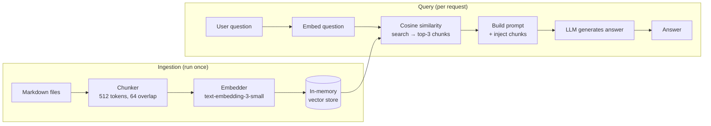

# POC: Build a RAG Pipeline

> **Difficulty:** 🟡 Intermediate
> **Time:** 45 minutes
> **Prerequisites:** Python 3.9+, OpenAI API key (or sentence-transformers for local embeddings)

## Quick Overview



*Two separate pipelines: build the index once offline, then query it at runtime.*

## What You'll Build

An end-to-end RAG (Retrieval-Augmented Generation) system entirely in Python with:

- **Ingestion pipeline**: Load `.md` files → chunk with overlap → embed → store in-memory
- **Query pipeline**: Embed query → top-K cosine similarity retrieval → LLM answer
- **Quality measurement**: Recall@K and MRR on a labeled test set
- **No external vector database needed**: uses NumPy for similarity search

---

## Problem Statement

LLMs hallucinate facts they weren't trained on. RAG solves this by retrieving relevant documents at query time and injecting them into the prompt — grounding the answer in real source material. Understanding how to build RAG from scratch (rather than just calling a LangChain helper) lets you tune every component: chunk size, overlap, embedding model, retrieval strategy, and prompt construction.

---

## Architecture Deep Dive

```
Chunk strategy matters enormously:

FIXED SIZE WITH OVERLAP:
  Text: [... A ... B ... C ... D ...]
                     ↑
              chunk boundary

  Chunk 1: [... A ... B ...]   (512 tokens)
  Chunk 2: [       B ... C ...]  (512 tokens, 64 overlap with chunk 1)
  Chunk 3: [           C ... D ...]

  Why overlap? Sentences that straddle a boundary are partially in both chunks.
  Without overlap they'd be cut in half and possibly unretrievable.

COSINE SIMILARITY:
  similarity(query, chunk) = dot(q_vec, c_vec) / (|q_vec| * |c_vec|)
  Range: -1 to 1.  Values above 0.7 are typically relevant.

RETRIEVAL QUALITY METRICS:
  Recall@K:  fraction of relevant docs that appear in top-K results
  MRR:       1/rank_of_first_relevant_result (higher = better)
  Precision@K: fraction of top-K results that are relevant
```

---

## Implementation

```python
# rag_pipeline.py
# End-to-end RAG: ingest markdown files, build vector index,
# answer questions with retrieved context.

import os
import json
import math
import re
from pathlib import Path
from typing import List, Tuple, Dict, Optional
from dataclasses import dataclass, field

# ── Dependencies ──────────────────────────────────────────────────────────────
# pip install openai numpy tiktoken
import numpy as np
import tiktoken
from openai import OpenAI

client = OpenAI(api_key=os.environ["OPENAI_API_KEY"])

EMBED_MODEL = "text-embedding-3-small"   # 1536-dim, cheap
CHAT_MODEL  = "gpt-4o-mini"
CHUNK_SIZE  = 512    # tokens per chunk
OVERLAP     = 64     # token overlap between consecutive chunks
TOP_K       = 3      # chunks to retrieve per query


# ── Data Structures ───────────────────────────────────────────────────────────

@dataclass
class Chunk:
    """A single text chunk from a source document."""
    chunk_id: str
    source_file: str
    text: str
    start_token: int
    end_token: int
    embedding: Optional[np.ndarray] = None


@dataclass
class VectorStore:
    """Simple in-memory vector store backed by NumPy."""
    chunks: List[Chunk] = field(default_factory=list)
    matrix: Optional[np.ndarray] = None   # shape: (n_chunks, embed_dim)

    def add(self, chunk: Chunk):
        self.chunks.append(chunk)

    def build_index(self):
        """Stack all embeddings into a matrix for fast batch cosine search."""
        vectors = np.array([c.embedding for c in self.chunks], dtype=np.float32)
        # L2-normalize each row so dot product == cosine similarity
        norms = np.linalg.norm(vectors, axis=1, keepdims=True)
        self.matrix = vectors / np.maximum(norms, 1e-9)
        print(f"  Index built: {self.matrix.shape[0]} chunks, dim={self.matrix.shape[1]}")

    def search(self, query_embedding: np.ndarray, k: int) -> List[Tuple[Chunk, float]]:
        """Return top-k chunks by cosine similarity."""
        if self.matrix is None:
            raise RuntimeError("Call build_index() before search()")

        q = query_embedding / np.maximum(np.linalg.norm(query_embedding), 1e-9)
        scores = self.matrix @ q                          # (n_chunks,)
        top_indices = np.argsort(scores)[::-1][:k]       # descending

        return [(self.chunks[i], float(scores[i])) for i in top_indices]


# ── Ingestion Pipeline ─────────────────────────────────────────────────────────

def load_markdown_files(directory: str) -> List[Tuple[str, str]]:
    """Load all .md files from a directory. Returns list of (filename, text)."""
    docs = []
    for path in Path(directory).rglob("*.md"):
        text = path.read_text(encoding="utf-8", errors="ignore")
        # Strip frontmatter (--- ... ---)
        text = re.sub(r"^---[\s\S]*?---\n", "", text, count=1).strip()
        if len(text) > 50:   # skip near-empty files
            docs.append((str(path), text))
            print(f"  Loaded: {path.name} ({len(text)} chars)")
    return docs


def chunk_text(source_file: str, text: str, chunk_size: int, overlap: int) -> List[Chunk]:
    """
    Split text into overlapping token-based chunks.
    Uses tiktoken for accurate token counting.
    """
    enc = tiktoken.get_encoding("cl100k_base")  # same encoding as text-embedding-3
    tokens = enc.encode(text)

    chunks = []
    start = 0
    chunk_index = 0

    while start < len(tokens):
        end = min(start + chunk_size, len(tokens))
        chunk_tokens = tokens[start:end]
        chunk_text_str = enc.decode(chunk_tokens)

        chunk = Chunk(
            chunk_id=f"{Path(source_file).stem}_{chunk_index}",
            source_file=source_file,
            text=chunk_text_str,
            start_token=start,
            end_token=end,
        )
        chunks.append(chunk)
        chunk_index += 1

        if end == len(tokens):
            break  # reached end of document

        start = end - overlap  # step forward, keeping overlap tokens

    return chunks


def embed_chunks(chunks: List[Chunk], batch_size: int = 100) -> List[Chunk]:
    """
    Embed all chunks using the OpenAI embedding API.
    Batches requests to stay within API limits.
    """
    print(f"\n  Embedding {len(chunks)} chunks in batches of {batch_size}...")

    for i in range(0, len(chunks), batch_size):
        batch = chunks[i : i + batch_size]
        texts = [c.text for c in batch]

        response = client.embeddings.create(model=EMBED_MODEL, input=texts)

        for j, embed_data in enumerate(response.data):
            batch[j].embedding = np.array(embed_data.embedding, dtype=np.float32)

        print(f"  Embedded {min(i + batch_size, len(chunks))}/{len(chunks)}")

    return chunks


def build_index(docs_directory: str) -> VectorStore:
    """Full ingestion pipeline: load → chunk → embed → index."""
    print("\n" + "="*55)
    print("INGESTION PIPELINE")
    print("="*55)

    store = VectorStore()

    print("\n[1/3] Loading documents...")
    docs = load_markdown_files(docs_directory)
    print(f"  Loaded {len(docs)} documents")

    print("\n[2/3] Chunking documents...")
    all_chunks: List[Chunk] = []
    for source_file, text in docs:
        chunks = chunk_text(source_file, text, CHUNK_SIZE, OVERLAP)
        all_chunks.extend(chunks)
        print(f"  {Path(source_file).name}: {len(chunks)} chunks")

    print(f"  Total chunks: {len(all_chunks)}")

    print("\n[3/3] Embedding chunks...")
    embedded_chunks = embed_chunks(all_chunks)

    for chunk in embedded_chunks:
        store.add(chunk)

    store.build_index()

    print(f"\n  Ingestion complete. Index has {len(store.chunks)} chunks.")
    return store


# ── Query Pipeline ─────────────────────────────────────────────────────────────

def embed_query(query: str) -> np.ndarray:
    """Embed a single query string."""
    response = client.embeddings.create(model=EMBED_MODEL, input=[query])
    return np.array(response.data[0].embedding, dtype=np.float32)


def retrieve(store: VectorStore, query: str, k: int = TOP_K) -> List[Tuple[Chunk, float]]:
    """Retrieve top-k chunks for a query."""
    query_vec = embed_query(query)
    results = store.search(query_vec, k=k)
    return results


def build_rag_prompt(query: str, retrieved: List[Tuple[Chunk, float]]) -> str:
    """Construct the prompt with retrieved context injected."""
    context_parts = []
    for i, (chunk, score) in enumerate(retrieved, 1):
        context_parts.append(
            f"[Source {i}: {Path(chunk.source_file).name}, similarity={score:.3f}]\n"
            f"{chunk.text}"
        )

    context_block = "\n\n---\n\n".join(context_parts)

    return f"""You are a helpful assistant. Answer the question using ONLY the provided context.
If the context does not contain enough information to answer, say "I don't have enough information."
Do not use knowledge outside of the provided context.

CONTEXT:
{context_block}

QUESTION: {query}

ANSWER:"""


def answer(store: VectorStore, query: str) -> Dict:
    """
    Full query pipeline:
    1. Embed query
    2. Retrieve top-K chunks
    3. Build prompt
    4. Generate answer
    """
    print(f"\n[QUERY] {query}")

    # Step 1 + 2: Retrieve
    retrieved = retrieve(store, query, k=TOP_K)

    print(f"[RETRIEVED] {len(retrieved)} chunks:")
    for chunk, score in retrieved:
        preview = chunk.text[:80].replace("\n", " ")
        print(f"  score={score:.3f}  chunk={chunk.chunk_id}  preview={preview}...")

    # Step 3: Build prompt
    prompt = build_rag_prompt(query, retrieved)

    # Step 4: Generate answer
    response = client.chat.completions.create(
        model=CHAT_MODEL,
        messages=[{"role": "user", "content": prompt}],
        max_tokens=512,
        temperature=0,   # deterministic for RAG (no hallucination)
    )

    answer_text = response.choices[0].message.content.strip()
    print(f"[ANSWER] {answer_text[:200]}...")

    return {
        "query": query,
        "answer": answer_text,
        "sources": [
            {"chunk_id": c.chunk_id, "file": c.source_file, "score": float(s)}
            for c, s in retrieved
        ],
        "tokens_used": response.usage.total_tokens,
    }


# ── Retrieval Quality Measurement ─────────────────────────────────────────────

def evaluate_retrieval(store: VectorStore, test_cases: List[Dict]) -> Dict:
    """
    Measure retrieval quality on a labeled test set.

    Each test case: {"query": str, "relevant_chunk_ids": [str, ...]}

    Returns:
      recall@K: fraction of relevant chunks that appeared in top-K
      mrr:      mean reciprocal rank of first relevant chunk
      precision@K: fraction of top-K that were relevant
    """
    print("\n" + "="*55)
    print("RETRIEVAL QUALITY EVALUATION")
    print("="*55)

    recall_sum = 0.0
    mrr_sum    = 0.0
    precision_sum = 0.0

    for tc in test_cases:
        query    = tc["query"]
        relevant = set(tc["relevant_chunk_ids"])

        retrieved = retrieve(store, query, k=TOP_K)
        retrieved_ids = [c.chunk_id for c, _ in retrieved]

        # Recall@K
        hits = sum(1 for cid in retrieved_ids if cid in relevant)
        recall = hits / len(relevant) if relevant else 0.0
        recall_sum += recall

        # MRR
        rr = 0.0
        for rank, cid in enumerate(retrieved_ids, 1):
            if cid in relevant:
                rr = 1.0 / rank
                break
        mrr_sum += rr

        # Precision@K
        precision = hits / len(retrieved_ids) if retrieved_ids else 0.0
        precision_sum += precision

        print(f"  Query: {query[:50]}")
        print(f"    Recall@{TOP_K}={recall:.2f}  MRR={rr:.2f}  Precision@{TOP_K}={precision:.2f}")

    n = len(test_cases)
    metrics = {
        f"recall@{TOP_K}": round(recall_sum / n, 3),
        "mrr": round(mrr_sum / n, 3),
        f"precision@{TOP_K}": round(precision_sum / n, 3),
    }

    print(f"\nAggregate across {n} test cases:")
    for k, v in metrics.items():
        print(f"  {k}: {v}")

    return metrics


# ── Demo: Create sample documents ─────────────────────────────────────────────

SAMPLE_DOCS = {
    "caching.md": """# Caching Fundamentals

## What is Caching?
Caching stores copies of frequently accessed data in a fast storage layer.
The primary goal is to reduce latency and database load.

## Cache-Aside Pattern
In cache-aside (lazy loading), the application checks the cache first.
On a miss, it loads from the database and populates the cache.
TTL values of 300-3600 seconds are common for product data.

## Cache Eviction Policies
LRU (Least Recently Used): evicts the item that was accessed least recently.
LFU (Least Frequently Used): evicts the item accessed the fewest times.
FIFO: evicts the oldest item regardless of access pattern.

## Redis vs Memcached
Redis supports data structures (lists, sets, sorted sets) and persistence.
Memcached is simpler, faster for pure string key-value at high throughput.
Use Redis when you need persistence or advanced data types.
""",
    "databases.md": """# Database Fundamentals

## Indexing
Indexes speed up read queries at the cost of write performance.
A B-tree index is the default in PostgreSQL and MySQL.
Covering indexes include all columns needed by a query, avoiding table lookups.

## ACID Properties
Atomicity: all operations in a transaction succeed or all fail.
Consistency: the database moves from one valid state to another.
Isolation: concurrent transactions do not interfere with each other.
Durability: committed transactions survive crashes.

## Replication
Primary-replica replication sends writes to the primary.
Replicas receive changes via WAL (write-ahead log) streaming.
Read queries can be distributed to replicas to scale read throughput.
Replication lag of 1-100ms is typical on the same datacenter.

## Sharding
Sharding splits data across multiple database nodes.
Hash-based sharding distributes rows evenly but makes range queries hard.
Range-based sharding supports range queries but risks hot partitions.
""",
    "message-queues.md": """# Message Queues

## Why Use a Queue?
Queues decouple producers from consumers.
A producer can continue working even if the consumer is slow or down.
Common uses: email sending, image resizing, notifications, payment processing.

## Kafka vs RabbitMQ
Kafka stores messages on disk for days/weeks — consumers can replay.
RabbitMQ acknowledges and deletes messages after consumption.
Kafka throughput: 1-10 million messages/second per broker.
RabbitMQ throughput: ~50,000 messages/second per broker.

## Consumer Groups
Multiple consumers in a group share the partitions of a topic.
Each partition is assigned to exactly one consumer per group.
This provides horizontal scaling for message processing.

## Dead Letter Queue
Messages that fail processing are moved to a DLQ after N retries.
Operators can inspect DLQ messages, fix the issue, and replay them.
""",
}


def create_sample_docs(directory: str):
    """Write sample markdown files for the demo."""
    Path(directory).mkdir(parents=True, exist_ok=True)
    for filename, content in SAMPLE_DOCS.items():
        (Path(directory) / filename).write_text(content)
    print(f"Created {len(SAMPLE_DOCS)} sample documents in {directory}/")


# ── Main ───────────────────────────────────────────────────────────────────────

def main():
    DOCS_DIR = "./sample-docs"

    # Step 0: Create sample documents
    print("Creating sample documents...")
    create_sample_docs(DOCS_DIR)

    # Step 1: Build the index (run once — expensive due to embedding API calls)
    store = build_index(DOCS_DIR)

    # Step 2: Answer some questions
    print("\n" + "="*55)
    print("QUERY PIPELINE")
    print("="*55)

    questions = [
        "What is the difference between Redis and Memcached?",
        "How does cache-aside pattern work?",
        "What is replication lag?",
        "How does Kafka compare to RabbitMQ for throughput?",
        "What does the Atomicity property mean in databases?",
    ]

    results = []
    for question in questions:
        result = answer(store, question)
        results.append(result)
        print()

    # Step 3: Evaluate retrieval quality (requires labeled ground truth)
    # In production you'd build this from user feedback / human labeling
    test_cases = [
        {
            "query": "Redis vs Memcached",
            "relevant_chunk_ids": ["caching_1"],  # chunk from caching.md
        },
        {
            "query": "What is ACID?",
            "relevant_chunk_ids": ["databases_1"],
        },
        {
            "query": "Kafka throughput",
            "relevant_chunk_ids": ["message-queues_1"],
        },
    ]

    metrics = evaluate_retrieval(store, test_cases)

    # Step 4: Save results
    output = {
        "answers": results,
        "retrieval_metrics": metrics,
        "config": {
            "embed_model": EMBED_MODEL,
            "chat_model": CHAT_MODEL,
            "chunk_size": CHUNK_SIZE,
            "overlap": OVERLAP,
            "top_k": TOP_K,
        },
    }
    with open("rag_results.json", "w") as f:
        json.dump(output, f, indent=2)

    print("\nResults saved to rag_results.json")


if __name__ == "__main__":
    main()
```

---

## Setup

```bash
# Install dependencies
pip install openai numpy tiktoken

# Set your API key
export OPENAI_API_KEY="sk-..."

# Run the full pipeline
python rag_pipeline.py
```

### Local Embeddings (no API key required)

To avoid API costs during development, replace `embed_chunks` with sentence-transformers:

```python
# pip install sentence-transformers
from sentence_transformers import SentenceTransformer

model = SentenceTransformer("all-MiniLM-L6-v2")   # 384-dim, fast, free

def embed_chunks_local(chunks: List[Chunk]) -> List[Chunk]:
    texts = [c.text for c in chunks]
    vectors = model.encode(texts, batch_size=32, show_progress_bar=True)
    for i, chunk in enumerate(chunks):
        chunk.embedding = vectors[i].astype(np.float32)
    return chunks

def embed_query_local(query: str) -> np.ndarray:
    return model.encode([query])[0].astype(np.float32)
```

---

## Expected Output

```
Creating sample documents...
Created 3 sample documents in sample-docs/

===================================================
INGESTION PIPELINE
===================================================

[1/3] Loading documents...
  Loaded: caching.md (1024 chars)
  Loaded: databases.md (1187 chars)
  Loaded: message-queues.md (1056 chars)
  Loaded 3 documents

[2/3] Chunking documents...
  caching.md: 2 chunks
  databases.md: 3 chunks
  message-queues.md: 2 chunks
  Total chunks: 7

[3/3] Embedding chunks...
  Embedded 7/7
  Index built: 7 chunks, dim=1536

  Ingestion complete. Index has 7 chunks.

===================================================
QUERY PIPELINE
===================================================

[QUERY] What is the difference between Redis and Memcached?
[RETRIEVED] 3 chunks:
  score=0.847  chunk=caching_1  preview=## Redis vs Memcached Redis supports data structures...
  score=0.612  chunk=caching_0  preview=## What is Caching? Caching stores copies of frequently...
  score=0.441  chunk=databases_0  preview=## Indexing Indexes speed up read queries at the cost...
[ANSWER] Redis supports data structures (lists, sets, sorted sets) and persistence,
while Memcached is simpler and faster for pure string key-value storage at high
throughput. Use Redis when you need persistence or advanced data types...
```

---

## Key Observations

| Parameter | Effect of Increasing | Effect of Decreasing |
|-----------|---------------------|---------------------|
| `CHUNK_SIZE` | Longer context per chunk, fewer chunks, may dilute relevance | More precise chunks, more API calls, may cut sentences |
| `OVERLAP` | Better coverage of sentence boundaries, slightly larger index | Risk of missing boundary-spanning content |
| `TOP_K` | More context for LLM, higher token cost, more noise | Faster, cheaper, but may miss relevant info |

### Retrieval Failure Modes

- **Lexical mismatch**: query uses "latency" but docs say "response time" — embeddings usually handle this, but not always
- **Chunk boundary cuts key sentence**: increase overlap or use sentence-aware chunking
- **Wrong top-K**: retrieved chunk score is low (< 0.5) — consider adding a score threshold

---

## Extension Ideas

- **Hybrid search**: Combine BM25 (keyword) with embedding similarity using RRF (Reciprocal Rank Fusion) — often 10-15% better recall
- **Reranking**: After top-20 cosine retrieval, use a cross-encoder to rerank to top-3
- **Persistent index**: Replace in-memory store with Chroma, FAISS, or Qdrant
- **Metadata filtering**: Add document date/category to Chunk and filter before similarity search
- **Chunking strategies**: Try sentence-window chunking (embed sentence, store surrounding window)

---

## Key Takeaways

- RAG = two separate pipelines: ingestion (build index once) and query (retrieve + generate at runtime)
- Chunk size and overlap are the two most impactful tuning parameters
- Cosine similarity on normalized vectors reduces to a dot product — NumPy handles thousands of chunks in milliseconds
- Measure Recall@K to know if your retriever is finding the right chunks before blaming the LLM
- Local embeddings (sentence-transformers) are fine for development; switch to API embeddings for production quality
