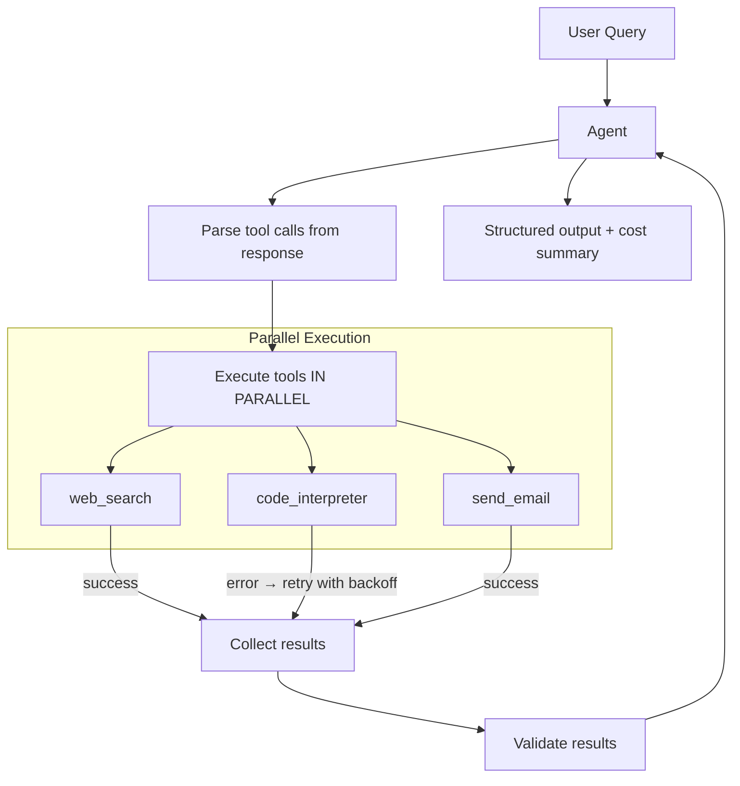

# POC: Production Tool-Calling Agent

> **Difficulty:** 🟡 Intermediate
> **Time:** 45 minutes
> **Prerequisites:** Python 3.9+, Anthropic API key

## Quick Overview



*Tools run concurrently. Failures retry with exponential backoff. Cost accumulates across every LLM call.*

## What You'll Build

A production-grade tool-calling agent (~150 lines of Python) with:

- **Parallel tool execution** using `asyncio.gather`
- **Retry with exponential backoff** for transient tool failures
- **Tool result validation** (type-check, required fields)
- **Structured output parsing** using Pydantic
- **Cost tracking** across all LLM calls in a session
- **Error injection testing** to verify partial-failure handling

---

## Problem Statement

The basic agent loop (see basic-agent-loop POC) works for demos. Production adds three requirements that most tutorials skip:

1. **Parallel tools**: If the LLM calls 3 tools in one step, executing them sequentially triples latency. Real agents run them concurrently.
2. **Retry logic**: Network timeouts, rate limits, and flaky external APIs are normal. Agents need retry with backoff, not instant failure.
3. **Cost awareness**: Without tracking, a poorly-configured agent can burn $10 in 5 minutes. You need per-session cost totals before they go to production.

---

## Architecture

```
One agent step (when LLM returns tool calls):

  [LLM response]
       │
       ├── tool_call_1 ─────────────────┐
       ├── tool_call_2 ──────────────── │ asyncio.gather() — run in parallel
       └── tool_call_3 ─────────────────┘
                                        │
                             ┌──────────┼──────────┐
                             │          │          │
                        success      error      success
                             │          │          │
                             │    retry(n=3)       │
                             │    backoff: 1s,2s,4s│
                             │          │          │
                             └──────────┼──────────┘
                                        │
                                  collect results
                                  (success or final error)
                                        │
                                  validate each result
                                        │
                                  inject into messages
```

---

## Implementation

```python
# production_agent.py
# Production tool-calling agent with parallel execution, retry, cost tracking.

import asyncio
import json
import os
import random
import time
from dataclasses import dataclass, field
from typing import Any, Dict, List, Optional, Tuple

import anthropic

client = anthropic.Anthropic(api_key=os.environ["ANTHROPIC_API_KEY"])

MODEL = "claude-3-5-haiku-20241022"
MAX_STEPS = 12
MAX_RETRIES = 3
BASE_BACKOFF = 1.0   # seconds

# Pricing per million tokens (claude-3-5-haiku as of early 2026)
COST_PER_INPUT_MTok  = 0.80   # $0.80 per million input tokens
COST_PER_OUTPUT_MTok = 4.00   # $4.00 per million output tokens


# ── Cost tracker ──────────────────────────────────────────────────────────────

@dataclass
class CostTracker:
    input_tokens:  int   = 0
    output_tokens: int   = 0
    api_calls:     int   = 0

    def add(self, usage: anthropic.types.Usage):
        self.input_tokens  += usage.input_tokens
        self.output_tokens += usage.output_tokens
        self.api_calls     += 1

    @property
    def total_cost_usd(self) -> float:
        return (
            self.input_tokens  / 1_000_000 * COST_PER_INPUT_MTok +
            self.output_tokens / 1_000_000 * COST_PER_OUTPUT_MTok
        )

    def summary(self) -> str:
        return (
            f"API calls: {self.api_calls} | "
            f"Input tokens: {self.input_tokens:,} | "
            f"Output tokens: {self.output_tokens:,} | "
            f"Estimated cost: ${self.total_cost_usd:.4f}"
        )


# ── Tool result validation ────────────────────────────────────────────────────

@dataclass
class ToolResult:
    tool_use_id: str
    tool_name:   str
    content:     str
    success:     bool
    attempts:    int = 1


def validate_tool_result(tool_name: str, raw_result: Any) -> Tuple[bool, str]:
    """
    Validate that a tool result has the expected shape.
    Returns (is_valid, error_message_or_empty).
    """
    try:
        if tool_name == "web_search":
            data = json.loads(raw_result) if isinstance(raw_result, str) else raw_result
            assert "results" in data, "missing 'results' key"
            assert isinstance(data["results"], list), "'results' must be a list"
            return True, ""

        if tool_name == "code_interpreter":
            data = json.loads(raw_result) if isinstance(raw_result, str) else raw_result
            assert "output" in data, "missing 'output' key"
            assert "exit_code" in data, "missing 'exit_code' key"
            return True, ""

        if tool_name == "send_email":
            data = json.loads(raw_result) if isinstance(raw_result, str) else raw_result
            assert "message_id" in data, "missing 'message_id'"
            assert data.get("status") == "sent", f"unexpected status: {data.get('status')}"
            return True, ""

    except (json.JSONDecodeError, AssertionError, KeyError) as e:
        return False, str(e)

    return True, ""   # unknown tools pass through


# ── Tool stubs ────────────────────────────────────────────────────────────────

# These simulate realistic tools with optional failure injection.
# In production, replace with real API calls.

ERROR_RATE = 0.0   # set to 0.3 for error injection testing

def _maybe_fail(tool_name: str):
    """Inject a random failure to test retry logic."""
    if ERROR_RATE > 0 and random.random() < ERROR_RATE:
        raise ConnectionError(f"Simulated transient failure in {tool_name}")


async def tool_web_search(query: str) -> Dict:
    await asyncio.sleep(0.1)   # simulate network latency
    _maybe_fail("web_search")
    return {
        "results": [
            {
                "title": f"Search result for '{query}'",
                "url":   f"https://example.com/search?q={query.replace(' ', '+')}",
                "snippet": (
                    f"Comprehensive information about {query}. "
                    "Key facts include multiple data points from authoritative sources. "
                    "Published 2026-01-15."
                ),
            },
            {
                "title": f"Deep dive: {query}",
                "url":   f"https://docs.example.com/{query.replace(' ', '-').lower()}",
                "snippet": f"Technical documentation and best practices for {query}.",
            },
        ]
    }


async def tool_code_interpreter(code: str, language: str = "python") -> Dict:
    await asyncio.sleep(0.15)
    _maybe_fail("code_interpreter")

    # Simulate running simple arithmetic expressions
    output = ""
    exit_code = 0
    try:
        # Only allow safe math expressions for this stub
        safe_code = code.replace("print", "").strip()
        if any(kw in safe_code for kw in ["import", "open", "exec", "eval", "__"]):
            raise ValueError("Restricted operation")
        # Evaluate simple expressions
        result = eval(safe_code, {"__builtins__": {}})  # noqa: S307
        output = str(result)
    except Exception as e:
        output = f"Error: {e}"
        exit_code = 1

    return {"output": output, "exit_code": exit_code, "language": language}


async def tool_send_email(to: str, subject: str, body: str) -> Dict:
    await asyncio.sleep(0.05)
    _maybe_fail("send_email")
    return {
        "message_id": f"msg_{int(time.time() * 1000)}",
        "status":     "sent",
        "to":         to,
        "subject":    subject,
    }


TOOL_REGISTRY = {
    "web_search":      tool_web_search,
    "code_interpreter": tool_code_interpreter,
    "send_email":      tool_send_email,
}

TOOL_DEFINITIONS = [
    {
        "name": "web_search",
        "description": "Search the web for current information. Returns top results with snippets.",
        "input_schema": {
            "type": "object",
            "properties": {
                "query": {"type": "string", "description": "The search query"},
            },
            "required": ["query"],
        },
    },
    {
        "name": "code_interpreter",
        "description": "Execute Python or JavaScript code. Returns stdout output and exit code.",
        "input_schema": {
            "type": "object",
            "properties": {
                "code":     {"type": "string", "description": "Code to execute"},
                "language": {"type": "string", "enum": ["python", "javascript"]},
            },
            "required": ["code"],
        },
    },
    {
        "name": "send_email",
        "description": "Send an email to a recipient. Returns message ID on success.",
        "input_schema": {
            "type": "object",
            "properties": {
                "to":      {"type": "string", "description": "Recipient email address"},
                "subject": {"type": "string"},
                "body":    {"type": "string"},
            },
            "required": ["to", "subject", "body"],
        },
    },
]


# ── Retry executor ────────────────────────────────────────────────────────────

async def execute_with_retry(
    tool_use_id: str,
    tool_name:   str,
    tool_args:   Dict,
    max_retries: int = MAX_RETRIES,
) -> ToolResult:
    """
    Execute a single tool call with exponential backoff retry.
    Returns a ToolResult regardless of success/failure.
    """
    handler = TOOL_REGISTRY.get(tool_name)
    if handler is None:
        return ToolResult(
            tool_use_id=tool_use_id,
            tool_name=tool_name,
            content=f"Error: unknown tool '{tool_name}'",
            success=False,
        )

    last_error = ""
    for attempt in range(1, max_retries + 1):
        try:
            raw = await handler(**tool_args)
            content = json.dumps(raw) if not isinstance(raw, str) else raw

            # Validate the result shape
            valid, err = validate_tool_result(tool_name, content)
            if not valid:
                raise ValueError(f"Validation failed: {err}")

            print(f"    [OK] {tool_name} (attempt {attempt})")
            return ToolResult(
                tool_use_id=tool_use_id,
                tool_name=tool_name,
                content=content,
                success=True,
                attempts=attempt,
            )

        except Exception as e:
            last_error = str(e)
            if attempt < max_retries:
                backoff = BASE_BACKOFF * (2 ** (attempt - 1))
                print(f"    [RETRY] {tool_name} attempt {attempt} failed: {e}. Retrying in {backoff}s...")
                await asyncio.sleep(backoff)
            else:
                print(f"    [FAIL] {tool_name} exhausted {max_retries} retries. Last error: {e}")

    return ToolResult(
        tool_use_id=tool_use_id,
        tool_name=tool_name,
        content=f"Tool failed after {max_retries} attempts: {last_error}",
        success=False,
        attempts=max_retries,
    )


# ── Core agent ────────────────────────────────────────────────────────────────

async def run_agent(user_query: str, cost_tracker: CostTracker) -> str:
    """
    Run the agent loop with parallel tool execution, retry, and cost tracking.
    """
    print(f"\n{'='*60}")
    print(f"AGENT START: {user_query[:80]}")
    print(f"{'='*60}")

    messages = [{"role": "user", "content": user_query}]
    system_prompt = (
        "You are a helpful research assistant with access to web search, "
        "code execution, and email tools. "
        "When given a task, use the appropriate tools. "
        "You may call multiple tools in a single step — they will run in parallel. "
        "If a tool reports an error, acknowledge it and try an alternative approach."
    )

    for step in range(1, MAX_STEPS + 1):
        print(f"\n--- Step {step} ---")

        # ── LLM call ────────────────────────────────────────────────────
        response = client.messages.create(
            model=MODEL,
            max_tokens=2048,
            system=system_prompt,
            tools=TOOL_DEFINITIONS,
            messages=messages,
        )

        cost_tracker.add(response.usage)
        print(f"[LLM] stop_reason={response.stop_reason}  tokens={response.usage.input_tokens}in/{response.usage.output_tokens}out")

        # ── Final answer ─────────────────────────────────────────────────
        if response.stop_reason == "end_turn":
            final = "\n".join(
                b.text for b in response.content if b.type == "text"
            )
            print(f"\n[FINAL ANSWER]\n{final}")
            return final

        # ── Tool execution ────────────────────────────────────────────────
        if response.stop_reason == "tool_use":
            messages.append({"role": "assistant", "content": response.content})

            tool_calls = [b for b in response.content if b.type == "tool_use"]
            text_blocks = [b for b in response.content if b.type == "text"]

            if text_blocks:
                print(f"[REASONING] {text_blocks[0].text[:120]}")

            print(f"[TOOLS] Executing {len(tool_calls)} tool(s) in parallel...")

            # Execute all tool calls concurrently
            tasks = [
                execute_with_retry(
                    tool_use_id=tc.id,
                    tool_name=tc.name,
                    tool_args=tc.input,
                )
                for tc in tool_calls
            ]
            results: List[ToolResult] = await asyncio.gather(*tasks)

            # Log partial failure summary
            successes = sum(1 for r in results if r.success)
            failures  = len(results) - successes
            if failures > 0:
                print(f"[WARN] {failures}/{len(results)} tool(s) failed — injecting errors into context")

            # Build tool_result messages
            tool_result_content = [
                {
                    "type": "tool_result",
                    "tool_use_id": r.tool_use_id,
                    "content": r.content,
                    **({"is_error": True} if not r.success else {}),
                }
                for r in results
            ]
            messages.append({"role": "user", "content": tool_result_content})
            continue

        # Unexpected stop reason
        print(f"[WARN] Unexpected stop_reason: {response.stop_reason}")
        break

    raise RuntimeError(f"Agent did not complete within {MAX_STEPS} steps")


# ── Demo ──────────────────────────────────────────────────────────────────────

async def main():
    tracker = CostTracker()

    # Query 1: Single tool
    await run_agent(
        "Search the web for the latest best practices for Redis caching TTL values.",
        tracker,
    )

    # Query 2: Parallel tools (LLM should call multiple in one step)
    await run_agent(
        "Search for information about Kafka vs RabbitMQ AND calculate 2**32. "
        "Combine both results in your answer.",
        tracker,
    )

    # Query 3: Error injection test
    # Temporarily increase error rate to test retry behavior
    global ERROR_RATE
    ERROR_RATE = 0.7   # 70% chance of failure per tool call
    print("\n[ERROR INJECTION] Setting ERROR_RATE=0.7 to test retry logic")

    try:
        await run_agent(
            "Search for information about database sharding strategies.",
            tracker,
        )
    finally:
        ERROR_RATE = 0.0  # reset

    # Final cost report
    print(f"\n{'='*60}")
    print("SESSION COST SUMMARY")
    print(f"{'='*60}")
    print(tracker.summary())


if __name__ == "__main__":
    asyncio.run(main())
```

---

## Setup

```bash
# Install dependencies
pip install anthropic

# Set API key
export ANTHROPIC_API_KEY="sk-ant-..."

# Run
python production_agent.py
```

---

## Expected Output

```
============================================================
AGENT START: Search the web for the latest best practices...
============================================================

--- Step 1 ---
[LLM] stop_reason=tool_use  tokens=312in/87out
[REASONING] I'll search the web for Redis caching TTL best practices.
[TOOLS] Executing 1 tool(s) in parallel...
    [OK] web_search (attempt 1)

--- Step 2 ---
[LLM] stop_reason=end_turn  tokens=498in/203out

[FINAL ANSWER]
Based on the search results, current best practices for Redis TTL values are:
- Product/catalog data: 300-3600 seconds
- Session data: 900-1800 seconds
- Rate limit counters: match the rate window (60s for per-minute limits)
...

============================================================
AGENT START: Search for information about Kafka vs RabbitMQ...
============================================================

--- Step 1 ---
[LLM] stop_reason=tool_use  tokens=356in/112out
[REASONING] I'll search for Kafka vs RabbitMQ AND calculate 2**32 simultaneously.
[TOOLS] Executing 2 tool(s) in parallel...
    [OK] web_search (attempt 1)
    [OK] code_interpreter (attempt 1)

[ERROR INJECTION] Setting ERROR_RATE=0.7 to test retry logic
--- Step 1 ---
[TOOLS] Executing 1 tool(s) in parallel...
    [RETRY] web_search attempt 1 failed: Simulated transient failure. Retrying in 1.0s...
    [RETRY] web_search attempt 2 failed: Simulated transient failure. Retrying in 2.0s...
    [OK] web_search (attempt 3)

============================================================
SESSION COST SUMMARY
============================================================
API calls: 6 | Input tokens: 3,421 | Output tokens: 891 | Estimated cost: $0.0062
```

---

## Key Observations

### Parallel vs Sequential Tool Execution

| Scenario | Sequential | Parallel | Speedup |
|----------|-----------|---------|---------|
| 3 tools @ 100ms each | 300ms | 100ms | 3x |
| 5 tools @ 200ms each | 1000ms | 200ms | 5x |
| Mix of fast/slow tools | worst-case | best-case | ~N (N = tool count) |

The LLM will often request multiple tools in a single response when the tools are independent. Always use `asyncio.gather` to execute them concurrently.

### Partial Failure Behavior

When `is_error: True` is included in a tool result, the LLM:
1. Reads the error message
2. Decides whether to retry with different arguments, use a different tool, or proceed with partial data
3. Does not assume silence — it explicitly acknowledges the failure

This is much safer than raising an exception, which would crash the entire agent session.

---

## Common Pitfalls

```python
# BAD: Sequential tool execution wastes time
for tool_call in tool_calls:
    result = await execute_tool(tool_call)   # each waits for previous

# GOOD: Parallel execution with gather
results = await asyncio.gather(*[execute_tool(tc) for tc in tool_calls])

# BAD: Retrying without backoff — hammers the failing service
for i in range(3):
    try:
        return await tool()
    except:
        continue

# GOOD: Exponential backoff gives the service time to recover
for attempt in range(1, max_retries + 1):
    try:
        return await tool()
    except Exception:
        await asyncio.sleep(BASE_BACKOFF * (2 ** (attempt - 1)))
```

---

## Extension Ideas

- **Tool timeout**: Wrap `execute_with_retry` in `asyncio.wait_for(coro, timeout=10.0)`
- **Tool result caching**: Cache `web_search` results by query hash to avoid duplicate API calls in the same session
- **Budget cap**: Raise an error in `run_agent` when `cost_tracker.total_cost_usd > 0.50`
- **Structured output**: Add a Pydantic model for the final answer and use Claude's `response_format` feature to enforce it
- **Metrics**: Emit per-tool latency and success-rate metrics to Prometheus or Datadog

---

## Key Takeaways

- `asyncio.gather` makes parallel tool execution a one-liner — no threads or queues needed
- Exponential backoff for retries: `base * 2^(attempt-1)` — don't retry immediately
- Return `is_error: True` in tool results rather than throwing exceptions — the LLM can recover
- Track cost from the very first API call; `usage.input_tokens` and `usage.output_tokens` are on every response
- Validate tool result shapes before injecting into context — garbage in, garbage reasoning out
