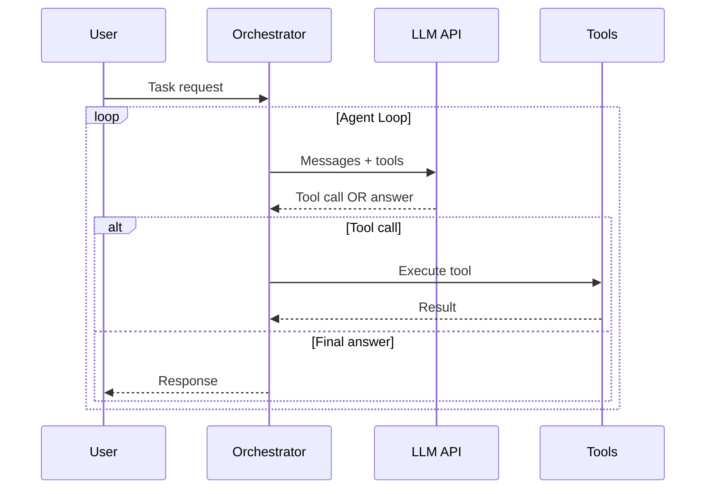

# AI Agent Workflows

AI agents are the next evolution beyond plain LLM calls. Instead of a single prompt → response, an agent runs a loop: it reasons, picks a tool, executes it, sees the result, and keeps going until the task is done. This section teaches you how to design, build, evaluate, and operate agents in production.



## Who This Is For

- **Backend engineers** adding AI capabilities to existing systems
- **ML engineers** building agentic pipelines
- **System designers** who need to reason about agent architecture at scale
- **Anyone** who wants to understand how tools like Claude Code, GitHub Copilot, and ChatGPT Plugins actually work under the hood

## Learning Path

Start with concepts, then apply them in hands-on exercises, explore real platform implementations, and finally learn what can go wrong (and how to prevent it).

```
Concepts → Hands-On → Platforms → Failure Modes
   ↓            ↓          ↓            ↓
 Theory      Working     Real tools   What breaks
            examples    deep-dives    in prod
```

## Section Map

| Subsection | What You'll Learn | Level |
|------------|------------------|-------|
| [📖 Concepts](./concepts) | Core agent patterns: ReAct, tool use, memory, orchestration, safety, MCP | 🟢 → ⚫ |
| [🔬 Hands-On](./hands-on) | Runnable pseudocode exercises for each pattern | 🟢 → 🔴 |
| [🛠️ Platforms](./platforms) | LangChain, LangGraph, AutoGen, CrewAI, Claude API deep-dives | 🟡 → ⚫ |
| [⚠️ Failure Modes](./failures) | What breaks in production agents and how to fix it | 🔴 → ⚫ |
| [📋 Case Studies](./case-studies) | OpenClaw production architecture analysed end-to-end; domain adaptation guide | 🔴 → ⚫ |

## Concepts at a Glance

29 concept articles total. Start with the learning roadmap if you're new.

### Foundations (Beginner)
0. [From Zero to Production Agent](./concepts/from-zero-to-production-agent) — The complete 6-stage learning path
1. [What is an AI Agent?](./concepts/what-is-an-agent) — LLM + memory + tools + action loop
2. [LLM Fundamentals for Agent Builders](./concepts/llm-fundamentals-for-agents) — Tokens, context windows, model selection
3. [ReAct Pattern](./concepts/react-pattern) — Reason + Act interleaved
4. [Tool Use & Function Calling](./concepts/tool-use-function-calling) — How agents call external code

### Architecture (Intermediate)
5. [Prompt Engineering for Agents](./concepts/prompt-engineering-for-agents) — System prompts that work across 100s of queries
6. [Agent Memory Types](./concepts/agent-memory-types) — In-context, vector, episodic, semantic
7. [Single-Agent Architecture](./concepts/single-agent-architecture) — When one agent is enough
8. [Multi-Agent Systems](./concepts/multi-agent-systems) — Parallelism, specialization, topologies
9. [Orchestrator-Worker Pattern](./concepts/orchestrator-worker-pattern) — Delegating sub-tasks
10. [RAG Deep Dive](./concepts/rag-deep-dive) — Grounding agents in real documents
11. [Structured Output & JSON Mode](./concepts/structured-output) — Machine-readable agent responses
12. [Agent Routing & Intent Classification](./concepts/agent-routing) — Directing messages to the right agent

### Advanced Patterns (Advanced)
13. [Hierarchical Multi-Agent](./concepts/hierarchical-multi-agent) — Multi-level coordination
14. [Agent Communication Protocols](./concepts/agent-communication-protocols) — How agents talk
15. [Long-Running Agents](./concepts/long-running-agents) — Checkpointing, async, human-in-loop
16. [Human-in-the-Loop Workflows](./concepts/human-in-the-loop) — Pausing for human approval
17. [Agent Planning Patterns](./concepts/planning-patterns) — Plan-and-Execute, Tree-of-Thought
18. [Context Window Management](./concepts/context-window-management) — Compaction, summarization, truncation
19. [Agent Evaluation & Testing](./concepts/agent-evaluation-testing) — Non-deterministic testing
20. [Cost Control for Agents](./concepts/cost-control-agents) — Token budgets, model routing
21. [Multi-Model Routing & Fallback](./concepts/multi-model-routing) — Route tasks to cheaper models
22. [Agent Observability](./concepts/agent-observability) — Tracing, metrics, alerts
23. [Safety & Guardrails](./concepts/safety-guardrails) — Input/output filtering, action limits
24. [Agent-to-Agent Protocol (A2A)](./concepts/agent-to-agent-protocol) — Inter-agent communication standard
25. [Agent Client Protocol (ACP)](./concepts/agent-client-protocol) — Client-agent communication standard

### Expert Patterns (Expert)
26. [Model Context Protocol](./concepts/model-context-protocol) — Anthropic's standard for tool interop
27. [LangGraph Stateful Agents](./concepts/langgraph-stateful-agents) — Graph-based agent workflows
28. [Agent Tool Registry](./concepts/agent-tool-registry) — Dynamic tool discovery at scale

## Key Mental Models

**Agent ≠ Chatbot**: A chatbot responds. An agent acts. Agents can read files, run code, call APIs, search the web, and coordinate with other agents — all autonomously.

**The action loop is the core primitive**: Every agent, from simple to expert-level, runs a loop: perceive → decide → act → observe → repeat.

**Context is the bottleneck**: Every token in an agent's context costs money and adds latency. Most agent design decisions are about managing what goes in the context and what gets offloaded to memory or tools.

**Failure modes compound**: In a 10-step agent, a 5% per-step error rate gives you a ~40% chance of failure. Reliability engineering matters more for agents than for single LLM calls.

## Case Studies

Three in-depth articles analysing OpenClaw — a self-hosted production multi-agent gateway — from architecture to domain adaptation.

| Article | What You'll Learn |
|---------|------------------|
| [OpenClaw: Architecture Deep Dive](./case-studies/openclaw-architecture) | Five-layer architecture, context compaction, auth rotation, multi-channel routing |
| [OpenClaw: Agent Patterns Extracted](./case-studies/openclaw-patterns) | 8 standalone patterns you can apply to any agent system |
| [Adapting OpenClaw Patterns to Your Domain](./case-studies/openclaw-domain-adaptation) | Legal, healthcare, e-commerce walkthroughs; 8-step adaptation process |

These are **advanced** articles. Read them after completing at least Stage 3 of the [learning path](./concepts/from-zero-to-production-agent).
