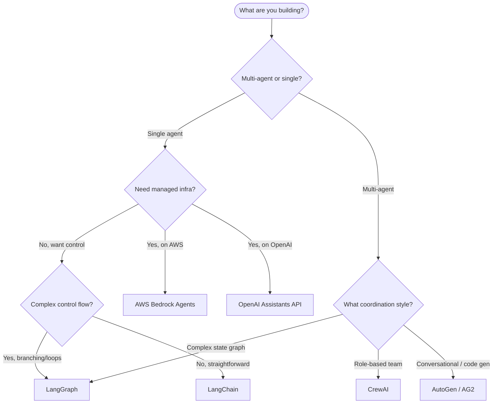

# Agent Platforms & Frameworks

**Reading Time**: 5 minutes

> Choosing a framework is choosing a set of trade-offs. This page maps each platform to the problems it solves best.

## Quick Comparison

| Framework | Model-Agnostic | State Management | Multi-Agent | Best For | Cost |
|-----------|---------------|-----------------|-------------|----------|------|
| [LangChain](./langchain) | Yes (100+ LLMs) | Limited (Memory objects) | Awkward | RAG pipelines, rapid prototyping | Free + LLM API |
| [CrewAI](./crewai) | Yes (via LiteLLM) | Task context passing | Native (role-based) | Content pipelines, research teams | Free + LLM API |
| [AutoGen / AG2](./autogen) | Yes | Message history | Native (conversational) | Code gen, debate loops, human-in-loop | Free + LLM API |
| [AWS Bedrock Agents](./aws-bedrock-agents) | No (AWS models only) | Managed (Sessions) | Limited | AWS-first, enterprise compliance | LLM + OpenSearch |
| [OpenAI Assistants](./openai-assistants) | No (OpenAI only) | Managed (Threads) | Limited | Managed RAG + code execution | Per-token + storage |

## When to Use Each

### LangChain — Fast Wiring with Breadth

Use when you need to connect an LLM to an existing data source or tool quickly. The LCEL pipe syntax makes RAG pipelines readable and swappable. Best choice when the team is new to agents and wants opinionated scaffolding.

**Avoid when**: You need complex control flow or multi-agent coordination — switch to LangGraph (same ecosystem, explicit graphs).

### CrewAI — Specialized Agent Teams

Use when the task naturally decomposes into specialized roles: researcher, analyst, writer. The role/goal/backstory model encodes domain expertise cleanly. Built-in delegation lets agents request help from peers without orchestration code.

**Avoid when**: You need deterministic execution paths or state checkpointing — the framework offers limited control over what agents do mid-execution.

### AutoGen / AG2 — Conversation as Control Plane

Use when the workflow is inherently conversational: agents review each other's work, debate approaches, write code, run it, and fix errors in a loop. The `UserProxyAgent` with Docker code execution is the standout feature for code generation pipelines.

**Avoid when**: The task isn't conversational or you need predictable, inspectable control flow — LangGraph is cleaner there.

### AWS Bedrock Agents — Managed, AWS-Native

Use when your team is AWS-first and wants zero agent infrastructure to operate. Action Groups (Lambda-backed tools) and Knowledge Bases (managed RAG) integrate naturally with existing AWS services. Built-in Guardrails satisfy compliance requirements.

**Avoid when**: Cost predictability is critical (OpenSearch Serverless minimum ~$175/month), you need model choice beyond AWS-supported foundation models, or rapid iteration cycles are important.

### OpenAI Assistants API — Managed State + Built-In Tools

Use when you're already on OpenAI and want managed conversation state, RAG (`file_search`), and sandboxed code execution (`code_interpreter`) without building or operating any of that infrastructure.

**Avoid when**: You need model flexibility, vendor portability, or complex multi-agent patterns. At high volume, `code_interpreter` and vector storage costs compound significantly.

## Decision Tree



## Framework Maturity and Production Readiness

| Framework | First Release | Production Use | Community Size | API Stability |
|-----------|--------------|----------------|---------------|---------------|
| LangChain | Jan 2023 | High | Very large | Stable (v0.3) |
| LangGraph | Jan 2024 | Growing | Large | Stable |
| AutoGen | Sep 2023 | High (Microsoft) | Large | AG2 stabilizing |
| CrewAI | Jan 2024 | Growing | Medium | Evolving |
| Bedrock Agents | Nov 2023 | High (AWS) | Enterprise | Stable (AWS SLA) |
| OpenAI Assistants | Nov 2023 | High | Very large | Stable (v2) |

## Self-Hosted vs Managed Trade-offs

```
Self-hosted (LangChain, CrewAI, AutoGen, LangGraph):
  + Full control over model choice, data residency, customization
  + No per-call platform markup
  + Can run fully air-gapped with local models (Ollama)
  - You build and operate session state, RAG, code execution
  - You implement guardrails, rate limiting, error recovery

Managed (Bedrock Agents, OpenAI Assistants):
  + Zero infrastructure to operate for the agent runtime
  + Built-in RAG, code execution, guardrails
  + Audit logs and compliance out of the box
  - Vendor lock-in (data, code, agents tied to platform)
  - Limited customization of reasoning loop
  - Cost compounds at scale (storage, tool invocations)
```

## Deep-Dive Articles

- [LangChain — Agent Framework Overview](./langchain)
- [CrewAI — Role-Based Multi-Agent Teams](./crewai)
- [AutoGen / AG2 — Conversational Multi-Agent](./autogen)
- [AWS Bedrock Agents — Managed Agent Platform](./aws-bedrock-agents)
- [OpenAI Assistants API — Stateful Agent Runtime](./openai-assistants)
