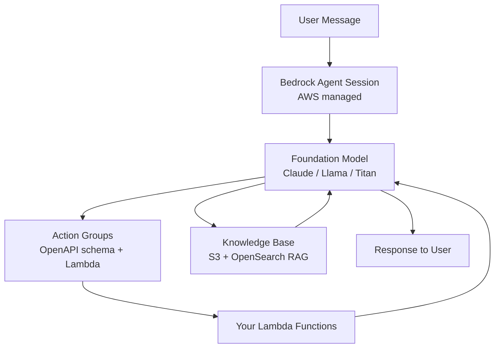
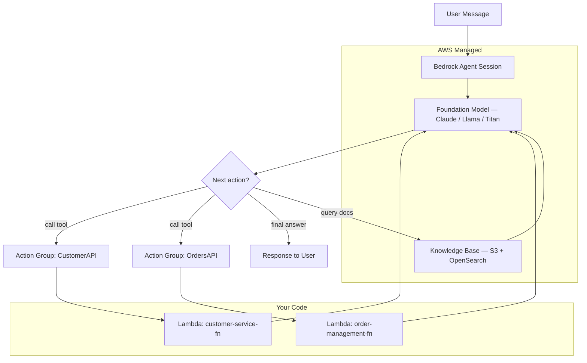

# AWS Bedrock Agents — Managed Agent Platform

**Level**: 🟡 Intermediate
**Reading Time**: 10 minutes

> AWS Bedrock Agents is the "zero to production agent" path for teams already in AWS: you configure rather than code, and AWS handles the runtime, state, and orchestration.

## 🗺️ Quick Overview



*Bedrock Agents is fully managed: you supply the Foundation Model, Lambda-backed Action Groups, and S3 Knowledge Bases; AWS runs the orchestration loop.*

## The Problem

Building an agent from scratch means writing the reasoning loop, managing conversation state, building tool dispatch, persisting sessions, adding guardrails, setting up tracing, and stitching it all together. For teams with existing AWS infrastructure, that's weeks of undifferentiated work. Bedrock Agents provides a fully managed runtime that handles all of this through configuration — you supply the model, the Lambda functions, and the documentation; AWS runs the rest.

## Architecture

Bedrock Agents has three main building blocks:

1. **Agent** — the orchestrator: a foundation model (Claude, Llama, Titan, etc.) plus a natural language instruction set. The agent is the brain that reasons about which action to take.
2. **Action Groups** — sets of callable tools. Each action group is backed by a **Lambda function** and described by an **OpenAPI schema**. The agent reads the schema to understand what the tool does and what parameters it needs.
3. **Knowledge Bases** — managed RAG: you point Bedrock at an S3 bucket, it chunks, embeds, and stores documents in a managed vector store (OpenSearch Serverless by default). The agent can query knowledge bases automatically when it needs factual grounding.



## Session Management

Every user interaction happens inside a **session**. Sessions are created automatically and persist for a configurable time (default: 30 minutes idle timeout). The agent maintains conversation history within a session — users can ask follow-up questions without re-sending context.

```
Session lifecycle:
  CreateSession → InvokeAgent (turn 1) → InvokeAgent (turn 2) → ... → session expires
```

Sessions are tied to a `sessionId` you provide. Use your own user/conversation ID as the session ID for natural mapping.

## Trace Output

Every invocation returns a **trace** — a structured log of how the agent reasoned:

```json
{
  "trace": {
    "orchestrationTrace": {
      "rationale": {
        "text": "The user is asking about order #12345. I need to look up the order status."
      },
      "invocationInput": {
        "actionGroupInvocationInput": {
          "actionGroupName": "OrdersAPI",
          "function": "getOrderStatus",
          "parameters": [{"name": "orderId", "value": "12345"}]
        }
      },
      "observation": {
        "actionGroupInvocationOutput": {
          "text": "{\"status\": \"shipped\", \"eta\": \"2026-03-22\"}"
        }
      }
    }
  }
}
```

This trace is invaluable for debugging agent behavior without reading raw LLM output.

## CDK: Creating an Agent with an Action Group

```typescript
import * as bedrock from 'aws-cdk-lib/aws-bedrock';
import * as lambda from 'aws-cdk-lib/aws-lambda';
import * as s3 from 'aws-cdk-lib/aws-s3';

// Lambda function that handles tool calls
const agentHandler = new lambda.Function(this, 'AgentHandler', {
  runtime: lambda.Runtime.NODEJS_20_X,
  handler: 'index.handler',
  code: lambda.Code.fromAsset('lambda/agent-handler'),
});

// The Lambda receives this payload structure:
// {
//   actionGroup: "OrdersAPI",
//   function: "getOrderStatus",
//   parameters: [{ name: "orderId", value: "12345" }]
// }
// And must return:
// { response: { actionGroup: "...", function: "...", functionResponse: { responseBody: { TEXT: { body: "..." } } } } }

// Agent definition
const agent = new bedrock.CfnAgent(this, 'CustomerServiceAgent', {
  agentName: 'customer-service-agent',
  foundationModel: 'anthropic.claude-3-5-sonnet-20241022-v2:0',
  instruction: `You are a customer service agent for Acme Corp.
  Help customers check order status, initiate returns, and answer product questions.
  Always be polite and confirm actions before executing them.`,
  idleSessionTtlInSeconds: 1800,

  actionGroups: [
    {
      actionGroupName: 'OrdersAPI',
      description: 'Tools for managing customer orders',
      actionGroupExecutor: {
        lambda: agentHandler.functionArn,
      },
      functionSchema: {
        functions: [
          {
            name: 'getOrderStatus',
            description: 'Get the current status and estimated delivery date for an order',
            parameters: {
              orderId: {
                type: 'string',
                description: 'The order ID to look up',
                required: true,
              },
            },
          },
          {
            name: 'initiateReturn',
            description: 'Start a return process for an order item',
            parameters: {
              orderId: { type: 'string', required: true },
              itemId: { type: 'string', required: true },
              reason: { type: 'string', required: true },
            },
          },
        ],
      },
    },
  ],
});

// Grant Lambda permission to be invoked by Bedrock
agentHandler.addPermission('BedrockInvoke', {
  principal: new iam.ServicePrincipal('bedrock.amazonaws.com'),
  action: 'lambda:InvokeFunction',
});
```

## Adding a Knowledge Base

```typescript
// S3 bucket with your documents
const docsBucket = new s3.Bucket(this, 'AgentDocs');

// Knowledge Base (Bedrock manages the vector store)
const knowledgeBase = new bedrock.CfnKnowledgeBase(this, 'ProductKB', {
  name: 'product-documentation',
  roleArn: kbRole.roleArn,
  knowledgeBaseConfiguration: {
    type: 'VECTOR',
    vectorKnowledgeBaseConfiguration: {
      embeddingModelArn: 'arn:aws:bedrock:us-east-1::foundation-model/amazon.titan-embed-text-v2:0',
    },
  },
  storageConfiguration: {
    type: 'OPENSEARCH_SERVERLESS',
    opensearchServerlessConfiguration: {
      collectionArn: collection.attrArn,
      vectorIndexName: 'bedrock-knowledge-base-index',
      fieldMapping: {
        vectorField: 'embedding',
        textField: 'text',
        metadataField: 'metadata',
      },
    },
  },
});

// Associate KB with agent
const agentKBAssociation = new bedrock.CfnAgentKnowledgeBaseAssociation(this, 'AgentKBAssoc', {
  agentId: agent.attrAgentId,
  agentVersion: 'DRAFT',
  knowledgeBaseId: knowledgeBase.attrKnowledgeBaseId,
  description: 'Product documentation for answering customer questions',
  knowledgeBaseState: 'ENABLED',
});
```

## Invoking the Agent (Python SDK)

```python
import boto3
import json

bedrock_runtime = boto3.client('bedrock-agent-runtime', region_name='us-east-1')

def invoke_agent(agent_id: str, alias_id: str, session_id: str, user_message: str):
    response = bedrock_runtime.invoke_agent(
        agentId=agent_id,
        agentAliasId=alias_id,
        sessionId=session_id,
        inputText=user_message,
        enableTrace=True,  # get reasoning trace
    )

    # Response is a streaming EventStream
    full_response = ""
    for event in response['completion']:
        if 'chunk' in event:
            chunk = event['chunk']['bytes'].decode('utf-8')
            full_response += chunk
        elif 'trace' in event:
            trace = event['trace']['trace']
            # Log trace for debugging
            print(json.dumps(trace, indent=2))

    return full_response

# Multi-turn conversation using same session_id
session_id = "user-123-session-456"

answer1 = invoke_agent(AGENT_ID, ALIAS_ID, session_id, "What's the status of order #12345?")
answer2 = invoke_agent(AGENT_ID, ALIAS_ID, session_id, "Can I return the main item?")  # agent remembers context
```

## Built-In Guardrails

Bedrock Agents integrates with **Bedrock Guardrails** — content filtering you configure separately and attach to the agent:

- Block topics (e.g., "never discuss competitor pricing")
- Filter harmful content (hate speech, violence, PII)
- Detect prompt injection attacks
- Grounding checks (response must be supported by KB)

This is a production differentiator vs. self-hosted frameworks where you build guardrails yourself.

## Strengths

- **Fully managed runtime**: No agent loop code, no session state management, no infrastructure to run
- **AWS ecosystem integration**: IAM, CloudWatch, CloudTrail, Lambda — fits naturally into AWS-first architectures
- **Built-in guardrails**: Content filtering, PII detection, topic blocking as configuration
- **Managed RAG**: Knowledge Bases handle chunking, embedding, indexing, and retrieval — no vector DB ops
- **Trace output**: Structured reasoning traces make debugging production issues tractable

## Weaknesses

- **AWS lock-in**: The agent runtime, session state, and KB are AWS-proprietary. Migrating off requires rewriting the agent layer.
- **Limited framework flexibility**: You can't implement custom reasoning loops, conditional branching beyond the model's built-in tool use, or multi-agent topologies (as of 2025)
- **Slower iteration**: Changes to action groups require re-preparing the agent (a deployment step) and clearing the alias cache
- **Cost opacity**: Per-token LLM cost + action group invocations + KB queries + OpenSearch Serverless capacity — monthly cost is hard to predict
- **Cold Lambda starts**: Each tool call invokes a Lambda. For latency-sensitive apps, pre-warmed Lambdas or provisioned concurrency add cost

## Pricing (Approximate, US East 2025)

| Component | Cost |
|-----------|------|
| Foundation model inference | Per-token (e.g., Claude 3.5 Sonnet: ~$3/M input, $15/M output) |
| Knowledge Base queries | $0.00001 per query (minimal) |
| OpenSearch Serverless (KB storage) | ~$0.24/OCU-hr (min 2 OCUs = ~$175/month) |
| Lambda action group invocations | Standard Lambda pricing |
| Bedrock Guardrails | $0.75 per 1,000 text units processed |

The **OpenSearch Serverless minimum** is the primary fixed cost. For small deployments, self-hosted pgvector is significantly cheaper.

## When to Choose Bedrock Agents

Choose Bedrock Agents when:
- Your team is **AWS-first** and wants to avoid managing agent infrastructure
- You need **enterprise compliance** (audit logs, IAM, data residency within AWS)
- The agent tools are **Lambda-backed** services you already have
- You want **managed RAG** without operating a vector database
- **Guardrails** are a hard requirement (regulated industries)

Avoid when:
- You need custom agent topologies (multi-agent, parallel branches, LangGraph-style graphs)
- Cost predictability is critical (OpenSearch Serverless minimum fee applies even at low usage)
- You want to avoid cloud vendor lock-in
- Rapid iteration with a short feedback loop is important (re-prepare cycle slows experimentation)

## Key Takeaways

- Bedrock Agents = Agent (model + instructions) + Action Groups (Lambda tools via OpenAPI) + Knowledge Bases (managed RAG)
- Sessions maintain conversation history automatically; pass a consistent `sessionId` for multi-turn conversations
- Trace output shows the model's reasoning at each step — essential for production debugging
- Built-in Guardrails and IAM integration make it the natural choice for AWS teams with compliance requirements
- The trade-off is AWS lock-in and limited customization vs. zero infrastructure overhead
- Fixed OpenSearch Serverless cost (~$175/month) makes it over-engineered for low-volume or experimental workloads
