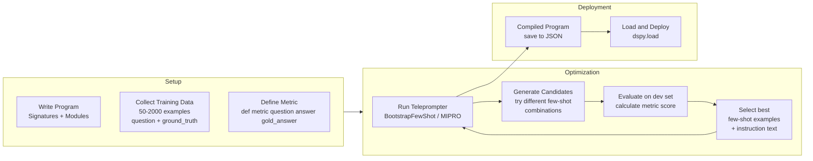

# DSPy — Programmatic Prompt Optimization

**Level**: 🔴 Advanced
**Reading Time**: 14 minutes

> DSPy is the paradigm shift prompt engineering has been waiting for: instead of hand-crafting brittle prompt templates, you write a program that describes *what* you want, then let an optimizer find the best prompts for you — automatically.

## 🗺️ Quick Overview

```mermaid
flowchart TD
    PROG[DSPy Program\nSignatures + Modules] --> METRIC[Metric Function\naccuracy / F1 / LLM-judge]
    TRAIN[Training Set\n50-2000 labeled examples] --> OPT
    METRIC --> OPT[Teleprompter / Optimizer\nBootstrapFewShot\nMIPRO / BayesianOpt]
    PROG --> OPT
    OPT --> COMP[Compiled Program\noptimized prompts + few-shot examples baked in]
    COMP --> PROD[Production Deployment\n.load() the compiled program]
```

*DSPy's optimization loop: write a program with Signatures and Modules, define a metric, provide labeled examples, run a Teleprompter — it outputs a compiled program with optimized prompts and few-shot demonstrations.*

## The Problem DSPy Solves

### The Hand-Crafted Prompt Trap

Traditional LLM pipelines look like this:

```python
# Traditional approach — brittle, hard to optimize
prompt = """You are an expert research analyst. Given the following question,
provide a comprehensive answer backed by evidence. Be precise and cite sources.
Think step by step.

Question: {question}
Answer:"""
```

This works until:
- You switch models (GPT-4 → Claude → Llama) — you rewrite the prompt
- Your accuracy plateaus at 74% and you don't know which sentence to change
- A new model version ships and your fine-tuned prompt stops working
- You add a second step to the pipeline and the prompt interactions become unpredictable

**The core problem**: prompts are hyperparameters, but we treat them like code. We hand-write them, check them into git, and never systematically optimize them. When something breaks, we guess.

### The DSPy Approach

DSPy (Declarative Self-improving Python) from Stanford separates *what you want* from *how to prompt for it*:

1. You declare what inputs and outputs your program needs (Signatures)
2. You compose building blocks (Modules like `Predict`, `ChainOfThought`, `ReAct`)
3. You define how to measure success (a Metric function)
4. You run an optimizer (Teleprompter) with labeled training data
5. The optimizer finds the best prompts, few-shot examples, and instruction text

When you change models, you run the optimizer again. The program structure stays the same; only the optimized prompts change.

## Core Abstractions

### Signature: Declare What You Want

A Signature declares the input and output fields of a task. It is the "what" without the "how":

```python
import dspy

# Simple string signature
qa_signature = "question -> answer"

# Class-based signature with field descriptions (better — more control)
class QuestionAnswer(dspy.Signature):
    """Answer questions with factual, precise responses."""

    question: str = dspy.InputField(desc="The question to answer")
    answer: str = dspy.OutputField(desc="A factual, concise answer in 1-2 sentences")

# Multi-field signature for classification
class ClassifyDocument(dspy.Signature):
    """Classify a document into one of the given categories."""

    document: str = dspy.InputField(desc="The document text to classify")
    categories: list[str] = dspy.InputField(desc="List of valid category names")
    label: str = dspy.OutputField(desc="The most appropriate category")
    confidence: float = dspy.OutputField(desc="Confidence score between 0 and 1")
    reasoning: str = dspy.OutputField(desc="Brief explanation of the classification")
```

DSPy uses the Signature's field names, descriptions, and docstring to construct the actual prompt. You never write the prompt — DSPy does.

### Module: Composable Building Blocks

Modules are how you apply a Signature. Each module wraps a Signature and provides different reasoning strategies:

```python
# dspy.Predict: basic — generate output fields directly
predictor = dspy.Predict(QuestionAnswer)
result = predictor(question="What is the CAP theorem?")
print(result.answer)

# dspy.ChainOfThought: adds a "reasoning" field before the output
# The LLM is prompted to think step-by-step before answering
cot = dspy.ChainOfThought(QuestionAnswer)
result = cot(question="What is the CAP theorem?")
print(result.reasoning)  # the step-by-step thinking
print(result.answer)     # the final answer

# dspy.ReAct: Reasoning + Action — for tool-using agents
# Alternates between Thought, Action (tool call), Observation cycles
react_agent = dspy.ReAct(QuestionAnswer, tools=[search_tool, calculator_tool])

# dspy.MultiChainComparison: generates N reasoning chains, picks the best
mcc = dspy.MultiChainComparison(QuestionAnswer, M=3)  # generates 3 chains
```

### Program: Composed Pipelines

Programs are classes that compose Modules into multi-step pipelines:

```python
class RAGPipeline(dspy.Module):
    """A retrieval-augmented generation pipeline."""

    def __init__(self, retriever, num_passages=3):
        super().__init__()
        self.retriever = retriever
        self.num_passages = num_passages

        # Each Module is a field — DSPy tracks them for optimization
        self.generate_query = dspy.Predict("question -> search_query")
        self.answer_question = dspy.ChainOfThought(
            "context, question -> answer"
        )

    def forward(self, question):
        # Step 1: Generate an optimized search query
        search_query = self.generate_query(question=question).search_query

        # Step 2: Retrieve relevant passages
        passages = self.retriever(search_query, k=self.num_passages)
        context = "\n\n".join(passages)

        # Step 3: Answer using retrieved context
        result = self.answer_question(context=context, question=question)
        return result
```

## The Optimization Loop



## Code: Full Optimization Workflow

```python
import dspy
from dspy.evaluate import Evaluate
from dspy.teleprompt import BootstrapFewShot

# --- 1. Configure the LLM ---
lm = dspy.LM("openai/gpt-4o-mini", temperature=0.7)
dspy.configure(lm=lm)

# --- 2. Define Signature and Program ---
class AnswerWithCitations(dspy.Signature):
    """Answer the question using retrieved context passages. Be precise."""

    context: list[str] = dspy.InputField(desc="Relevant passages")
    question: str = dspy.InputField()
    answer: str = dspy.OutputField(desc="A factual answer grounded in the context")
    citations: list[str] = dspy.OutputField(desc="Verbatim quotes from context used")

class QAProgram(dspy.Module):
    def __init__(self):
        super().__init__()
        self.answer = dspy.ChainOfThought(AnswerWithCitations)

    def forward(self, context, question):
        return self.answer(context=context, question=question)

# --- 3. Prepare training data ---
# dspy.Example holds one labeled example
trainset = [
    dspy.Example(
        context=["The CAP theorem states..."],
        question="What does CAP stand for?",
        answer="Consistency, Availability, Partition Tolerance",
    ).with_inputs("context", "question"),
    # ... 50-200 more examples
]

# --- 4. Define metric function ---
def exact_match_metric(example, prediction, trace=None):
    """Returns 1 if the gold answer appears in the prediction, else 0."""
    gold = example.answer.lower().strip()
    pred = prediction.answer.lower().strip()
    return int(gold in pred or pred in gold)

# For production: use a more sophisticated metric
def llm_judge_metric(example, prediction, trace=None):
    """Use an LLM to judge if the prediction is correct."""
    judge = dspy.Predict("question, gold_answer, predicted_answer -> is_correct: bool")
    result = judge(
        question=example.question,
        gold_answer=example.answer,
        predicted_answer=prediction.answer,
    )
    return result.is_correct

# --- 5. Run the optimizer ---
optimizer = BootstrapFewShot(
    metric=exact_match_metric,
    max_bootstrapped_demos=4,   # up to 4 few-shot examples in the prompt
    max_labeled_demos=16,       # draw from up to 16 labeled training examples
    max_rounds=3,               # number of optimization rounds
)

program = QAProgram()
compiled_program = optimizer.compile(
    program,
    trainset=trainset,
)

# --- 6. Evaluate the compiled program ---
evaluate = Evaluate(
    devset=trainset[:20],  # use a held-out dev set in practice
    metric=exact_match_metric,
    num_threads=4,
    display_progress=True,
)

score = evaluate(compiled_program)
print(f"Compiled program accuracy: {score:.1%}")

# --- 7. Save and load ---
compiled_program.save("qa_program.json")

# Loading in production
loaded_program = QAProgram()
loaded_program.load("qa_program.json")

result = loaded_program(
    context=["The Byzantine fault is a condition..."],
    question="What is a Byzantine fault in distributed systems?",
)
print(result.answer)
```

## Teleprompter Options

| Optimizer | When to Use | What It Optimizes | Compute Cost |
|-----------|------------|-------------------|-------------|
| `BootstrapFewShot` | Starting point — most programs | Few-shot examples from training data | Low |
| `BootstrapFewShotWithRandomSearch` | When BootstrapFewShot plateaus | Few-shot + tries N random subsets | Medium |
| `BayesianSignatureOptimizer` | Maximizing accuracy, have GPU budget | Instruction text + few-shot examples | High |
| `MIPRO` | Production accuracy-critical systems | Multi-stage: instructions + demonstrations | High |
| `BootstrapFinetune` | Need a smaller, cheaper model | Generates fine-tuning data from the program | Very High |

**Rule of thumb**: start with `BootstrapFewShot`. If accuracy plateaus below your target, escalate to `MIPRO`. Reserve `BootstrapFinetune` for when you need to deploy a smaller, faster model (Llama 3 8B) that matches GPT-4-level accuracy on your specific task.

## Manual Prompting vs DSPy

| Dimension | Manual Prompting | DSPy |
|-----------|-----------------|------|
| Time to first working version | Minutes | Hours (setup + data collection) |
| Accuracy ceiling | Depends on your prompt skills | Systematically higher (5-25% gain typical) |
| Model portability | Rewrite prompt per model | Re-run optimizer per model |
| Debugging | Trial-and-error, no visibility | Metrics track each optimization step |
| Data requirement | Zero | 50-2000 labeled examples |
| Flexibility | Total control | Constrained by Signature structure |
| Production maintenance | Prompt in code = change manually | Re-run optimizer when model changes |
| Best for | Exploration, creative tasks | Production pipelines with defined metrics |

## When to Use DSPy

**Use DSPy when:**
- You have labeled data (even 50 examples is enough for `BootstrapFewShot`)
- Your task has a well-defined correctness metric (F1, exact match, LLM-as-judge)
- Manual prompt engineering is hitting an accuracy ceiling (e.g., stuck at 72%)
- You need to support multiple LLM providers or versions — re-optimize instead of rewrite
- Accuracy matters more than prompt interpretability (the optimizer's prompts can be verbose)

**Do not use DSPy when:**
- You have no labeled training data — DSPy cannot optimize without a metric
- The task is one-off or exploratory — the setup cost (data collection, pipeline code) is not worth it
- You need creative, open-ended generation — DSPy optimizes for a metric, not quality in the subjective sense
- Simple tasks (single classification, basic summarization) — a good system prompt is sufficient and faster

## Real Use Cases

1. **Multi-hop QA**: `HotPotQA` benchmark — decompose complex question → retrieve → retrieve again → answer. DSPy programs with `BootstrapFewShot` match GPT-4-level accuracy on Llama 3 8B after optimization.

2. **Document classification pipeline**: classify 10,000 support tickets per day into 50 categories. MIPRO optimization achieves 89% F1 vs 76% F1 with a hand-crafted prompt — 17% improvement.

3. **RAG answer quality**: DSPy-optimized RAG pipelines show 10-25% improvement in faithfulness (answers grounded in retrieved context) vs hand-crafted prompts, measured by LLM-as-judge.

4. **Code generation**: Structured output with Signatures for code + test generation. Optimization target: all generated tests pass.

## Common Mistakes

1. **Optimizing on the test set**: It is tempting to use your full dataset as both train and dev. This leads to overfitting — the optimizer learns to produce prompts that work on *those specific examples* but generalize poorly. Always hold out 20-30% as a true test set, never seen during optimization.

2. **Too-small training sets**: `BootstrapFewShot` can work with 20 examples, but the optimizer has limited signal. For `MIPRO`, fewer than 100 examples produces unstable results. Invest in data labeling — even semi-automated labels (weak supervision, another LLM labeling) are better than nothing.

3. **Ignoring the metric quality**: DSPy will optimize whatever metric you give it. If your metric is easy to game (e.g., `len(prediction.answer) > 10`), the optimizer will find prompts that produce long answers regardless of quality. Spend as much time designing the metric as designing the program.

4. **Saving the compiled program then changing the Signature**: If you change a Signature (add a field, rename a field) after saving a compiled `.json`, loading it will fail or produce incorrect behavior. Treat compiled programs as model artifacts — version them alongside the Signature code.

5. **Using `dspy.Predict` when `dspy.ChainOfThought` is appropriate**: For reasoning tasks (QA, classification, code generation), `ChainOfThought` consistently outperforms `Predict` by 10-20% because it forces the model to articulate its reasoning before producing the output. Use `Predict` only for simple extraction or format conversion.

## Key Takeaways

- DSPy separates *what you want* (Signatures) from *how to prompt* (Teleprompters optimize that automatically)
- The optimizer finds better few-shot examples and instruction text than hand-crafting — typical improvement: **5-25% accuracy gain**
- You need labeled training data (minimum ~50 examples) and a well-defined metric to use DSPy
- `BootstrapFewShot` is the starting point — escalate to `MIPRO` or `BayesianSignatureOptimizer` for higher stakes
- Compiled programs are portable JSON files — load them in production, re-optimize when you change models
- DSPy is not a general agent framework — it is a **prompt optimization** system for accuracy-critical production pipelines

## References

- 📚 [DSPy Documentation](https://dspy.ai/) — official docs, tutorials, API reference
- 📖 [DSPy: Compiling Declarative Language Model Calls into Self-Improving Pipelines (Stanford 2023)](https://arxiv.org/abs/2310.03714) — the original DSPy paper with benchmark results
- 📺 [DSPy Explained — AI Jason YouTube](https://www.youtube.com/watch?v=CDung1LnLbY) — 30-minute walkthrough of core concepts and optimization
- 📖 [DSPy GitHub Examples](https://github.com/stanfordnlp/dspy/tree/main/examples) — canonical examples for QA, RAG, classification, and agentic programs
- 📖 [Omar Khattab on DSPy Design](https://towardsdatascience.com/intro-to-dspy-goodbye-prompting-hello-programming-4ca1c6ce3eb9) — creator walkthrough of the paradigm shift from prompting to programming
