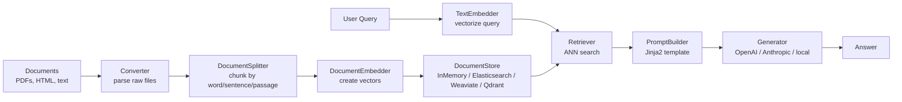
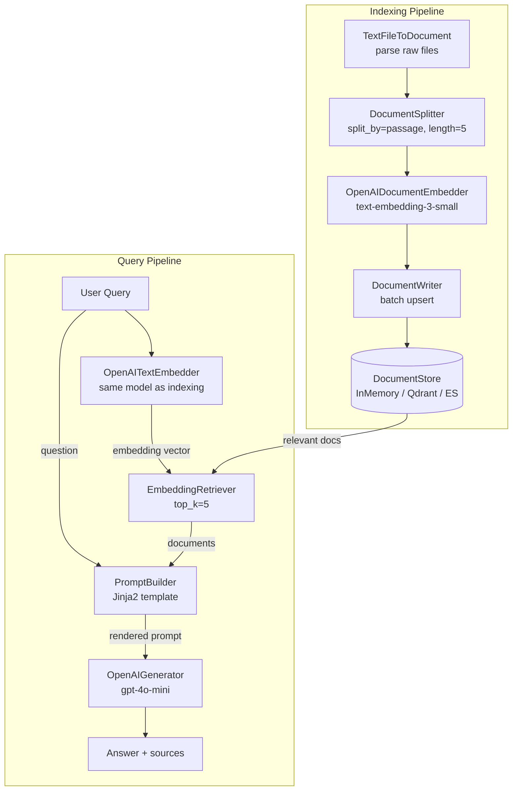

# Haystack — NLP Pipeline Framework for Search & RAG

**Level**: 🟡 Intermediate
**Reading Time**: 12 minutes

> Haystack is what happens when a team of NLP engineers builds an LLM framework. The component graph model, typed I/O, and deep evaluation tooling are a direct result of years of production RAG deployments.

## Quick Overview



*Haystack pipelines are directed graphs of typed components. Swap any node (e.g., replace InMemoryDocumentStore with Weaviate) without touching the rest of the pipeline.*

## What Problem Does Haystack Solve?

Before LLMs dominated the NLP landscape, question answering over documents was a hard research problem. deepset (Berlin, founded 2018) built Haystack to make that research accessible in production. The framework has always been document-first: parse, store, retrieve, generate answers.

**Haystack 1.x** (2020–2023): Pipeline-based framework with deep integration with Elasticsearch and Hugging Face Transformers. Strong for open-domain QA.

**Haystack 2.x** (2024–present): Rebuilt from scratch as a **component-based pipeline framework**. Every processing step (converter, embedder, retriever, reranker, generator, router) is a typed component with explicit input/output schemas. Pipelines are directed graphs. This redesign makes it:
- Easier to swap components (change vector store, change LLM provider — only the component config changes)
- Type-safe (the pipeline validates connections at build time, not run time)
- Easier to test in isolation (each component is a plain Python class)

## Core Abstractions

### 1. Component

The atomic unit of a Haystack pipeline. Each component is a Python class decorated with `@component`:
- Declares `InputType` and `OutputType` as dataclasses
- Implements a `run()` method that receives inputs and returns outputs
- Is fully serializable to YAML/JSON for config-driven pipelines

Haystack ships with 60+ built-in components. You can write custom ones in ~10 lines.

```python
from haystack import component, Document
from typing import List

@component
class UppercaseFilter:
    @component.output_types(documents=List[Document])
    def run(self, documents: List[Document]) -> dict:
        return {"documents": [Document(content=d.content.upper()) for d in documents]}
```

### 2. Pipeline

A `Pipeline` is a directed graph of connected components. You add components, then connect their named outputs to named inputs.

```python
from haystack import Pipeline

pipe = Pipeline()
pipe.add_component("splitter", DocumentSplitter(split_by="word", split_length=256))
pipe.add_component("embedder", OpenAIDocumentEmbedder())
pipe.connect("splitter.documents", "embedder.documents")
```

Pipelines can be serialized to YAML and loaded back — useful for config-driven deployments.

### 3. Document Store

Where documents and their embeddings live. Haystack supports:

| Document Store | Type | Best For |
|----------------|------|----------|
| `InMemoryDocumentStore` | In-process | Prototyping, tests |
| `ElasticsearchDocumentStore` | Self-hosted | Hybrid search (BM25 + vector) at enterprise scale |
| `OpenSearchDocumentStore` | Self-hosted | AWS-native teams |
| `WeaviateDocumentStore` | SaaS / self-hosted | Schema-rich data, multi-modal |
| `QdrantDocumentStore` | SaaS / self-hosted | Fast Rust-based retrieval |
| `PineconeDocumentStore` | SaaS | Managed vector search, zero ops |
| `PgvectorDocumentStore` | PostgreSQL extension | Teams already using Postgres |

Swapping document stores is a one-line config change — the pipeline code stays identical.

### 4. Prompt Templates (Jinja2)

Haystack uses Jinja2 for prompt templates. The `PromptBuilder` component accepts a template string and renders it with variables passed at runtime.

```python
from haystack.components.builders import PromptBuilder

template = """
Answer the question using only the provided context. If you cannot answer from the context, say "I don't know."

Context:

  {{ doc.content }}


Question: {{ question }}
Answer:
"""

prompt_builder = PromptBuilder(template=template)
```

## Full RAG Pipeline

```python
from haystack import Pipeline
from haystack.components.embedders import OpenAITextEmbedder, OpenAIDocumentEmbedder
from haystack.components.retrievers import InMemoryEmbeddingRetriever
from haystack.components.builders import PromptBuilder, RAGPromptBuilder
from haystack.components.generators import OpenAIGenerator
from haystack.components.converters import TextFileToDocument
from haystack.components.preprocessors import DocumentSplitter
from haystack.document_stores.in_memory import InMemoryDocumentStore

# --- Indexing Pipeline ---
document_store = InMemoryDocumentStore()

indexing = Pipeline()
indexing.add_component("converter", TextFileToDocument())
indexing.add_component("splitter", DocumentSplitter(split_by="passage", split_length=5))
indexing.add_component("embedder", OpenAIDocumentEmbedder(model="text-embedding-3-small"))
indexing.add_component("writer", DocumentWriter(document_store))

indexing.connect("converter.documents", "splitter.documents")
indexing.connect("splitter.documents", "embedder.documents")
indexing.connect("embedder.documents", "writer.documents")

indexing.run({"converter": {"paths": ["./knowledge-base/"]}})

# --- Query Pipeline ---
template = """
Answer using only the context below. Cite the source document.

Context:

  [{{ loop.index }}] {{ doc.content }}


Question: {{ question }}
"""

query_pipeline = Pipeline()
query_pipeline.add_component("embedder", OpenAITextEmbedder(model="text-embedding-3-small"))
query_pipeline.add_component("retriever", InMemoryEmbeddingRetriever(document_store, top_k=5))
query_pipeline.add_component("prompt_builder", PromptBuilder(template=template))
query_pipeline.add_component("llm", OpenAIGenerator(model="gpt-4o-mini"))

query_pipeline.connect("embedder.embedding", "retriever.query_embedding")
query_pipeline.connect("retriever.documents", "prompt_builder.documents")
query_pipeline.connect("prompt_builder.prompt", "llm.prompt")

result = query_pipeline.run({
    "embedder": {"text": "What is the refund policy?"},
    "prompt_builder": {"question": "What is the refund policy?"}
})
print(result["llm"]["replies"][0])
```

## Pipeline Component Graph (Architecture)



## Hybrid Search: BM25 + Vector

Haystack's native support for hybrid search is one of its strongest differentiators. When using Elasticsearch or OpenSearch, you can combine keyword (BM25) and semantic (vector) retrieval in a single pipeline:

```python
from haystack.components.retrievers.elasticsearch import (
    ElasticsearchBM25Retriever,
    ElasticsearchEmbeddingRetriever
)
from haystack.components.rankers import TransformersSimilarityRanker

hybrid_pipeline = Pipeline()
hybrid_pipeline.add_component("bm25", ElasticsearchBM25Retriever(es_store, top_k=10))
hybrid_pipeline.add_component("embedding", ElasticsearchEmbeddingRetriever(es_store, top_k=10))
hybrid_pipeline.add_component("joiner", DocumentJoiner(join_mode="reciprocal_rank_fusion"))
hybrid_pipeline.add_component("reranker", TransformersSimilarityRanker(top_k=5))

hybrid_pipeline.connect("bm25.documents", "joiner.documents")
hybrid_pipeline.connect("embedding.documents", "joiner.documents")
hybrid_pipeline.connect("joiner.documents", "reranker.documents")
```

Hybrid search typically outperforms either approach alone by 5–15% on recall, especially for domain-specific vocabulary that embeddings handle poorly.

## Evaluation with RAGAS

Haystack integrates with deepeval and RAGAS for pipeline evaluation. You can measure:
- **Faithfulness**: does the answer only use information from retrieved context?
- **Answer Relevancy**: does the answer actually address the question?
- **Context Precision**: are retrieved documents actually relevant?
- **Context Recall**: did retrieval capture all necessary information?

```python
from haystack.evaluation import EvaluationRunResult
from haystack_experimental.evaluation.harness import RAGEvaluationHarness, RAGExpectedComponent

harness = RAGEvaluationHarness(
    rag_pipeline=query_pipeline,
    rag_components={
        RAGExpectedComponent.QUERY_PROCESSOR: "embedder",
        RAGExpectedComponent.DOCUMENT_RETRIEVER: "retriever",
        RAGExpectedComponent.RESPONSE_GENERATOR: "llm",
    },
    metrics=[RAGEvaluationMetric.FAITHFULNESS, RAGEvaluationMetric.ANSWER_RELEVANCY],
)
result = harness.run(inputs=eval_dataset)
print(result.to_pandas())
```

## Haystack vs LangChain vs LlamaIndex

| Feature | Haystack 2.x | LangChain | LlamaIndex |
|---------|-------------|-----------|------------|
| Architecture model | Component graph (explicit I/O) | Chain / LCEL pipe | Index-centric |
| Type safety | Strong (typed inputs/outputs validated at build) | Weak | Medium |
| Swappability | Excellent — one-line store swap | Good | Good |
| Production battle-testing | Yes — European enterprise deployments | Yes — large community | Growing |
| Learning curve | Medium | High | Low for RAG |
| Hybrid search | Native (BM25 + vector in same pipeline) | Via integrations | Via integrations |
| Evaluation tooling | Built-in RAGAS integration | LangSmith (paid SaaS) | Built-in eval |
| Serialization | YAML / JSON pipelines | Partial (LCEL) | Partial |
| Community | Smaller, focused | Largest | Large |
| Origin | NLP research (deepset, 2018) | Startup (Harrison Chase, 2022) | Startup (Jerry Liu, 2022) |
| GDPR / EU focus | Strong (German company, EU data residency default) | US-centric | US-centric |

## deepset Cloud

deepset (the company) offers **deepset Cloud** — a managed platform for Haystack pipelines:
- Hosted document stores (Elasticsearch-backed)
- Pipeline deployment without managing infra
- Annotation tool for building evaluation datasets
- A/B testing of pipeline variants
- Pricing: starts at $99/month for teams

Self-hosting is fully supported — all Haystack components work without deepset Cloud.

## When to Use Haystack

**Choose Haystack when:**
- You need strong component isolation and want to A/B test individual pipeline stages (e.g., swap embedding model without touching the rest)
- Your team is EU-based and GDPR compliance / data residency matters (deepset is German, deep EU expertise)
- You need native hybrid search (BM25 + vector) — Haystack makes this a first-class feature
- Production reliability and battle-testing matter more than community ecosystem size
- You want to serialize pipelines to YAML for config-driven deployments

**Avoid Haystack when:**
- You need a massive ecosystem of pre-built community integrations immediately (LangChain has more)
- You are building an agent-first application rather than a retrieval-first application (LangChain/AutoGen better fit)
- Your team is already deep in LlamaIndex and happy with it (no reason to switch unless you hit its limits)

## Common Mistakes

1. **Connecting components with mismatched output names.** Haystack validates connections at pipeline build time, not run time. If you write `pipe.connect("embedder.embeddings", "retriever.query_embedding")` but the output is actually named `embedding` (singular), you get a clear error — but beginners miss this because they do not read the component's output type docs first. Always check `component.__init__.__doc__` or the Haystack component reference.

2. **Using InMemoryDocumentStore in production.** It is in-process RAM, not persisted, not distributed. A pod restart loses all documents. For anything beyond a local demo, use Qdrant, Elasticsearch, or another persistent store from day one.

3. **Forgetting to use the same embedding model for indexing and querying.** If you index with `text-embedding-3-small` and query with `text-embedding-3-large`, the vector dimensions differ (1536 vs 1536 — they happen to match in this case, but the embedding space is different). You will get nonsensical retrieval results. Lock the model ID in a config constant shared between the indexing and query pipeline builders.

## Key Takeaways

- Haystack 2.x is a component-graph framework — every step is a typed, swappable, testable component
- The `DocumentStore` abstraction lets you swap from InMemory to Elasticsearch to Qdrant with a one-line config change
- Native hybrid search (BM25 + vector + reranker) is a standout feature not available out-of-the-box in LangChain or LlamaIndex
- deepset is a German company with strong EU/GDPR focus — important for European enterprise deployments
- RAGAS evaluation is built into the framework — you can measure faithfulness, relevancy, and recall without external tooling
- Pipelines are serializable to YAML — great for config-driven, version-controlled RAG deployments

## References

- 📖 [Haystack Official Documentation](https://docs.haystack.deepset.ai/) — Component reference, tutorials, and pipeline examples
- 📖 [deepset Blog — Haystack 2.0 Architecture](https://haystack.deepset.ai/blog/introducing-haystack-2-beta-and-advent) — The design decisions behind the 2.x rewrite
- 📺 [Building Production RAG with Haystack — PyData Berlin 2023](https://www.youtube.com/watch?v=mRukyvt5u44) — deepset engineers walkthrough of production patterns
- 📖 [RAGAS: Evaluation Framework for RAG Pipelines](https://docs.ragas.io/) — Evaluation metrics used with Haystack
