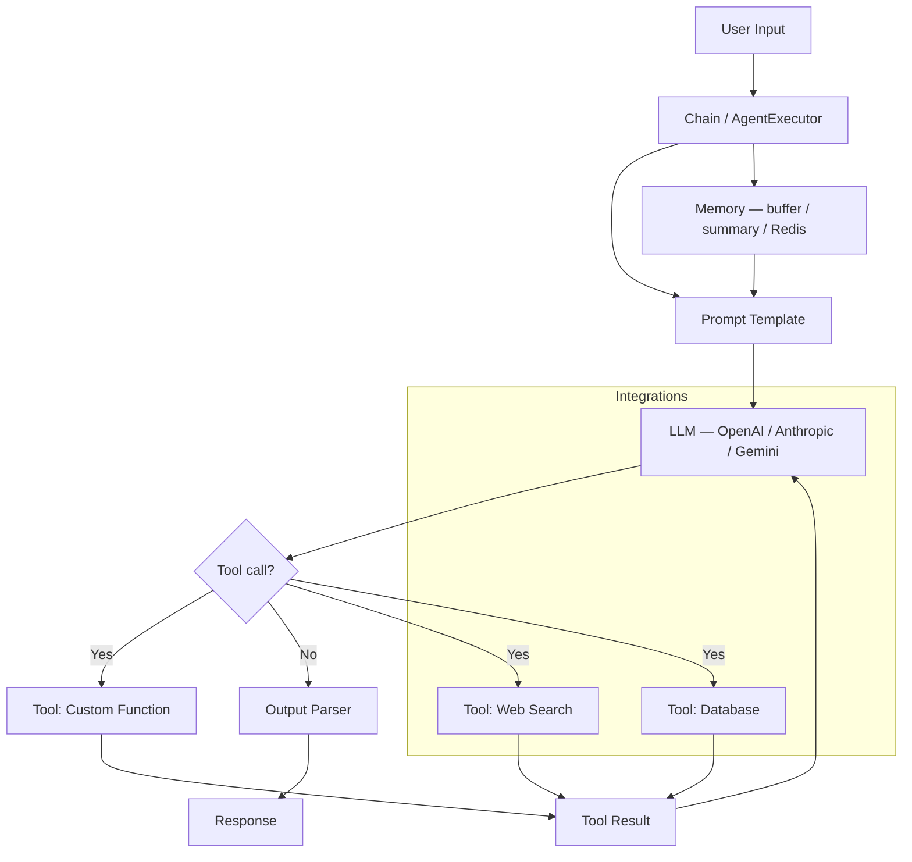

# LangChain — Agent Framework Overview

**Level**: 🟡 Intermediate
**Reading Time**: 10 minutes

> LangChain is the duct tape and scaffolding of the LLM world — it connects everything quickly, and that's both its strength and its weakness.

## 🗺️ Quick Overview

```mermaid
flowchart LR
    INPUT[Input] --> CHAIN[Chain\nprompt | model | parser]
    CHAIN --> AGENT[Agent Loop\nLLM decides next tool]
    AGENT --> TOOLS[Tools\nweb search / DB / code]
    TOOLS --> AGENT
    AGENT --> MEM[Memory\nconversation history]
    AGENT --> RET[Retriever\nRAG / vector store]
    AGENT --> OUT[Output]
```

*LangChain wires five composable primitives — chains, agents, tools, retrievers, memory — using the LCEL pipe operator.*

## The Problem

When you start building with LLMs you face the same setup work every time: connecting to a model API, wrapping prompts into reusable structures, wiring in a retriever for RAG, adding memory across turns, calling tools. LangChain packages all of that boilerplate into composable abstractions so you can go from idea to working prototype in hours, not days.

## Core Abstractions

LangChain is built around five composable primitives:

1. **Chains** — sequences of steps (prompt → LLM → output parser) composed into pipelines
2. **Agents** — chains that loop: the LLM decides which tool to call next until it has an answer
3. **Tools** — callable functions exposed to an agent (web search, calculator, database lookup)
4. **Retrievers** — components that fetch relevant documents from a vector store, for RAG
5. **Memory** — objects that persist conversation history across turns (in-memory, Redis, SQL)

These primitives are wired together using **LCEL** — LangChain Expression Language.

## LCEL: The Pipe Syntax

LCEL is the composition model introduced in LangChain v0.1. Chains are built by piping components with the `|` operator. Each component receives the output of the previous one.

```python
from langchain_core.prompts import ChatPromptTemplate
from langchain_openai import ChatOpenAI
from langchain_core.output_parsers import StrOutputParser

# Define components
prompt = ChatPromptTemplate.from_template(
    "Answer the question concisely.\n\nQuestion: {question}"
)
model = ChatOpenAI(model="gpt-4o-mini", temperature=0)
parser = StrOutputParser()

# Compose with | operator — this is LCEL
chain = prompt | model | parser

# Invoke
answer = chain.invoke({"question": "What is eventual consistency?"})
print(answer)
```

Each `|` step is lazy — the chain isn't executed until `.invoke()` is called. This makes chains serializable, loggable via LangSmith, and easy to swap components in and out.

### RAG Chain with Retriever

```python
from langchain_community.vectorstores import Chroma
from langchain_openai import OpenAIEmbeddings
from langchain_core.runnables import RunnablePassthrough

# Vector store + retriever
vectorstore = Chroma.from_documents(docs, OpenAIEmbeddings())
retriever = vectorstore.as_retriever(search_kwargs={"k": 4})

# RAG prompt
rag_prompt = ChatPromptTemplate.from_template("""
Use the following context to answer the question.

Context:
{context}

Question: {question}
""")

# Full RAG chain
rag_chain = (
    {"context": retriever, "question": RunnablePassthrough()}
    | rag_prompt
    | model
    | parser
)

answer = rag_chain.invoke("How does LangGraph handle checkpointing?")
```

### Agent with Tools

```python
from langchain.agents import create_tool_calling_agent, AgentExecutor
from langchain_community.tools import DuckDuckGoSearchRun
from langchain_core.tools import tool

# Built-in tool
search_tool = DuckDuckGoSearchRun()

# Custom tool using @tool decorator
@tool
def get_company_info(ticker: str) -> str:
    """Look up basic info about a public company by its stock ticker."""
    # implementation
    return f"Info for {ticker}..."

tools = [search_tool, get_company_info]

# Create agent
agent = create_tool_calling_agent(model, tools, prompt)
executor = AgentExecutor(agent=agent, tools=tools, verbose=True, max_iterations=10)

result = executor.invoke({"input": "What's the latest news about NVDA?"})
print(result["output"])
```

## Architecture Overview



## Comparison: LangChain vs Raw API vs LangGraph

| Dimension | Raw API | LangChain | LangGraph |
|-----------|---------|-----------|-----------|
| Setup speed | Slow (write everything) | Fast (100+ integrations) | Medium |
| Debugging | Easy — you wrote it | Hard — magic in the stack | Easy — explicit graph |
| Flexibility | Total | Medium — fight abstractions | High |
| State management | Manual | Limited (Memory objects) | First-class (typed state) |
| Multi-agent | Manual | Awkward | Native |
| Best for | Production critical paths | Rapid prototyping, RAG | Complex workflows |
| Dependencies | Minimal | Heavy (langchain-community) | Moderate (langgraph) |
| Learning curve | LLM APIs only | Low | Medium |

## When LangChain Shines

- **RAG pipelines**: The retriever + chain + memory pattern is battle-tested and fast to build
- **Fast prototyping**: Go from zero to working demo in an afternoon
- **Integration breadth**: 100+ LLM providers, vector stores, tools out of the box via `langchain-community`
- **Simple single-agent tasks**: Tool-calling agents with a handful of tools
- **Teams new to LLMs**: The abstractions guide you through the right patterns

## When LangChain Hurts

- **Debugging in production**: Errors surface deep inside framework code. Understanding what the LLM actually received requires either LangSmith (paid) or verbose logging everywhere.
- **Complex control flow**: Conditional routing, loops, human-in-loop — these stretch LangChain beyond what it was designed for. Switch to LangGraph.
- **Heavy dependency tree**: `langchain-community` pulls in dozens of optional packages. Cold start times and Docker image sizes balloon.
- **Abstraction leakage**: When a built-in tool doesn't work quite right, you end up fighting the abstraction instead of just writing the 10 lines of code yourself.
- **Version churn**: LangChain v0.1 → v0.2 → v0.3 broke many APIs. Production codebases need careful dependency pinning.

## Pricing and Self-Hosting

LangChain itself is **open source** (MIT license) — free to use. Costs come from:

| Component | Cost |
|-----------|------|
| LangChain library | Free (open source) |
| LangSmith (observability) | Free tier: 5k traces/month; paid from $39/month |
| LLM API calls | Per-token cost from OpenAI / Anthropic / etc. |
| Vector stores | Varies (Chroma = free/self-host; Pinecone = paid SaaS) |

Self-hosting: deploy your LangChain app as any Python service (FastAPI, Lambda, Cloud Run). No LangChain infrastructure to run — only the LLM and vector store need hosting decisions.

## Common Pitfalls

1. **`AgentExecutor` with no `max_iterations`**: Defaults to 15, but set it explicitly. A confused agent will hit the limit and return an error — better than infinite loop.
2. **Stale memory objects**: `ConversationBufferMemory` grows forever. Use `ConversationSummaryMemory` or set a token limit for long conversations.
3. **Using LangChain for simple calls**: If you're just calling GPT-4 once, `openai.chat.completions.create()` is clearer and has zero overhead.
4. **Fighting the framework**: When you spend more time debugging LangChain internals than writing business logic, reach for the raw API or LangGraph.
5. **Outdated community integrations**: `langchain-community` tools are community-maintained. Check the last commit date before depending on one in production.

## Key Takeaways

- LangChain = composable primitives (chains, agents, tools, retrievers, memory) wired together with LCEL pipe syntax
- Best for: RAG pipelines, rapid prototyping, teams that want 100+ integrations out of the box
- LCEL's `|` operator makes chains readable and swappable — this is the right way to use modern LangChain
- When tasks need complex state, conditional routing, or human-in-loop: switch to LangGraph (which is built by the same team and integrates seamlessly)
- LangChain is free and open source; production cost is the LLM API and optionally LangSmith for tracing
