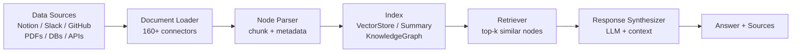
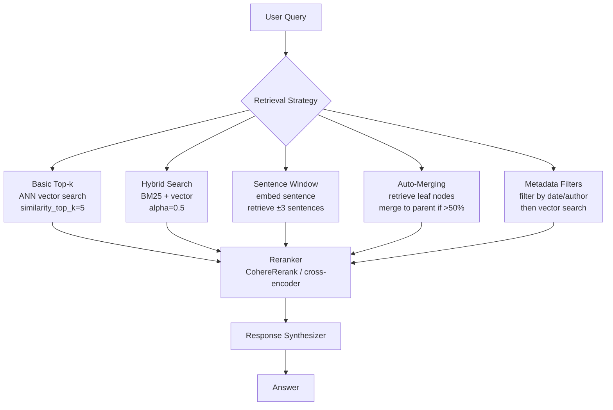

# LlamaIndex — Data Framework for RAG Pipelines

**Level**: 🟡 Intermediate
**Reading Time**: 12 minutes

> LlamaIndex is to RAG what SQLAlchemy is to databases — it's the layer that abstracts away the complexity of connecting LLMs to your data, so you can focus on what you're building, not how to plumb it together.

## 🗺️ Quick Overview



*LlamaIndex's six-stage pipeline: ingest raw documents, parse into nodes, build a searchable index, retrieve relevant chunks, synthesize a final answer with citations.*

## The Problem

Every RAG pipeline solves the same problem: you have data in a dozen different formats and locations — PDFs, Notion pages, Slack threads, database tables, API endpoints — and you need an LLM to reason over it. Without a framework, you end up writing the same ingestion, chunking, embedding, and retrieval boilerplate for every project. When you add multi-document reasoning (comparing two documents, synthesizing across 50 research papers), the complexity explodes.

LlamaIndex solves this by standardizing the entire pipeline: 160+ pre-built data connectors, composable index types, and production-ready retrieval strategies — all behind a consistent API.

## LlamaIndex vs LangChain: Complementary Tools

The most common confusion: LangChain and LlamaIndex are **not competitors** — they're complementary.

| Dimension | LlamaIndex | LangChain |
|-----------|-----------|---------|
| Primary focus | Data ingestion + retrieval (RAG) | Agent orchestration + chaining |
| Data connectors | 160+ native connectors | 100+ loaders (via community) |
| Advanced retrieval | Excellent — built-in ✅ | Good — possible via LCEL |
| Query decomposition | Built-in (SubQuestionQueryEngine) | Requires custom implementation |
| Agent integration | Via llama-agents / tool use | Native LangChain agents |
| Learning curve | Lower for RAG use cases | Lower for general agent work |
| Best used when | RAG is the primary problem | You need full agent + tool use |

**Rule of thumb**: if your primary problem is connecting an LLM to your data, start with LlamaIndex. If your primary problem is orchestrating multi-step agent workflows with tools, start with LangChain. Many production systems use both.

## Core Abstractions

LlamaIndex is built around five abstractions that form its pipeline:

### 1. Documents and Nodes

- **Document**: raw ingested data — a PDF, a webpage, a database row. Has text content and metadata (filename, author, date).
- **Node**: a chunk of a Document, produced by a NodeParser. Nodes are the unit of retrieval. Each node keeps a reference back to its parent document.

```python
from llama_index.core import Document
from llama_index.core.node_parser import SentenceSplitter

# Create documents manually
doc = Document(
    text="LlamaIndex is a data framework for LLM applications...",
    metadata={"source": "docs", "date": "2024-01-15"}
)

# Or load from files
from llama_index.core import SimpleDirectoryReader
docs = SimpleDirectoryReader("./data/").load_data()  # loads PDFs, txt, md

# Parse into nodes (chunks)
splitter = SentenceSplitter(chunk_size=512, chunk_overlap=50)
nodes = splitter.get_nodes_from_documents(docs)
print(f"Split {len(docs)} documents into {len(nodes)} nodes")
```

### 2. Index

The index is how you make nodes searchable. LlamaIndex supports three main index types:

- **VectorStoreIndex**: embeds each node, stores in a vector database. Most common — supports semantic similarity search.
- **SummaryIndex**: builds a summary of all documents. Best for summarization over full document sets.
- **PropertyGraphIndex**: extracts entities and relationships, builds a knowledge graph. Best for multi-hop reasoning.

### 3. Query Engine

A Query Engine wraps an index and exposes a simple `.query()` interface. It handles retrieval + synthesis in one call and returns both the synthesized answer and the source nodes used.

### 4. Retriever

The Retriever is the component that finds relevant nodes for a query. It is separated from the Query Engine so you can compose them. A VectorIndexRetriever does approximate nearest-neighbor search; a BM25Retriever does keyword-based lexical search.

### 5. Response Synthesizer

Takes the retrieved nodes and the query, then calls the LLM to produce the final answer. Supports multiple synthesis strategies: `compact` (fits all nodes in one LLM call), `refine` (iteratively refines over each node), `tree_summarize` (builds a tree of summaries for large node sets).

## Code: Simple RAG with VectorStoreIndex

```python
from llama_index.core import VectorStoreIndex, SimpleDirectoryReader, Settings
from llama_index.llms.openai import OpenAI
from llama_index.embeddings.openai import OpenAIEmbedding

# Configure the LLM and embedding model globally
Settings.llm = OpenAI(model="gpt-4o-mini", temperature=0)
Settings.embed_model = OpenAIEmbedding(model="text-embedding-3-small")

# Load documents from a directory (supports PDF, txt, md, docx, csv...)
documents = SimpleDirectoryReader("./docs/").load_data()
print(f"Loaded {len(documents)} documents")

# Build an in-memory vector index
# This embeds all nodes and stores them for retrieval
index = VectorStoreIndex.from_documents(
    documents,
    show_progress=True,  # shows progress bar for large doc sets
)

# Create a query engine with default top-5 retrieval
query_engine = index.as_query_engine(similarity_top_k=5)

# Query — returns answer + source nodes
response = query_engine.query(
    "What are the key differences between eventual and strong consistency?"
)

print(response.response)

# Inspect the source nodes that were used
for i, node in enumerate(response.source_nodes):
    print(f"\n--- Source {i+1} (score: {node.score:.3f}) ---")
    print(node.text[:200])
    print(f"File: {node.metadata.get('file_name', 'unknown')}")
```

## Code: Persistent Index with ChromaDB

For production use, you need the index to survive restarts. Connect LlamaIndex to a persistent vector store:

```python
import chromadb
from llama_index.core import VectorStoreIndex, StorageContext, Settings
from llama_index.vector_stores.chroma import ChromaVectorStore
from llama_index.core import SimpleDirectoryReader

# Initialize a persistent Chroma client
chroma_client = chromadb.PersistentClient(path="./chroma_db")
chroma_collection = chroma_client.get_or_create_collection("my_knowledge_base")

# Wire up the LlamaIndex vector store adapter
vector_store = ChromaVectorStore(chroma_collection=chroma_collection)
storage_context = StorageContext.from_defaults(vector_store=vector_store)

# First run: build and persist the index
documents = SimpleDirectoryReader("./docs/").load_data()
index = VectorStoreIndex.from_documents(
    documents,
    storage_context=storage_context,
    show_progress=True,
)

# Subsequent runs: load from the existing Chroma collection
index = VectorStoreIndex.from_vector_store(
    vector_store,
    storage_context=storage_context,
)

query_engine = index.as_query_engine(similarity_top_k=8)
response = query_engine.query("How does write-ahead logging prevent data loss?")
print(response.response)
```

**Other supported vector stores**: Pinecone, Weaviate, Qdrant, pgvector (Postgres), Redis, Milvus, Azure AI Search.

## Code: SubQuestionQueryEngine for Multi-Document Reasoning

The `SubQuestionQueryEngine` solves a hard problem: when a question requires comparing or synthesizing across multiple documents, a single retrieval step is insufficient. This engine decomposes the question into sub-questions, routes each to the appropriate index, then synthesizes the combined results.

```python
from llama_index.core import VectorStoreIndex, SimpleDirectoryReader
from llama_index.core.tools import QueryEngineTool, ToolMetadata
from llama_index.core.query_engine import SubQuestionQueryEngine

# Build separate indices for different knowledge sources
# Each index covers one topic area

# Q1 2024 earnings report
q1_docs = SimpleDirectoryReader("./q1-2024/").load_data()
q1_index = VectorStoreIndex.from_documents(q1_docs)

# Q4 2023 earnings report
q4_docs = SimpleDirectoryReader("./q4-2023/").load_data()
q4_index = VectorStoreIndex.from_documents(q4_docs)

# Wrap each as a named tool — names and descriptions matter for routing
query_tools = [
    QueryEngineTool(
        query_engine=q1_index.as_query_engine(),
        metadata=ToolMetadata(
            name="q1_2024_earnings",
            description="Q1 2024 earnings report. Revenue, profit, guidance.",
        ),
    ),
    QueryEngineTool(
        query_engine=q4_index.as_query_engine(),
        metadata=ToolMetadata(
            name="q4_2023_earnings",
            description="Q4 2023 earnings report. Revenue, profit, year-end summary.",
        ),
    ),
]

# The SubQuestionQueryEngine decomposes complex questions automatically
engine = SubQuestionQueryEngine.from_defaults(
    query_engine_tools=query_tools,
    verbose=True,  # prints sub-questions as they are generated
)

# This question requires data from both indices
response = engine.query(
    "How did revenue growth in Q1 2024 compare to Q4 2023, "
    "and what were the main drivers of the change?"
)

print(response)
# Behind the scenes, it generated:
# Sub-question 1 → q1_2024_earnings: "What was Q1 2024 revenue?"
# Sub-question 2 → q4_2023_earnings: "What was Q4 2023 revenue?"
# Sub-question 3 → q1_2024_earnings: "What were the growth drivers in Q1 2024?"
# Then synthesized all three answers into a final response
```

## Advanced Retrieval Strategies

LlamaIndex's retrieval depth is its primary advantage over basic RAG implementations.



**When to use each strategy:**

| Strategy | Use when | Tradeoff |
|---------|---------|---------|
| Basic top-k | Simple QA, fast responses needed | May miss context around relevant chunk |
| Hybrid (BM25 + vector) | Exact term matching matters (names, codes) | Slightly more latency, better recall |
| Sentence window | Short, dense text (papers, legal docs) | More tokens retrieved per result |
| Auto-merging | Hierarchical documents (chapters, sections) | Needs custom node parser setup |
| Metadata filters | Multi-tenant data, time-bounded queries | Requires rich metadata at ingestion |

## Quick Reference: Main Classes

| Class | Purpose | When to use |
|-------|---------|------------|
| `SimpleDirectoryReader` | Load files from a folder | Local files (PDF, txt, md, docx) |
| `VectorStoreIndex` | Semantic similarity index | Default — almost all RAG use cases |
| `SummaryIndex` | Summarize over all docs | Full-corpus summarization |
| `PropertyGraphIndex` | Entity-relationship knowledge graph | Multi-hop, relational reasoning |
| `SubQuestionQueryEngine` | Decompose into sub-queries | Cross-document comparison |
| `RouterQueryEngine` | Route to different indices | Multiple distinct knowledge bases |
| `SentenceSplitter` | Chunk by sentences | Most text documents |
| `SemanticSplitter` | Chunk by semantic coherence | Long documents with topic shifts |
| `SentenceWindowNodeParser` | Small embed, large context | Dense technical documents |

## Strengths & Weaknesses

| | Strength | Weakness |
|-|----------|---------|
| **Data ingestion** | 160+ connectors; best-in-class coverage | Connector quality varies by source |
| **Retrieval depth** | SubQuestion, AutoMerge, hybrid — battle-tested | More setup than basic RAG |
| **Query composition** | RouterQueryEngine, nested retrieval | Higher latency for complex queries |
| **Agent integration** | Works with LangChain agents, OpenAI tools | llama-agents is still maturing |
| **Learning curve** | Lower than LangChain for pure RAG | Steeper for multi-agent patterns |
| **LlamaCloud** | Managed PDF parsing, hosted indices | $79/month; adds external dependency |

## When to Use LlamaIndex

**Use LlamaIndex when:**
- Your core problem is connecting an LLM to documents (PDF, Notion, Slack, database)
- You need advanced retrieval (hybrid, multi-document, metadata filtering)
- You have 160+ data sources and want pre-built connectors
- You're building a Q&A or summarization product over enterprise documents
- You want production-ready RAG without reinventing ingestion pipelines

**Consider alternatives when:**
- Your pipeline is simple (single doc type, basic top-k retrieval) — raw vector store + OpenAI is fine
- You need sophisticated agent orchestration with tools — LangChain or LangGraph
- You need state management and human-in-loop — LangGraph
- You want managed, zero-maintenance RAG — LlamaCloud ($79/month) or Ragie

## Common Mistakes

1. **Using in-memory index in production**: `VectorStoreIndex.from_documents()` without a persistent vector store means you re-embed all documents on every restart. For 10,000 documents at 1,536 dimensions each, that is 100MB of embeddings computed fresh every cold start. Always use a persistent store (Chroma, Pinecone, pgvector) in production.

2. **Default chunk size without tuning**: The default `SentenceSplitter` chunk size is 1,024 tokens. For short-answer QA over precise technical docs, this is too large — you retrieve 1,024 tokens but only 50 are relevant. Drop to 256-512 tokens with 20-25% overlap for better precision. For summarization tasks, larger chunks (2,048) work better.

3. **Not adding metadata at ingestion**: Retrieval filters are only as good as the metadata you store at load time. If you ingest documents without `author`, `date`, `document_type`, or `tenant_id` metadata, you cannot filter by these fields later. Add metadata at ingestion — it is cheap to store, expensive to retrofit.

4. **Using `SubQuestionQueryEngine` for simple queries**: This engine makes multiple LLM calls per query (one to decompose into sub-questions, one per sub-question, one to synthesize). For simple single-document QA, a basic `QueryEngine` is 5x cheaper and faster. Use `SubQuestionQueryEngine` only when you genuinely need cross-document reasoning.

5. **Ignoring reranking**: Top-k retrieval by vector similarity is fast but imprecise. A cross-encoder reranker (e.g., `CohereRerank`, `SentenceTransformerRerank`) re-scores the top-20 candidates and returns the best 5. Adding a reranker typically improves retrieval accuracy by 10-20% with 50-100ms of added latency. Worth it for production Q&A systems.

## Key Takeaways

- LlamaIndex = data framework for RAG — the best choice when your core problem is connecting LLMs to external data across many source types
- The core pipeline is: Documents → Node Parser → Index → Retriever → Response Synthesizer → Answer with sources
- **160+ data connectors** means most ingestion is configuration, not code
- `SubQuestionQueryEngine` handles cross-document reasoning by decomposing questions into sub-queries automatically
- Use persistent vector stores (Chroma, Pinecone, pgvector) in production — in-memory indices re-embed all data on every restart
- LlamaIndex and LangChain are complementary: LlamaIndex for retrieval, LangChain for orchestration

## References

- 📚 [LlamaIndex Documentation](https://docs.llamaindex.ai/) — official docs, getting started guide, API reference
- 📖 [LlamaIndex Blog: Building Advanced RAG](https://www.llamaindex.ai/blog/a-cheat-sheet-and-some-recipes-for-building-advanced-rag-803a9d94c41b) — cheat sheet of RAG patterns with code
- 📖 [Retrieval Augmented Generation: State of the Art](https://arxiv.org/abs/2312.10997) — survey of RAG techniques (LlamaIndex implements many of these)
- 📺 [Advanced RAG Techniques — LlamaIndex YouTube](https://www.youtube.com/watch?v=TRjq7t2Ms5I) — SubQuestionQueryEngine, auto-merging retrieval walkthrough
- 📖 [Jerry Liu on LlamaIndex Design Decisions](https://towardsdatascience.com/llamaindex-the-ultimate-llm-framework-for-indexing-and-retrieval-fa588d8ca03e) — founder walkthrough of core abstractions
