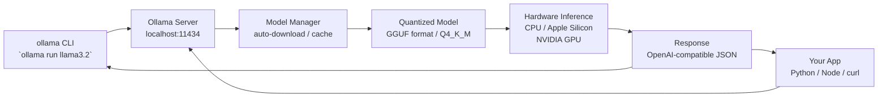
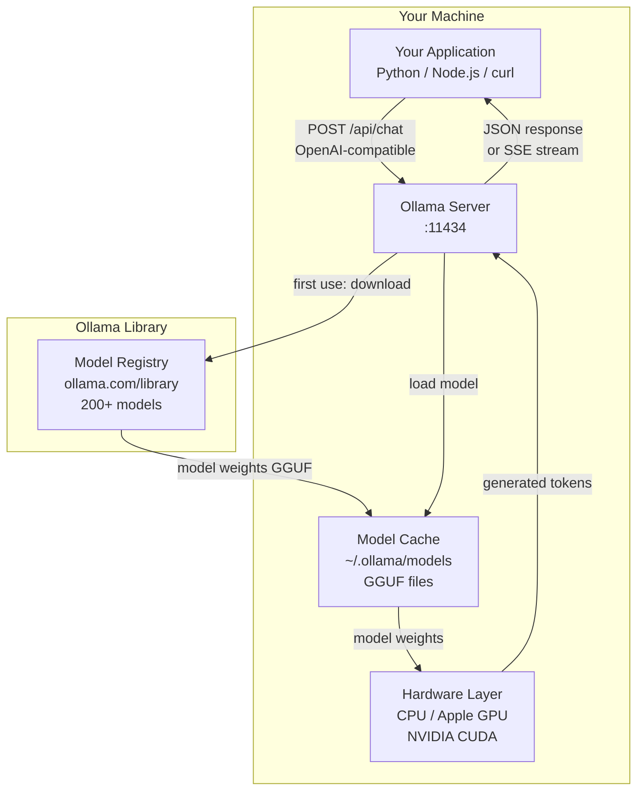

# Ollama — Running LLMs Locally

**Level**: 🟢 Beginner
**Reading Time**: 10 minutes

> Ollama turns running a local LLM into something as simple as `brew install ollama && ollama run llama3.2`. No Python environment, no CUDA setup, no model downloads to manage manually — one command and you have a local GPT-level model running on your laptop.

## 🗺️ Quick Overview



*Ollama runs as a local server on port 11434. Your app talks to it through an OpenAI-compatible REST API. Ollama handles model downloading, quantization, and hardware acceleration automatically.*

## What is Ollama?

Ollama is an open-source tool (MIT license) for running large language models on your own hardware — macOS, Linux, or Windows. It provides:

- **One-command setup**: `brew install ollama` or a single curl script on Linux
- **200+ models** in the Ollama library: Llama 3, Mistral, Phi-4, Qwen, Gemma, DeepSeek, CodeLlama, and more
- **OpenAI-compatible API**: your existing OpenAI code works with a `base_url` change
- **Automatic hardware acceleration**: uses Apple Silicon GPU, NVIDIA CUDA, or AMD ROCm if available; falls back to CPU
- **Automatic model management**: downloads, caches, and garbage-collects model files for you

## Why Run Models Locally?

| Reason | Detail |
|--------|--------|
| **Privacy** | Data never leaves your machine — no API calls to external servers |
| **Cost** | $0 per token after hardware. No monthly API bill for high-volume use |
| **Offline** | Works without internet once the model is downloaded |
| **Latency** | No network round-trip (but generation is slower on local hardware) |
| **Control** | Pin exact model version; no API deprecations or surprise changes |
| **Experimentation** | Try 20 models in an afternoon without worrying about cost |

**When local is not the right choice**: production multi-user systems (Ollama handles one request at a time by default), latency-critical paths (cloud GPUs are faster for large models), or models bigger than your RAM can fit.

## Quick Start

```bash
# --- Install ---
# macOS (Homebrew)
brew install ollama

# Linux (one command)
curl -fsSL https://ollama.com/install.sh | sh

# Windows: download installer from https://ollama.com/download

# --- Pull a model ---
ollama pull llama3.2:3b      # 2GB — good for development and testing
ollama pull mistral:7b        # 4GB — solid general-purpose model
ollama pull phi4:14b          # 9GB — excellent quality, smaller than 70B
ollama pull deepseek-r1:14b  # 9GB — strong reasoning and coding

# --- Run in terminal (interactive chat) ---
ollama run llama3.2:3b "Explain vector databases in one paragraph"

# --- List downloaded models ---
ollama list

# --- Start the API server (auto-starts on install, runs on port 11434) ---
ollama serve

# --- Check server health ---
curl http://localhost:11434/api/tags
```

## Model Selection Guide

Choose a model based on your hardware constraints and task requirements:

| Model | Size | RAM Needed | Tokens/sec (M3 Pro) | Good For |
|-------|------|-----------|---------------------|---------|
| Llama 3.2 1B | 0.8GB | 4GB | ~120 t/s | Ultra-fast, simple extraction |
| Llama 3.2 3B | 2GB | 6GB | ~90 t/s | Development, testing, chat |
| Mistral 7B | 4GB | 8GB | ~60 t/s | General purpose, balanced |
| Llama 3.1 8B | 5GB | 10GB | ~55 t/s | Strong reasoning, good quality |
| Phi-4 14B | 9GB | 16GB | ~35 t/s | Excellent quality, efficient |
| Llama 3.3 70B | 40GB | 48GB | ~12 t/s | Near-GPT-4 quality |
| DeepSeek R1 32B | 20GB | 24GB | ~20 t/s | Strong reasoning and coding |
| DeepSeek R1 70B | 40GB | 48GB | ~10 t/s | Best open-source reasoning |

**Quick selection rule**:
- 8GB RAM → Llama 3.2 3B or Mistral 7B
- 16GB RAM → Phi-4 14B (sweet spot of quality/speed)
- 32GB RAM → Llama 3.1 70B or DeepSeek R1 32B
- 64GB+ RAM → Llama 3.3 70B (GPT-4 class)

## Quantization in Ollama

Ollama downloads models in **GGUF format** — quantized versions that dramatically reduce memory requirements. All Ollama models are pre-quantized:

| Quantization | Bits | Quality | Size vs FP16 | Default? |
|-------------|------|---------|-------------|---------|
| Q4_0 | 4-bit | Good | ~25% | No |
| Q4_K_M | 4-bit (medium) | Better | ~28% | **Yes** (default) |
| Q5_K_M | 5-bit (medium) | Best 5-bit | ~35% | No |
| Q8_0 | 8-bit | Near-lossless | ~50% | No |
| FP16 | 16-bit | Lossless | 100% | No |

**Specifying quantization** in the model tag:
```bash
ollama pull llama3.1:8b-instruct-q8_0    # 8-bit — better quality, more RAM
ollama pull llama3.1:8b-instruct-q4_K_M  # default 4-bit — smaller, slightly lower quality
```

For most development use cases, the default `Q4_K_M` is fine. Use `Q8_0` when you need maximum quality and have the RAM headroom.

## Performance Benchmarks

Real-world generation speeds (tokens per second, output):

| Hardware | Model | Quantization | Tokens/sec |
|----------|-------|-------------|-----------|
| MacBook Pro M2 Max (32GB) | Mistral 7B | Q4_K_M | ~80 t/s |
| MacBook Pro M3 Pro (18GB) | Llama 3.2 3B | Q4_K_M | ~90 t/s |
| MacBook Pro M3 Pro (18GB) | Phi-4 14B | Q4_K_M | ~35 t/s |
| RTX 4090 (24GB VRAM) | Llama 3.1 8B | Q4_K_M | ~120 t/s |
| RTX 4090 (24GB VRAM) | Llama 3.3 70B | INT4 | ~30 t/s |
| CPU only (Intel i7, 32GB) | Mistral 7B | Q4_K_M | ~3-8 t/s |

**Context**: GPT-4o streaming feels like ~40-60 t/s to the user. Local Phi-4 14B on M3 Pro at ~35 t/s is comparable in perceived speed for chat use cases.

## Using Ollama from Code

### Direct HTTP API (any language)

```bash
curl http://localhost:11434/api/chat -d '{
  "model": "llama3.2",
  "messages": [
    {"role": "user", "content": "What is the CAP theorem?"}
  ],
  "stream": false
}'
```

### OpenAI-Compatible Python Client

This is the most important feature for developers: Ollama exposes an OpenAI-compatible REST API at `/v1`. Your existing OpenAI code works with two changed lines:

```python
import openai

# Change base_url to Ollama — everything else stays identical
client = openai.OpenAI(
    base_url="http://localhost:11434/v1",
    api_key="ollama",  # required by the client library; Ollama ignores the value
)

# Identical call as OpenAI
response = client.chat.completions.create(
    model="llama3.2",     # model name must match what you pulled
    messages=[
        {"role": "system", "content": "You are a helpful assistant."},
        {"role": "user", "content": "Explain vector databases in one paragraph."},
    ],
    temperature=0.7,
    max_tokens=300,
)

print(response.choices[0].message.content)

# Streaming — also works identically
stream = client.chat.completions.create(
    model="mistral",
    messages=[{"role": "user", "content": "Write a short poem about distributed systems."}],
    stream=True,
)

for chunk in stream:
    if chunk.choices[0].delta.content:
        print(chunk.choices[0].delta.content, end="", flush=True)
```

### LangChain + Ollama

```python
from langchain_ollama import ChatOllama
from langchain_core.messages import HumanMessage

# Drop-in replacement for ChatOpenAI
llm = ChatOllama(
    model="llama3.2",
    temperature=0.7,
    base_url="http://localhost:11434",  # default; can omit
)

response = llm.invoke([HumanMessage(content="What is a race condition?")])
print(response.content)

# Works in LCEL chains too
from langchain_core.prompts import ChatPromptTemplate
from langchain_core.output_parsers import StrOutputParser

chain = (
    ChatPromptTemplate.from_template("Explain {concept} in one sentence.")
    | llm
    | StrOutputParser()
)

result = chain.invoke({"concept": "the thundering herd problem"})
print(result)
```

### LlamaIndex + Ollama

```python
from llama_index.llms.ollama import Ollama
from llama_index.embeddings.ollama import OllamaEmbedding
from llama_index.core import Settings, VectorStoreIndex, SimpleDirectoryReader

# Configure LlamaIndex to use Ollama for both LLM and embeddings
Settings.llm = Ollama(model="llama3.2", request_timeout=120.0)
Settings.embed_model = OllamaEmbedding(model_name="nomic-embed-text")

# Build a fully local RAG pipeline — no API calls, no cost
documents = SimpleDirectoryReader("./docs/").load_data()
index = VectorStoreIndex.from_documents(documents)
query_engine = index.as_query_engine()

response = query_engine.query("What are the consistency levels in Cassandra?")
print(response)
```

## Architecture Diagram



## Ollama vs Cloud API

| Dimension | Ollama (Local) | Cloud API (OpenAI/Anthropic) |
|-----------|---------------|------------------------------|
| **Cost** | $0/token (after hardware) | $0.15-15/1M tokens |
| **Privacy** | 100% local — no data leaves | Data sent to provider |
| **Setup** | 5 minutes | 2 minutes (API key only) |
| **Model quality** | Good to excellent (70B models) | Best (GPT-4o, Claude 3.5) |
| **Max tokens/sec** | 30-120 t/s (local GPU) | 60-200 t/s (remote) |
| **Concurrency** | 1 request at a time (default) | Unlimited (rate-limited) |
| **Latency** | 0ms to first token (no network) | 200-800ms TTFT |
| **Context window** | 4K-128K depending on model | 128K-1M |
| **Offline** | Yes | No |
| **Best for** | Dev, privacy, cost-sensitive | Production, quality-critical |

## Production Self-Hosting

Ollama is designed for **development and local use** — not production multi-user deployments. Key limitations:

- Handles 1 request at a time by default (serial queue)
- No built-in authentication, rate limiting, or access control
- No autoscaling

**For production self-hosting**, use these alternatives:

| Tool | Best For | Notes |
|------|---------|-------|
| **vLLM** | High-throughput GPU inference | Continuous batching, 3-5x Ollama throughput |
| **Text Generation Inference (TGI)** | Hugging Face models at scale | Enterprise ready |
| **Ollama + nginx** | Simple multi-user with auth | Works for small teams (<10 users) |
| **LMStudio** | Desktop GUI alternative to Ollama | macOS/Windows, no CLI |

For a team of 1-5 developers, Ollama behind nginx with basic auth is workable. For production user-facing services, use vLLM on a GPU server.

## Common Mistakes

1. **Running a model that doesn't fit in RAM**: If your model requires more RAM than available, the OS will page to disk. A 7B model that normally runs at 60 t/s on-GPU will drop to 2-5 t/s when paging. Check `ollama list` for model size and ensure it fits with 20% headroom (e.g., 7B model = 4GB, run on 6GB+ available RAM).

2. **Using Ollama for production multi-user endpoints**: By default, Ollama processes one request at a time. If 10 users hit your endpoint simultaneously, 9 of them queue. For any production use with concurrent users, set `OLLAMA_NUM_PARALLEL=4` (for multi-request parallelism) or switch to vLLM.

3. **Not specifying a system prompt for instruct models**: Raw base models (e.g., `llama3.2` without `:instruct`) are not trained to follow instructions. They complete text rather than answer questions. Always pull instruct/chat variants: `llama3.2:3b-instruct-q4_K_M`. The default `llama3.2` tag is already the instruct variant, but when pulling specific sizes, verify.

4. **Forgetting `request_timeout` in LlamaIndex / LangChain**: Large local models generating long responses can take 60-120 seconds. The default timeout in many client libraries is 30 seconds. Set `request_timeout=120.0` (LlamaIndex) or `timeout=120` (LangChain) for local models.

5. **Comparing local 7B models to GPT-4o quality**: A local Mistral 7B is excellent for its size but is not GPT-4 level. For tasks requiring strong reasoning, complex coding, or nuanced understanding, local models plateau. Use local models for cost/privacy-sensitive tasks, cloud APIs for quality-critical production tasks.

## Key Takeaways

- Ollama = one-command local LLM inference with OpenAI-compatible API on port 11434
- **200+ models** available: `ollama pull mistral` and you have a 4GB, 60 t/s local model
- Drop-in OpenAI replacement: change `base_url="http://localhost:11434/v1"` and your code works unchanged
- Model sweet spot: **Phi-4 14B** (9GB, ~35 t/s on M3 Pro) — excellent quality, reasonable hardware requirement
- Local models are great for development, privacy, and cost savings; **not** designed for production multi-user serving
- For production self-hosting, use **vLLM** (GPU) or TGI instead

## References

- 📚 [Ollama Official Documentation](https://ollama.com/docs) — quickstart, model library, API reference
- 📖 [Ollama GitHub](https://github.com/ollama/ollama) — source code, issues, community examples
- 📖 [Ollama Model Library](https://ollama.com/library) — full list of available models with sizes and tags
- 📺 [Run Llama 3 Locally with Ollama — Matt Williams YouTube](https://www.youtube.com/watch?v=90ozfdsQOKo) — practical walkthrough with benchmarks
- 📖 [LangChain Ollama Integration](https://python.langchain.com/docs/integrations/chat/ollama/) — how to use ChatOllama in LangChain pipelines
