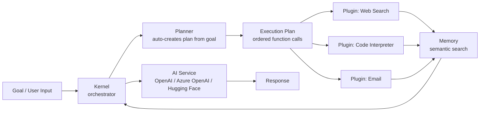
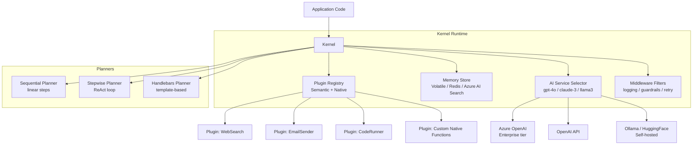

# Semantic Kernel — Microsoft's Enterprise LLM SDK

**Level**: 🟡 Intermediate
**Reading Time**: 12 minutes

> Semantic Kernel treats AI capabilities as composable plugins — the same way a software engineer treats a class library. That design decision makes it the natural choice for enterprises already thinking in objects, services, and dependency injection.

## Quick Overview



*The Kernel holds plugins, memory, and AI services. A Planner reads your goal and auto-generates a plan — an ordered sequence of plugin function calls — to accomplish it.*

## What Problem Does Semantic Kernel Solve?

When enterprises want to add AI to existing .NET or Python applications, they face two bad options:
1. **Call the LLM directly** — no structure, no reusability, no planning
2. **Use LangChain** — heavily Python-first, fights .NET architecture, opinionated about everything

Semantic Kernel fills the gap: it is an LLM integration SDK that feels like a normal software library. You register functions (called **plugins**), declare a goal, and let the **Planner** figure out which functions to call in what order. The orchestration logic lives in the Kernel, not scattered through your application code.

Microsoft uses it in GitHub Copilot, Azure AI Studio, and Microsoft 365 Copilot.

## Core Abstractions

### 1. Kernel

The Kernel is the central orchestrator. It owns:
- Registered **AI services** (which LLM to call)
- Registered **plugins** (what functions the AI can invoke)
- **Memory** (semantic storage with embeddings)
- **Middleware / filters** (logging, guardrails, retry logic)

```python
import semantic_kernel as sk
from semantic_kernel.connectors.ai.open_ai import OpenAIChatCompletion

kernel = sk.Kernel()
kernel.add_service(
    OpenAIChatCompletion(
        service_id="gpt4o",
        model_id="gpt-4o",
        api_key="..."
    )
)
```

### 2. Plugins (Formerly Skills)

A plugin is a collection of functions — either semantic (prompt templates) or native (regular code).

**Semantic function** — defined as a prompt template, resolved by the LLM:
```python
summarize = kernel.add_function(
    function_name="summarize",
    plugin_name="TextSkill",
    prompt="Summarize this text in 3 bullet points:\n{{$input}}",
    prompt_execution_settings=OpenAIChatPromptExecutionSettings(max_tokens=300)
)

result = await kernel.invoke(summarize, input="Long article text here...")
print(str(result))
```

**Native function** — decorated regular code, called directly without LLM:
```python
from semantic_kernel.functions import kernel_function

class MathPlugin:
    @kernel_function(description="Multiply two numbers")
    def multiply(self, a: float, b: float) -> float:
        return a * b

kernel.add_plugin(MathPlugin(), plugin_name="Math")
```

The LLM can call native functions as tools — the Kernel handles the function-calling protocol automatically.

### 3. Planners

Planners auto-create an execution plan (a sequence of function calls) from a natural-language goal. You don't hard-code "call function A, then B, then C" — you describe what you want and the Planner figures out the sequence.

**Sequential Planner** — linear step-by-step execution:
```python
from semantic_kernel.planners.sequential_planner import SequentialPlanner

planner = SequentialPlanner(kernel)
plan = await planner.create_plan_async(
    "Research Anthropic's latest funding round and draft a 3-sentence summary email"
)
result = await kernel.invoke(plan)
print(str(result))
```

**Stepwise Planner (ReAct-style)** — dynamic reasoning and acting:
```python
from semantic_kernel.planners.stepwise_planner import StepwisePlanner, StepwisePlannerConfig

planner = StepwisePlanner(
    kernel,
    config=StepwisePlannerConfig(max_iterations=10, min_iteration_time_ms=1000)
)
plan = planner.create_plan("What is the weather in Tokyo and should I bring an umbrella?")
result = await plan.invoke_async(kernel)
```

**Handlebars Planner** — generates a Handlebars template as the plan; useful for complex conditional logic:
```python
from semantic_kernel.planners.handlebars_planner import HandlebarsPlannerOptions, HandlebarsPlanner

planner = HandlebarsPlanner(kernel, HandlebarsPlannerOptions(allow_loops=True))
plan = await planner.create_plan_async("Process a list of customer tickets and escalate priority ones")
result = await plan.invoke_async(kernel)
```

### 4. Memory

Semantic memory stores and retrieves text by semantic similarity using embeddings. This lets agents "remember" facts without needing them in the prompt context.

```python
from semantic_kernel.connectors.ai.open_ai import OpenAITextEmbedding
from semantic_kernel.memory.volatile_memory_store import VolatileMemoryStore

# Register embedding service and memory store
kernel.add_service(OpenAITextEmbedding(service_id="embedder", model_id="text-embedding-3-small", api_key="..."))
memory = sk.SemanticTextMemory(storage=VolatileMemoryStore(), embeddings_generator=kernel.get_service("embedder"))

# Save facts
await memory.save_information(collection="facts", id="1", text="Our refund policy is 30 days, no questions asked.")
await memory.save_information(collection="facts", id="2", text="Premium plan costs $99/month and includes 10 team seats.")

# Retrieve by similarity
results = await memory.search(collection="facts", query="How much does the premium plan cost?", limit=2)
for r in results:
    print(r.text, r.relevance)
```

### 5. AI Connectors

Semantic Kernel ships first-class connectors for:
- **Azure OpenAI** (primary enterprise target)
- **OpenAI** (GPT-4o, GPT-4 Turbo)
- **Hugging Face** (local/self-hosted models)
- **Ollama** (local models)
- **Google Gemini** (via connector)

Swapping connectors does not change plugin or planner code — the abstraction is clean.

## Full Architecture Diagram



## Semantic Kernel vs LangChain vs LlamaIndex

| Feature | Semantic Kernel | LangChain | LlamaIndex |
|---------|----------------|-----------|------------|
| Primary language | C#/.NET (Python too) | Python / JS | Python |
| Focus | Enterprise orchestration + planning | Chains + agents + RAG | RAG / data retrieval |
| Built-in planner | Strong (3 planner types) | LCEL + manual agents | Limited |
| Native memory | Yes (semantic memory built-in) | Via integrations | Via integrations |
| Type safety | Strong (typed functions) | Weak | Medium |
| Enterprise fit | Excellent (Microsoft backing, Azure-native) | Good | Good |
| .NET support | First-class | None | None |
| Learning curve | Medium | High | Low (for RAG) |
| Microsoft ecosystem | Native (Teams, Office, GitHub Copilot) | Third-party integrations | Third-party integrations |
| Auto-planning from goal | Yes (Sequential / Stepwise / Handlebars) | Manual agent design | No |
| Community size | Growing (Microsoft-driven) | Very large | Large |

## When to Choose Semantic Kernel

**Choose SK when:**
- Your team writes C# or .NET and you want first-class LLM integration
- You are building enterprise apps on Azure AI / Azure OpenAI Service
- You need automatic planning from high-level goals (planner feature is hard to replicate)
- You are integrating with the Microsoft ecosystem: Teams bots, Office add-ins, GitHub Copilot extensions
- You want structured, testable, dependency-injectable AI components

**Avoid SK when:**
- Your entire stack is Python and you have no .NET presence (LangChain/LlamaIndex fit better)
- You need bleeding-edge community plugins and integrations immediately (SK adopts them slower)
- You are building a pure RAG pipeline with no planning needs (LlamaIndex is simpler)
- Your team is unfamiliar with dependency injection patterns (SK's architecture assumes familiarity)

## Real-World Production Example

A financial services company building an AI assistant for analysts:
1. Register plugins: `SecFilingSearch`, `FinancialCalculator`, `CompanyDatabase`, `EmailDraftWriter`
2. Analyst types: "Compare NVIDIA and AMD's Q3 2024 revenue and send a summary to my team"
3. Handlebars Planner generates: call `SecFilingSearch` for NVIDIA → call `SecFilingSearch` for AMD → call `FinancialCalculator` to compare → call `EmailDraftWriter` → deliver output
4. Each step uses the Azure OpenAI connector — all within their existing Azure tenant for compliance

## Common Mistakes

1. **Using Sequential Planner for dynamic tasks.** Sequential Planner creates the plan upfront and cannot adapt if a tool fails or returns unexpected data. Use Stepwise Planner (ReAct) for tasks where you do not know the full sequence ahead of time.

2. **Registering too many plugins.** The Planner reads all registered plugins and their descriptions to build the plan. With 50+ plugins, the Planner prompt becomes very large, causing slow planning, high cost, and confused plans. Group related functions into focused plugins (5–10 functions each) and only register plugins relevant to the task.

3. **Volatile memory in production.** `VolatileMemoryStore` is in-process RAM — wiped on restart, not shared across replicas. Use `AzureAISearchMemoryStore` or `RedisMemoryStore` for production deployments.

## Key Takeaways

- Semantic Kernel = Kernel (orchestrator) + Plugins (functions) + Planners (auto-sequencing) + Memory (semantic retrieval)
- It is the natural choice for .NET / Azure shops — first-class C# support and Azure AI connectors
- Planners are the standout feature: describe a goal in natural language, get an execution plan automatically
- Semantic functions are prompt templates; native functions are regular code — both become tools the LLM can call
- Production memory requires a real store (Azure AI Search, Redis) — not the default in-memory option
- Microsoft uses it in GitHub Copilot, Azure AI Studio, and Microsoft 365 Copilot — it is production-proven at scale

## References

- 📖 [Semantic Kernel Official Docs](https://learn.microsoft.com/en-us/semantic-kernel/overview/) — Microsoft's comprehensive guide
- 📖 [Semantic Kernel GitHub Repository](https://github.com/microsoft/semantic-kernel) — Source code and Python/C#/Java examples
- 📺 [Semantic Kernel Deep Dive — Microsoft Build 2024](https://www.youtube.com/watch?v=ZKPqQoIghkE) — Product team overview of SK architecture and planners
- 📖 [SK Python Samples](https://github.com/microsoft/semantic-kernel/tree/main/python/samples) — Runnable examples for all major features
