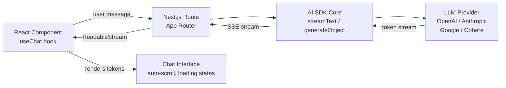
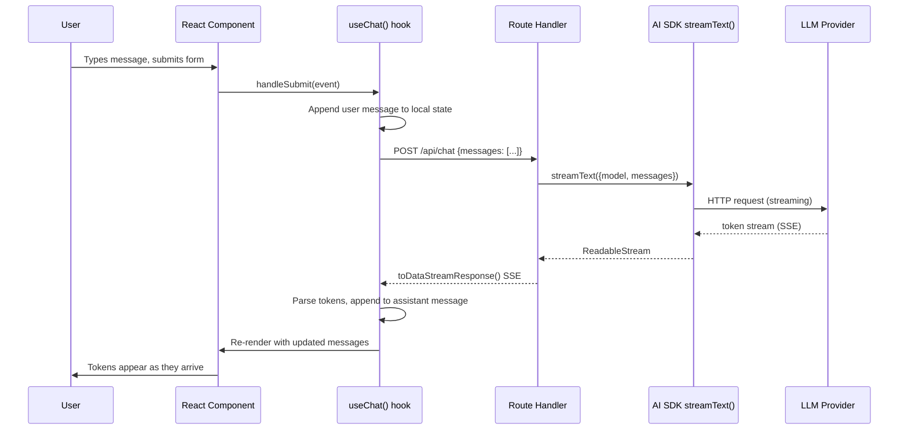

# Vercel AI SDK — Streaming AI UIs for Next.js

**Level**: 🟡 Intermediate
**Reading Time**: 10 minutes

> Building a streaming AI chat in Next.js without the Vercel AI SDK means writing 200 lines of SSE handling, state management, and error recovery. With the SDK, it's 20 lines and you're done.

## 🗺️ Quick Overview



*AI SDK sits between your React UI and the LLM provider. `useChat()` on the client manages state; a Next.js route handler calls `streamText()` and pipes the response back as SSE.*

## The Problem

When you integrate an LLM into a Next.js app without a dedicated SDK, you're solving the same problems every time:

- Parsing streaming SSE responses from OpenAI/Anthropic
- Managing loading states, message history, and error states in React
- Writing different code for every LLM provider (OpenAI API ≠ Anthropic API)
- Handling tool calls in streaming mode (providers return tool call deltas)
- Making streaming work on Edge Runtime (no Node.js streams)

Vercel AI SDK (`ai` package) is a TypeScript-first SDK that solves all of these with a unified API across 20+ providers, purpose-built React hooks, and first-class Next.js App Router support.

## Core Packages

| Package | Purpose | Install |
|---------|---------|---------|
| `ai` | Core: LLM calls, streaming, tool use, structured output | Always |
| `@ai-sdk/openai` | OpenAI provider (GPT-4o, GPT-4o-mini, embeddings) | If using OpenAI |
| `@ai-sdk/anthropic` | Anthropic provider (Claude 3.5, 3 Haiku) | If using Anthropic |
| `@ai-sdk/google` | Google provider (Gemini 1.5 Pro, Flash) | If using Google |
| `@ai-sdk/react` | React hooks: `useChat`, `useCompletion` | React apps |
| `@ai-sdk/vue` | Vue bindings | Vue apps |
| `@ai-sdk/svelte` | Svelte bindings | Svelte apps |

```bash
npm install ai @ai-sdk/openai @ai-sdk/anthropic
```

## Key APIs

### `generateText()` — Non-Streaming

Returns a complete response after the full generation completes. Use for background tasks, classification, extraction where streaming UX isn't needed.

```typescript
import { generateText } from "ai";
import { openai } from "@ai-sdk/openai";

const { text, usage } = await generateText({
  model: openai("gpt-4o-mini"),
  prompt: "Summarize this document in 3 bullet points: ...",
});

console.log(text);
console.log(`Tokens used: ${usage.totalTokens}`);
```

### `streamText()` — Streaming

Returns a `ReadableStream` of tokens. This is the function you use in route handlers to stream back to the client.

```typescript
import { streamText } from "ai";
import { anthropic } from "@ai-sdk/anthropic";

const result = await streamText({
  model: anthropic("claude-3-5-haiku-20241022"),
  system: "You are a helpful assistant.",
  messages: [{ role: "user", content: "Explain CAP theorem" }],
});

// Convert to a Response compatible with Next.js App Router
return result.toDataStreamResponse();
```

### `generateObject()` — Structured Output

Generates a JSON object that matches a Zod schema. No more parsing or hallucinated JSON — the SDK handles structured output mode and retries.

```typescript
import { generateObject } from "ai";
import { openai } from "@ai-sdk/openai";
import { z } from "zod";

const { object } = await generateObject({
  model: openai("gpt-4o"),
  schema: z.object({
    title: z.string(),
    difficulty: z.enum(["beginner", "intermediate", "advanced"]),
    estimatedTime: z.number().describe("minutes to complete"),
    prerequisites: z.array(z.string()),
  }),
  prompt: "Generate a learning plan entry for 'understanding vector databases'",
});

// object is fully typed based on the Zod schema
console.log(object.title);       // string
console.log(object.difficulty);  // "beginner" | "intermediate" | "advanced"
console.log(object.estimatedTime); // number
```

## Code: Streaming Chat with `useChat()` and App Router

This is the canonical Next.js + AI SDK pattern. Two files: a route handler and a React component.

**`app/api/chat/route.ts`** — the server:

```typescript
import { streamText } from "ai";
import { openai } from "@ai-sdk/openai";

export const runtime = "edge"; // runs on Edge Runtime — no Node.js required

export async function POST(req: Request) {
  const { messages } = await req.json();

  const result = await streamText({
    model: openai("gpt-4o-mini"),
    system: "You are a helpful assistant who answers concisely.",
    messages,             // full conversation history passed from client
    maxTokens: 1000,
    temperature: 0.7,
  });

  // toDataStreamResponse() returns a Response with AI SDK's streaming protocol
  // useChat() on the client knows how to consume this format
  return result.toDataStreamResponse();
}
```

**`app/chat/page.tsx`** — the React client:

```typescript
"use client";

import { useChat } from "@ai-sdk/react";

export default function ChatPage() {
  const {
    messages,      // array of { role, content } — updated as tokens arrive
    input,         // current text input value
    handleInputChange, // onChange for the textarea
    handleSubmit,  // onSubmit — sends message + clears input
    isLoading,     // true while streaming
    error,         // error object if the request failed
  } = useChat({
    api: "/api/chat",       // matches our route handler above
    maxSteps: 5,            // allows multi-step tool calls
    onError: (err) => console.error("Chat error:", err),
  });

  return (
    <div style={{ maxWidth: 600, margin: "0 auto", padding: 20 }}>
      <div style={{ minHeight: 400, border: "1px solid #eee", padding: 16 }}>
        {messages.map((m) => (
          <div
            key={m.id}
            style={{
              marginBottom: 12,
              textAlign: m.role === "user" ? "right" : "left",
            }}
          >
            <strong>{m.role}:</strong> {m.content}
          </div>
        ))}
        {isLoading && <div style={{ opacity: 0.5 }}>Assistant is typing...</div>}
        {error && <div style={{ color: "red" }}>Error: {error.message}</div>}
      </div>

      <form onSubmit={handleSubmit} style={{ marginTop: 16, display: "flex" }}>
        <textarea
          value={input}
          onChange={handleInputChange}
          placeholder="Ask something..."
          style={{ flex: 1, padding: 8 }}
          rows={2}
        />
        <button type="submit" disabled={isLoading} style={{ marginLeft: 8 }}>
          Send
        </button>
      </form>
    </div>
  );
}
```

That is a fully functional streaming chat in ~60 lines. `useChat()` handles: message history, optimistic updates, streaming token appending, loading state, error handling, and request deduplication.

## Code: Tool Use with `streamText()` and `maxSteps`

Tools let the LLM call functions and use their results in the final response. The `maxSteps` parameter allows the model to loop — call a tool, get the result, call another tool, get the result, then generate the final answer.

```typescript
// app/api/agent/route.ts
import { streamText, tool } from "ai";
import { openai } from "@ai-sdk/openai";
import { z } from "zod";

export const runtime = "edge";

export async function POST(req: Request) {
  const { messages } = await req.json();

  const result = await streamText({
    model: openai("gpt-4o"),
    messages,
    maxSteps: 5,  // allow up to 5 tool call → result → continue cycles

    tools: {
      // Tool 1: fetch current weather
      getWeather: tool({
        description: "Get current weather for a city",
        parameters: z.object({
          city: z.string().describe("The city name"),
          unit: z.enum(["celsius", "fahrenheit"]).default("celsius"),
        }),
        execute: async ({ city, unit }) => {
          // In real code, call a weather API here
          return { city, temperature: 22, condition: "Partly cloudy", unit };
        },
      }),

      // Tool 2: search for information
      searchWeb: tool({
        description: "Search the web for current information",
        parameters: z.object({
          query: z.string().describe("The search query"),
        }),
        execute: async ({ query }) => {
          // In real code, call Serper / Tavily / Brave Search API
          return { results: [`Result for: ${query}`] };
        },
      }),
    },
  });

  return result.toDataStreamResponse();
}
```

## Code: Provider Switching

The AI SDK's unified interface means switching providers is a one-line import change. Same code, different model:

```typescript
import { streamText } from "ai";

// Option A: OpenAI
import { openai } from "@ai-sdk/openai";
const model = openai("gpt-4o-mini");

// Option B: Anthropic — same interface
import { anthropic } from "@ai-sdk/anthropic";
const model = anthropic("claude-3-5-haiku-20241022");

// Option C: Google Gemini — same interface
import { google } from "@ai-sdk/google";
const model = google("gemini-1.5-flash");

// Your route handler code is identical regardless of which model you pick
const result = await streamText({ model, messages });
return result.toDataStreamResponse();
```

**Cost routing pattern** — route to a cheaper model when appropriate:

```typescript
function selectModel(complexity: "simple" | "complex") {
  if (complexity === "simple") {
    return anthropic("claude-3-5-haiku-20241022"); // $0.80/1M input tokens
  }
  return openai("gpt-4o");  // $2.50/1M input tokens — 3x more expensive
}
```

**Fallback pattern** — try primary provider, fall back to secondary:

```typescript
import { openai } from "@ai-sdk/openai";
import { anthropic } from "@ai-sdk/anthropic";

async function streamWithFallback(messages: any[]) {
  try {
    return await streamText({ model: openai("gpt-4o"), messages });
  } catch (err) {
    console.warn("OpenAI failed, falling back to Anthropic:", err);
    return await streamText({ model: anthropic("claude-3-5-sonnet-20241022"), messages });
  }
}
```

## Architecture: What `useChat()` Does



## Why AI SDK Matters for Next.js Developers

| Without AI SDK | With AI SDK |
|---------------|-------------|
| Parse SSE manually: `getReader()`, `TextDecoder`, delta accumulation | `useChat()` handles all streaming parsing |
| Write provider-specific request formats | One unified API for 20+ providers |
| Manage message history, loading, error state in React | `useChat()` state management built in |
| Handle Edge Runtime streaming (Web Streams API) | `toDataStreamResponse()` handles it |
| Tool call delta parsing (complex JSON assembly) | `tool()` helper + auto-execution |
| Structured output parsing with retries | `generateObject()` + Zod schema |

## Strengths & Weaknesses

| | Strength | Weakness |
|-|----------|---------|
| **DX for Next.js** | Best-in-class — `useChat` is 20 lines | Less value outside Next.js/React |
| **Provider coverage** | 20+ providers, identical interface | Some providers need separate packages |
| **TypeScript** | Full type inference from Zod schemas | Type errors can be cryptic for tool params |
| **Streaming** | Edge Runtime, App Router, SSE — all work | Only SSE streaming — not WebSockets |
| **Structured output** | `generateObject` with Zod is excellent | No built-in JSON repair for bad LLM output |
| **Multi-step agents** | `maxSteps` enables simple agent loops | Not a full agent framework (LangChain is) |

## When to Use Vercel AI SDK

**Use Vercel AI SDK when:**
- You are building a Next.js or React app with AI features
- You need streaming token-by-token output in the UI
- You want to switch LLM providers without rewriting your code
- You need structured JSON output with type safety (Zod schemas)
- You want to add tool use without implementing the streaming delta assembly yourself

**Consider alternatives when:**
- You are building a Python backend — use LangChain, LlamaIndex, or the provider SDK directly
- You need a full agent framework with memory, state, and complex orchestration — use LangGraph or LlamaIndex agents
- You are not building a UI — `generateText()` is fine but the raw provider SDK works just as well
- You need WebSocket streaming — AI SDK uses SSE only

## Common Mistakes

1. **Sending full message history on every request**: `useChat()` sends all `messages` in every POST request. For long conversations (50+ messages), this burns tokens fast. Implement server-side summarization or truncate to the last N messages before passing to the LLM.

2. **Not setting `maxTokens`**: Without a `maxTokens` limit, a runaway generation can cost 10x the expected amount. Always set `maxTokens` explicitly — `1000` is a reasonable default for chat, `500` for short answers.

3. **Using `runtime = "edge"` with Node.js dependencies**: Edge Runtime does not support most Node.js APIs (file system, crypto, process). If your route handler imports a Node.js-only package, remove `export const runtime = "edge"` or refactor the dependency.

4. **Not handling the `error` state in `useChat()`**: `useChat()` exposes an `error` object but does not display it by default. If you don't render `error.message`, users see a frozen loading spinner with no indication of failure. Always render the error state.

5. **Using `generateText()` for chat** (instead of `streamText()`): `generateText()` waits for the full response before returning. For chat UIs, this means users stare at a blank screen for 5-15 seconds. Always use `streamText()` for user-facing chat — streaming makes interfaces feel 10x faster even if the total time is the same.

## Key Takeaways

- Vercel AI SDK = TypeScript-first SDK for streaming AI UIs in Next.js/React
- `useChat()` + a route handler calling `streamText()` = working streaming chat in ~60 lines
- Same code works with 20+ LLM providers — switch models by changing one import
- `generateObject()` with Zod schemas gives full type-safe structured output with no JSON parsing
- `maxSteps` in `streamText()` enables simple agentic loops with tool calling
- Best for: Next.js apps with streaming UIs. For Python backends or complex agent orchestration, use the provider SDK or LangChain directly

## References

- 📚 [Vercel AI SDK Documentation](https://sdk.vercel.ai/docs) — official docs, API reference, examples
- 📖 [Vercel AI SDK GitHub](https://github.com/vercel/ai) — source, examples, changelog
- 📺 [Building a Chatbot with Vercel AI SDK — Vercel YouTube](https://www.youtube.com/watch?v=rPuglGMl-gI) — official walkthrough with Next.js App Router
- 📖 [AI SDK Provider Guide](https://sdk.vercel.ai/providers/ai-sdk-providers) — comparison of all supported providers and their capabilities
- 📖 [Streaming in Next.js App Router](https://nextjs.org/docs/app/building-your-application/routing/loading-ui-and-streaming) — underlying streaming primitives the AI SDK builds on
