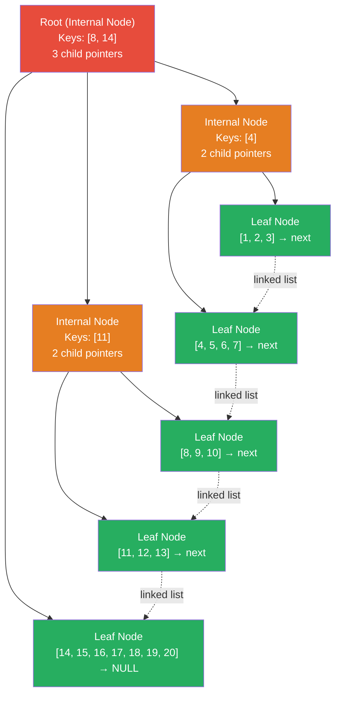

# B+Tree — The Database Index

**Level**: 🟡 Intermediate
**Reading Time**: 12 minutes

> Every index you create in PostgreSQL, MySQL, or SQLite is a B+tree. Understanding this structure explains why some queries are fast and others are not.

---

## The Core Idea

Imagine a library with millions of books. A flat sorted list of titles lets you find a book by binary search — but the list itself could be millions of pages long. You would prefer a catalog organized like a hierarchy: first by genre, then by author's last initial, then alphabetically within that. Each level of the hierarchy fits on one page.

That is a B+tree: a **balanced tree where each node is a disk page**, designed so that finding any value requires reading only O(log N) disk pages — typically 3 or 4 even for tables with millions of rows.

**Why B+tree specifically, not binary search tree?** A regular binary search tree has two children per node. A B+tree has hundreds. With fewer levels, you need fewer disk reads. And every disk read costs 100x+ more than a memory access.

---

## B-tree vs B+tree

Most resources use these terms interchangeably, but databases use **B+tree** specifically:

| Property | B-tree | B+tree |
|----------|--------|--------|
| Data stored | In all nodes (internal + leaf) | Only in leaf nodes |
| Internal nodes | Hold keys AND data | Hold only routing keys |
| Leaf nodes | Unlinked | Linked as a doubly-linked list |
| Range scan | Must traverse tree multiple times | Scan leaves linearly |

B+tree wins for databases because **range scans are the dominant operation**. Once you find the start of a range with O(log N) traversal, you scan leaf nodes linearly — no backtracking through internal nodes.

---

## How It Works

### Structure

```
B+tree properties:
  - Order M: each node holds between ceil(M/2) and M keys
  - Internal nodes: keys act as routing guides only; pointers to children
  - Leaf nodes: keys + actual data (or pointers to heap rows); linked list
  - Balanced: all leaves are at the same depth
  - Root: special case — can have as few as 2 children
```

Node size = disk page size (usually 4KB or 8KB in PostgreSQL). A 4KB node with 8-byte integer keys and 8-byte pointers fits ~250 entries per internal node. With 250 branching factor, a 3-level tree holds 250³ ≈ 15 million entries.

### Point Lookup Pseudocode

```
function lookup(tree, searchKey):
  node = tree.root

  -- traverse from root to leaf
  while node is not a leaf:
    -- binary search within this node's keys to find correct child pointer
    childIndex = binarySearch(node.keys, searchKey)
    node = node.children[childIndex]

  -- node is now a leaf; binary search for the key
  index = binarySearch(node.keys, searchKey)

  if node.keys[index] == searchKey:
    return node.values[index]
  else:
    return NOT_FOUND
```

### Range Scan Pseudocode

```
function rangeQuery(tree, startKey, endKey):
  -- Step 1: find the leaf containing startKey
  leafNode = findLeaf(tree, startKey)
  results = []

  -- Step 2: scan leaf nodes linearly (they are linked)
  while leafNode != NULL:
    for i in range(len(leafNode.keys)):
      if leafNode.keys[i] > endKey:
        return results            -- past the end of range
      if leafNode.keys[i] >= startKey:
        results.append(leafNode.values[i])

    leafNode = leafNode.nextLeaf  -- follow linked list pointer

  return results
```

### Insert and Node Split Pseudocode

```
function insert(tree, key, value):
  leaf = findLeaf(tree, key)
  insertIntoLeaf(leaf, key, value)

  if leaf.size > leaf.maxSize:
    splitLeaf(tree, leaf)

function splitLeaf(tree, leaf):
  -- create new sibling node
  newLeaf = createLeafNode()

  -- split keys/values roughly in half
  midIndex = len(leaf.keys) / 2
  newLeaf.keys = leaf.keys[midIndex:]
  newLeaf.values = leaf.values[midIndex:]
  leaf.keys = leaf.keys[:midIndex]
  leaf.values = leaf.values[:midIndex]

  -- link sibling into the leaf chain
  newLeaf.nextLeaf = leaf.nextLeaf
  leaf.nextLeaf = newLeaf

  -- push the first key of newLeaf up to parent as routing key
  pushUpToParent(tree, leaf.parent, newLeaf.keys[0], newLeaf)

  -- if parent is also full, split it recursively
  if leaf.parent.size > leaf.parent.maxSize:
    splitInternalNode(tree, leaf.parent)
```

---

## Visual Walkthrough

A B+tree with order 4 storing keys 1–20:



Range query `WHERE key BETWEEN 4 AND 11`:
1. Traverse root → I1 → L2 (key 4 is first in L2)
2. Scan L2: collect 4, 5, 6, 7
3. Follow linked list to L3: collect 8, 9, 10
4. Follow linked list to L4: collect 11, stop (11 <= 11)
5. Total: 3 leaf pages read, no backtracking through internal nodes

---

## Where This Appears in Real Systems

### PostgreSQL

**Every index is a B+tree by default.** When you write:
```
CREATE INDEX idx_users_email ON users(email);
```
PostgreSQL creates a B+tree on the email column. The default page size is 8KB. For a table with 10 million users, the tree is 4–5 levels deep.

**Clustered vs non-clustered**: PostgreSQL uses "heap" storage — rows are not stored in index order. The B+tree leaf nodes store row pointers (ctid = page number + slot). MySQL InnoDB primary key is a clustered index — the leaf nodes contain the actual row data, and secondary indexes store the primary key value to look up the row.

**Index-only scans**: If all the columns you need are in the index, PostgreSQL can answer the query from the B+tree alone, skipping the heap entirely.

### MySQL InnoDB

InnoDB uses B+tree for all indexes. The primary key is always a clustered index (data lives in leaf pages). Secondary indexes store the primary key, which is then used to look up the row in the clustered index — a two-step process called a "bookmark lookup."

### SQLite

SQLite uses B+tree for both table data (without a separate heap) and indexes. The entire database file is organized as a B+tree. This is why SQLite is remarkably fast for single-process applications despite being file-based.

---

## Complexity Analysis

| Operation | Time Complexity | Disk Reads |
|-----------|----------------|------------|
| Point lookup | O(log_M N) | 3–4 pages typical |
| Range scan (K results) | O(log_M N + K) | 3–4 pages + K/M leaf pages |
| Insert | O(log_M N) amortized | 3–4 reads + 1–2 writes |
| Delete | O(log_M N) amortized | 3–4 reads + 1–2 writes |

Where M is the branching factor (typically 100–500). log_M N is much smaller than log₂ N:
- log₂(1,000,000) ≈ 20 levels
- log₁₀₀(1,000,000) = 3 levels

**With 3 levels and 100 branching factor, a B+tree holds 1 million entries with at most 3 disk reads per lookup.** This is why databases can answer queries in milliseconds even on spinning disks.

---

## Trade-offs

| Index Type | Point Lookup | Range Query | Insert | Sequential Scan | Notes |
|------------|-------------|-------------|--------|-----------------|-------|
| B+tree | O(log N) | O(log N + K) | O(log N) | O(N/M) | Default; best for mixed workload |
| Hash index | O(1) avg | Not supported | O(1) avg | O(N) | PostgreSQL supports; only exact match |
| LSM tree | O(log N) | O(log N + K) | O(1) amortized | O(N) | Write-optimized; see LSM tree article |
| No index (full scan) | O(N) | O(N) | N/A | O(N) | Only good for tiny tables |

**When to use a hash index**: exact equality queries only, never range queries. PostgreSQL hash indexes are faster for `=` but useless for `BETWEEN`, `>`, `<`, `LIKE 'prefix%'`, or `ORDER BY`.

---

## Interview Connection

**"Explain how a database index works."**

Answer: Most databases use a B+tree index. It is a balanced tree where each node corresponds to a disk page (typically 8KB). Internal nodes store routing keys and child pointers. Leaf nodes store the actual indexed values and row pointers, and are linked in sorted order. To find a value, you traverse from root to leaf with binary search at each node — typically 3–4 disk reads regardless of table size. For range queries, you find the start leaf node, then scan the linked list of leaves linearly.

**Common follow-ups**:
- "What is the difference between a clustered and non-clustered index?" → Clustered: row data is stored in the leaf pages. Non-clustered: leaf pages store row pointers (heap references). MySQL InnoDB primary key is clustered. PostgreSQL indexes are always non-clustered (heap-based).
- "Why doesn't the database just use a hash table?" → Range queries (`BETWEEN`, `>`, `ORDER BY`) are not supported by hash tables. B+tree supports both exact lookups and range scans efficiently.
- "What happens during a B+tree node split?" → When a leaf node is full, it splits into two nodes. The new node's smallest key is pushed up to the parent as a routing key. If the parent is also full, it splits recursively. Root splits increase the tree height by one.

---

## Key Takeaways

- B+tree stores all data in leaf nodes; internal nodes are routing only — this enables fast range scans
- Leaf nodes form a doubly-linked list — after finding the range start in O(log N), scan forward linearly
- Each node = one disk page (8KB in PostgreSQL) — branching factor ~100–500, so 3–4 levels handles millions of rows
- PostgreSQL default index type is B+tree; every `CREATE INDEX` creates one
- MySQL InnoDB primary key is a clustered B+tree — row data lives in leaf pages; secondary indexes store the PK
- Hash indexes are O(1) for exact equality but cannot do range queries, ORDER BY, or prefix matching
- Node splits during insert propagate up — root splits are how the tree grows taller
