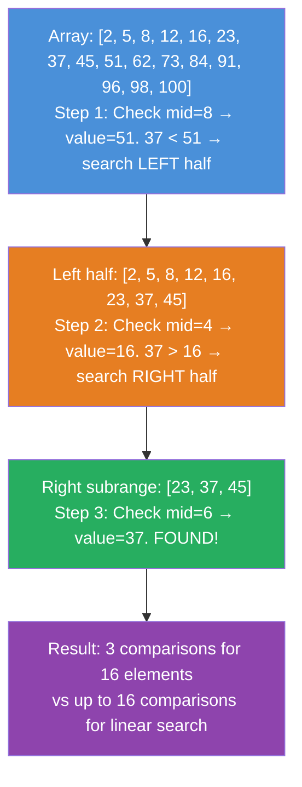

# Binary Search in Real Systems

**Level**: 🟢 Beginner
**Reading Time**: 8 minutes

> Every time a database finds a row by ID in milliseconds instead of scanning the whole table, binary search is why.

---

## The Core Idea

Imagine finding a word in a physical dictionary. You do not start from page 1 and flip forward. You open to the middle, check whether your word comes before or after that page, then repeat. Each step cuts the remaining search space in half.

That is binary search: discard half the possibilities with each comparison. With 1 million sorted items, you find any item in at most 20 comparisons (log₂(1,000,000) ≈ 20). Linear search would take up to 1 million comparisons.

The catch: **the data must be sorted**. Every use of binary search in production is essentially a decision to keep data sorted so it can be searched this way.

---

## How It Works

### Standard Binary Search

```
function binarySearch(sortedArray, target):
  left = 0
  right = len(sortedArray) - 1

  while left <= right:
    mid = (left + right) / 2          -- integer division, no overflow risk: left + (right - left) / 2

    if sortedArray[mid] == target:
      return mid                       -- found it

    if sortedArray[mid] < target:
      left = mid + 1                   -- target is in the right half

    else:
      right = mid - 1                  -- target is in the left half

  return NOT_FOUND
```

### Find First Occurrence (Left Boundary)

When duplicates exist and you need the leftmost match (used in range queries):

```
function findFirst(sortedArray, target):
  left = 0
  right = len(sortedArray) - 1
  result = NOT_FOUND

  while left <= right:
    mid = left + (right - left) / 2

    if sortedArray[mid] == target:
      result = mid
      right = mid - 1               -- keep searching left for earlier occurrence

    elif sortedArray[mid] < target:
      left = mid + 1

    else:
      right = mid - 1

  return result
```

### Find Last Occurrence (Right Boundary)

```
function findLast(sortedArray, target):
  left = 0
  right = len(sortedArray) - 1
  result = NOT_FOUND

  while left <= right:
    mid = left + (right - left) / 2

    if sortedArray[mid] == target:
      result = mid
      left = mid + 1                -- keep searching right for later occurrence

    elif sortedArray[mid] < target:
      left = mid + 1

    else:
      right = mid - 1

  return result
```

Range query: `findFirst(array, rangeStart)` through `findLast(array, rangeEnd)` — that is exactly how databases implement `WHERE id BETWEEN 100 AND 200`.

---

## Visual Walkthrough

Searching for 37 in a sorted array of 16 elements:



Each step halves the search space. After 4 steps you have searched 16 elements. After 20 steps you have searched 1,048,576 elements.

---

## Where This Appears in Real Systems

### PostgreSQL — B-tree Index Traversal

Every B-tree index traversal is binary search, repeated at each level of the tree. When you run `SELECT * FROM users WHERE id = 42`:

1. PostgreSQL reads the root page of the index (8KB chunk of disk)
2. Binary searches the sorted array of keys within that page to find the pointer to the next level
3. Follows that pointer to the next page, binary searches again
4. Repeats until reaching a leaf page that contains the actual row location
5. Reads the heap page to get the full row

A B-tree with millions of rows has only 3–4 levels. Each level = one disk read + one binary search. Total: 3–4 disk reads to find any row by primary key.

### Redis — ZRANGEBYSCORE

Redis sorted sets (ZSETs) store members in a skip list. `ZRANGEBYSCORE myset 100 200` uses binary search to find the starting position in O(log N) time, then scans linearly from there to collect the range.

The command `ZRANK key member` — find the rank (position) of a member — is also binary search on the underlying sorted structure.

### Time-Series Databases

InfluxDB, TimescaleDB, and Prometheus all store data in time-ordered segments. Queries like `SELECT * FROM metrics WHERE time > '2024-01-01'` binary search across segment boundaries to find the starting segment, then scan forward.

Without binary search, time-range queries would scan all historical data.

### Git Bisect

`git bisect` uses binary search to find which commit introduced a bug. You tell git which commit is good and which is bad, and it binary searches through the commit history — checking out the midpoint, asking you to test, then discarding half the range. Finds the culprit commit in O(log N) steps instead of testing every commit linearly.

```
You have: 1000 commits to search
git bisect needs at most: log₂(1000) ≈ 10 test rounds
vs linear: up to 1000 test rounds
```

### Package Managers (npm, pip, cargo)

Version resolution uses binary search over sorted version lists. When a package requires `>=1.2.0 <2.0.0`, the resolver binary searches the sorted list of available versions to find the satisfying range boundary.

---

## Complexity Analysis

| Operation | Time | Space |
|-----------|------|-------|
| Search | O(log N) | O(1) |
| Find first/last occurrence | O(log N) | O(1) |

**What O(log N) means in practice**:

| Array size | Max comparisons |
|------------|-----------------|
| 1,000 | 10 |
| 1,000,000 | 20 |
| 1,000,000,000 | 30 |
| 10^18 (all data ever) | ~60 |

The jump from 1 million to 1 billion elements only costs 10 more comparisons. This is why binary search is used everywhere data is sorted — the cost of searching barely grows even as data explodes.

**Prerequisite cost**: sorting. Sorting takes O(N log N) time once. If you sort once and search many times, the O(log N) search pays for itself quickly.

---

## Trade-offs

| Approach | Lookup Time | Insert Time | Range Query | Requires Sort |
|----------|-------------|-------------|-------------|---------------|
| Binary search (sorted array) | O(log N) | O(N) | O(log N + K) | Yes |
| Linear scan (unsorted) | O(N) | O(1) | O(N) | No |
| Hash table | O(1) average | O(1) | Not supported | No |
| B-tree (database index) | O(log N) | O(log N) | O(log N + K) | Maintained automatically |

The key insight: hash tables are faster for exact lookups but cannot do range queries. Binary search (and structures built on it like B-trees) is the right choice when you need range queries or sorted traversal.

---

## Interview Connection

**"How does a database find a row by primary key without scanning the whole table?"**

Answer: The database uses a B-tree index. To find a value in a B-tree, it binary searches the sorted keys within each tree node, following pointers down the tree. The tree stays balanced, so the height is O(log N). Typically 3–4 levels for millions of rows, meaning 3–4 disk reads per lookup.

**Common follow-ups**:
- "Why doesn't the database use a hash table instead?" → Hash tables cannot do range queries (`WHERE id BETWEEN 100 AND 200`) or sorted traversal (`ORDER BY id`). B-trees support both.
- "What is the difference between a B-tree and a B+tree?" → B+tree stores all data in leaf nodes (not internal nodes) and links leaf nodes together. This makes range scans much faster — you find the start in O(log N) then scan leaf nodes linearly without backtracking.
- "How does binary search relate to git bisect?" → Git bisect literally performs binary search on the commit history to find the first bad commit.

---

## Key Takeaways

- Binary search reduces N comparisons to log N by halving the search space each step — 20 comparisons for 1 million elements
- The prerequisite is sorted data — every system that uses binary search pays the cost to keep data sorted
- PostgreSQL B-tree index traversal is binary search repeated at each tree level — typically 3–4 levels for millions of rows
- Redis ZRANGEBYSCORE uses binary search to find the range start in a sorted set
- The find-first and find-last variants enable range queries — this is how `WHERE id BETWEEN x AND y` works
- Git bisect is binary search applied to version history — find a bug in 1000 commits with ~10 tests
- Hash tables are faster (O(1)) for exact lookup but cannot do range queries — binary search wins when you need ranges
