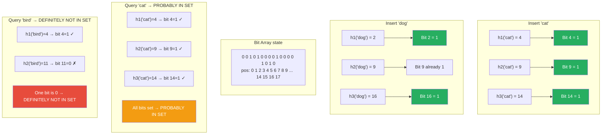

# Bloom Filter

**Level**: 🟡 Intermediate
**Reading Time**: 10 minutes

> Cassandra uses bloom filters to avoid reading SSTables that definitely do not contain your key. Without them, every read would require checking every level of the LSM tree on disk.

---

## The Core Idea

You are the bouncer at an exclusive club. You have a list of banned patrons, but the list has 100 million entries — checking it takes too long for each arrival. You want a quick pre-check: "can I say for certain this person is NOT banned?" If the quick check says "probably allowed," you let them in (or do a slow full check). If the quick check says "definitely not banned," you can skip the full list entirely.

That is a Bloom filter: a space-efficient structure that answers membership queries with **no false negatives** (if it says "not in set", that is 100% certain) but **possible false positives** (if it says "probably in set", you may still need to verify).

The trade-off you are accepting: occasional false positives in exchange for massive memory savings and O(1) constant-time queries.

---

## How It Works

### Structure

```
Bloom filter components:
  - bitArray: an array of M bits, all initialized to 0
  - k: number of hash functions (each hash function maps an element to a bit position)
```

Typical values: M = 10 bits per expected element, k = 7 hash functions gives a 1% false positive rate.

### Insert Pseudocode

```
function insert(bloomFilter, element):
  for i from 1 to k:
    position = hashFunction_i(element) mod bloomFilter.M
    bloomFilter.bitArray[position] = 1
```

Each hash function maps the element to a position in the bit array, and that bit is set to 1.

### Query Pseudocode

```
function mightContain(bloomFilter, element):
  for i from 1 to k:
    position = hashFunction_i(element) mod bloomFilter.M
    if bloomFilter.bitArray[position] == 0:
      return DEFINITELY_NOT_IN_SET    -- at least one bit is 0 → cannot be in the set

  return PROBABLY_IN_SET              -- all k bits are 1 → probably in the set
```

### False Positive Rate Formula

```
After inserting N elements into a filter of M bits with k hash functions:

falsePositiveRate ≈ (1 - e^(-kN/M))^k

Practical sizing (targeting 1% FPR):
  M = -N × ln(0.01) / (ln 2)^2
  M ≈ 9.6 × N bits
  k = (M/N) × ln(2)
  k ≈ 6.6 → round to 7

Example:
  1 million elements, 1% FPR → ~1.2 MB bit array, k=7 hash functions
  1 billion elements, 1% FPR → ~1.2 GB bit array, k=7 hash functions
```

---

## Visual Walkthrough

A Bloom filter with 18 bits and 3 hash functions. Inserting "cat" and "dog":



Note how "bird" gets a false positive on bit 4 (shared with "cat") but is correctly rejected because bit 11 is still 0.

---

## Where This Appears in Real Systems

### Cassandra — SSTable Filtering

This is the canonical Bloom filter use case. Cassandra uses an LSM tree structure. When you read a key, Cassandra must check multiple SSTables on disk — but reading each file is expensive.

Each SSTable has a Bloom filter. Before reading an SSTable from disk, Cassandra checks the filter:
- DEFINITELY NOT IN SET → skip this file entirely (saves one disk read)
- PROBABLY IN SET → read the file and check

With a 1% false positive rate, 99% of unnecessary disk reads are eliminated. For a read-heavy workload with millions of keys spread across many SSTables, this makes a 10–100x difference in read latency.

### PostgreSQL — Bloom Filter Index Extension

PostgreSQL 9.6+ includes a `bloom` index access method (extension). It is useful for multi-column equality queries where a B-tree index would be too large. The bloom index uses significantly less space, with a trade-off of occasional false positives that require a heap check.

### Chrome — Safe Browsing

Chrome maintains a local Bloom filter of known malicious URLs. When you visit a URL:
1. Check the local Bloom filter first (O(1), no network call)
2. If DEFINITELY NOT malicious → load the page immediately
3. If PROBABLY malicious → send the URL to Google's servers for exact verification

This keeps millions of malicious URLs out of browser memory (a full set would be gigabytes) while checking each page visit in microseconds. False positives trigger a network call, not a false block — acceptable rate at ~1%.

### Redis — Probabilistic Data Structures Module

Redis has a native Bloom filter implementation via the RedisBloom module (included in Redis Stack):
```
BF.ADD myfilter "element"     -- insert
BF.EXISTS myfilter "element"  -- query: returns 0 (definitely not) or 1 (probably yes)
BF.RESERVE myfilter 0.01 1000000  -- create with 1% FPR, 1 million capacity
```

Used for: deduplication (have we seen this event ID?), URL caching (has this URL been cached?), session deduplication.

### Email Spam Detection

Email systems use Bloom filters to track processed message IDs. When a message arrives, check the filter: if DEFINITELY NOT SEEN, process it and add the ID. If PROBABLY SEEN, do a full database lookup to confirm deduplication. The filter handles the 99%+ common case (new messages) in constant time.

### Kafka / Stream Processing

Stream processors use Bloom filters to deduplicate events in high-throughput pipelines. Checking if an event ID has been seen before writing it to storage — avoiding the cost of a full lookup in the backing store for every event.

---

## Complexity Analysis

| Operation | Time | Space |
|-----------|------|-------|
| Insert | O(k) = O(1) — k is fixed | O(M) bits total |
| Query | O(k) = O(1) — k is fixed | — |
| False positive rate | — | Configurable |
| Delete | Not supported (standard Bloom filter) | — |

**Why delete is not supported**: setting a bit to 0 during delete might clear a bit that was set by a different element. A Counting Bloom Filter uses counters instead of bits (allowing decrement on delete) but uses 3–4x more memory.

**Space efficiency example**:
- Store 1 million user IDs (8 bytes each) in a hash set → 8 MB minimum
- Bloom filter for same set, 1% FPR → ~1.2 MB
- Bloom filter savings → 85% less memory

---

## Trade-offs

| Approach | Memory | Lookup Time | False Positives | False Negatives | Delete |
|----------|--------|-------------|-----------------|-----------------|--------|
| Bloom Filter | O(N × bits_per_element) | O(1) | Yes (tunable) | Never | No |
| Hash Set | O(N × element_size) | O(1) avg | No | No | Yes |
| Sorted Array | O(N × element_size) | O(log N) | No | No | O(N) |
| Counting Bloom Filter | 3–4x Bloom filter | O(1) | Yes | Never | Yes |

**When to choose Bloom filter**: when memory is constrained, false positives are acceptable (they just trigger a slower fallback check), and you never need to delete elements.

---

## Interview Connection

**"Cassandra is slow on reads. How would you speed it up?"**

One answer: tune Bloom filters. Cassandra's read path checks multiple SSTables. Increasing the Bloom filter size (lower false positive rate) means fewer unnecessary SSTable reads. The trade-off is memory — Bloom filters are stored in memory (or off-heap). You can tune per-table with `bloom_filter_fp_chance` (default 0.1 = 10% FPR for most tables, 0.01 for time-series).

**Common follow-ups**:
- "Can a Bloom filter ever report a false negative?" → No. If an element was inserted, all k bits are set. The query checks those same k bits — they remain 1 forever (unless you use a different variant). False negatives are impossible.
- "How do you size a Bloom filter?" → You need to know the expected number of elements N and your target false positive rate FPR. Then M = -N × ln(FPR) / (ln 2)^2 bits, k = (M/N) × ln(2) hash functions.
- "What happens if you insert more elements than the bloom filter was designed for?" → The false positive rate increases beyond the target. At some point, nearly all bits are 1 and almost every query returns "probably in set," making it useless.

---

## Key Takeaways

- Bloom filters answer "is this element in the set?" in O(1) with no false negatives but tunable false positives
- Structure: M-bit array + k hash functions. Insert sets k bits; query checks if all k bits are 1
- 1% false positive rate requires ~10 bits per element — 85%+ memory savings vs a hash set storing full values
- Cassandra uses Bloom filters to skip SSTables that definitely do not contain a key — saves disk reads on every read path
- Chrome safe browsing: check a local Bloom filter of malicious URLs before making a network call — millions of URLs in kilobytes of memory
- Redis has native Bloom filter support via RedisBloom (BF.ADD, BF.EXISTS commands)
- Standard Bloom filters do not support deletion — Counting Bloom Filters do but use 3–4x more memory
