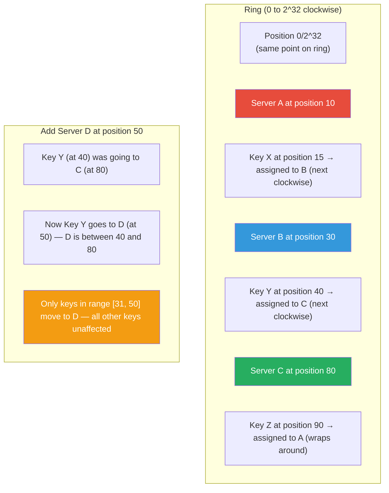

# Consistent Hashing

**Level**: 🟡 Intermediate
**Reading Time**: 12 minutes

> Without consistent hashing, adding one cache server invalidates most of the cache. With it, adding or removing nodes remaps only 1/N of keys — the mathematical foundation of Cassandra, DynamoDB, and Redis Cluster.

---

## The Core Idea

**The naive approach and why it fails**: With N servers, you assign key K to server `hash(K) mod N`. Simple. But when you add or remove a server (N changes), almost every key gets reassigned to a different server. For a cache, this means a "cache stampede" — suddenly all cached data is unreachable, every request misses, and your database gets overwhelmed.

**The consistent hashing solution**: Instead of mapping keys to servers directly, map both servers and keys to positions on a ring — a virtual circle representing hash values from 0 to 2^32-1. To find a key's server, walk clockwise from the key's position until you hit a server position.

When you add a server, only the keys between the new server and its counterclockwise predecessor need to move — about 1/N of all keys. When you remove a server, only its keys move — to the next server clockwise.

---

## How It Works

### Ring Construction

```
function buildRing():
  ring = sorted map (ring position → server identifier)

  for each server S:
    position = hash(S.identifier) mod 2^32
    ring.insert(position, S)

  return ring
```

### Key Lookup

```
function getServer(ring, key):
  keyPosition = hash(key) mod 2^32

  -- find the first server at or after this position on the ring
  server = ring.findFirstGreaterOrEqual(keyPosition)

  if server == NULL:
    -- wrap around: key is after the last server, so use the first server
    server = ring.first()

  return server
```

### Add a Node

```
function addNode(ring, newServer):
  position = hash(newServer.identifier) mod 2^32
  ring.insert(position, newServer)

  -- keys that were assigned to the successor server in range
  -- [predecessor_position + 1, new_position] now move to newServer
  -- no other keys are affected
```

### Remove a Node

```
function removeNode(ring, server):
  position = hash(server.identifier) mod 2^32
  successor = ring.findSuccessor(position)

  -- all of the removed server's keys now belong to successor
  ring.remove(position)
  migrateData(server, successor)
```

### Virtual Nodes (Vnodes)

With only one position per physical server, load distribution is uneven — hash collisions and small N can put all servers on one side of the ring. Virtual nodes solve this:

```
function buildRingWithVnodes(servers, vnodeCount=150):
  ring = sorted map

  for each server S:
    for i from 0 to vnodeCount-1:
      -- each physical server gets many virtual positions
      virtualNodeKey = S.identifier + "#" + i
      position = hash(virtualNodeKey) mod 2^32
      ring.insert(position, S)       -- maps virtual position → physical server

  return ring
```

With 150 virtual nodes per physical server, load distributes much more evenly — each physical server "owns" ~150 arc segments spread around the ring, not one large arc.

---

## Visual Walkthrough

Ring with 3 servers (A, B, C) and keys X, Y, Z:



**Before adding D**: Key Y (position 40) → Server C (position 80, next clockwise).
**After adding D**: Key Y (position 40) → Server D (position 50, now closest clockwise). Only keys in the arc [B+1...D] move. All other keys are unchanged.

---

## Where This Appears in Real Systems

### Apache Cassandra

Cassandra's data distribution is entirely based on consistent hashing. Each row's partition key is hashed to a ring position, and the node that owns that ring position stores the row. With a replication factor of 3, the row is also stored on the next 2 clockwise nodes (replicas).

Cassandra uses a variant called **token ranges**: rather than a circular ring, each node is assigned a range of token values. Virtual nodes (vnodes) give each physical node ~256 token ranges spread across the ring by default.

```
Token assignment example (3 nodes, 3 vnodes each, simplified):
  Node 1: owns tokens [0-10], [40-50], [80-90]
  Node 2: owns tokens [10-25], [50-65], [90-100]
  Node 3: owns tokens [25-40], [65-80], [100-0 wraparound]
```

### Amazon DynamoDB

DynamoDB's original design (Amazon Dynamo paper, 2007) is one of the foundational descriptions of consistent hashing at scale. Each DynamoDB partition is a hash range served by a set of storage nodes. When DynamoDB auto-partitions (splits a hot partition), it does so by bisecting the ring arc — moving half the keys to a new partition.

### Redis Cluster

Redis Cluster uses a slightly different approach: **16,384 hash slots** instead of a continuous ring. Each key is hashed to one of 16,384 slots, and each cluster node owns a range of slots.

```
Hash slot assignment: CRC16(key) mod 16384

Example (3 nodes):
  Node A: slots 0-5460
  Node B: slots 5461-10922
  Node C: slots 10923-16383

Adding Node D: move some slots from each existing node to D
  Node A: slots 0-4095     (moved 1365 slots to D)
  Node B: slots 5461-9551  (moved 1371 slots to D)
  Node C: slots 10923-15307 (moved 1076 slots to D)
  Node D: slots 4096-5460 + 9552-10922 + 15308-16383
```

Only the keys in the moved slots need to migrate — the rest are unaffected.

### Content Delivery Networks (CDN)

CDN edge servers use consistent hashing to route requests. Each URL is hashed to an edge server that handles caching for that URL. When a new edge server is added, only URLs that hash to that server's ring arc move — all other cache entries remain valid. This minimizes cache misses when scaling the CDN.

Akamai's CDN, Fastly, and Cloudflare all use variants of consistent hashing for edge routing.

### Memcached (libketama)

The `libketama` library implements consistent hashing for Memcached client-side routing. Because Memcached has no built-in sharding, clients use libketama to decide which server to send each key to. When a Memcached server dies and is removed, libketama only remaps keys that were on that server — other cache entries remain valid.

---

## Complexity Analysis

| Operation | Time | Notes |
|-----------|------|-------|
| Build ring | O(N × V log(N × V)) | V = virtual nodes per server |
| Lookup key's server | O(log(N × V)) | Binary search on sorted ring positions |
| Add a node | O(V log(N × V)) | Insert V virtual positions + remap 1/N of keys |
| Remove a node | O(V log(N × V)) | Remove V positions + migrate that node's keys |
| Keys remapped on add/remove | O(K/N) | K = total keys, N = number of nodes |

**Key property**: naive hashing remaps O(K) keys when a node changes. Consistent hashing remaps O(K/N) keys — proportional to only the affected node's share, not all keys.

---

## Trade-offs

| Approach | Keys remapped on N change | Load balance | Complexity |
|----------|--------------------------|--------------|------------|
| Naive hash (mod N) | O(K) — nearly all | Perfect | Simple |
| Consistent hashing | O(K/N) — minimal | Uneven without vnodes | Moderate |
| Consistent hashing + vnodes | O(K/N) — minimal | Even | Moderate |
| Jump consistent hash | O(K/N) — minimal | Even (deterministic) | Simple, but no deletion |
| Rendezvous hashing | O(K/N) — minimal | Even | Simple, O(N) lookup |

**Virtual node count trade-off**: more virtual nodes → better load balance but more memory for the ring metadata and slower add/remove operations. Cassandra defaults to 256 vnodes per physical node; Redis uses 16,384 fixed slots.

---

## Interview Connection

**"How would you shard a distributed cache and handle node additions without invalidating everything?"**

Answer: Use consistent hashing. Map both cache nodes and keys to a hash ring. Each key is assigned to the nearest clockwise node. When adding a node, only keys between the new node and its predecessor need to move — about 1/N of keys. Without consistent hashing, changing N in `hash(key) mod N` remaps nearly all keys, causing a cache stampede.

**Common follow-ups**:
- "What are virtual nodes and why do they help?" → Without virtual nodes, each physical server has one ring position. With small N, load distribution can be very uneven. Virtual nodes give each physical server V positions spread across the ring, so each server ends up "owning" V/N of all ring positions — even distribution regardless of N.
- "How does Cassandra use consistent hashing?" → Each partition key is hashed to a ring position. The node owning that range stores the data. With replication factor R, the next R-1 clockwise nodes also store replicas. Virtual nodes (vnodes) give each physical node ~256 ring segments for even distribution.
- "What is a hash slot in Redis Cluster?" → Redis Cluster uses 16,384 fixed hash slots instead of a continuous ring. Each key maps to `CRC16(key) mod 16384`. Cluster nodes own ranges of slots. When scaling, slots move between nodes one at a time — no downtime.

---

## Key Takeaways

- Consistent hashing maps both nodes and keys to a ring; key → nearest clockwise node
- Adding/removing a node only moves O(K/N) keys instead of O(K) as with naive `hash mod N`
- Virtual nodes (vnodes): each physical node gets V ring positions → much more even load distribution
- Cassandra uses consistent hashing with ~256 vnodes per node for automatic data distribution
- DynamoDB was one of the first at-scale consistent hashing implementations (Dynamo paper, 2007)
- Redis Cluster uses 16,384 hash slots — a discrete version of the same concept
- CDNs use consistent hashing to route URLs to edge servers — minimizes cache invalidation when edge servers are added
- Memcached's libketama brought client-side consistent hashing to the mainstream
