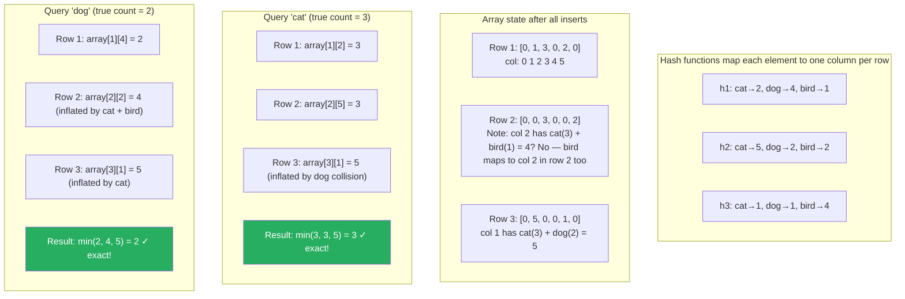

# Count-Min Sketch

**Level**: 🔴 Advanced
**Reading Time**: 12 minutes

> Twitter processes millions of hashtag events per second. Storing exact counts for every unique hashtag would require hundreds of gigabytes. Count-Min Sketch produces accurate trending topic estimates in kilobytes.

---

## The Core Idea

You want to count how many times each element appears in a high-cardinality stream. Exact counting works when the number of distinct elements is manageable — but when you have millions of unique hashtags, IP addresses, or user IDs, storing an exact count for each one is impractical.

Count-Min Sketch is the probabilistic answer: use a **fixed-size 2D array** where multiple elements share counters. When you query an element's frequency, you get an upper bound that is guaranteed to never undercount, with controllable error.

The analogy: imagine a tally counter with only 100 slots, but multiple things share each slot. To count how many times "cat" appeared, you hash it to a few slots and read the minimum across those slots. The minimum is always an overestimate — slots are shared, so other elements inflate counts — but the minimum is the tightest possible overestimate.

---

## How It Works

### Structure

```
Count-Min Sketch components:
  - 2D array: D rows × W columns of counters (integers), all initialized to 0
  - D independent hash functions h_1, h_2, ..., h_D
  - D controls accuracy (probability of error)
  - W controls error magnitude (epsilon)
```

Typical values: D = 5 rows, W = 2000 columns → 10,000 counters total, handling millions of distinct elements with 0.1% relative error.

### Increment (Add Element) Pseudocode

```
function add(sketch, element):
  for d from 1 to D:
    column = hash_d(element) mod W
    sketch.array[d][column] += 1
```

Each row hashes the element to a different column and increments that cell.

### Query (Estimate Frequency) Pseudocode

```
function query(sketch, element):
  minCount = INFINITY

  for d from 1 to D:
    column = hash_d(element) mod W
    minCount = min(minCount, sketch.array[d][column])

  return minCount
  -- this is an upper bound on the true frequency
  -- it equals true_frequency + overcount_from_collisions
```

The minimum across all rows is the tightest upper bound. Other elements that collide into the same column inflate counts, but they inflate different rows differently — taking the minimum filters out most of the noise.

### Error Bounds

```
With D rows and W columns, given a stream of total N events:

Error guarantee:
  Probability(estimated_count > true_count + ε × N) ≤ δ

Where:
  ε = e / W            (e is Euler's number ≈ 2.718)
  δ = e^(-D)           (e is Euler's number)

Design formulas:
  W = ceil(e / ε)      -- columns needed for error bound ε
  D = ceil(ln(1/δ))    -- rows needed for confidence 1-δ

Example: 1% relative error (ε=0.01) with 99% confidence (δ=0.01):
  W = ceil(2.718 / 0.01) = 272 columns
  D = ceil(ln(100)) = 5 rows
  Total counters: 5 × 272 = 1360 counters
  Memory: 1360 × 4 bytes = ~5 KB
  This handles an unlimited number of distinct elements!
```

---

## Visual Walkthrough

A Count-Min Sketch with 3 rows and 6 columns. Tracking events: "cat" appears 3 times, "dog" appears 2 times, "bird" appears 1 time.



The minimum filters out collisions that inflate individual rows, giving the correct answer when collisions do not affect all rows simultaneously.

---

## Where This Appears in Real Systems

### Twitter — Trending Topics

Twitter's trending algorithm must count how many times each hashtag has been used in recent time windows. With millions of tweets per minute and hundreds of thousands of unique hashtags, storing exact counts for everything is not practical in a low-latency in-memory system.

Count-Min Sketch allows Twitter to maintain approximate hashtag frequency counts in kilobytes of memory per time window, with bounded error. The top-K trending topics derived from CMS estimates are accurate enough for the product.

### Kafka / Flink — Stream Processing

Apache Flink and Kafka Streams use Count-Min Sketch for:
- **Heavy hitter detection**: which topics/partitions have unusually high throughput?
- **Cardinality-weighted rate limiting**: rate limit keys that appear most frequently
- **Approximate consumer group lag statistics**: how far behind is each consumer group?

Flink's `CountMinSketch` is a first-class operator in the streaming API.

### Redis — RedisBloom Module

Redis Stack includes a Count-Min Sketch implementation:
```
CMS.INITBYDIM mysketch 2000 5     -- create with width=2000, depth=5
CMS.INCRBY mysketch "hashtag" 1   -- increment count
CMS.QUERY mysketch "hashtag"      -- estimate count
CMS.MERGE combined 2 sketch1 sketch2  -- merge two sketches
```

Used for: trending content, hot key detection, frequency-capped notifications.

### Network Routers — DDoS Detection

Network hardware uses Count-Min Sketch to detect heavy hitters — IP addresses sending disproportionate traffic (DDoS patterns). At line rate (millions of packets per second), you cannot afford exact per-IP counters. CMS fits in SRAM on the network ASIC and identifies suspicious IPs in real time.

### Database Query Optimization

PostgreSQL and other databases use frequency sketches internally in their query optimizer. The optimizer estimates how many rows match a `WHERE` clause predicate. For low-cardinality columns, exact histograms work. For high-cardinality columns (like user IDs or email addresses), sketch-based frequency estimates help the optimizer choose better join orders and index strategies.

---

## Complexity Analysis

| Operation | Time | Space |
|-----------|------|-------|
| Add element | O(D) = O(1) — D is fixed | O(D × W) = O(1) fixed |
| Query frequency | O(D) = O(1) — D is fixed | — |
| Merge two sketches | O(D × W) | — |

**Key property**: memory is fixed regardless of how many distinct elements you have tracked. A 5-row × 2000-column sketch uses the same 40KB whether it has tracked 1,000 or 1 billion distinct elements.

**Comparison with exact counting**:

| Approach | Memory for 1M distinct elements | Memory for 1B distinct elements | Error |
|----------|--------------------------------|--------------------------------|-------|
| Exact HashMap | ~32 MB (8-byte key + 8-byte count) | ~32 GB | None |
| Count-Min Sketch (1% error) | ~5 KB | ~5 KB | ≤1% × N overcount |

---

## Trade-offs

| Approach | Memory | Accuracy | Supports Delete | Distinct Count | Merge |
|----------|--------|----------|-----------------|---------------|-------|
| Count-Min Sketch | Fixed O(DW) | ±ε × total | Yes (decrements) | No | Yes |
| Exact HashMap | O(distinct elements) | Exact | Yes | Yes | Yes |
| Count Sketch (±) | Fixed O(DW) | ±ε × total | Yes | No | Yes |
| Bloom Filter | Fixed O(M) | Membership only | No (standard) | No | No |
| HyperLogLog | Fixed O(M) | Cardinality ±0.81% | No | Yes | Yes |

**CMS vs Count Sketch**: Count Sketch uses signed counters and takes the median instead of minimum, giving both over and under-estimates. Useful when you need unbiased estimates. CMS always over-estimates — safer when you want an upper bound.

**CMS vs HyperLogLog**: HyperLogLog counts distinct elements (cardinality). CMS counts how many times each element has appeared (frequency). They solve different problems.

---

## Interview Connection

**"How would you implement a trending topics feature for Twitter at scale?"**

A strong answer includes Count-Min Sketch: maintain a sliding time window of CMS counters (one per window, e.g., per 5 minutes). Increment the count for each hashtag as tweets arrive. For trending detection, query the top-K elements — combine CMS with a min-heap of size K to maintain the top-K hashtags by estimated frequency. At the end of each window, emit the top-K list.

**Common follow-ups**:
- "What is the error bound of Count-Min Sketch?" → The estimated count is always ≥ true count (never undercounts) and exceeds the true count by at most ε × N with probability 1-δ, where N is the total event count and ε, δ are tunable parameters.
- "Can Count-Min Sketch undercount?" → No. It can only overcount, because collisions can only add to a counter, never subtract from one. This is why it is a safe upper bound estimate.
- "How do you detect top-K from a Count-Min Sketch?" → Combine with a min-heap of size K. For each new element, query the CMS for its estimated count. If greater than the smallest element in the heap, replace it. This is approximate — some top-K elements might be missed due to CMS error.

---

## Key Takeaways

- Count-Min Sketch estimates element frequency in a stream using fixed O(D×W) memory regardless of distinct element count
- Structure: D×W integer array + D independent hash functions. Increment by hashing to one column per row; query by taking the minimum across rows
- Guarantees no undercounting — estimates are always upper bounds with controllable overcount probability
- Twitter uses CMS for trending hashtag frequency estimation — millions of events in kilobytes of memory
- Kafka Streams and Apache Flink include CMS as a built-in operator for heavy hitter detection
- Redis RedisBloom module has native CMS support (CMS.INITBYDIM, CMS.INCRBY, CMS.QUERY)
- Network routers use CMS at line rate for DDoS heavy hitter detection in SRAM
- Design parameters: ε (error) controls width W = ceil(e/ε); δ (confidence) controls depth D = ceil(ln(1/δ))
