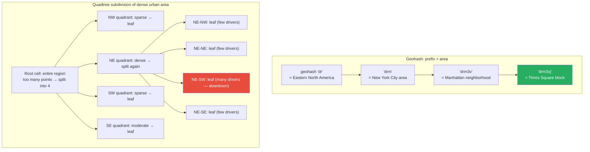

# Geospatial Algorithms

**Level**: 🟡 Intermediate
**Reading Time**: 12 minutes

> Uber matches drivers to riders in milliseconds. Yelp returns nearby restaurants almost instantly. Redis can answer "find all users within 10km of this point" in one command. Each of these uses a different geospatial indexing strategy.

---

## The Core Idea

Latitude and longitude are 2D coordinates. Standard database indexes work on 1D values. The core challenge of geospatial queries: **how do you map 2D location data to a structure that supports efficient proximity queries?**

Three major approaches:

1. **Geohash**: encode a lat/lng pair as a string where nearby locations share a common prefix — enables prefix-based range queries on a standard 1D index
2. **Quadtree**: recursively divide a 2D region into four quadrants until each cell has few enough points — a tree structure tailored to 2D space
3. **R-tree**: generalization of B-tree to multiple dimensions — the standard spatial index in relational databases

---

## Geohash

### How It Works

Geohash encodes a location as a base-32 string. The encoding works by repeatedly bisecting the latitude and longitude ranges, interleaving the bits.

```
function geohashEncode(latitude, longitude, precision=9):
  latRange = [-90.0, 90.0]
  lngRange = [-180.0, 180.0]
  bits = []
  isLng = true    -- alternate between longitude and latitude bits

  while len(bits) < precision × 5:    -- 5 bits per base32 character
    if isLng:
      mid = (lngRange[0] + lngRange[1]) / 2
      if longitude >= mid:
        bits.append(1)
        lngRange[0] = mid
      else:
        bits.append(0)
        lngRange[1] = mid
    else:
      mid = (latRange[0] + latRange[1]) / 2
      if latitude >= mid:
        bits.append(1)
        latRange[0] = mid
      else:
        bits.append(0)
        latRange[1] = mid
    isLng = not isLng

  return bitsToBase32(bits)
```

### Geohash Properties

```
Precision levels (approximate cell dimensions):
  1 character:  5,000 km × 5,000 km
  4 characters: 40 km × 20 km
  6 characters: 1.2 km × 0.6 km     -- city-block level
  8 characters: 38 m × 19 m          -- building level
  9 characters: 4.8 m × 4.8 m        -- door-level

Key property: nearby locations share longer common prefixes
  "dr"     = Eastern North America
  "drm"    = New York City area
  "drm3v"  = Manhattan neighborhood
  "drm3vj" = Times Square block
```

### Geohash Neighbor Lookup for Radius Queries

```
function findNearby(index, latitude, longitude, radiusKm):
  -- step 1: determine the right precision for the radius
  precision = precisionForRadius(radiusKm)

  -- step 2: encode the center location
  centerHash = geohashEncode(latitude, longitude, precision)

  -- step 3: get the center cell + 8 surrounding cells
  searchCells = [centerHash] + geohashNeighbors(centerHash)

  -- step 4: query index for all points in those 9 cells
  candidates = []
  for cell in searchCells:
    candidates.extend(index.queryByPrefix(cell))

  -- step 5: filter by exact distance (some candidates will be in cell but outside radius)
  results = []
  for point in candidates:
    if haversineDistance(latitude, longitude, point.lat, point.lng) <= radiusKm:
      results.append(point)

  return results
```

---

## Quadtree

### How It Works

A quadtree recursively subdivides a 2D region into four quadrants. Each leaf node holds up to MAX_POINTS points. When a leaf exceeds MAX_POINTS, it splits into four children.

```
QuadtreeNode:
  bounds: {minLat, maxLat, minLng, maxLng}
  points: list of (lat, lng, data)      -- only for leaf nodes
  children: [NW, NE, SW, SE]            -- only for internal nodes
  isLeaf: boolean

function quadtreeInsert(node, lat, lng, data):
  if not node.contains(lat, lng):
    return false

  if node.isLeaf:
    node.points.append((lat, lng, data))
    if len(node.points) > MAX_POINTS_PER_LEAF:
      subdivide(node)
    return true

  for child in node.children:
    if child.contains(lat, lng):
      return quadtreeInsert(child, lat, lng, data)

function quadtreeQuery(node, queryBounds):
  results = []
  if not node.intersects(queryBounds):
    return results

  if node.isLeaf:
    for point in node.points:
      if queryBounds.contains(point.lat, point.lng):
        results.append(point)
    return results

  for child in node.children:
    results.extend(quadtreeQuery(child, queryBounds))
  return results
```

---

## Visual Walkthrough



Uber's driver matching: query the quadtree cells overlapping the rider's pickup radius, collect all drivers in those cells, filter by exact distance, rank by ETA.

---

## Where This Appears in Real Systems

### Redis — GEOADD / GEORADIUS

Redis implements geospatial commands using geohash stored internally in a sorted set (ZSET). Each location is stored with its geohash as the score.

```
GEOADD drivers 40.7589 -73.9851 "driver:123"   -- add driver at lat/lng
GEORADIUS drivers 40.7589 -73.9851 5 km         -- find all within 5km
GEODIST drivers driver:123 driver:456 km        -- distance between two drivers
GEOPOS drivers driver:123                        -- get coordinates of a driver
```

Internally, `GEORADIUS` computes the geohash of the center, finds the 8 neighboring cells, and does a sorted-set range query on each cell's geohash prefix. The ZSET is sorted by geohash score, so range queries are O(log N + K).

### Uber — H3 Hexagonal Grid

Uber uses **H3** (their open-source hexagonal hierarchical spatial index) instead of square geohash cells. Hexagons have a key advantage: all 6 neighbors of a hexagon are equidistant from the center, whereas square cells have 4 edge-adjacent and 4 corner-adjacent neighbors at different distances.

H3 organizes the globe into a hierarchy of hexagonal cells at 16 resolution levels. Uber uses H3 for:
- Driver-rider matching: find drivers in the same H3 hexagon
- Surge pricing: calculate demand per H3 cell
- Service area definition: express regions as sets of H3 cells

### PostGIS — R-tree Index

PostGIS (the PostgreSQL geospatial extension) uses an **R-tree** index (specifically the GiST-based R*-tree) for spatial queries.

```sql
-- Create a spatial index on a geometry column
CREATE INDEX idx_locations_geom ON locations USING GIST(geom);

-- Find all restaurants within 1km of Times Square
SELECT name, ST_Distance(geom, ST_MakePoint(-73.985, 40.758)::geography) AS distance
FROM restaurants
WHERE ST_DWithin(geom::geography, ST_MakePoint(-73.985, 40.758)::geography, 1000)
ORDER BY distance;
```

The R-tree stores bounding rectangles of geometric objects in a B-tree-like hierarchy. Each internal node stores the bounding box of all its children. A range query prunes subtrees whose bounding box does not intersect the query region.

### Yelp / DoorDash — Geohash Prefix Search

Location-based services like Yelp and DoorDash store venue/restaurant locations with their geohash in a database or search index (often Elasticsearch). A nearby search:
1. Encode the user's location to a geohash prefix at the appropriate precision
2. Get the center cell + 8 neighboring cells
3. Query the index for all venues matching those 9 prefixes
4. Filter by exact distance and rank by relevance + distance

---

## Complexity Analysis

| Structure | Nearest-K query | Range query | Insert | Space |
|-----------|----------------|-------------|--------|-------|
| Geohash (sorted DB index) | O(log N + K) | O(log N + K) | O(log N) | O(N) |
| Quadtree | O(log N + K) | O(log N + K) | O(log N) amortized | O(N) |
| R-tree | O(log N + K) | O(log N + K) | O(log N) | O(N) |
| Full scan (no index) | O(N) | O(N) | O(1) | O(N) |

All three indexed approaches achieve O(log N + K) for range queries, but their constant factors differ significantly based on data density and query patterns.

---

## Trade-offs

| Approach | Pros | Cons | Best For |
|----------|------|------|----------|
| Geohash | Simple, works with standard 1D indexes (Redis, Elasticsearch), easy to implement | Cell boundary artifacts — points near a border may be in different cells but physically close; must query 9 cells | Simple proximity queries, existing infrastructure |
| Quadtree | Adapts to data density (dense areas subdivide more), efficient for point-in-polygon | Complex to implement, harder to distribute across nodes | Dynamic point data (moving objects like drivers) |
| R-tree (PostGIS) | Handles arbitrary shapes (polygons, lines), not just points; standard in databases | Complex to implement from scratch; update-heavy workloads can degrade tree quality | Complex geometry — polygons, paths, service areas |
| H3 hexagonal | Uniform distance to neighbors, excellent for area-based analytics | More complex encoding, proprietary ecosystem (though open-source) | Spatial analytics, area-based features (surge pricing) |

**Geohash limitation — boundary problem**: A point at `40.7589, -73.9851` and a point at `40.7590, -73.9851` are 11 meters apart but might have different 6-character geohash prefixes if they fall on opposite sides of a cell boundary. Solution: always query the center cell plus all 8 neighbors, then filter by exact distance. This adds overhead but is unavoidable.

---

## Interview Connection

**"Design a system like Uber's driver-matching. How do you find the nearest driver efficiently?"**

Answer involves the spatial indexing decision: Use geohash (simple, works with existing storage) or a quadtree (handles density variations, good for moving objects). Specifically:
1. Each driver updates their location every few seconds — store lat/lng + geohash in a Redis sorted set (ZSET) indexed by geohash
2. When a rider requests, encode their location, check the geohash cell + 8 neighbors, collect all driver IDs, compute exact distances, rank by ETA
3. For production: update driver location with `GEOADD`, query with `GEORADIUS`
4. Consider H3 for aggregated analytics (surge, demand maps)

**Common follow-ups**:
- "What is the boundary problem with geohash?" → Two locations can be physically adjacent but on opposite sides of a geohash cell boundary, giving them different prefixes. Solution: always query the 8 neighboring cells and filter by exact distance afterward.
- "Why does Uber use hexagons instead of squares?" → Hexagons have uniform distance to all 6 neighbors (same distance whether edge-adjacent). Square cells have edge-adjacent neighbors at distance 1 and corner-adjacent at distance √2 — not uniform. Hexagonal grids also tile space more efficiently for circular queries.
- "What is an R-tree?" → An R-tree is a B-tree generalization for 2D data. Each node contains the bounding box of all its children's geometries. A spatial query prunes subtrees whose bounding box does not intersect the query region. PostGIS uses a GiST-based R*-tree variant for arbitrary geometry (points, lines, polygons).

---

## Key Takeaways

- Geohash encodes lat/lng as a base-32 string where nearby points share prefixes — enables prefix range queries on any 1D index
- Query radius = center cell + 8 neighbors → filter by exact haversine distance (necessary to handle boundary artifacts)
- Redis GEOADD/GEORADIUS uses geohash internally stored in a sorted set — O(log N + K) proximity queries
- Quadtree recursively splits dense areas — good for moving objects (drivers), adapts to data density
- R-tree (PostGIS GiST index) handles arbitrary geometries (points, polygons, lines) — standard spatial index for relational databases
- Uber H3: hexagonal grid where all 6 neighbors are equidistant — better for area-based analytics like surge pricing
- All indexed approaches achieve O(log N + K) range queries; full scan is O(N) — you always want a spatial index
