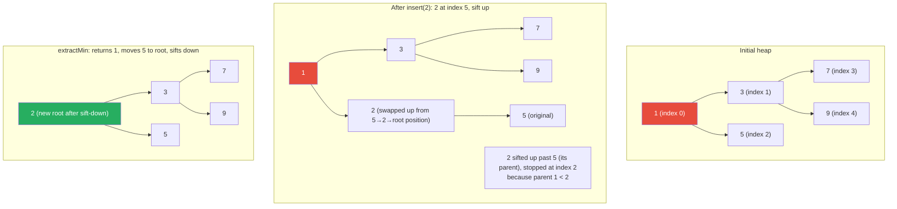

# Heap and Priority Queue

**Level**: 🟢 Beginner
**Reading Time**: 9 minutes

> Dijkstra's shortest path, Kubernetes pod scheduling, and merging a million sorted Kafka partition logs — all use the same underlying structure: a heap.

---

## The Core Idea

A heap is a tree where every parent has a more-important value than its children. In a **min-heap**, the parent is always smaller — so the root is always the smallest element. In a **max-heap**, the parent is always larger — root is the largest.

Why is this useful? You can insert any element in O(log N) and always retrieve the minimum (or maximum) element in O(1). This is the priority queue interface: "give me the most important thing next."

Think of a hospital emergency department: patients are not served in arrival order, but in severity order. A new trauma patient jumps to the front. Someone with a minor injury waits. The priority queue always serves the most critical patient next, no matter when they arrived.

---

## How It Works

### Structure

A binary heap is typically stored in a flat array — no pointers needed:

```
For a node at index i:
  left child:  2i + 1
  right child: 2i + 2
  parent:      (i - 1) / 2  (integer division)

Min-heap array example: [1, 3, 5, 7, 9, 8, 6]
  Index: 0  1  2  3  4  5  6
  Value: 1  3  5  7  9  8  6

  Index 0 (value 1) is root
  Index 1 (value 3) = left child of 0
  Index 2 (value 5) = right child of 0
  Index 3 (value 7) = left child of 1
  Index 4 (value 9) = right child of 1
  Index 5 (value 8) = left child of 2
  Index 6 (value 6) = right child of 2
```

### Insert (Sift Up) Pseudocode

```
function heapInsert(heap, value):
  heap.append(value)             -- add to end
  siftUp(heap, len(heap) - 1)   -- restore heap property

function siftUp(heap, index):
  while index > 0:
    parent = (index - 1) / 2
    if heap[parent] > heap[index]:    -- parent is larger than child (violation)
      swap(heap, parent, index)
      index = parent
    else:
      break                           -- heap property satisfied
```

### Extract Min (Sift Down) Pseudocode

```
function extractMin(heap):
  if heap is empty:
    return NULL

  minimum = heap[0]                  -- root is always the minimum

  -- move last element to root, then sift down
  heap[0] = heap[len(heap) - 1]
  heap.removeLast()
  siftDown(heap, 0)

  return minimum

function siftDown(heap, index):
  size = len(heap)
  while true:
    smallest = index
    left = 2 × index + 1
    right = 2 × index + 2

    if left < size and heap[left] < heap[smallest]:
      smallest = left
    if right < size and heap[right] < heap[smallest]:
      smallest = right

    if smallest == index:
      break                          -- heap property satisfied

    swap(heap, index, smallest)
    index = smallest
```

### Peek (Get Min without Removing)

```
function peekMin(heap):
  return heap[0]    -- O(1) — root is always minimum
```

---

## Visual Walkthrough

Inserting value 2 into a min-heap, then extracting the minimum:



---

## Where This Appears in Real Systems

### Dijkstra's Shortest Path — Database Query Planning

Dijkstra's algorithm finds the shortest path in a weighted graph. The priority queue is the core: always process the unvisited node with the smallest current distance.

```
function dijkstra(graph, source):
  dist = {node: INFINITY for all nodes}
  dist[source] = 0
  pq = MinHeap()
  pq.insert((distance=0, node=source))

  while pq is not empty:
    (currentDist, node) = pq.extractMin()
    if currentDist > dist[node]: continue    -- stale entry

    for each neighbor, edgeWeight in graph.neighbors(node):
      newDist = currentDist + edgeWeight
      if newDist < dist[neighbor]:
        dist[neighbor] = newDist
        pq.insert((newDist, neighbor))

  return dist
```

**PostgreSQL uses Dijkstra's algorithm** internally in its query planner for join ordering in complex queries — treating each join as an edge and the estimated cost as the weight.

**Network routing protocols** (OSPF) use Dijkstra to build shortest-path routing trees.

### Kubernetes — Pod Scheduling

The Kubernetes scheduler maintains a priority queue of pods waiting to be scheduled. Pods have a `priority` field. The scheduler always dequeues the highest-priority pod next. When a node becomes available, the scheduler assigns the highest-priority pending pod to it.

The priority queue also drives preemption: if a high-priority pod cannot be scheduled because all nodes are full, the scheduler may evict lower-priority pods.

### Top-K Elements in a Stream

To find the top-K items in a stream of N items (N >> K), maintain a min-heap of size K:

```
function topK(stream, k):
  minHeap = MinHeap(capacity=k)

  for item in stream:
    if minHeap.size < k:
      minHeap.insert(item)
    elif item > minHeap.peekMin():
      minHeap.extractMin()    -- remove the smallest of the top-K
      minHeap.insert(item)    -- add the new larger item

  return minHeap.toArray()   -- the K largest items
```

Time: O(N log K) — much better than sorting (O(N log N)) when K << N.

Used in: recommendation systems (top-K similar items), search result ranking, trending content detection.

### Merge K Sorted Lists — Kafka External Sort

When Kafka consumers merge messages from multiple partitions (all sorted within a partition), or when databases perform an external merge sort, they use a min-heap:

```
function mergeKSortedLists(lists):
  minHeap = MinHeap()
  result = []

  -- Initialize heap with first element from each list
  for i, list in enumerate(lists):
    if len(list) > 0:
      minHeap.insert((list[0], listIndex=i, elementIndex=0))

  while minHeap is not empty:
    (value, listIdx, elemIdx) = minHeap.extractMin()
    result.append(value)

    -- Add next element from same list
    nextIdx = elemIdx + 1
    if nextIdx < len(lists[listIdx]):
      minHeap.insert((lists[listIdx][nextIdx], listIdx, nextIdx))

  return result
```

Time: O(N log K) where N is total elements across all lists, K is number of lists.

Used in: Kafka consumer offset tracking, database merge joins, external sort in large ETL pipelines.

### Timer Wheels and Timeout Management

Systems that manage many concurrent timeouts (TCP connections, session expiration, rate limiting windows) use a heap-based timer queue. Each pending timeout is stored as `(expiration_time, callback)`. The event loop extracts the min element (soonest timeout) and fires its callback.

In high-frequency systems, a hierarchical timing wheel (an approximate heap) is used instead, trading some accuracy for O(1) insert/delete.

---

## Complexity Analysis

| Operation | Time | Notes |
|-----------|------|-------|
| Insert | O(log N) | Sift up from leaf |
| Extract min/max | O(log N) | Sift down from root |
| Peek min/max | O(1) | Root is always min/max |
| Build heap from N elements | O(N) | Better than N × O(log N) — use heapify |
| Delete arbitrary element | O(log N) | Requires index tracking |

**Build heap is O(N)**, not O(N log N): starting from the last internal node and sifting down is equivalent to building from the leaves, and the total work sums to O(N) by geometric series analysis. This is why Python's `heapq.heapify` is faster than inserting elements one by one.

**Space**: O(N), stored as a flat array. No pointer overhead unlike tree data structures.

---

## Trade-offs

| Structure | Insert | Extract Min | Peek Min | Find Arbitrary | Notes |
|-----------|--------|-------------|----------|----------------|-------|
| Binary Heap | O(log N) | O(log N) | O(1) | O(N) | Standard choice |
| Sorted Array | O(N) | O(1) | O(1) | O(log N) | Slow inserts |
| Unsorted Array | O(1) | O(N) | O(N) | O(N) | Slow min queries |
| Fibonacci Heap | O(1) amortized | O(log N) amortized | O(1) | O(log N) amortized | Complex; better for Dijkstra with decrease-key |
| Balanced BST | O(log N) | O(log N) | O(log N) | O(log N) | Supports delete-arbitrary efficiently |

**When to use Fibonacci Heap**: graph algorithms with many `decrease-key` operations (like Dijkstra with dense graphs). In practice, binary heaps are used for most applications because their constants are much smaller.

---

## Interview Connection

**"Find the K largest elements in a stream of 1 million numbers."**

Answer: maintain a min-heap of size K. For each new number, if it is larger than the heap's minimum, replace the minimum. Final heap contents = the K largest. Time: O(N log K), space: O(K).

**Common follow-ups**:
- "What is a heap and how does it differ from a BST?" → A heap is a complete binary tree stored as an array, with the heap property (parent ≤ children for min-heap). It only guarantees the root is min/max — no ordering between other elements. A BST maintains full in-order sorting. Heaps are faster for insert/extract-min than BSTs but do not support arbitrary sorted access or range queries.
- "How does Dijkstra's algorithm use a priority queue?" → It processes nodes in order of current shortest distance. The priority queue (min-heap) always returns the unprocessed node with the smallest distance estimate, ensuring we process nodes optimally.
- "How do you merge K sorted lists efficiently?" → Use a min-heap of K entries. Insert the first element from each list. Repeatedly extract the minimum and insert the next element from that list. Time O(N log K), space O(K). Used in Kafka merge, external sort, and database merge joins.

---

## Key Takeaways

- Min-heap: parent ≤ children; root is always minimum. Max-heap is the inverse
- Stored as a flat array — no pointers needed. Left child at 2i+1, right child at 2i+2, parent at (i-1)/2
- Insert: O(log N) — sift up. Extract-min: O(log N) — sift down. Peek: O(1)
- Build heap from N elements: O(N) — use heapify, not N insertions
- Dijkstra's shortest path uses a min-heap to always process the closest unvisited node
- Kubernetes pod scheduling uses a max-heap (priority queue) — always schedule the highest-priority pod
- Top-K in a stream: maintain a min-heap of size K — O(N log K) total
- Merge K sorted lists: min-heap with one entry per list — O(N log K) total, used in Kafka and external sort
