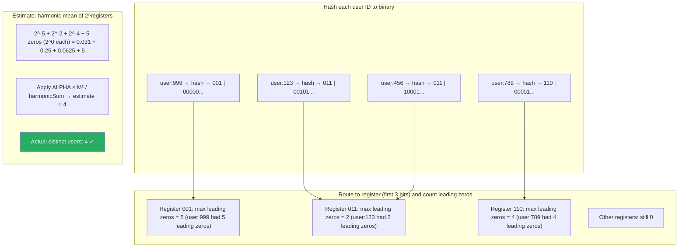

# HyperLogLog — Cardinality Estimation

**Level**: 🟡 Intermediate
**Reading Time**: 10 minutes

> Redis can count billions of unique visitors using 12KB of memory, with 0.81% error. That is HyperLogLog: the algorithm that makes "count distinct" at web scale tractable.

---

## The Core Idea

"How many unique users visited our site today?" This is a cardinality estimation problem. The naive solution — store every user ID in a hash set — requires memory proportional to the number of unique users. A site with 100 million daily unique visitors would need gigabytes just for the counter.

HyperLogLog solves this with a probabilistic observation: **if you hash elements to uniform binary strings, the maximum number of leading zeros you observe is a good estimator of how many distinct elements you have seen**.

The intuition: if you flip coins until you get heads, and the longest run of tails you have seen is k, you probably flipped at least 2^k times. HyperLogLog uses hashed elements like coin flips. If the maximum leading-zero prefix seen so far is k bits long, you probably have seen about 2^k distinct elements.

This single observation has high variance. HyperLogLog reduces variance by splitting elements into M buckets and averaging the estimates across buckets using a harmonic mean.

---

## How It Works

### Structure

```
HyperLogLog components:
  - M registers (M is a power of 2, typically 2^14 = 16384)
  - Each register holds a small integer (max leading zeros seen for that bucket)
  - Precision p = log2(M) — higher p → more registers → less error

Error rate: 1.04 / sqrt(M)
  M = 16384 (2^14) → error = 1.04 / 128 = 0.0081 = 0.81%
  M = 16384 registers × 6 bits each = ~12 KB total memory
```

### Add Element Pseudocode

```
function add(hll, element):
  -- hash element to a uniformly random b-bit binary string
  hashValue = hash(element)           -- e.g., 64-bit hash

  -- use first p bits to select the register
  registerIndex = first_p_bits(hashValue)

  -- count leading zeros in the remaining bits
  remainingBits = hashValue >> p
  leadingZeros = countLeadingZeros(remainingBits) + 1

  -- update register if we have seen more leading zeros
  hll.registers[registerIndex] = max(hll.registers[registerIndex], leadingZeros)
```

### Estimate Cardinality Pseudocode

```
function estimate(hll):
  -- compute harmonic mean of 2^register[j] across all M registers
  harmonicSum = 0
  for j from 0 to M-1:
    harmonicSum += 2^(-hll.registers[j])

  rawEstimate = ALPHA_M × M × M / harmonicSum
  -- ALPHA_M is a bias correction constant ≈ 0.7213 for M=16384

  -- small range correction (if estimate < 2.5M, many registers are 0)
  if rawEstimate < 2.5 × M:
    zerosCount = count(registers where register == 0)
    if zerosCount > 0:
      return M × ln(M / zerosCount)    -- linear counting for small sets
    else:
      return rawEstimate

  -- large range correction (if estimate > 2^32 / 30, hash collisions distort estimate)
  if rawEstimate > 2^32 / 30:
    return -2^32 × ln(1 - rawEstimate / 2^32)

  return rawEstimate
```

### Merge (Union of Two HyperLogLogs)

```
function merge(hll1, hll2):
  result = new HyperLogLog()
  for j from 0 to M-1:
    result.registers[j] = max(hll1.registers[j], hll2.registers[j])
  return result
```

Merging is just a component-wise maximum — this is what makes HyperLogLog composable. You can compute the HyperLogLog for each shard separately and merge them at the end.

---

## Visual Walkthrough

HyperLogLog with M=8 registers (p=3). Tracking four distinct users.



With M=8 registers, error is high (~37%). Production uses 16,384 registers, giving 0.81% error.

---

## Where This Appears in Real Systems

### Redis — PFADD / PFCOUNT

Redis has native HyperLogLog support. PF stands for Philippe Flajolet, who invented the algorithm.

```
PFADD daily:visitors:2024-01-15 "user:123" "user:456" "user:789"
PFCOUNT daily:visitors:2024-01-15
→ (integer) 3

-- Merge multiple days into a week estimate
PFMERGE weekly:visitors:2024-w3 daily:visitors:2024-01-15 daily:visitors:2024-01-16 daily:visitors:2024-01-17
PFCOUNT weekly:visitors:2024-w3
→ (integer) estimates unique visitors across all three days (union, not sum)
```

Redis uses 12KB per HyperLogLog structure. You can track the approximate unique visitors for every day of the year in 365 × 12KB = ~4MB.

### PostgreSQL — pg_hll Extension

The `pg_hll` extension adds a `hll` data type and aggregate functions:
```sql
SELECT hll_cardinality(hll_union_agg(page_views_hll))
FROM daily_page_views
WHERE date BETWEEN '2024-01-01' AND '2024-01-31';
```

Used when you want to merge pre-aggregated HyperLogLogs across time periods — compute daily HLLs once, then merge any combination of days without re-scanning the raw events.

### Apache Spark — count_distinct

Spark's `approx_count_distinct()` DataFrame function uses HyperLogLog internally:
```
df.groupBy("campaign_id").agg(approx_count_distinct("user_id"))
```

For large datasets, `approx_count_distinct` can be 10–100x faster than `countDistinct` (exact count), which requires shuffling all user IDs. HLL only needs to shuffle the compact register arrays.

### Google Analytics — Unique Visitor Counts

Large-scale analytics platforms (Google Analytics, Amplitude, Mixpanel) use HyperLogLog for unique visitor counts because exact counting at scale requires too much memory and is too slow to compute on query. The slight inaccuracy is acceptable for marketing analytics.

### ClickHouse — uniqHLL12

ClickHouse has a native `uniqHLL12()` aggregation function using 2^12 = 4096 registers (~2.5% error) and `uniq()` which uses a more accurate adaptive algorithm. Used for user funnel analysis, cohort analysis, and retention metrics.

---

## Complexity Analysis

| Operation | Time | Space |
|-----------|------|-------|
| Add element | O(1) | O(M) fixed |
| Estimate cardinality | O(M) | — |
| Merge two HLLs | O(M) | O(M) for result |
| Standard error | — | 1.04 / sqrt(M) |

**Memory comparison for counting 1 billion unique users**:

| Approach | Memory |
|----------|--------|
| Exact hash set (64-bit IDs) | ~8 GB |
| Sorted bitmap (if IDs fit in 32 bits) | ~512 MB |
| HyperLogLog (M=16384, 0.81% error) | 12 KB |

HyperLogLog uses ~700,000x less memory than an exact hash set for 1 billion elements.

---

## Trade-offs

| Approach | Memory | Error | Merge | Supports | Notes |
|----------|--------|-------|-------|----------|-------|
| HyperLogLog | O(M) fixed | ~0.81% | Yes | Cardinality | Best for cardinality at scale |
| Exact HashSet | O(N) | 0% | O(N₁+N₂) | Membership, cardinality | Use when N is bounded |
| Bitmap | O(max_id/8) | 0% | O(M) | Cardinality, membership | Only works if IDs are small integers |
| Count-Min Sketch | O(D×W) fixed | ε×total | Yes | Frequency | Counts per element, not distinct count |
| Linear Counting | O(N/ln(N)) | 0% | Yes | Cardinality | Better than exact for small ranges |

**HyperLogLog vs Count-Min Sketch**: Different problems. HLL answers "how many distinct elements?" CMS answers "how many times has this specific element appeared?"

---

## Interview Connection

**"How do you count unique visitors per day at scale for a billion-user platform?"**

Strong answer: Use HyperLogLog. For each day, maintain a HyperLogLog structure (12KB in Redis). When a user visits, call `PFADD` with their user ID. At the end of the day, call `PFCOUNT` to get the estimated unique visitors with 0.81% error. For weekly or monthly counts, use `PFMERGE` to take the union — this is the cardinality of unique visitors across all days, not the sum (which would double-count users who visit multiple days).

**Common follow-ups**:
- "Why does HyperLogLog work — what is the mathematical intuition?" → The maximum number of leading zeros in hash values of N distinct elements is approximately log₂(N). HyperLogLog extends this by using M buckets to reduce variance, then takes a harmonic mean which is less sensitive to outliers.
- "What is the difference between PFCOUNT on one key vs. multiple keys in Redis?" → PFCOUNT on a single key returns its estimate. PFCOUNT on multiple keys computes the union (equivalent to PFMERGE then PFCOUNT) and estimates the number of distinct elements across all specified structures.
- "When would you NOT use HyperLogLog?" → When you need exact counts, when N is small enough that an exact hash set fits in memory, or when you need to check membership (HLL does not support "was user X in this set?").

---

## Key Takeaways

- HyperLogLog estimates cardinality (distinct count) in fixed O(M) memory regardless of the number of elements seen
- Uses M = 16384 registers (6 bits each) = 12KB for 0.81% standard error — works for billions of distinct elements
- Core idea: count leading zeros of hashed values to estimate how many distinct elements you have seen
- Redis PFADD / PFCOUNT / PFMERGE — native HyperLogLog support; 12KB per counter
- PFMERGE takes the union of multiple HLLs — use this for rolling weekly/monthly unique visitor counts
- Apache Spark `approx_count_distinct()` uses HyperLogLog internally for 10–100x speedup vs exact count
- HyperLogLog counts distinct elements (cardinality); Count-Min Sketch counts per-element frequency — different problems
- Google Analytics, ClickHouse, and PostgreSQL (via extension) all use HyperLogLog for large-scale analytics
