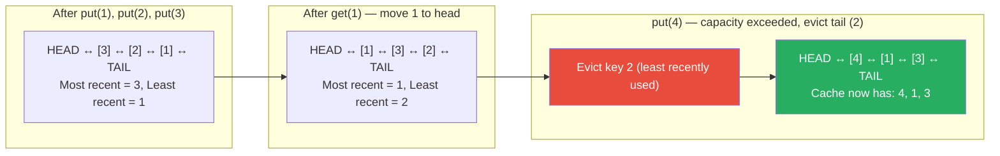

# LRU and LFU Cache Eviction

**Level**: 🟢 Beginner
**Reading Time**: 10 minutes

> Redis can hold only so much data. When memory is full and a new key arrives, Redis has to evict something. Which key it evicts depends on the policy you choose — and the wrong choice can tank your hit rate.

---

## The Core Idea

A cache has limited memory. When it is full and you need to add a new item, something must go. The eviction policy decides which item to remove.

**LRU (Least Recently Used)**: evict the item that has not been accessed for the longest time. The assumption: recently used items are likely to be used again soon (temporal locality).

**LFU (Least Frequently Used)**: evict the item that has been accessed the fewest times overall. The assumption: popular items are likely to remain popular; rarely accessed items are unlikely to be needed.

The analogy: LRU is a bookshelf where you always put recently-read books at one end and throw out books from the other end. LFU is keeping a "times read" count per book and throwing out the least-read book.

---

## How LRU Works

### Data Structure

LRU requires O(1) get and O(1) put. The implementation is a doubly-linked list combined with a hash map:
- **Hash map**: key → node pointer (O(1) lookup)
- **Doubly-linked list**: nodes in access order (most recent at head, least recent at tail)

On every access (get or put), move the accessed node to the head. When eviction is needed, remove the tail node.

### LRU Pseudocode

```
LRUCache:
  capacity: integer
  hashMap: key → ListNode
  head: dummy head node (most recently used end)
  tail: dummy tail node (least recently used end)
  -- head ↔ [node1] ↔ [node2] ↔ ... ↔ [nodeN] ↔ tail

function get(cache, key):
  if key not in cache.hashMap:
    return NOT_FOUND

  node = cache.hashMap[key]
  moveToHead(cache, node)            -- mark as recently used
  return node.value

function put(cache, key, value):
  if key in cache.hashMap:
    node = cache.hashMap[key]
    node.value = value
    moveToHead(cache, node)          -- update and move to head
    return

  newNode = createNode(key, value)
  cache.hashMap[key] = newNode
  addToHead(cache, newNode)          -- new item = most recently used

  if len(cache.hashMap) > cache.capacity:
    -- evict least recently used: the tail node
    lruNode = cache.tail.prev
    removeNode(cache, lruNode)
    delete cache.hashMap[lruNode.key]

function moveToHead(cache, node):
  removeNode(cache, node)
  addToHead(cache, node)

function addToHead(cache, node):
  node.next = cache.head.next
  node.prev = cache.head
  cache.head.next.prev = node
  cache.head.next = node

function removeNode(cache, node):
  node.prev.next = node.next
  node.next.prev = node.prev
```

All operations are O(1): hash map gives O(1) node lookup; linked list pointer updates are O(1).

---

## How LFU Works

LFU is more complex. It tracks access frequency, and ties in frequency are broken by recency (evict the least recently used among equal-frequency items).

### LFU Pseudocode (Frequency Buckets)

```
LFUCache:
  capacity: integer
  minFreq: integer                   -- current minimum frequency
  keyToFreq: key → frequency
  keyToValue: key → value
  freqToKeys: frequency → ordered set of keys (insertion order = access order)

function get(cache, key):
  if key not in cache.keyToValue:
    return NOT_FOUND

  incrementFrequency(cache, key)
  return cache.keyToValue[key]

function put(cache, key, value):
  if cache.capacity == 0:
    return

  if key in cache.keyToValue:
    cache.keyToValue[key] = value
    incrementFrequency(cache, key)
    return

  -- evict if at capacity
  if len(cache.keyToValue) >= cache.capacity:
    evictLFU(cache)

  cache.keyToValue[key] = value
  cache.keyToFreq[key] = 1
  cache.freqToKeys[1].addLast(key)    -- new items start with frequency 1
  cache.minFreq = 1                   -- new item has min frequency

function incrementFrequency(cache, key):
  freq = cache.keyToFreq[key]
  cache.keyToFreq[key] = freq + 1
  cache.freqToKeys[freq].remove(key)

  if cache.freqToKeys[freq] is empty and freq == cache.minFreq:
    cache.minFreq += 1                -- no more items at this freq

  cache.freqToKeys[freq + 1].addLast(key)

function evictLFU(cache):
  -- get the least recently used key among minimum frequency keys
  keysAtMinFreq = cache.freqToKeys[cache.minFreq]
  keyToEvict = keysAtMinFreq.removeFirst()   -- oldest among minimum frequency

  delete cache.keyToFreq[keyToEvict]
  delete cache.keyToValue[keyToEvict]
```

---

## Visual Walkthrough

LRU cache with capacity 3, processing accesses: put(1), put(2), put(3), get(1), put(4):



Key 2 was evicted because it was the least recently accessed, even though it was accessed more recently than key 1 before the get(1) call.

---

## Where This Appears in Real Systems

### Redis — Maxmemory Policy

Redis exposes several eviction policies via `maxmemory-policy`:

```
maxmemory-policy options:
  allkeys-lru     → evict any key using LRU approximation
  volatile-lru    → evict only keys with TTL using LRU
  allkeys-lfu     → evict any key using LFU approximation (Redis 4.0+)
  volatile-lfu    → evict only keys with TTL using LFU
  allkeys-random  → evict random key
  volatile-random → evict random key with TTL
  volatile-ttl    → evict key with soonest expiration
  noeviction      → return error when memory full (default)
```

**Redis uses approximate LRU/LFU**, not exact. Instead of maintaining a full linked list (which would require pointer updates on every access), Redis samples a random set of candidates (default: 5 keys) and evicts the one that scores worst by the policy. This is much faster with minimal accuracy loss.

For LFU, Redis stores a logarithmic counter per key in 8 bits. Each access increments the counter probabilistically — the counter saturates slowly, giving a reasonable frequency estimate without exact tracking.

### CPU Cache — Hardware LRU

CPU L1/L2/L3 caches use hardware LRU (or a pseudo-LRU approximation called PLRU). With N-way set-associativity, each cache set holds N cache lines. When all N lines are occupied and a new memory address maps to that set, the LRU line is evicted. This happens in hardware in nanoseconds.

### OS Page Cache — Clock Algorithm

The OS page cache (managed by the kernel) uses the **clock algorithm**, also called "second chance" — an approximation of LRU. Each page has a reference bit. On access, the bit is set to 1. When a page must be evicted, the clock hand sweeps through pages: if a page's bit is 1, reset it to 0 and move on; if it is 0, evict it. This approximates LRU without the overhead of maintaining a full linked list for potentially millions of pages.

### CDN Edge Cache

CDN edge servers cache content (images, videos, HTML) using LRU policies. Popular content stays hot in cache; stale or rarely-accessed content ages out. CDNs often layer LRU with TTL: items are evicted either when LRU pressure forces it or when their TTL expires, whichever comes first.

### Browser Cache

Web browsers cache resources (CSS, JS, images) using a combination of HTTP cache headers (Cache-Control, Expires) and LRU-based eviction when the disk cache fills. The browser's cache engine uses a combination of TTL and LRU approximations.

---

## Complexity Analysis

| Algorithm | Get | Put | Space | Implementation Complexity |
|-----------|-----|-----|-------|--------------------------|
| LRU (exact) | O(1) | O(1) | O(capacity) | Medium (linked list + hash map) |
| LFU (exact) | O(1) | O(1) | O(capacity) | High (frequency buckets) |
| LRU (approximate, Redis) | O(1) | O(1) | O(capacity) | Low (sample + compare) |
| Random eviction | O(1) | O(1) | O(capacity) | Very low |
| FIFO | O(1) | O(1) | O(capacity) | Very low |

---

## Trade-offs

| Policy | Best For | Worst For | Notes |
|--------|----------|-----------|-------|
| LRU | Workloads with temporal locality — recent items stay hot | Scan patterns that cycle through all items (thrashes) | Most common default |
| LFU | Workloads with stable popularity — hot items stay hot | New items that need time to build frequency | Avoids LRU "cache pollution" from one-off scans |
| FIFO | Simplest implementation, streaming data | Mixed access patterns | Too simple for most caches |
| Random | Surprisingly competitive when access pattern is random | Nothing — but suboptimal for most patterns | Low overhead |

**When LFU beats LRU**: workloads with long-term popular items that may occasionally miss in LRU (e.g., product catalog where top-100 products are always queried, but LRU might age them out during a nightly batch scan that cycles through all products). LFU keeps the high-frequency items regardless of recent access.

**When LRU beats LFU**: workloads where popularity shifts over time — LFU is slow to adapt because old frequency counts dominate. A viral tweet might be hugely popular today but nearly irrelevant tomorrow; LRU naturally ages it out.

---

## Interview Connection

**"Design an LRU cache with O(1) get and put."**

Answer: doubly-linked list + hash map. The hash map gives O(1) key lookup. The linked list maintains access order. On every get or put, move the accessed node to the head of the list (O(1) pointer manipulation). When capacity is exceeded, remove the tail node (O(1)). The hash map also stores a pointer to each node so we can jump to it directly.

**Common follow-ups**:
- "What is the difference between LRU and LFU?" → LRU evicts the item not accessed for the longest time; LFU evicts the item accessed the fewest times total. LFU is better when popular items have stable long-term frequency; LRU is better when access patterns shift over time.
- "How does Redis implement LRU without a linked list?" → Redis uses approximate LRU: when eviction is needed, it samples a random set of keys and evicts the one with the oldest last-access timestamp. This avoids the memory overhead of maintaining a full doubly-linked list for potentially millions of keys.
- "What eviction policy should you use for Redis?" → Depends on workload. `allkeys-lru` for mixed or temporal-locality workloads. `allkeys-lfu` when you have stable hot keys that you never want to evict (product catalog, user profile data). `volatile-lru` when you want session data to expire naturally but also evict oldest sessions under memory pressure.

---

## Key Takeaways

- LRU: evict the least recently used item — implemented with doubly-linked list + hash map for O(1) get/put
- LFU: evict the least frequently used item — implemented with frequency buckets for O(1) get/put
- Redis supports both via `maxmemory-policy`: allkeys-lru, allkeys-lfu, volatile-lru, volatile-lfu
- Redis uses approximate LRU/LFU by sampling random candidates — faster than maintaining exact order for millions of keys
- CPU hardware caches use LRU (or pseudo-LRU) to decide which cache line to evict
- OS page cache uses the clock algorithm — an efficient approximation of LRU for millions of pages
- LFU beats LRU when popular items are stable; LRU beats LFU when access patterns shift over time
- The classic interview question: implement LRU cache with O(1) operations → doubly-linked list + hash map
