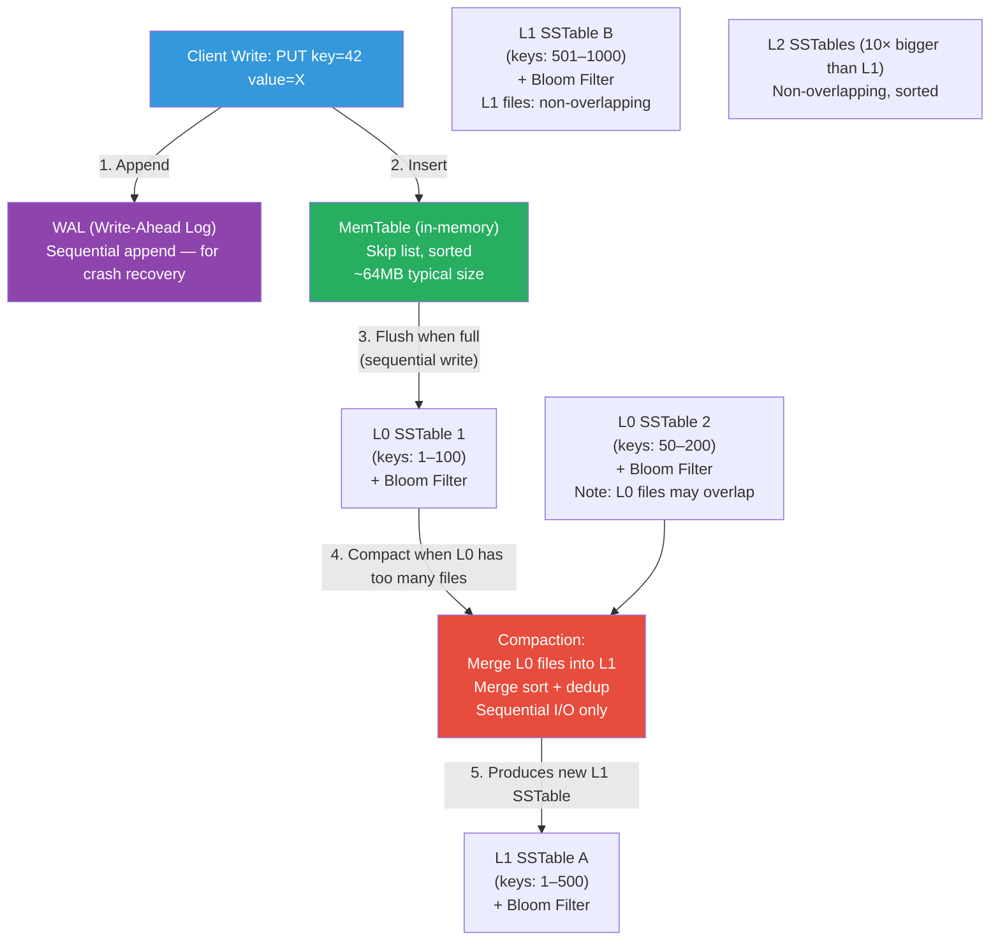

# LSM Tree — Write-Optimized Storage

**Level**: 🔴 Advanced
**Reading Time**: 14 minutes

> Cassandra, RocksDB, LevelDB, ScyllaDB, and HBase all use the LSM tree because it turns disk's slow random writes into fast sequential writes — at the cost of more complex reads.

---

## The Core Idea

**The problem with B-trees under heavy writes**: B-tree updates are in-place. Updating a value means finding the right leaf page on disk, reading it, modifying it, and writing it back. Each write touches a random location on disk. On an HDD, random writes are 100x slower than sequential writes. Even on SSDs, random writes cause write amplification that wears down the device faster.

**The LSM tree insight**: never do random writes. Instead, buffer writes in memory, then flush sorted chunks to disk sequentially. Over time, merge the chunks to maintain sorted order. All disk I/O is sequential.

The trade-off: writes become O(1) amortized with sequential I/O. Reads become more complex — data might be in memory or in any of several on-disk files, and you must check all of them.

---

## How It Works

### Architecture

```
LSM Tree layers:
  MemTable (in-memory):
    - Sorted data structure (skip list or red-black tree)
    - All new writes go here first
    - Also write to WAL (Write-Ahead Log) for durability
    - When MemTable reaches size threshold, flush to L0

  L0 (Level 0, on disk):
    - Immutable sorted files called SSTables (Sorted String Tables)
    - Multiple L0 SSTables may overlap in key ranges
    - Bloom filter per SSTable for fast membership testing

  L1, L2, L3... (deeper levels, on disk):
    - SSTables at each level are sorted and non-overlapping within the level
    - Each level is 10x larger than the level above (configurable)
    - Compaction merges L_N with overlapping L_{N+1} files
```

### Write Path Pseudocode

```
function write(lsmTree, key, value):
  -- Step 1: durability first — write to WAL on disk
  walLog.append(key, value)

  -- Step 2: write to in-memory MemTable
  lsmTree.memTable.put(key, value)

  -- Step 3: if MemTable is full, flush it to disk as an SSTable
  if lsmTree.memTable.size > MEMTABLE_SIZE_THRESHOLD:
    flushMemTable(lsmTree)

function flushMemTable(lsmTree):
  -- MemTable is already sorted — write it as a sequential SSTable file
  ssTable = createSSTable(lsmTree.memTable)
  ssTable.bloomFilter = buildBloomFilter(lsmTree.memTable.keys())
  lsmTree.L0.add(ssTable)
  lsmTree.memTable = new MemTable()   -- start fresh

  -- if too many L0 files, trigger compaction
  if len(lsmTree.L0) > L0_COMPACTION_THRESHOLD:
    compact(lsmTree, level=0)
```

### Read Path Pseudocode

```
function read(lsmTree, key):
  -- Step 1: check MemTable (most recent writes)
  value = lsmTree.memTable.get(key)
  if value != NULL:
    return value

  -- Step 2: check L0 files (newest to oldest — L0 may overlap)
  for ssTable in lsmTree.L0.newestToOldest():
    if ssTable.bloomFilter.mightContain(key):
      value = ssTable.get(key)
      if value != NULL:
        return value

  -- Step 3: check L1, L2, L3... (binary search to find the relevant SSTable)
  for level from 1 to MAX_LEVEL:
    ssTable = findSSTableForKey(lsmTree.levels[level], key)
    if ssTable != NULL and ssTable.bloomFilter.mightContain(key):
      value = ssTable.get(key)
      if value != NULL:
        return value

  return NOT_FOUND
```

### Compaction Pseudocode

```
function compact(lsmTree, level):
  -- select files to compact: one or more files from level N
  -- and all overlapping files from level N+1
  filesToCompact = selectCompactionCandidates(lsmTree, level)

  -- open all files simultaneously and merge using a min-heap
  -- (external merge sort — same algorithm as merging K sorted lists)
  mergedIterator = mergeSortedIterators(filesToCompact)
  newSSTable = createSSTable()

  for key, value in mergedIterator:
    -- skip tombstones (deleted keys) if no older versions remain
    if value is TOMBSTONE and noOlderVersionsExist(key):
      continue
    -- skip older versions of the same key (keep most recent)
    if not isLatestVersion(key, value):
      continue
    newSSTable.append(key, value)

  newSSTable.bloomFilter = buildBloomFilter(newSSTable.keys())

  -- atomically replace old files with new merged file
  replaceSSTables(lsmTree, filesToCompact, [newSSTable])
```

---

## Visual Walkthrough

LSM tree data flow from write to compaction:



**Read path** (checking for key that exists in L1):
1. Check MemTable → miss
2. Check L0 SSTable 1 bloom filter → "definitely not here" → skip
3. Check L0 SSTable 2 bloom filter → "probably here" → check file → miss (false positive)
4. Check L1 SSTable A bloom filter → "probably here" → check file → found!

---

## Where This Appears in Real Systems

### RocksDB — The Embedded LSM Engine

RocksDB (Facebook's fork of LevelDB) is the embedded storage engine for dozens of systems:
- **Kafka**: log segments on brokers use RocksDB for offset tracking in newer versions
- **CockroachDB**: uses RocksDB (now Pebble, a Go port) as its storage layer
- **TiKV** (TiDB's storage): RocksDB
- **MyRocks**: MySQL with RocksDB storage engine — used by Facebook for their MySQL tier, 2x better write throughput, 40% less disk space vs InnoDB
- **Ceph**: distributed storage uses RocksDB for metadata

### Cassandra

Cassandra's storage engine is a pure LSM tree implementation. Each node maintains its own MemTable and SSTables. Compaction strategies are pluggable:
- **SizeTiered compaction** (default): merge SSTables of similar size
- **LeveledCompaction**: mimics RocksDB's leveled approach — better read performance, more write I/O
- **TimeWindowCompaction**: for time-series data — compact by time window

### HBase / BigTable

Google BigTable (the original LSM-tree database) and Apache HBase use the same LSM architecture. The MemTable is called MemStore; SSTables are called HFiles. BigTable was the system that popularized LSM trees for production use, documented in the 2006 OSDI paper.

### LevelDB

Google's LevelDB (2011) introduced the leveled compaction strategy. Each level has a size quota; when a level exceeds its quota, the most fragmented file is compacted into the next level. This bounds the number of files at each level and makes reads more predictable.

### ScyllaDB

ScyllaDB is a C++ rewrite of Cassandra with per-core sharding. It uses the same LSM tree architecture but with optimized compaction and I/O scheduling that achieves 10x better throughput than Cassandra on the same hardware.

---

## Complexity Analysis

| Operation | B-tree | LSM Tree |
|-----------|--------|----------|
| Point write | O(log N) + random I/O | O(1) amortized + sequential I/O |
| Point read | O(log N) + 1 I/O | O(log N) per level × levels |
| Range scan | O(log N + K) | O(log N + K) with bloom filters |
| Space | Low overhead | Higher — compaction needs 2× space during merge |
| Write amplification | Low (in-place) | High — each key written multiple times during compaction |

**Write amplification** is the key LSM cost: a single logical write may be physically written to disk multiple times as data moves from MemTable → L0 → L1 → L2 → ... Each compaction rewrites data. In a leveled LSM with 10x level size ratio, data moves through 4–5 levels, resulting in 10–50x write amplification. This is partially offset by sequential I/O being much faster than B-tree's random I/O.

**Space amplification**: LSM trees can temporarily use 2x space during compaction (old + new files both exist). Bloom filters add overhead. Compaction overhead is usually 10–30% of live data size.

---

## Trade-offs

| Property | B+Tree | LSM Tree |
|----------|--------|----------|
| Write performance | Slower (random I/O) | Faster (sequential I/O) |
| Read performance | Faster (single index lookup) | Slower (check multiple levels) |
| Write amplification | Low | High (compaction rewrites data) |
| Space overhead | Low | Medium (compaction space + bloom filters) |
| Read tail latency | Predictable | Spiky (compaction can spike read latency) |
| Best for | Read-heavy, mixed workloads | Write-heavy workloads |
| Examples | PostgreSQL, MySQL InnoDB, SQLite | RocksDB, Cassandra, HBase, LevelDB |

**When to choose LSM**: write throughput is the bottleneck, workload is write-heavy (IoT, time-series, logging), or when disk space and write amplification are acceptable costs for write speed.

**When B-tree wins**: read-heavy workloads with complex queries, transactions requiring strong consistency, when write amplification is costly (SSDs wear), or when consistent low latency is needed without compaction spikes.

---

## Interview Connection

**"Why is Cassandra faster at writes than PostgreSQL?"**

Answer: Cassandra uses an LSM tree (Log-Structured Merge tree) storage engine. All writes go to a MemTable in memory and a sequential Write-Ahead Log on disk — no random disk I/O. PostgreSQL uses a B+tree with in-place updates, which requires random disk I/O to update leaf pages. LSM writes are sequential, which is 10–100x faster on HDDs and significantly faster even on SSDs.

The trade-off: Cassandra reads are slower because a key might be in any of several SSTable files on disk, requiring multiple bloom filter checks and potentially multiple file reads. PostgreSQL's B-tree read is always 3–4 disk reads.

**Common follow-ups**:
- "What is compaction and why does it matter?" → Compaction merges multiple SSTable files, removing overwritten/deleted keys and maintaining sorted order. Without compaction, the number of SSTable files would grow unboundedly and reads would check hundreds of files. Compaction causes periodic write spikes that can affect read latency.
- "How does Cassandra handle reads efficiently given the LSM structure?" → Bloom filters. Each SSTable has a Bloom filter in memory. Before reading an SSTable from disk, Cassandra checks the bloom filter. If it says "definitely not here," the file is skipped. This eliminates most unnecessary disk reads.
- "What is write amplification in LSM trees?" → Each logical write is physically written to disk multiple times: once to the WAL, once when the MemTable flushes to L0, and once for each subsequent compaction that moves the data to a deeper level. Total write amplification is typically 10–50x in a leveled LSM tree.

---

## Key Takeaways

- LSM trees convert random writes into sequential writes by buffering in-memory (MemTable) and flushing sorted SSTables to disk
- Write path: WAL → MemTable → (flush) L0 SSTable → (compact) L1 → L2 → ...
- Read path: MemTable → L0 (newest to oldest) → L1 → L2... — bloom filters at each level skip irrelevant files
- Cassandra, RocksDB, LevelDB, HBase, and ScyllaDB all use LSM trees
- RocksDB is embedded in CockroachDB, TiDB/TiKV, and Facebook's MySQL (MyRocks)
- Write amplification: data is rewritten multiple times through compaction (typically 10–50x for leveled compaction)
- B-tree wins for read-heavy workloads; LSM tree wins for write-heavy workloads
- Bloom filters are essential for LSM read performance — they prevent checking every SSTable level for every read
